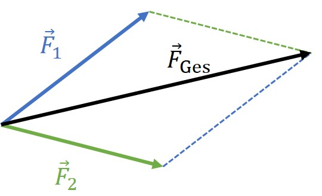
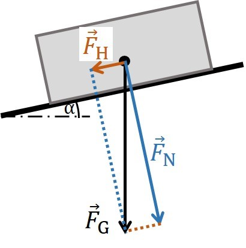

<!--
author:   Herbert Schletter

email:    herbert.schletter@physik.tu-chemnitz.de

version:  0.0.1

language: de

narrator: Deutsch Male

comment:  Skriptum zur Vorlesung „Physik (mit Experimenten)“

link:     https://cdn.jsdelivr.net/chartist.js/latest/chartist.min.css

script:   https://cdn.jsdelivr.net/chartist.js/latest/chartist.min.js

-->

# Elementarkurs Experimentalphysik

Skriptum zum Kurs „Physik (mit Experimenten)“

Dr. Herbert Schletter

Wintersemester 2021/2022

## Vorwort
Dieses Skriptum wurde konzipiert und verfasst als Lehrmaterial zur Vorlesung „Physik (mit Experimenten)“ für die Studiengänge ‚Wirtschaftsingenieurwesen‘ und ‚Lehramt an Grundschulen‘ an der
Technischen Universität Chemnitz. Es bietet einen Überblick über grundlegende Konzepte und Arbeitsmethoden der Physik mit einem Schwerpunkt auf die Gebiete der klassischen Physik.

Da ein Skriptum auf den jeweiligen Vorlesungsinhalt abgestimmt ist, erreicht es nicht den Umfang und die Ausführlichkeit eines Lehrbuchs und kann daher auch ein solches nicht
ersetzen. Es bietet jedoch eine didaktische Einführung in das Themengebiet.

Der diesem Skriptum zu Grunde liegende Physikkurs hat einen Umfang von 15 Vorlesungen. Dieser recht geringe zeitliche Umfang erfordert eine Konzentration des
Vorlesungsinhalts auf die zentralen physikalischen Prinzipien der einzelnen Stoffgebiete zusammen mit den grundlegenden mathematischen Herleitungen. Aufgrund dieser
Stoffreduktion trägt dieses Skriptum die Bezeichnung „Elementarkurs“.

## Einführung

Am Beginn dieses Kurses soll zunächst geklärt werden, welche Zielstellung hierin
verfolgt wird. Wie der Titel bereits besagt, handelt es sich um eine
(grundlegende) Einführung in die Physik, konkret: in die Experimentalphysik (dieser Begriff
wird im Laufe dieser Einführung noch erklärt werden). Es muss daher zunächst in ganz
allgemeiner Form geklärt werden, womit sich die Physik beschäftigt. Die folgenden Seiten beschreiben die grundlegende Zielstellung der Physik und verschiedene Wege, wie dieses Ziel erreicht werden kann.

### Was ist Physik?

> Die Physik ist eine Naturwissenschaft, die Vorgänge der (unbelebten) Natur qualitativ und quantitativ beschreibt. Sie fragt nach den Eigenschaften und gegenseitigen Wechselwirkungen physikalischer Körper.

Der Begriff „Körper“ bezeichnet dabei ganz allgemein eine definierte Menge an Materie. Ihm können sehr vielfältige und unterschiedliche Eigenschaften zugeordnet werden.
Aus diesem Grund entwickelten sich im Laufe der Zeit verschiedene Teilgebiete der Physik, in denen Körper jeweils unter bestimmten Gesichtspunkten charakterisiert werden.

Die Physik strebt danach, komplexe Phänomene auf grundlegende, allgemeingültige und möglichst einfache Gesetzmäßigkeiten zurück zu führen. Um diese Gesetzmäßigkeiten quantitativ auszudrücken, bedient sich die Physik der Mathematik. Dabei ist das wesentliche Ziel der Physik ein qualitatives *Verständnis* der Naturvorgänge. Die quantitative Beschreibung dieser Vorgänge durch mathematische Formeln ist dem nachgeordnet und kann das Verständnis nicht ersetzen.

Die Physik strebt eine möglichst einfache Beschreibung der Natur an. Diese Einfachheit kann jedoch nur soweit gehen, dass die Realität nicht durch zu starke Vereinfachungen verfälscht widergegeben wird. Die Komplexität physikalischer Formeln und Beschreibungen widerspiegelt daher lediglich die Komplexität der uns umgebenden Natur.

Für eine solche einfache Beschreibung der Naturvorgänge ist es erforderlich (und charakteristisch für die Physik), diese Vorgänge auf ihre wesentlichen Eigenschaften zu reduzieren und Unwesentliches außen vor zu lassen. Ein solches vereinfachtes oder reduziertes Abbild der Natur wird als **Modell** bezeichnet. Physikalische Modelle sind stets nur unter bestimmten Voraussetzungen anwendbar. So wird uns in den ersten Kapiteln das Modell des Massepunkts begegnen, bei dem die Form und Größe eines Körpers als unwesentliche Eigenschaften ignoriert werden und lediglich die Masse berücksichtigt wird, die – modellhaft – in einem Punkt gedacht wird. Für die Beschreibung einer geradlinigen Bewegung ist dieses Modell ausreichend, für die Rotation jedoch nicht mehr. Für letztere müssen dann andere Modelle herangezogen werden.

Mitunter werden Modelle soweit reduziert, dass sie die Realität nur noch näherungsweise widergeben (z.B. durch Vernachlässigung der unvermeidbaren Reibung bei der Beschreibung von Bewegungen). Es muss dann geprüft werden, ob ein solches Modell den konkreten Sachverhalt mit ausreichender Genauigkeit beschreibt. Ist dies nicht der Fall, muss ein entsprechend aufwändigeres Modell angewendet werden.

#### Entwicklung der Physik

Die Menschheit hatte seit jeher ein Interesse an der Naturbeobachtung. Die Physik in ihrem heutigen Sinn entstand jedoch erst im 17. Jahrhundert und ist eng mit den Personen Galileo Galilei und Isaac Newton verbunden. Seither ist die Physik geprägt durch:

1.  systematisches Experimentieren anstelle einer bloßen Naturbeobachtung und
2.  eine enge Verknüpfung von Theorie und Experiment.

Vom 17. bis 19. Jahrhundert entwickelten sich die Teilbereiche, die heute als klassische Physik bezeichnet werden: Mechanik, Wärmelehre, Elektrizitätslehre & Optik. Ab ca. 1900 entstand die moderne Physik, zu der (unter anderem) die relativistische Physik, Quantenphysik, Atom-, Molekül- und Festkörperphysik sowie die Elementarteilchenphysik gezählt wird. Die einzelnen Teilgebiete der Physik lassen sich nicht scharf voneinander abgrenzen. So werden beispielsweise die Gesetze der Mechanik auch in der Elektrizitäts- oder Wärmelehre angewendet und finden sich auch in der modernen Physik wieder.

### Arbeitsmethoden der Physik

Die Physik kennt zwei grundsätzliche Herangehensweisen zur Untersuchung von Naturvorgängen:

In der **Experimentalphysik** werden Naturvorgänge durch Experimente (siehe unten) empirisch untersucht. Durch systematische Veränderung der Einflussgrößen werden physikalische Zusammenhänge ermittelt. Mit Hilfe mathematischer Methoden können Beziehungen zwischen den physikalischen Größen hergestellt und die ermittelten Ergebnisse in Formeln ausgedrückt werden.

Die **theoretische Physik** orientiert sich stärker an der mathematischen Vorgehensweise. Dabei bilden physikalische Grundgesetze, Axiome oder Annahmen die Basis der Überlegungen. Darauf aufbauend werden dann – unter Anwendung der Gesetze der Mathematik – neue Zusammenhänge und Gesetze geschlussfolgert. Die zugrunde liegenden Gesetze müssen dabei so formuliert werden, dass sie die Gegebenheiten der Natur widerspiegeln.

Beide Herangehensweisen ergänzen sich und müssen identische Ergebnisse liefern. So sollen experimentelle Befunde auch theoretisch (ausgehend von physikalischen Grundgesetzen) erklärt werden. Umgekehrt werden Berechnungen und Vorhersagen der theoretischen Physik experimentell überprüft.

Der vorliegende Physikkurs ist in der Experimentalphysik angesiedelt. Das kann jedoch nicht bedeuten, dass auf die Anwendung der Mathematik verzichtet wird. Vielmehr werden auch hier mathematische Methoden genutzt um Beziehungen zwischen physikalischen Größen herzustellen und gefundene Zusammenhänge zu begründen.

### Experimente & Messungen

Experimente sind elementarer Bestandteil jeder *Natur*wissenschaft.

Ein **Experiment** ist eine gezielte Frage an die Natur. D.h. durch Experimente werden Zusammenhänge der Natur gezielt und systematisch untersucht. Der Aufbau und die Durchführung eines Experiments müssen dieser Zielstellung entsprechen:

-   Der Versuchsaufbau muss den relevanten Effekt widerspiegeln.

-   Störende Einflussfaktoren sollen ausgeschlossen oder minimiert werden (z.B. Vermeidung von Reibungsverlusten in der Mechanik, Abschirmung gegen elektromagnetische Felder).

-   Experimente müssen systematisch durchgeführt werden, indem Einflussfaktoren einzeln unter sonst gleichen Bedingungen geändert werden.

-   Messungen müssen mit ausreichender Genauigkeit erfolgen.

Diese Anforderungen bedingen einen entsprechenden apparativen Aufwand für das Experimentieren, der sich in der Größe und den Kosten von Versuchsaufbauten widerspiegelt. Mitunter sind selbst bauliche Anforderungen an die Laborräume einzuhalten, damit ein Experiment gelingt (z.B. Sonderfundamente für atomar auflösende Elektronenmikroskope).

Im Experiment sollen Zusammenhänge der Natur quantitativ erfasst werden. Dazu müssen relevante Größen gemessen werden. Eine **Messung** ist ein Vergleich einer (unbekannten) Größe mit einem Maßnormal. Dieser Vergleich kann direkt (z.B. Längenmessung mit einem Lineal) oder indirekt (z.B. Massebestimmung mit Digitalwaage) erfolgen. Die Maßnormale verkörpern eine festgelegte Quantität der zu messenden Größe. Beispiele für Maßnormale sind: Lineal für die Längenmessung, Massestücke, ein Metronom als Zeitnormal aber auch elektrische Multimeter usw. Die Maßnormale definieren dabei auch die Maßeinheiten der jeweiligen Größe.

Eine physikalische Größe ist definiert als:

$$\textrm{Größe}=\textrm{Zahlenwert}\cdot\textrm{Einheit}$$
Beispielsweise könnten für einen Menschen Körpergröße $h$ und Masse $m$ wie folgt angegeben werden:

$$\begin{array}{c}
        h=1{,}88\cdot 1~\mathrm{Meter}=1{,}88~\mathrm m \\
        m=87\cdot 1~\mathrm{Kilogramm}=87~\mathrm{kg}
\end{array}$$

Physikalische Größen ohne Maßeinheiten existieren nicht. Für jede Größe muss eine Einheit definiert sein. Daraus ergibt sich eine sehr große Zahl physikalischer Einheiten. Um diese zu systematisieren werden Einheitensysteme (oder: Maßsysteme) angewendet. Ein Einheitensystem definiert einen Satz physikalischer Grundgrößen mit den zugehörigen Grundeinheiten. Daraus können alle weiteren Größen mit ihren Einheiten abgeleitet werden.

In der Physik ist das Système international d'unités – kurz: SI-System – allgemein gebräuchlich. Die sieben SI-Grundgrößen mit ihren Grundeinheiten sind in der nachfolgenden Tabelle zusammengestellt. Alle weiteren physikalischen Einheiten lassen sich aus diesen Grundeinheiten ableiten. Für die Einheit der elektrischen Spannung – das Volt – gilt beispielsweise

$$1~\mathrm V=1~\frac{\mathrm{kg\cdot m^2}}{\mathrm{A\cdot s^3}}$$

| SI-Grundgröße           | Grundeinheit                 |
|:------------------------|:-----------------------------|
| Länge                   | Meter ($1~\mathrm m$)        |
| Zeit                    | Sekunde ($1~\mathrm s$)        |
| Masse                   | Kilogram ($1~\mathrm {kg}$)     |
| (absolute) Temperatur   | Kelvin ($1~\mathrm K$)   |
| Stoffmenge              | Mol ($1~\mathrm{mol}$)         |
| Elektrische Stromstärke | Ampere ($1~\mathrm A$)        |
| Lichtstärke             | Candela ($1~\mathrm{cd}$) |

Vorsicht ist geboten bei Einheiten, die keine dezimalen Umrechnungsfaktoren besitzen. Das betrifft unter anderem Zeitangaben in Minuten oder Stunden. Hier sollten Angaben stets in Sekunden erfolgen. Ebenso sollten Winkelangaben im Bogenmaß (Radiant) vorgenommen werden.

Wie oben bereits angegeben ist eine Messung der Vergleich einer Größe mit einem Maßnormal. Ein solcher Vergleich ist jedoch niemals völlig exakt. Es treten stets **Messunsicherheiten** (Messfehler) auf, die sich unter anderem aus Unzulänglichkeiten oder der begrenzten Anzeigegenauigkeit des Messinstruments ergeben. Diese Messunsicherheiten müssen ermittelt und zum Messwert angegeben werden. Die Angabe eines Messergebnisses ohne Unsicherheit ist für die Praxis wertlos. Die Bestimmung der Messunsicherheit ist somit ebenso wichtig (und ebenso schwierig) wie die Messung selbst.

Die Angabe der Messunsicherheit kann als absolute oder relative Unsicherheit erfolgen. Für die Masse der oben angegebenen Person könnte die vollständige Angabe wie folgt aussehen:

$$m=87\pm 4~\mathrm{kg}\quad\textrm{bzw.}\quad m=87~\mathrm{kg}\pm5\,\%$$

### Bezugssysteme

Die Physik beschreibt Naturvorgänge in ihrer räumlichen und zeitlichen Entwicklung. Dazu müssen physikalische Größen orts- und/oder zeitabhängig gemessen, berechnet und angegeben werden. Mathematisch bedient sich die Physik hierbei der Methoden der Vektorrechnung sowie der Integral- und Differentialrechnung. Darüber hinaus müssen geeignete Bezugsystem definiert werden, damit Orts- und Zeitangaben eindeutig erfolgen können.

Für die Zeit wird ein Referenzzeitpunkt festgelegt. In vielen Fällen ist dies implizit der Beginn des Experiments oder der Messung. Es können jedoch auch beliebige andere Referenzzeiten definiert werden.

Für Ortsangaben muss ein geeignetes Koordinatensystem definiert werden. Dieses sollte dem betreffenden Sachverhalt so angepasst werden, dass eine einfache Beschreibung des Vorgangs möglich ist. Tatsächlich kann durch die Wahl eines geeigneten Koordinatensystems der Rechenaufwand erheblich reduziert werden. Für lineare (eindimensionale) Probleme (z.B. geradlinige Bewegung) genügt auch ein eindimensionales Koordinatensystem ($x$-Achse). Für zwei- oder dreidimensionale Beschreibungen werden entsprechend 2D $\left( x,y \right)$ oder 3D $\left( x,y,z \right)$ Koordinatensysteme verwendet.

Die bisher genannten Koordinatensysteme sind rechtwinklige, oder kartesische Koordinatensysteme. Es handelt sich um sogenannte Rechtssysteme, d.h. die Lage der Achsen zueinander kann durch die Finger der rechten Hand ermittelt werden. Wie in der folgenden Abbildung dargestellt, entsprechen Daumen, Zeigefinger und Mittelfinger – rechtwinklig abgespreizt – der $x$-, $y$- und $z$-Achse.

. \[Quelle: User:Acdx, cmglee, [„Right hand rule Cartesian axes“](https://commons.wikimedia.org/wiki/File:Right_hand_rule_Cartesian_axes.svg), [CC BY-SA 4.0](https://creativecommons.org/licenses/by-sa/4.0/legalcode), via Wikimedia Commons\]")

Anstelle dieser rechtwinkligen Koordinatensysteme können auch Winkelkoordinatensysteme verwendet werden. In zwei Dimensionen sind dies die Polarkoordinaten $\left(\phi ,r\right)$, die beispielsweise bei der Beschreibung von Kreisbewegungen angewendet werden. In 3D lassen sich anhand von Winkelangaben Zylinderkoordinaten $\left( \phi ,r,z\right)$ und Kugelkoordinaten $\left(\phi , \theta ,r\right)$ aufstellen. Letztere werden beispielsweise für Positionsangaben auf der Erde genutzt: die geografische Länge und Breite entsprechen den Winkeln $\phi$ und $\theta$ eines Kugelkoordinatensystems, dessen Ursprung im Erdmittelpunkt liegt.

Um ein physikalisches Problem räumlich zu beschreiben, muss zunächst ein Koordinatensystem festgelegt werden. Diese Festlegung kann willkürlich erfolgen. Es existieren oftmals mehrere gleichwertige Koordinatensysteme. Nach Festlegung eines Koordinatensystems sollte dieses für die gesamte Beschreibung beibehalten werden. Der Wechsel in ein anderes System ist zwar prinzipiell möglich, jedoch mit einem mitunter erheblichen Rechenaufwand verbunden.

## Mechanik

Die Mechanik ist ein Teilgebiet der klassischen Physik. Sie beschreibt die Bewegungseigenschaften von Körpern sowie die Wirkung von Kräften.

### Kinematik

Die Kinematik ist ein Teilgebiet der Mechanik und befasst sich mit der Beschreibung der Bewegung von Körpern. Die Ursachen der Bewegung (genauer: der Änderungen eines Bewegungszustands) werden nicht betrachtet.

Für die Bewegung eines Körpers auf geraden oder gekrümmten Bahnen spielen Form und Größe dieses Körpers keine Rolle und können vernachlässigt werden. Auf diese Weise gelangt man zum Modell des Massepunktes bzw. der Punktmasse, bei dem die gesamte Masse des betrachteten Körpers in einem Punkt vereinigt ist (vgl. Hinweise zu physikalischen Modellen im Kapitel [Einführung](#was-ist-physik?)). Die Lage dieses Massepunktes innerhalb des ursprünglichen Körpers ist nicht frei wählbar, sondern entspricht dem Schwerpunkt (oder Massenmittelpunkt), für den eine genaue Berechnungsvorschrift existiert. Auf letztere wird jedoch in diesem Kurs nicht näher eingegangen. Das Modell der Punktmasse kann nicht angewendet werden zur Beschreibung einer Eigenrotation eines Körpers oder bei Verformung des Körpers.

Ziel der Kinematik ist also, die Position eines Massepunktes im Raum sowie deren zeitliche Änderung (= Bewegung) anzugeben. Zu diesem Zweck benötigen wir eine Größe, die die Position erfasst. Dies ist der **Ortsvektor** $\vec r$. Er zeigt stets vom Koordinatenursprung zur aktuellen Position des Massepunktes. Im allgemeinen Fall ist der Ortsvektor dreidimensional mit den Komponenten

$$\vec{r}(t)=\begin{pmatrix} x(t) \\ y(t) \\ z(t) \end{pmatrix} .$$
Bei ebenen (zweidimensionalen) Bewegungen enthält der Ortsvektor entsprechend nur zwei Komponenten. Bei geradlinigen Bewegungen reduziert sich der Ortsvektor auf eine skalare Größe.

Bewegt sich der Massepunkt, so ändert sich sein Ortsvektor, d.h. der Ortsvektor ist zeitabhängig: $\vec{r}= \vec{r}(t)$. Der Zusammenhang $\vec{r}(t)$ wird als **Orts-Zeit-Gesetz** oder **Weg-Zeit-Gesetz** bezeichnet. Anhand dieses Orts-Zeit-Gesetzes lassen sich grundlegende Bewegungsformen unterscheiden, die im Folgenden zunächst für die geradlinige Bewegung betrachtet werden.

#### Geradlinige Bewegung

Bei der Beschreibung einer geradlinigen Bewegung wird der Ortsvektor ersetzt durch eine skalare Positions- oder Wegangabe, z.B. $x(t)$.

##### Gleichförmig geradlinige Bewegung

Eine geradlinige Bewegung wird als gleichförmig bezeichnet, wenn in gleichen Zeitabschnitten $\Delta t$ jeweils gleiche Strecken $\Delta x$ zurückgelegt werden. In der grafischen Darstellung des Orts-Zeit-Gesetzes $x(t)$ entspricht dies einer Geraden (siehe nachfolgende Abbildung, links). Der Anstieg dieser Geraden gibt an, wie schnell sich die Position des Massepunktes (das heißt sein Ortsvektor) ändert und wird als Geschwindigkeit $v$ definiert:

$$v=\frac{\Delta x}{\Delta t} \qquad\textrm{Einheit: } \left[ v \right]=1~\frac{\mathrm m}{\mathrm s}$$

Wird diese Berechnung – wie hier angegeben – für einen makroskopischen Zeitraum $\Delta t$ durchgeführt, so ergibt sich die Durchschnittsgeschwindigkeit während des betrachteten Zeitraums. Für die gleichförmige Bewegung ist die konkrete Wahl des Zeitintervalls jedoch unerheblich, da das Orts-Zeit-Gesetz eine Gerade darstellt und damit die Geschwindigkeit für alle Zeitintervalle gleich ist. Folglich ist bei der gleichförmigen Bewegung die Geschwindigkeit eine Konstante (siehe Abbildung, mittleres Diagramm).

Aus der Definition der Geschwindigkeit erhält man durch Umstellen für den in einem Zeitintervall zurückgelegten Weg:

$$\Delta x = v\cdot\Delta t \, .$$
Setzt man den Beginn des betrachteten Zeitintervalls auf den Zeitpunkt $t=0$, so erhält man das Weg-Zeit-Gesetz der gleichförmig geradlinigen Bewegung:

$$x(t) = vt+x_0 \, ,$$
wobei $x_0$ die Position des Körpers (Massepunkts) zum Zeitpunkt $t=0$ angibt. Diese kann durch geeignete Wahl des Koordinatensystems häufig $x_0 = 0$ gesetzt werden.

##### Beschleunigte geradlinige Bewegung

Bewegungen, bei denen die Geschwindigkeit nicht konstant ist, werden als beschleunigt bezeichnet. Das Weg-Zeit-Gesetz ist dabei keine Gerade, d.h., in gleichen Zeitintervallen $\Delta t$ werden zu unterschiedlichen Zeitpunkten verschiedene Wege $\Delta x$ zurückgelegt. Zudem hängt die Bestimmung der Durchschnittsgeschwindigkeit von der Länge des betrachteten Zeitintervalls ab. Zur Bestimmung einer exakten Momentangeschwindigkeit muss daher das betrachtete Zeitintervall infintesimal klein gewählt werden. Mathematisch entspricht dies der Ableitung des Orts-Zeit-Gesetzes nach der Zeit:

$$v_\mathrm{momentan}(t) =\lim_{\Delta t \to 0}\frac{\Delta x}{\Delta t} = \frac{\mathrm d x(t)}{\mathrm dt} = \dot x(t) \, .$$
Der Zusammenhang $v(t)$ wird dabei als **Geschwindigkeits-Zeit-Gesetz**  bezeichnet.

Bei beschleunigten Bewegungen ist also die Geschwindigkeit keine Konstante: $v(t)\neq\mathrm{const.}$ Um die Änderung der Geschwindigkeit zu quantifizieren, wird die **Beschleunigung** $a$ als weitere physikalische Größe eingeführt, die die zeitliche Veränderung der Geschwindigkeit erfasst. Mathematisch bedeutet dies, dass die Ableitung der Geschwindigkeit nach der Zeit gebildet wird:

$$a (t) = \frac{\mathrm dv (t)}{\mathrm dt} = \frac{\mathrm d^2 x (t)}{\mathrm dt^2} = \ddot{x} (t) \qquad \textrm {Einheit:}\, [a] = 1~\frac{\mathrm m}{\mathrm s^2}$$

In physikalischer Sprechweise ist auch das Bremsen eine Beschleunigung, jedoch mit negativem Vorzeichen $a<0$. Vektoriell ausgedrückt ist beim Bremsen die Richtung der Beschleunigung dem Geschwindigkeitsvektor entgegengesetzt.

Ausgehend von der Beschleunigung erhält man das Weg-Zeit-Gesetz durch zweimalige Integration. Für den Sonderfall der gleichmäßig beschleunigten Bewegung ($a= \mathrm{const.}$) folgt für das Geschwindigkeits-Zeit-Gesetz $v(t)$:

$$v (t) = \int\limits a\, \mathrm dt = a \cdot t + C_1 \,.$$

Die Integrationskonstante $C_1$ folgt mathematisch aus der Lösung des unbestimmten Integrals und muss noch mit einer physikalischen Größe identifiziert werden. Aus den Anfangsbedingungen (Anfangszeitpunkt $t = 0$) folgt:

$$v(t = 0) = a \cdot 0 + C_1 = C_1\,.$$

Die Integrationskonstante entspricht also der Anfangsgeschwindigkeit zum Zeitpunkt $t = 0$, d.h. $C_1 = v_0$. Das Geschwindigkeits-Zeit-Gesetz der gleichmäßig beschleunigten Bewegung lautet also:

$$v (t) = a \cdot t + v_0 \,.$$

Das Weg-Zeit-Gesetz erhält man durch Integration des Geschwindigkeits-Zeit-Gesetzes:

$$x(t)= \int\limits v (t)\mathrm dt = \int\limits (a \cdot t + v_0) \mathrm dt = \frac{1}{2}a t^2 + v_0 t + C_2$$

Über die Anfangsbedingungen lässt sich wiederum die physikalische Bedeutung der Integrationskonstante $C_2$ finden:

$$x(t = 0) =\frac{a}{2} \cdot 0^2 + v_0 \cdot 0 + C_2 = C_2$$

Die Konstante $C_2$ entspricht also der Anfangsposition $x_0$ des Körpers zum Zeitpunkt $t=0$. Damit erhalten wir das Weg-Zeit-Gesetz der gleichmäßig beschleunigten Bewegung:

$$x(t)=\frac{1}{2} a t^2 + v_0 t + x_0$$

Für ungleichmäßig beschleunigte Bewegungen ($a \neq \mathrm{const.}$) ist die Vorgehensweise prinzipiell gleich. Ausgehend vom zeitlichen Verlauf der Beschleunigung $a(t)$ erhält man durch ein- bzw. zweimalige Integration das Geschwindigkeits-Zeit-Gesetz und das Orts-Zeit-Gesetz. Die hergeleiteten Beziehungen für $x(t)$, $v(t)$ und $a(t)$ spiegeln sich auch in den grafischen Darstellungen des Orts-Zeit-Gesetzes, Geschwindigkeits-Zeit-Gesetzes und Beschleunigungs-Zeit-Gesetzes wider. Für die gleichmäßig beschleunigte Bewegung sind diese Diagramme in der nachfolgenden Abbildung dargestellt.

Ein Spezialfall der gleichmäßig beschleunigten Bewegung ist der freie Fall. Zu dessen Beschreibung definieren wir folgendes eindimensionale Koordinatensystem, wobei wir die Koordinate $x$ der Anschaulichkeit wegen durch die Höhe $h$ ersetzen (siehe Abbildung):

-   $h$-Achse in vertikaler Richtung, positive Richtung zeigt nach oben.
-   Der Nullpunkt der $h$-Achse entspricht dem Startpunkt
    der Bewegung, d.h. $h_0=0$.

Im freien Fall wird der Körper nach unten (d.h. in Richtung der negativen $h$-Achse) beschleunigt. Dabei wirkt die Fallbeschleunigung, die in der Nähe der Erdoberfläche annähernd konstant den Wert $a=g=9{,}81~\frac{\mathrm m}{\mathrm s^2}$ aufweist (siehe folgende Abbildung). Für das Orts-Zeit-Gesetz gilt demnach:

$$h=-\frac{g}{2}t^2$$

Beginnt der freie Fall nicht in der Höhe $h=0$, so ist die Anfangshöhe $h_0$ zu berücksichtigen:

$$h=-\frac{g}{2}t^2 + h_0$$

Von einem senkrechten Wurf wird gesprochen, wenn der Körper zusätzlich eine Anfangsgeschwindigkeit $v_0$ in vertikale Richtung erhält. Für das Orts-Zeit-Gesetz gilt dann:

$$h=-\frac{g}{2}t^2 + v_0 t + h_0$$

#### Überlagerung von Bewegungen – mehrdimensionale Bewegung

Bewegungen, die nicht geradlinig verlaufen, müssen in zwei- bzw. dreidimensionalen Koordinatensystemen beschrieben werden. Der Ortsvektor besitzt dann im allgemeinen Fall drei Komponenten:

$$\vec r(t)=\begin{pmatrix}x(t) \\ y(t) \\ z(t)\end{pmatrix}\, .$$
Gleiches gilt für die Geschwindigkeit

$$\vec v(t) =\dot{\vec r}(t) = \frac{\mathrm d}{\mathrm dt}\vec r(t) = \frac{\mathrm d}{\mathrm dt}\begin{pmatrix}x(t) \\ y(t) \\ z(t)\end{pmatrix}
        = \begin{pmatrix}\frac{\mathrm dx(t)}{\mathrm dt} \\ \frac{\mathrm dy(t)}{\mathrm dt} \\ \frac{\mathrm dz(t)}{\mathrm dt} \end{pmatrix}
        =\begin{pmatrix}v_\mathrm x(t) \\ v_\mathrm y(t) \\ v_\mathrm z(t)\end{pmatrix}$$
und die Beschleunigung

$$\vec a(t) =\dot{\vec v}(t) = \frac{\mathrm d}{\mathrm dt}\vec v(t)
        = \frac{\mathrm d}{\mathrm dt}\begin{pmatrix}v_\mathrm x(t) \\ v_\mathrm y(t) \\ v_\mathrm z(t)\end{pmatrix}
        = \begin{pmatrix}\frac{\mathrm dv_\mathrm x(t)}{\mathrm dt} \\ \frac{\mathrm dv_\mathrm y(t)}{\mathrm dt} \\ \frac{\mathrm dv_\mathrm z(t)}{\mathrm dt} \end{pmatrix}
        =\begin{pmatrix}a_\mathrm x(t) \\ a_\mathrm y(t) \\ a_\mathrm z(t)\end{pmatrix} \, .$$

Die Komponenten dieser Vektoren können getrennt voneinander jeweils als geradlinige Bewegung betrachtet werden. D.h. die Bewegungen in verschiedene Raumrichtungen überlagern sich ohne gegenseitige Beeinflussung. Diese Eigenschaft wird als *Superposition* der Bewegung bezeichnet.

Wir betrachten die Bewegung auf einer gekrümmten Bahn am Beispiel des waagerechten Wurfs. Für diesen definieren wir folgendes zweidimensionale Koordinatensystem mit $x$- & $z$-Achse (siehe nachfolgende Abbildung):

-   Die x-Achse ist waagerecht orientiert, die z-Achse senkrecht

-   Der Abwurf erfolgt in positive $x$-Richtung:

    $$\vec v_0 = \begin{pmatrix} v_0 \\ 0 \end{pmatrix}$$

-   Die Fallbeschleunigung zeigt in negative $z$-Richtung:

    $$\vec{a} = \begin{pmatrix} 0 \\ -g \end{pmatrix}$$

-   Die Abwurfposition liegt über dem Koordinatenursprung:

    $$\vec r_0 = \begin{pmatrix} 0 \\ h_0 \end{pmatrix}$$

Diese Bewegung wird nun komponentenweise betrachtet. In $x$-Richtung liegt eine gleichförmige Bewegung mit der Geschwindigkeit $v_0$ vor:

$$x(t) = v_0 t$$

In $z$-Richtung liegt eine gleichmäßig beschleunigte Bewegung mit der Anfangshöhe $h_0$ vor:

$$z(t) = - \frac{g}{2} t^2 + h_0$$

Beide Bewegungen überlagern sich, und es gilt für den waagerechten Wurf:

$$\vec{r}(t) = \begin{pmatrix} v_0t \\ h_0 - \frac{g}{2}t^2 \end{pmatrix}$$

In der vertikalen Richtung führt ein Körper beim waagerechten Wurf demnach dieselbe Bewegung aus wie beim freien Fall. Hinzu kommt lediglich die waagerechte Bewegung.

Mit dem eben hergeleiteten Orts-Zeit-Gesetz wird zwar der zeitliche Verlauf der Bewegung beschrieben, nicht jedoch die Bahnkurve, auf der sich der Körper bewegt. Um diese aufzustellen, muss der Parameter $t$ in der obigen Formel eliminiert werden. Man erhält so die parameterfreie Darstellung $z(x)$. Die $x$-Komponente lässt sich wie folgt umformen:

$$t = \frac{x}{v_0}$$

Eingesetzt in die $z$-Komponente erhält man:

$$z = h_0 - \frac{g}{2}t^2 = h_0 - \frac{g}{2v_0^2}x^2$$

Die Bahnkurve des waagerechten Wurfs ist somit eine nach unten geöffnete Parabel mit dem Scheitelpunkt $\begin{pmatrix} 0\\ h_0 \end{pmatrix}$ (= Abwurfpunkt).

Mit dieser Vorgehensweise lassen sich Orts-Zeit-Gesetze und Bahnkurven für beliebige Bewegungen bestimmen. Die Betrachtung des schrägen Wurfs beispielsweise unterscheidet sich vom vorigen Beispiel lediglich darin, dass der Abwurf nun um einen Winkel $\alpha$ gegen die Horizontale geneigt erfolgt. Die Anfangsgeschwindigkeit beträgt demzufolge:

$$\vec v_0=\begin{pmatrix} v_0 \cdot \cos(\alpha) \\ v_0 \cdot \sin(\alpha) \end{pmatrix} \, .$$

Im Ergebnis ergibt sich wiederum eine parabelförmige Bahnkurve, deren Scheitelpunkt nicht mehr mit dem Abwurfpunkt übereinstimmt, sondern von $h_0, v_0$ und $\alpha$ abhängt.

### Dynamik

Die Dynamik befasst sich mit der Ursache von Bewegungen, bzw. genauer ausgedrückt: mit der Ursache von Bewegungszustandsänderungen. Zunächst halten wir qualitativ folgende grundlegende Beobachtungen fest:

-   Körper (bzw. Massepunkte) ändern ihren Bewegungszustand nicht spontan. Für eine Änderung des Bewegungszustandes ist stets eine Wechselwirkung des Körpers mit seiner Umgebung erforderlich.

-   Die Größe der Bewegungszustandsänderung wird durch die Stärke dieser Wechselwirkung bestimmt.

Wir schlussfolgern daraus, dass sich Körper einer Änderung ihres Bewegungszustandes widersetzen. Diese (qualitative) Eigenschaft wird als Trägheit bezeichnet. Um diese Erkenntnis auch quantitativ zu beschreiben, benötigen wir zunächst eine Größe, die den Bewegungszustand eines Körpers oder Massepunkts beschreibt. Des Weiteren müssen wir auch die Wechselwirkung des Körpers mit seiner Umgebung durch eine physikalische Größe quantitativ erfassen. Zur Beschreibung von Bewegungen kennen wir bereits die Geschwindigkeit als physikalische Größe. Wir ergänzen dies durch eine weitere mechanische Größe: den Impuls $\vec{p}$, der als das Produkt aus Masse und Geschwindigkeit definiert ist:

$$\vec{p} = m \cdot \vec{v} \qquad \textrm {Einheit: } [\vec{p}\, ]= 1~\frac{\mathrm{kg\cdot m}}{\mathrm s}$$
Die besondere Bedeutung dieser Größe wird später noch diskutiert werden. Wir betrachten sie zunächst als quantitativen Ausdruck eines Bewegungszustands. Der Impuls ist eine vektorielle Größe. Seine Richtung stimmt mit der Bewegungsrichtung überein.

Die Wechselwirkung zwischen zwei Körpern beschreiben wir durch die Kraft:

$$\textrm {Kraft: } \vec{F} \qquad \textrm {Einheit: }[\vec{F} ] = 1~\frac{\mathrm{kg\cdot m}}{\mathrm s^2}=1~\mathrm N \quad \textrm{(Newton)}$$
Der Vektorcharakter der Kraft widerspiegelt, dass die Wechselwirkung zwischen Körpern stets gerichtet ist. Entsprechend gibt die Richtung des Kraftvektors die Richtung der Wechselwirkung an, während der Betrag $|\vec{F }|$ die Stärke der Wechselwirkung beschreibt. Ferner ist für Kräfte die vektorielle Addition anzuwenden, d.h. bei mehreren auf einen Körper wirkenden Kräften:

$$\vec F_{ges} = \vec F_1+\vec F_1+\cdots$$

Dies bedeutet auch, dass sich die einzelnen auf einen Körper wirkenden Kräfte überlagern, ohne sich gegenseitig zu beeinflussen. Wie schon bei der [Überlagerung von Bewegungen](#überlagerung-von-bewegungen-–-mehrdimensionale-bewegung) spricht man auch hier von *Superposition* der Kräfte. Umgekehrt lässt sich eine wirkende Kraft vektoriell in einzelne Komponenten zerlegen (siehe Abbildung).

<!--
style = "width: 5cm;"
-->

Mit diesen Definitionen von Impuls und Kraft können nun die anfänglichen, qualitativen Beobachtungen auch quantitativ ausgedrückt werden. Die entsprechenden Aussagen gehen auf Sir [Isaac Newton]{.smallcaps} (1643 -- 1727) zurück.

#### Die Newton<!-- style ="font-variant: small-caps;" -->schen Axiome

Als Axiom bezeichnet man in der Physik einen Grundsatz, der sich nicht aus anderen Gesetzmäßigkeiten ableiten lässt, dessen Gültigkeit jedoch durch experimentelle Beobachtungen bestätigt ist.

Das **erste Newtonsche Axiom** behandelt die Trägheit eines Körpers:

> Ohne äußere Krafteinwirkung ist der Impuls einer Punktmasse zeitlich konstant.

Alternativ kann dieses sogenannte *Trägheitsprinzip* auch anhand der Geschwindigkeit (anstelle des Impulses) formuliert werden:

> Ein Massepunkt verharrt im Zustand der Ruhe oder der gleichförmig geradlinigen Bewegung, solange keine Kraft auf ihn einwirkt.

Das erste Newtonsche Axiom behandelt also den Fall, dass effektiv keine Kraftwirkung auf einen Massepunkt vorliegt. Das bedeutet nicht, dass gar keine Kräfte auf ihn wirken dürfen. Gemäß dem Superpositionsprinzip können sich mehrere auf einen Körper wirkende Kräfte gegenseitig kompensieren, sodass die Gesamtkraft null ist. Auch in diesem Fall ändert der Körper seinen Impuls nicht.

In umgekehrter Lesart sagt das Trägheitsprinzip bereits aus, dass für eine Änderung des Bewegungszustands eines Massepunkts stets eine Kraft einwirken muss. Das **zweite Newtonsche Axiom** (auch *Aktionsprinzip* genannt) drückt den Zusammenhang zwischen Kraft und Impuls quantitativ aus:

> Eine auf eine Punktmasse einwirkende Kraft bewirkt eine Änderung des Impulses dieser Punktmasse. Es gilt der Zusammenhang:

> $$\vec{F} = \frac{\mathrm d\vec{p}}{\mathrm d t} \qquad \textrm {bzw. } \int\limits_{t_1}^{t_2} \vec{F} \mathrm dt = \Delta \vec{p}$$

Das Integral $\int \vec{F} \mathrm dt$ wird auch als *Kraftstoß* bezeichnet und ist identisch mit der Änderung des Impulses. Eine Impulsänderung kann auf zweierlei Weise geschehen: durch Änderung der Geschwindigkeit oder durch Änderung der Masse:

$$\frac{\mathrm d \vec{p}}{\mathrm dt}= \dot{\vec{p}}= m \cdot \dot{\vec{v}} + \dot{m} \cdot \vec{v}$$

Diese Formulierung gilt also auch für Systeme mit veränderlicher Masse, wie sie beispielsweise in der Relativitätstheorie zu betrachten sind. In vielen Fällen bleibt die Masse eines Körpers jedoch konstant ($\dot{m}=0$), und es kann geschrieben werden:

$$\frac{\mathrm d \vec{p}}{\mathrm dt}=\vec{F} = m \dot{\vec{v}} = m \vec{a}$$

Dieser Ausdruck („Kraft ist Masse mal Beschleunigung“) ist die bekanntere – aber nicht allgemeingültige – Formulierung des zweiten Newtonschen Axioms und wird als Newtonsches Grundgesetz der Mechanik bezeichnet. Aus dieser Formel wird auch ersichtlich, welche Rolle die Masse für die Bewegung der Körper spielt: Bei gleicher Kraft wird ein Körper mit größerer Masse weniger stark beschleunigt werden. D.h., er widersetzt sich stärker der Änderung seines Bewegungszustands. Damit ist die Masse das quantitative Maß der Trägheit.

Des Weiteren gilt das als *Reaktionsprinzip* bezeichnete **dritte Newtonsche Axiom**:

> Stehen zwei Punktmassen nur miteinander, nicht aber mit anderen Punktmassen in Wechselwirkung, so ist die Kraft $\vec{F_1}$ auf die eine Punktmasse entgegengesetzt gleich der Kraft $\vec{F_2}$ auf die zweite Punktmasse: $\vec{F_1} = -\vec{F_2}$ („Actio = Reactio“)

Mit Hilfe der Newtonschen Axiome lassen sich nun (beliebige) Bewegungsprobleme lösen, d.h. ausgehend von den auf einen Massepunkt wirkenden Kräften wird dessen Orts-Zeit-Gesetz berechnet. Das prinzipielle Vorgehen folgt diesen Schritten:

1.  Ermittlung aller auf einen Massepunkt wirkenden Kräfte $\vec F_i$

2.  Bestimmung der Gesamtkraft durch Vektoraddition aller Teilkräfte $\vec{F}_\mathrm{ges}= \sum_i \vec{F}_i$

3.  Berechnung der Beschleunigung anhand des Newtonschen Grundgesetzes (Voraussetzung: Vorgang mit konstanter Masse):

    $$\vec{a}= \frac{\vec{F}_{ges}}{m}$$

4.  Zeitliche Integration liefert das Geschwindigkeits-Zeit-Gesetz $\vec{v}(t)$ (siehe oben: [beschleunigte Bewegungen](#beschleunigte-geradlinige-bewegung)).

5.  Nochmalige zeitliche Integration ergibt das Orts-Zeit-Gesetz $\vec{r}(t)$.

#### Systeme aus mehreren Punktmassen und ihr Impuls

Bisher wurden einzelne Punktmassen betrachtet, auf die in irgendeiner Weise eine Kraft einwirkt. Die Herkunft dieser Kraft wurde noch nicht berücksichtigt. Wir haben jedoch bereits zu Beginn dieses Kapitels festgestellt, dass eine Kraft immer aus der Wechselwirkung mit anderen Körpern bzw. Massepunkten resultiert. Bezieht man diese mit in die Betrachtung ein, so erhält man ein System aus mehreren Punktmassen, die jeweils einen Impuls $\vec{p_i}$ besitzen:

$$\vec{p_1}=m_1 \cdot \vec{v_1} \qquad \vec{p_2} = m_2 \cdot \vec{v_2} \qquad \textrm{usw.}$$

Der Gesamtimpuls dieses Systems ergibt sich als vektorielle Summe aller Einzelimpulse:

$$\vec{p}_{ges}=\sum_i \vec{p_i}$$

Wir betrachten im Folgenden sogenannte abgeschlossene Systeme. D.h.:

-   Es wirken keine Kräfte von außen ein. Die Massepunkte des Systems stehen nur miteinander in Wechselwirkung.
-   Es können keine Massepunkte das System verlassen oder hinzukommen.

Prinzipiell können beliebig viele Punktmassen zu einem solchen System gehören. Wir betrachten hier zunächst ein einfaches System aus zwei Massepunkten in einer eindimensionalen Bewegung. Experimentell lässt sich dies realisieren durch zwei Wagen, die sich reibungsfrei auf einer Schiene bewegen können. Anfangs befinden sich beide Wagen in Ruhe. Für Einzel- und Gesamtimpuls gilt:

$$p_1 = p_2 =0 \qquad p_{ges}=0$$

Zwischen beiden Wagen befinde sich eine gespannte Feder, die plötzlich freigegeben wird und die Wagen auseinanderdrückt. Das bedeutet, dass die Wagen über die Feder miteinander wechselwirken. Das Experiment zeigt, dass die Wagen dabei – abhängig von ihrer Masse – unterschiedlich stark in entgegengesetzte Richtungen beschleunigt werden. Entsprechend unterscheiden sich ihre Endgeschwindigkeiten nach vollständiger Entspannung der Feder. Es gilt jedoch:

$$m_1 v'_1 = -m_2 v'_2 \, .$$
Das bedeutet

$$p'_1 =-p'_2 \qquad \textrm{und } \qquad p'_{ges}= p'_1 +p'_2 =0 \, .$$

Dabei geben gestrichene Größen den Zustand nach der Wechselwirkung an. Der Gesamtimpuls ändert sich bei dieser Wechselwirkung also nicht.

Unter Betrachtung der Newtonschen Axiome lässt sich dieses experimentelle Ergebnis auch theoretisch begründen. Wir formulieren diese Begründung allgemein in vektorieller Schreibweise, d.h. ohne die Beschränkung auf eine eindimensionale Bewegung. Wenn zwei Massepunkte nur miteinander wechselwirken (die Feder im obigen Experiment „vermittelt“ lediglich diese Wechselwirkung), müssen zu jedem Zeitpunkt $t^*$ die auf die beiden Massepunkte wirkenden Kräfte entgegengesetzt gleich groß sein (drittes Newtonsches Axiom):

$$\vec{F_1}(t^*) = - \vec{F_2}(t^*)$$

Demzufolge müssen auch die Kraftstöße auf beide Massepunkte über beliebige Zeiträume stets entgegengesetzt gleich groß sein:

$$\int\limits_{t_1}^{t_2} \vec{F_1} \mathrm dt = - \int\limits_{t_1}^{t_2} \vec{F_2} \mathrm dt$$

Gemäß dem zweiten Newtonschen Axiom gilt für die Änderung der Impulse im Zeitraum $t_1 \to t_2$ :

$$\Delta\vec{p_1}=\int\limits_{t_1}^{t_2} \vec{F_1} \mathrm dt \qquad \textrm{sowie} \qquad \Delta \vec{p_2} =\int\limits_{t_1}^{t_2} \vec{F_2} \mathrm dt$$
und somit:

$$\Delta \vec{p_1} = - \Delta \vec{p_2}$$

Zum Zeitpunkt $t_1$ (im obigen Experiment war dies vor der Freigabe der Feder) gilt für den Gesamtimpuls:

$$\vec{p}_{ges}(t_1) = \vec{p_1}(t_1) + \vec{p_2}(t_1)$$

Zu einem beliebigen späteren Zeitpunkt $t_2$ (nicht nur nach vollständiger Entspannung der Feder) gilt:

$$\begin{aligned}
\vec{p}_{ges}(t_2) & = \vec{p_2}(t_2) + \vec{p_2}(t_2) \\
& = \vec{p_1}(t_1) + \Delta\vec{p_1}+ \vec{p_2}(t_1) + \Delta\vec{p_2} \\
& = \vec{p_1}(t_1) + \vec{p_2}(t_1) \\
& =\vec{p}_{ges}(t_1)\end{aligned}$$

Der Gesamtimpuls ist zu diesem Zeitpunkt also gleich dem Anfangs-Gesamtimpuls. Da dies für beliebige Zeitpunkte gilt, schlussfolgern wir, dass sich der Gesamtimpuls im Verlauf der Wechselwirkung nicht ändert.

Diese Feststellung kann für Systeme mit mehr als zwei Massepunkten verallgemeinert werden. Solange keine äußeren Kräfte einwirken, treten Wechselwirkungen im System immer paarweise entgegengesetzt auf. Folglich existiert zu jeder Impulsänderung eines Massepunktes die entgegengesetzte Änderung eines anderen Massepunktes. Dies führt zum sogenannten **Impulserhaltungssatz**:

> In einem abgeschlossenen System ist der Gesamtimpuls eine Erhaltungsgröße, d.h. er bleibt zeitlich konstant.

Anhand dieses Erhaltungssatzes lassen sich viele Bewegungsprobleme vergleichsweise einfach bearbeiten. Wir werden dies in einem späteren Kapitel im Zusammenspiel mit einem weiteren Erhaltungssatz praktizieren.

#### Kräfte

Während wir in den vorangegangenen Abschnitten stets eine Kraftwirkung vorausgesetzt haben, ohne die Ursache dieser Kraft zu betrachten, sollen im Folgenden einige grundlegende Kräfte, die uns aus unserer Anschauung bereits bekannt sind, in Formeln gefasst werden.

##### Die Gewichtskraft

Bereits in der Kinematik hatten wir festgestellt, dass ein fallender Körper – unabhängig von seiner Masse $m$ – die Beschleunigung $\vec{g}$ erfährt. Gemäß dem zweiten Newtonschen Axiom ist hierfür eine beschleunigende Kraft

$$\vec{F}_G = m \vec{g}$$

erforderlich. Diese wird als Gewichtskraft bezeichnet und wirkt selbstverständlich nicht nur auf fallende Körper, sondern jederzeit auf jeden Körper. Damit ein Körper nicht fällt, muss eine gleich große Gegenkraft aufgebracht werden. Da die Fallbeschleunigung in der Nähe der Erdoberfläche räumlich (annähernd) konstant ist, gilt dies auch für die Gewichtskraft.

Vorsicht ist geboten bei der physikalisch korrekten Benennung von Masse und Gewicht. Die Gewichtskraft (oder Gewicht) ist eine Kraft, die neben der Masse auch von der jeweiligen Fallbeschleunigung abhängt. So wäre beispielsweise auf dem Mond, dessen Fallbeschleunigung nur etwa 16 % des Wertes auf der Erdoberfläche beträgt, die Masse eben dieselbe wie auf der Erde. Hingegen würde sich das Gewicht auf ca. 16 % reduzieren.

##### Die Komponenten der Gewichtskraft - Hangabtriebskraft und Normalkraft

Auf der Erdoberfläche wirkt die Gewichtskraft stets senkrecht nach unten. Bei einer geneigten Unterlage kann die Gewichtskraft gemäß dem Superpositionsprinzip in zwei Teilkräfte zerlegt werden, die parallel beziehungsweise senkrecht zur Unterlage orientiert sind (siehe Abbildung). Die Parallelkomponente heißt Hangabtriebskraft $\vec{F}_H$, die senkrechte Komponente heißt Normalkraft $\vec{F}_N$. Ist die Unterlage um den Winkel $\alpha$ gegen die Horizontale geneigt, so gilt für die Beträge dieser beiden Kräfte:

$$\begin{aligned}F_H & = F_G \cdot \sin{\alpha} = m g \sin{\alpha} \\
F_N & = F_G \cdot \cos{\alpha} = m g \cos{\alpha}\end{aligned}$$

<!-- style ="width: 7cm;" -->

##### Die Gravitationskraft

Gravitation ist die Anziehung zwischen Körpern (Massepunkten) aufgrund ihrer Masse. Befindet sich eine Masse $M$ im Koordinatenursprung, so erfährt eine zweite Masse $m$ an einem (beliebigen) Ort $\vec{r}$ die Kraft

$$\vec{F}_{Grav} = -\Gamma\frac{mM}{r^2}\cdot \vec{e}_r$$

wobei $r=|\vec{r}|$ den Betrag des Ortsvektors bezeichnet. Die Gravitationskonstante $\Gamma$ hat den Wert (siehe [CODATA2018](https://physics.nist.gov/cgi-bin/cuu/Value?bg))

$$\Gamma = 6{,}674\cdot 10^{-11}~\frac{\mathrm m^3}{\mathrm {kg\cdot s^2}} \, .$$

Der Ausdruck $\vec{e}_r$ bezeichnet einen Einheitsvektor (d.h. seine Länge ist 1) in Richtung $\vec{r}$ und gibt damit die Richtung dieser Kraft an: Sie wirkt stets entlang des Ortsvektors zum Koordinatenursprung hin, an dem sich die Masse $M$ befindet. Damit ist die Gravitation eine Zentralkraft.

Auf der Erdoberfläche spüren wir die Gravitation als Gewichtskraft. Es gilt also:

$$\begin{aligned}
F_G & = F_{Grav}(r=r_{Erde}) \\
mg & = \Gamma\frac{mM_{Erde}}{r^2_{Erde}} \, .\end{aligned}$$

Damit folgt für die Fallbeschleunigung

$$g = \Gamma\frac{M_{Erde}}{r^2_{Erde}} \, .$$

##### Die Federkraft

Die Dehnung oder Stauchung einer (linearen) Feder um eine Auslenkung $\vec{x}$ erfordert eine Kraft, die proportional zu dieser Auslenkung ist:

$$\vec{F} = k\vec{x}$$

Dieser Zusammenhang wird auch als lineares Kraftgesetz oder [Hooke]{.smallcaps}sches Gesetz einer Feder bezeichnet. Selbstverständlich wird dabei davon ausgegangen, dass die Kraft entlang der Federachse angreift. Der Proportionalitätsfaktor $k$ heißt Federkonstante und wird in der Einheit $[k]=1~\frac{\mathrm N}{\mathrm m}$ angegeben. Er gibt die „Härte“ der Feder an. „Weiche“ Federn besitzen eine kleine Federkonstante, d.h. für eine Verformung um eine gewisse Strecke ist entsprechend wenig Kraft aufzubringen.

Die Feder ihrerseits setzt dieser Verformung eine Kraft entgegen, die – gemäß dem dritten Newtonschen Axiom – der äußeren Kraft entgegengesetzt, aber gleich groß ist:

$$\vec{F}_F = -k\vec{x} \, .$$

Diese Kraft wird als Federkraft bezeichnet.

##### Reibungskräfte

Reale Bewegungsvorgänge unterliegen stets Einflüssen, die die Bewegung hemmen, d.h. ihre Geschwindigkeit verringern. Solche Einflüsse werden als Reibung bezeichnet. Der Reibung können verschiedene Mechanismen zu Grunde liegen; dementsprechend existieren unterschiedliche Formeln, die die einzelnen Reibungsprozesse beschreiben. Bei der Berechnung von Reibungskräften ist also stets zu prüfen, welche Art Reibung vorliegt.

Wir beschränken uns hier auf eine der grundlegenden Reibungsformen: die Festkörperreibung (auch trockene Reibung oder Coulomb-Reibung). Diese wirkt, wenn zwei feste Körper miteinander in Kontakt stehen und sich gegeneinander bewegen. Dies schließt also insbesondere den Fall ein, dass sich ein Körper auf einer festen Unterlage fortbewegt. Die dabei wirkende Reibungskraft $\vec{F}_R$ ist (annähernd) unabhängig von der Geschwindigkeit:

$$F_R = \mu F_N$$

$F_N$ ist dabei die oben eingeführte Normalkraft, also die Kraft, mit der der Körper auf seine Unterlage wirkt. Der Proportionalitätsfaktor $\mu$ wird als Reibungskoeffizient bezeichnet und hängt von der Materialkombination von Körper und Unterlage ab. In der Regel ist $\mu<1$.

Bewegt sich der Körper auf seiner Unterlage, so spricht man von Gleitreibung, und der Koeffizient wird genauer als Gleitreibungskoeffizient $\mu_\mathrm{Gleit}$ bezeichnet. Befindet sich der Körper auf seiner Unterlage in Ruhe, so wirkt eine größere Reibungskraft, die als Haftreibung bezeichnet wird. Der entsprechende Koeffizient heißt dann Haftreibungskoeffizient $\mu_\mathrm{Haft}$. Es gilt:

$$\mu_{Haft}>\mu_{Gleit}$$

Um einen Körper auf seiner Unterlage in Bewegung zu setzen, ist also eine größere Kraft erforderlich als für die anschließende Erhaltung dieser Bewegung.

Bisher wurden nur die Beträge der Reibungskräfte beschrieben. Ihre Richtung ist stets so, dass sie die Bewegung hemmen. D.h., die Gleitreibung ist der momentanen Geschwindigkeit entgegengerichtet. Die Haftreibung ist der beschleunigenden Kraft entgegengesetzt.

##### Die goldene Regel der Mechanik

Es existieren verschiedene Vorrichtungen, die eine auf sie einwirkende Kraft sowohl in ihrer Richtung als auch in ihrem Betrag verändern können. Solche kraftumformende Einrichtungen haben große Bedeutung in der Technik. Zu ihren wichtigsten Vertretern gehören unter anderem Hebel und Flaschenzug.

Wird ein Körper mit der Gewichtskraft $F_G$ an einem Flaschenzug mit insgesamt 4 Rollen aufgehängt, so ist an der Gegenseite des Flaschenzuges nur noch ein Viertel dieser Gewichtskraft erforderlich, um den Körper zu halten. Um den Körper hingegen um eine gewisse Höhe $h$ anzuheben, muss an der Gegenseite nun (mit der reduzierten Kraft) das Seil um das Vierfache dieser Höhe gezogen werden. Analoge Zusammenhänge gelten auch für alle weiteren kraftumformenden Einrichtungen. Dies führt zur sogenannten „goldenen Regel der Mechanik“:

> Was man an Kraft spart, muss man an Weg zusetzen.

Anders ausgedrückt: das Produkt aus Kraft und Weg bleibt an einer kraftumformenden Einrichtung stets dasselbe. Größen, die unter bestimmten Umständen konstant bleiben, sind stets von großer Bedeutung für die Beschreibung von Naturvorgängen. Daher führen wir das Produkt aus Kraft und Weg als eigenständige Größe – die Arbeit $W$ – ein.

#### Die Arbeit

Wird ein Körper unter dem Einfluss einer Kraft $\vec{F}$ um das Wegelement $\mathrm d\vec{s}$ verschoben, so wird an ihm die **Arbeit**

$$\mathrm dW = \vec{F}\cdot \mathrm d\vec{s}$$

verrichtet. Aus dieser Definition der Arbeit ergibt sich auch deren Einheit:

$$[W] = 1~\mathrm{Nm} = 1~\mathrm J \qquad \textrm{(Joule).}$$

Die obige Definition der Arbeit enthält ein Skalarprodukt aus der angreifenden Kraft und dem (gerichteten) Wegelement, um das der Körper verschoben wird. Physikalisch bedeutet dies, dass nur Kräfte bzw. Kraftkomponenten, die in Wegrichtung angreifen, auch Arbeit verrichten. Kräfte oder Kraftkomponenten, die senkrecht zum Weg angreifen, verrichten keine Arbeit. Kräfte, die schräg zum Weg angreifen, müssen entsprechend dem Superpositionsprinzip in ihre Komponenten in Wegrichtung bzw. senkrecht dazu zerlegt werden. Nur die erstere verrichtet dabei Arbeit. Wir werden im Laufe dieses Kurses noch Kräfte kennen lernen, die stets senkrecht zum momentanen Wegelement angreifen und daher niemals Arbeit verrichten.

Die differentielle Schreibweise in der obigen Formel berücksichtigt den allgemeinen Fall, dass sich die Kraft entlang des Weges ändert (dies ist beispielsweise beim Spannen einer Feder der Fall, siehe unten). Die gesamte zu verrichtende Arbeit ergibt sich durch Integration entlang des Verschiebewegs:

$$W = \int\limits_{\vec{r}_1}^{\vec{r}_2}\vec{F}\cdot \mathrm d \vec{s} \, .$$

Sofern die Kraft über den gesamten Verschiebeweg konstant ist und stets in Wegrichtung wirkt, vereinfacht sich dieser Ausdruck zu

$$W = F\cdot s \, ,$$

wobei $s$ für die Länge des gesamten Verschiebewegs steht.

Um die Bedeutung dieser physikalischen Größe besser zu verstehen, wollen wir anhand der uns bekannten Kräfte einige Arten der Arbeit betrachten.

##### Die Beschleunigungsarbeit

Ein Körper der Masse m soll aus dem Stand auf eine Geschwindigkeit $v$ beschleunigt werden. Dies geschehe mit einer konstanten Beschleunigung $a$ auf einem Weg der Länge $s$. Da die Wahl von $a$ und $s$ willkürlich ist, sollen diese beiden Größen in der endgültigen Formel eliminiert werden. Wir gehen ferner davon aus, dass die zur Beschleunigung erforderliche Kraft $\vec{F}$ konstant ist und stets parallel zur Bewegungsrichtung angreift. Wir können daher die vereinfachte Formel für die Arbeit ansetzen:

$$W = F\cdot s \, .$$

In diese setzen wir für die Kraft das Newtonsche Grundgesetz ein:

$$W = m a\cdot s$$

Für die Beschleunigung erhalten wir aus dem Weg-Zeit-Gesetz der gleichmäßig beschleunigten Bewegung:

$$s = \frac{a}{2}t^2 \quad \Rightarrow \quad a = \frac{2s}{t^2} \, .$$

Für die in dieser Formel auftretende Zeit formen wir das Geschwindigkeits-Zeit-Gesetz um:

$$v= at \quad \Rightarrow \quad t= \frac{v}{a}$$

Dies setzen wir in die Formel für die Beschleunigung ein und erhalten:

$$a= \frac{2s}{t^2} = \frac{2sa^2}{v^2} \quad \Rightarrow \quad \frac{2sa}{v^2} = 1 \quad \Rightarrow \quad a = \frac{v^2}{2s} \, .$$

Wird dieser Ausdruck in die Formel für die Arbeit eingesetzt, so folgt:

$$W = ma \cdot s = m \frac{v^2}{2s} \cdot s = \frac{1}{2} mv^2 \, .$$

Damit haben wir die zum Erreichen einer Geschwindigkeit $v$ (aus dem Stand) erforderliche Arbeit:

$$W_\mathrm{Beschl}= \frac{m}{2}v^2 \, .$$

##### Die Hubarbeit

Ein Körper der Masse $m$ soll um eine Höhe $\Delta h$ angehoben werden. Die Kraft, die hierfür aufzubringen ist, entspricht der Gewichtskraft dieses Körpers[^1]:

$$F=mg=\mathrm{const} \, .$$

Wir gehen weiterhin davon aus, dass der Körper senkrecht gehoben wird, also $\vec{F} \, || \, \mathrm d\vec{s}$. Damit ergibt sich für die Hubarbeit:

$$W = F \cdot s = F \cdot \Delta h = mg\Delta h \, .$$

[^1]: Tatsächlich wird im ersten Moment des Anhebens der Körper zusätzlich beschleunigt, d.h. es wirkt eine größere Kraft. Im Gegenzug wirkt eine geringere Kraft, wenn der Körper bei Erreichen der neuen Höhe abgebremst wird. Diese Beiträge von zusätzlicher und verringerter Kraft kompensieren sich jedoch gegenseitig, sodass der Ansatz der (konstanten) Gewichtskraft korrekt ist.

##### Die Federspannarbeit

Eine Feder mit der Federkonstante $k$ soll um eine Auslenkung $x_\mathrm{max}$ gedehnt werden. Hierfür muss die Kraft $\vec{F}= k\vec{x}$ aufgewendet werden. Diese Kraft hängt selbst von der momentanen Auslenkung ab und ändert sich also im Verlauf der Dehnung. In diesem Fall muss also tatsächlich das Integral zur Berechnung der Arbeit ausgewertet werden. Wir gehen jedoch auch hier davon aus, dass die Kraft stets in Wegrichtung (d.h. entlang der Federachse) angreift, sodass $\vec F\cdot \mathrm d\vec x = F\mathrm dx$ gesetzt werden kann. Dann gilt:

$$W = \int \limits_0^{x_\mathrm{max}} F \mathrm dx=
    \int \limits_0^{x_\mathrm{max}} kx\mathrm dx= \frac{1}{2}kx^2_\mathrm{max} \, .$$

##### Reibungsarbeit

Wie wir oben festgestellt haben, wirken bei der Bewegung eines Körpers stets Reibungskräfte, die diese Bewegung hemmen, d.h. die Geschwindigkeit verringern. Damit sich ein Körper auch unter dem Einfluss von Reibung mit unveränderter Geschwindigkeit bewegt, muss ständig eine Kraft auf diesen Körper wirken, die den Effekt der Reibung kompensiert. Zur Aufrechterhaltung der Bewegung muss also Arbeit gegen die Reibung verrichtet werden.

Damit ein Körper mit unveränderter Geschwindigkeit eine gewisse Wegstrecke $s$ gleitet, muss die Gleitreibung kompensiert werden. Dabei wird die Arbeit

$$W = Fs = \mu_G F_N s$$
verrichtet.

#### Die Leistung

Wir haben nun verschiedene Arten der Arbeit kennen gelernt. In vielen Situationen ist es darüber hinaus von Interesse, in welcher Zeit eine bestimmte Arbeit verrichtet wird. So ist beispielsweise bei Sportwagen die Zeitdauer für die Beschleunigungsarbeit von $0~\frac{\mathrm{km}}{\mathrm h}$ auf $100~\frac{\mathrm{km}}{\mathrm h}$ ein wichtiges Merkmal. Wir führen daher eine weitere Größe ein, die die Zeitdauer erfasst, in der eine bestimmte Arbeit verrichtet wird. Dazu teilen wir die verrichtete Arbeit durch die dafür benötigte Zeit und erhalten so die **Leistung** $P$ :

$$P= \frac{W}{\Delta t} \qquad \textrm{Einheit: } [P]=1~\frac{\mathrm J}{\mathrm s}= 1~\mathrm W \quad \textrm{(Watt).}$$

Genau genommen, handelt es sich hierbei um eine mittlere Leistung über den (makroskopischen) Zeitraum $\Delta t$. Durch den Übergang zu infinitesimal kleinen Zeitintervallen erhält man die momentane Leistung:

$$P=\frac{\mathrm dW}{\mathrm dt} \, .$$

Die Leistung ist als physikalische Größe nicht auf die Mechanik beschränkt und wird uns auch in späteren Kapiteln wieder begegnen (unter anderem als elektrische Leistung). Speziell für die Mechanik lässt sich eine weitere, äquivalente Formel für die Leistung angeben, die aus der obigen Definition der momentanen Leistung folgt:

$$P= \frac{\mathrm dW}{\mathrm dt}= \frac{\vec{F}\cdot \mathrm d \vec{s}}{\mathrm dt}= \vec{F}\cdot \frac{\mathrm d\vec{s}}{\mathrm dt}= \vec{F} \cdot \vec{v} \, .$$

Mechanische Leistung ist also das Produkt aus Kraft und Geschwindigkeit. Setzt man in diese Formel die Momentangeschwindigkeit ein, so erhält man die momentane Leistung. Entsprechend ergibt sich bei einer Durchschnittsgeschwindigkeit die mittlere Leistung. Beide Formeln für die Leistung sind (in der Mechanik) gleichwertig. Für die Berechnung einer konkreten Fragestellung wird schlicht die zweckmäßigere Formel ausgewählt.
