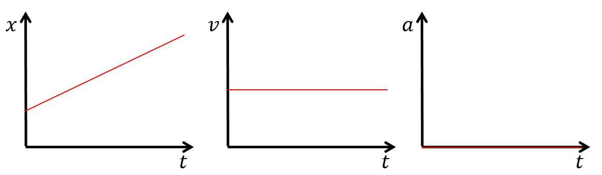
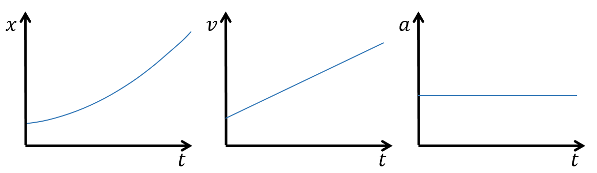
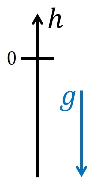
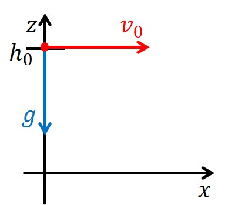

<!--
author:   Herbert Schletter

email:    herbert.schletter@physik.tu-chemnitz.de

version:  0.0.1

language: de

narrator: Deutsch Male

comment:  Skriptum zur Vorlesung „Physik (mit Experimenten)“

link:     https://cdn.jsdelivr.net/chartist.js/latest/chartist.min.css

script:   https://cdn.jsdelivr.net/chartist.js/latest/chartist.min.js

-->

# Elementarkurs Experimentalphysik

Skriptum zum Kurs „Physik (mit Experimenten)“

Dr. Herbert Schletter

Wintersemester 2021/2022

## Vorwort
Dieses Skriptum wurde konzipiert und verfasst als Lehrmaterial zur Vorlesung „Physik (mit Experimenten)“ für die Studiengänge ‚Wirtschaftsingenieurwesen‘ und ‚Lehramt an Grundschulen‘ an der
Technischen Universität Chemnitz. Es bietet einen Überblick über grundlegende Konzepte und Arbeitsmethoden der Physik mit einem Schwerpunkt auf die Gebiete der klassischen Physik.

Da ein Skriptum auf den jeweiligen Vorlesungsinhalt abgestimmt ist, erreicht es nicht den Umfang und die Ausführlichkeit eines Lehrbuchs und kann daher auch ein solches nicht
ersetzen. Es bietet jedoch eine didaktische Einführung in das Themengebiet.

Der diesem Skriptum zu Grunde liegende Physikkurs hat einen Umfang von 15 Vorlesungen. Dieser recht geringe zeitliche Umfang erfordert eine Konzentration des
Vorlesungsinhalts auf die zentralen physikalischen Prinzipien der einzelnen Stoffgebiete zusammen mit den grundlegenden mathematischen Herleitungen. Aufgrund dieser
Stoffreduktion trägt dieses Skriptum die Bezeichnung „Elementarkurs“.

## Einführung

Am Beginn dieses Kurses soll zunächst geklärt werden, welche Zielstellung hierin
verfolgt wird. Wie der Titel bereits besagt, handelt es sich um eine
(grundlegende) Einführung in die Physik, konkret: in die Experimentalphysik (dieser Begriff
wird im Laufe dieser Einführung noch erklärt werden). Es muss daher zunächst in ganz
allgemeiner Form geklärt werden, womit sich die Physik beschäftigt. Die folgenden Seiten beschreiben die grundlegende Zielstellung der Physik und verschiedene Wege, wie dieses Ziel erreicht werden kann.

### Was ist Physik?

> Die Physik ist eine Naturwissenschaft, die Vorgänge der (unbelebten) Natur qualitativ und quantitativ beschreibt. Sie fragt nach den Eigenschaften und gegenseitigen Wechselwirkungen physikalischer Körper.

Der Begriff „Körper“ bezeichnet dabei ganz allgemein eine definierte Menge an Materie. Ihm können sehr vielfältige und unterschiedliche Eigenschaften zugeordnet werden.
Aus diesem Grund entwickelten sich im Laufe der Zeit verschiedene Teilgebiete der Physik, in denen Körper jeweils unter bestimmten Gesichtspunkten charakterisiert werden.

Die Physik strebt danach, komplexe Phänomene auf grundlegende, allgemeingültige und möglichst einfache Gesetzmäßigkeiten zurück zu führen. Um diese Gesetzmäßigkeiten quantitativ auszudrücken, bedient sich die Physik der Mathematik. Dabei ist das wesentliche Ziel der Physik ein qualitatives *Verständnis* der Naturvorgänge. Die quantitative Beschreibung dieser Vorgänge durch mathematische Formeln ist dem nachgeordnet und kann das Verständnis nicht ersetzen.

Die Physik strebt eine möglichst einfache Beschreibung der Natur an. Diese Einfachheit kann jedoch nur soweit gehen, dass die Realität nicht durch zu starke Vereinfachungen verfälscht widergegeben wird. Die Komplexität physikalischer Formeln und Beschreibungen widerspiegelt daher lediglich die Komplexität der uns umgebenden Natur.

Für eine solche einfache Beschreibung der Naturvorgänge ist es erforderlich (und charakteristisch für die Physik), diese Vorgänge auf ihre wesentlichen Eigenschaften zu reduzieren und Unwesentliches außen vor zu lassen. Ein solches vereinfachtes oder reduziertes Abbild der Natur wird als **Modell** bezeichnet. Physikalische Modelle sind stets nur unter bestimmten Voraussetzungen anwendbar. So wird uns in den ersten Kapiteln das Modell des Massepunkts begegnen, bei dem die Form und Größe eines Körpers als unwesentliche Eigenschaften ignoriert werden und lediglich die Masse berücksichtigt wird, die – modellhaft – in einem Punkt gedacht wird. Für die Beschreibung einer geradlinigen Bewegung ist dieses Modell ausreichend, für die Rotation jedoch nicht mehr. Für letztere müssen dann andere Modelle herangezogen werden.

Mitunter werden Modelle soweit reduziert, dass sie die Realität nur noch näherungsweise widergeben (z.B. durch Vernachlässigung der unvermeidbaren Reibung bei der Beschreibung von Bewegungen). Es muss dann geprüft werden, ob ein solches Modell den konkreten Sachverhalt mit ausreichender Genauigkeit beschreibt. Ist dies nicht der Fall, muss ein entsprechend aufwändigeres Modell angewendet werden.

#### Entwicklung der Physik

Die Menschheit hatte seit jeher ein Interesse an der Naturbeobachtung. Die Physik in ihrem heutigen Sinn entstand jedoch erst im 17. Jahrhundert und ist eng mit den Personen Galileo Galilei und Isaac Newton verbunden. Seither ist die Physik geprägt durch:

1.  systematisches Experimentieren anstelle einer bloßen Naturbeobachtung und
2.  eine enge Verknüpfung von Theorie und Experiment.

Vom 17. bis 19. Jahrhundert entwickelten sich die Teilbereiche, die heute als klassische Physik bezeichnet werden: Mechanik, Wärmelehre, Elektrizitätslehre & Optik. Ab ca. 1900 entstand die moderne Physik, zu der (unter anderem) die relativistische Physik, Quantenphysik, Atom-, Molekül- und Festkörperphysik sowie die Elementarteilchenphysik gezählt wird. Die einzelnen Teilgebiete der Physik lassen sich nicht scharf voneinander abgrenzen. So werden beispielsweise die Gesetze der Mechanik auch in der Elektrizitäts- oder Wärmelehre angewendet und finden sich auch in der modernen Physik wieder.

### Arbeitsmethoden der Physik

Die Physik kennt zwei grundsätzliche Herangehensweisen zur Untersuchung von Naturvorgängen:

In der **Experimentalphysik** werden Naturvorgänge durch Experimente (siehe unten) empirisch untersucht. Durch systematische Veränderung der Einflussgrößen werden physikalische Zusammenhänge ermittelt. Mit Hilfe mathematischer Methoden können Beziehungen zwischen den physikalischen Größen hergestellt und die ermittelten Ergebnisse in Formeln ausgedrückt werden.

Die **theoretische Physik** orientiert sich stärker an der mathematischen Vorgehensweise. Dabei bilden physikalische Grundgesetze, Axiome oder Annahmen die Basis der Überlegungen. Darauf aufbauend werden dann – unter Anwendung der Gesetze der Mathematik – neue Zusammenhänge und Gesetze geschlussfolgert. Die zugrunde liegenden Gesetze müssen dabei so formuliert werden, dass sie die Gegebenheiten der Natur widerspiegeln.

Beide Herangehensweisen ergänzen sich und müssen identische Ergebnisse liefern. So sollen experimentelle Befunde auch theoretisch (ausgehend von physikalischen Grundgesetzen) erklärt werden. Umgekehrt werden Berechnungen und Vorhersagen der theoretischen Physik experimentell überprüft.

Der vorliegende Physikkurs ist in der Experimentalphysik angesiedelt. Das kann jedoch nicht bedeuten, dass auf die Anwendung der Mathematik verzichtet wird. Vielmehr werden auch hier mathematische Methoden genutzt um Beziehungen zwischen physikalischen Größen herzustellen und gefundene Zusammenhänge zu begründen.

### Experimente & Messungen

Experimente sind elementarer Bestandteil jeder *Natur*wissenschaft.

Ein **Experiment** ist eine gezielte Frage an die Natur. D.h. durch Experimente werden Zusammenhänge der Natur gezielt und systematisch untersucht. Der Aufbau und die Durchführung eines Experiments müssen dieser Zielstellung entsprechen:

-   Der Versuchsaufbau muss den relevanten Effekt widerspiegeln.

-   Störende Einflussfaktoren sollen ausgeschlossen oder minimiert werden (z.B. Vermeidung von Reibungsverlusten in der Mechanik, Abschirmung gegen elektromagnetische Felder).

-   Experimente müssen systematisch durchgeführt werden, indem Einflussfaktoren einzeln unter sonst gleichen Bedingungen geändert werden.

-   Messungen müssen mit ausreichender Genauigkeit erfolgen.

Diese Anforderungen bedingen einen entsprechenden apparativen Aufwand für das Experimentieren, der sich in der Größe und den Kosten von Versuchsaufbauten widerspiegelt. Mitunter sind selbst bauliche Anforderungen an die Laborräume einzuhalten, damit ein Experiment gelingt (z.B. Sonderfundamente für atomar auflösende Elektronenmikroskope).

Im Experiment sollen Zusammenhänge der Natur quantitativ erfasst werden. Dazu müssen relevante Größen gemessen werden. Eine **Messung** ist ein Vergleich einer (unbekannten) Größe mit einem Maßnormal. Dieser Vergleich kann direkt (z.B. Längenmessung mit einem Lineal) oder indirekt (z.B. Massebestimmung mit Digitalwaage) erfolgen. Die Maßnormale verkörpern eine festgelegte Quantität der zu messenden Größe. Beispiele für Maßnormale sind: Lineal für die Längenmessung, Massestücke, ein Metronom als Zeitnormal aber auch elektrische Multimeter usw. Die Maßnormale definieren dabei auch die Maßeinheiten der jeweiligen Größe.

Eine physikalische Größe ist definiert als:

$$\textrm{Größe}=\textrm{Zahlenwert}\cdot\textrm{Einheit}$$
Beispielsweise könnten für einen Menschen Körpergröße $h$ und Masse $m$ wie folgt angegeben werden:

$$\begin{array}{c}
        h=1{,}88\cdot 1~\mathrm{Meter}=1{,}88~\mathrm m \\
        m=87\cdot 1~\mathrm{Kilogramm}=87~\mathrm{kg}
\end{array}$$

Physikalische Größen ohne Maßeinheiten existieren nicht. Für jede Größe muss eine Einheit definiert sein. Daraus ergibt sich eine sehr große Zahl physikalischer Einheiten. Um diese zu systematisieren werden Einheitensysteme (oder: Maßsysteme) angewendet. Ein Einheitensystem definiert einen Satz physikalischer Grundgrößen mit den zugehörigen Grundeinheiten. Daraus können alle weiteren Größen mit ihren Einheiten abgeleitet werden.

In der Physik ist das Système international d'unités – kurz: SI-System – allgemein gebräuchlich. Die sieben SI-Grundgrößen mit ihren Grundeinheiten sind in der nachfolgenden Tabelle zusammengestellt. Alle weiteren physikalischen Einheiten lassen sich aus diesen Grundeinheiten ableiten. Für die Einheit der elektrischen Spannung – das Volt – gilt beispielsweise

$$1~\mathrm V=1~\frac{\mathrm{kg\cdot m^2}}{\mathrm{A\cdot s^3}}$$

| SI-Grundgröße           | Grundeinheit                 |
|:------------------------|:-----------------------------|
| Länge                   | Meter ($1~\mathrm m$)        |
| Zeit                    | Sekunde ($1~\mathrm s$)        |
| Masse                   | Kilogram ($1~\mathrm {kg}$)     |
| (absolute) Temperatur   | Kelvin ($1~\mathrm K$)   |
| Stoffmenge              | Mol ($1~\mathrm{mol}$)         |
| Elektrische Stromstärke | Ampere ($1~\mathrm A$)        |
| Lichtstärke             | Candela ($1~\mathrm{cd}$) |

Vorsicht ist geboten bei Einheiten, die keine dezimalen Umrechnungsfaktoren besitzen. Das betrifft unter anderem Zeitangaben in Minuten oder Stunden. Hier sollten Angaben stets in Sekunden erfolgen. Ebenso sollten Winkelangaben im Bogenmaß (Radiant) vorgenommen werden.

Wie oben bereits angegeben ist eine Messung der Vergleich einer Größe mit einem Maßnormal. Ein solcher Vergleich ist jedoch niemals völlig exakt. Es treten stets **Messunsicherheiten** (Messfehler) auf, die sich unter anderem aus Unzulänglichkeiten oder der begrenzten Anzeigegenauigkeit des Messinstruments ergeben. Diese Messunsicherheiten müssen ermittelt und zum Messwert angegeben werden. Die Angabe eines Messergebnisses ohne Unsicherheit ist für die Praxis wertlos. Die Bestimmung der Messunsicherheit ist somit ebenso wichtig (und ebenso schwierig) wie die Messung selbst.

Die Angabe der Messunsicherheit kann als absolute oder relative Unsicherheit erfolgen. Für die Masse der oben angegebenen Person könnte die vollständige Angabe wie folgt aussehen:

$$m=87\pm 4~\mathrm{kg}\quad\textrm{bzw.}\quad m=87~\mathrm{kg}\pm5\,\%$$

### Bezugssysteme

Die Physik beschreibt Naturvorgänge in ihrer räumlichen und zeitlichen Entwicklung. Dazu müssen physikalische Größen orts- und/oder zeitabhängig gemessen, berechnet und angegeben werden. Mathematisch bedient sich die Physik hierbei der Methoden der Vektorrechnung sowie der Integral- und Differentialrechnung. Darüber hinaus müssen geeignete Bezugsystem definiert werden, damit Orts- und Zeitangaben eindeutig erfolgen können.

Für die Zeit wird ein Referenzzeitpunkt festgelegt. In vielen Fällen ist dies implizit der Beginn des Experiments oder der Messung. Es können jedoch auch beliebige andere Referenzzeiten definiert werden.

Für Ortsangaben muss ein geeignetes Koordinatensystem definiert werden. Dieses sollte dem betreffenden Sachverhalt so angepasst werden, dass eine einfache Beschreibung des Vorgangs möglich ist. Tatsächlich kann durch die Wahl eines geeigneten Koordinatensystems der Rechenaufwand erheblich reduziert werden. Für lineare (eindimensionale) Probleme (z.B. geradlinige Bewegung) genügt auch ein eindimensionales Koordinatensystem ($x$-Achse). Für zwei- oder dreidimensionale Beschreibungen werden entsprechend 2D $\left( x,y \right)$ oder 3D $\left( x,y,z \right)$ Koordinatensysteme verwendet.

Die bisher genannten Koordinatensysteme sind rechtwinklige, oder kartesische Koordinatensysteme. Es handelt sich um sogenannte Rechtssysteme, d.h. die Lage der Achsen zueinander kann durch die Finger der rechten Hand ermittelt werden. Wie in der folgenden Abbildung dargestellt, entsprechen Daumen, Zeigefinger und Mittelfinger – rechtwinklig abgespreizt – der $x$-, $y$- und $z$-Achse.

.")

\[Quelle: User:Acdx, cmglee, [„Right hand rule Cartesian axes“](https://commons.wikimedia.org/wiki/File:Right_hand_rule_Cartesian_axes.svg), [CC BY-SA 4.0](https://creativecommons.org/licenses/by-sa/4.0/legalcode), via Wikimedia Commons\])

Anstelle dieser rechtwinkligen Koordinatensysteme können auch Winkelkoordinatensysteme verwendet werden. In zwei Dimensionen sind dies die Polarkoordinaten $\left(\phi ,r\right)$, die beispielsweise bei der Beschreibung von Kreisbewegungen angewendet werden. In 3D lassen sich anhand von Winkelangaben Zylinderkoordinaten $\left( \phi ,r,z\right)$ und Kugelkoordinaten $\left(\phi , \theta ,r\right)$ aufstellen. Letztere werden beispielsweise für Positionsangaben auf der Erde genutzt: die geografische Länge und Breite entsprechen den Winkeln $\phi$ und $\theta$ eines Kugelkoordinatensystems, dessen Ursprung im Erdmittelpunkt liegt.

Um ein physikalisches Problem räumlich zu beschreiben, muss zunächst ein Koordinatensystem festgelegt werden. Diese Festlegung kann willkürlich erfolgen. Es existieren oftmals mehrere gleichwertige Koordinatensysteme. Nach Festlegung eines Koordinatensystems sollte dieses für die gesamte Beschreibung beibehalten werden. Der Wechsel in ein anderes System ist zwar prinzipiell möglich, jedoch mit einem mitunter erheblichen Rechenaufwand verbunden.

## Mechanik

Die Mechanik ist ein Teilgebiet der klassischen Physik. Sie beschreibt die Bewegungseigenschaften von Körpern sowie die Wirkung von Kräften.

### Kinematik

Die Kinematik ist ein Teilgebiet der Mechanik und befasst sich mit der Beschreibung der Bewegung von Körpern. Die Ursachen der Bewegung (genauer: der Änderungen eines Bewegungszustands) werden nicht betrachtet.

Für die Bewegung eines Körpers auf geraden oder gekrümmten Bahnen spielen Form und Größe dieses Körpers keine Rolle und können vernachlässigt werden. Auf diese Weise gelangt man zum Modell des Massepunktes bzw. der Punktmasse, bei dem die gesamte Masse des betrachteten Körpers in einem Punkt vereinigt ist (vgl. Hinweise zu physikalischen Modellen im Kapitel [Einführung](#was-ist-physik?)). Die Lage dieses Massepunktes innerhalb des ursprünglichen Körpers ist nicht frei wählbar, sondern entspricht dem Schwerpunkt (oder Massenmittelpunkt), für den eine genaue Berechnungsvorschrift existiert. Auf letztere wird jedoch in diesem Kurs nicht näher eingegangen. Das Modell der Punktmasse kann nicht angewendet werden zur Beschreibung einer Eigenrotation eines Körpers oder bei Verformung des Körpers.

Ziel der Kinematik ist also, die Position eines Massepunktes im Raum sowie deren zeitliche Änderung (= Bewegung) anzugeben. Zu diesem Zweck benötigen wir eine Größe, die die Position erfasst. Dies ist der **Ortsvektor** $\vec r$. Er zeigt stets vom Koordinatenursprung zur aktuellen Position des Massepunktes. Im allgemeinen Fall ist der Ortsvektor dreidimensional mit den Komponenten

$$\vec{r}(t)=\begin{pmatrix} x(t) \\ y(t) \\ z(t) \end{pmatrix} .$$
Bei ebenen (zweidimensionalen) Bewegungen enthält der Ortsvektor entsprechend nur zwei Komponenten. Bei geradlinigen Bewegungen reduziert sich der Ortsvektor auf eine skalare Größe.

Bewegt sich der Massepunkt, so ändert sich sein Ortsvektor, d.h. der Ortsvektor ist zeitabhängig: $\vec{r}= \vec{r}(t)$. Der Zusammenhang $\vec{r}(t)$ wird als **Orts-Zeit-Gesetz** oder **Weg-Zeit-Gesetz** bezeichnet. Anhand dieses Orts-Zeit-Gesetzes lassen sich grundlegende Bewegungsformen unterscheiden, die im Folgenden zunächst für die geradlinige Bewegung betrachtet werden.

#### Geradlinige Bewegung

Bei der Beschreibung einer geradlinigen Bewegung wird der Ortsvektor ersetzt durch eine skalare Positions- oder Wegangabe, z.B. $x(t)$.

##### Gleichförmig geradlinige Bewegung

Eine geradlinige Bewegung wird als gleichförmig bezeichnet, wenn in gleichen Zeitabschnitten $\Delta t$ jeweils gleiche Strecken $\Delta x$ zurückgelegt werden. In der grafischen Darstellung des Orts-Zeit-Gesetzes $x(t)$ entspricht dies einer Geraden (siehe nachfolgende Abbildung, links). Der Anstieg dieser Geraden gibt an, wie schnell sich die Position des Massepunktes (das heißt sein Ortsvektor) ändert und wird als Geschwindigkeit $v$ definiert:

$$v=\frac{\Delta x}{\Delta t} \qquad\textrm{Einheit: } \left[ v \right]=1~\frac{\mathrm m}{\mathrm s}$$

Wird diese Berechnung – wie hier angegeben – für einen makroskopischen Zeitraum $\Delta t$ durchgeführt, so ergibt sich die Durchschnittsgeschwindigkeit während des betrachteten Zeitraums. Für die gleichförmige Bewegung ist die konkrete Wahl des Zeitintervalls jedoch unerheblich, da das Orts-Zeit-Gesetz eine Gerade darstellt und damit die Geschwindigkeit für alle Zeitintervalle gleich ist. Folglich ist bei der gleichförmigen Bewegung die Geschwindigkeit eine Konstante (siehe Abbildung, mittleres Diagramm).

Aus der Definition der Geschwindigkeit erhält man durch Umstellen für den in einem Zeitintervall zurückgelegten Weg:

$$\Delta x = v\cdot\Delta t \, .$$
Setzt man den Beginn des betrachteten Zeitintervalls auf den Zeitpunkt $t=0$, so erhält man das Weg-Zeit-Gesetz der gleichförmig geradlinigen Bewegung:

$$x(t) = vt+x_0 \, ,$$
wobei $x_0$ die Position des Körpers (Massepunkts) zum Zeitpunkt $t=0$ angibt. Diese kann durch geeignete Wahl des Koordinatensystems häufig $x_0 = 0$ gesetzt werden.

##### (Gleichmäßig) beschleunigte geradlinige Bewegung

Bewegungen, bei denen die Geschwindigkeit nicht konstant ist, werden als beschleunigt bezeichnet. Das Weg-Zeit-Gesetz ist dabei keine Gerade, d.h., in gleichen Zeitintervallen $\Delta t$ werden zu unterschiedlichen Zeitpunkten verschiedene Wege $\Delta x$ zurückgelegt. Zudem hängt die Bestimmung der Durchschnittsgeschwindigkeit von der Länge des betrachteten Zeitintervalls ab. Zur Bestimmung einer exakten Momentangeschwindigkeit muss daher das betrachtete Zeitintervall infintesimal klein gewählt werden. Mathematisch entspricht dies der Ableitung des Orts-Zeit-Gesetzes nach der Zeit:

$$v_\mathrm{momentan}(t) =\lim_{\Delta t \to 0}\frac{\Delta x}{\Delta t} = \frac{\mathrm d x(t)}{\mathrm dt} = \dot x(t) \, .$$
Der Zusammenhang $v(t)$ wird dabei als **Geschwindigkeits-Zeit-Gesetz**  bezeichnet.

Bei beschleunigten Bewegungen ist also die Geschwindigkeit keine Konstante: $v(t)\neq\mathrm{const.}$ Um die Änderung der Geschwindigkeit zu quantifizieren, wird die **Beschleunigung** $a$ als weitere physikalische Größe eingeführt, die die zeitliche Veränderung der Geschwindigkeit erfasst. Mathematisch bedeutet dies, dass die Ableitung der Geschwindigkeit nach der Zeit gebildet wird:

$$a (t) = \frac{\mathrm dv (t)}{\mathrm dt} = \frac{\mathrm d^2 x (t)}{\mathrm dt^2} = \ddot{x} (t) \qquad \textrm {Einheit:}\, [a] = 1~\frac{\mathrm m}{\mathrm s^2}$$

In physikalischer Sprechweise ist auch das Bremsen eine Beschleunigung, jedoch mit negativem Vorzeichen $a<0$. Vektoriell ausgedrückt ist beim Bremsen die Richtung der Beschleunigung dem Geschwindigkeitsvektor entgegengesetzt.

Ausgehend von der Beschleunigung erhält man das Weg-Zeit-Gesetz durch zweimalige Integration. Für den Sonderfall der gleichmäßig beschleunigten Bewegung ($a= \mathrm{const.}$) folgt für das Geschwindigkeits-Zeit-Gesetz $v(t)$:

$$v (t) = \int\limits a\, \mathrm dt = a \cdot t + C_1 \,.$$

Die Integrationskonstante $C_1$ folgt mathematisch aus der Lösung des unbestimmten Integrals und muss noch mit einer physikalischen Größe identifiziert werden. Aus den Anfangsbedingungen (Anfangszeitpunkt $t = 0$) folgt:

$$v(t = 0) = a \cdot 0 + C_1 = C_1\,.$$

Die Integrationskonstante entspricht also der Anfangsgeschwindigkeit zum Zeitpunkt $t = 0$, d.h. $C_1 = v_0$. Das Geschwindigkeits-Zeit-Gesetz der gleichmäßig beschleunigten Bewegung lautet also:

$$v (t) = a \cdot t + v_0 \,.$$

Das Weg-Zeit-Gesetz erhält man durch Integration des Geschwindigkeits-Zeit-Gesetzes:

$$x(t)= \int\limits v (t)\mathrm dt = \int\limits (a \cdot t + v_0) \mathrm dt = \frac{1}{2}a t^2 + v_0 t + C_2$$

Über die Anfangsbedingungen lässt sich wiederum die physikalische Bedeutung der Integrationskonstante $C_2$ finden:

$$x(t = 0) =\frac{a}{2} \cdot 0^2 + v_0 \cdot 0 + C_2 = C_2$$

Die Konstante $C_2$ entspricht also der Anfangsposition $x_0$ des Körpers zum Zeitpunkt $t=0$. Damit erhalten wir das Weg-Zeit-Gesetz der gleichmäßig beschleunigten Bewegung:

$$x(t)=\frac{1}{2} a t^2 + v_0 t + x_0$$

Für ungleichmäßig beschleunigte Bewegungen ($a \neq \mathrm{const.}$) ist die Vorgehensweise prinzipiell gleich. Ausgehend vom zeitlichen Verlauf der Beschleunigung $a(t)$ erhält man durch ein- bzw. zweimalige Integration das Geschwindigkeits-Zeit-Gesetz und das Orts-Zeit-Gesetz. Die hergeleiteten Beziehungen für $x(t)$, $v(t)$ und $a(t)$ spiegeln sich auch in den grafischen Darstellungen des Orts-Zeit-Gesetzes, Geschwindigkeits-Zeit-Gesetzes und Beschleunigungs-Zeit-Gesetzes wider. Für die gleichmäßig beschleunigte Bewegung sind diese Diagramme in der nachfolgenden Abbildung dargestellt.

Ein Spezialfall der gleichmäßig beschleunigten Bewegung ist der freie Fall. Zu dessen Beschreibung definieren wir folgendes eindimensionale Koordinatensystem, wobei wir die Koordinate $x$ der Anschaulichkeit wegen durch die Höhe $h$ ersetzen (siehe Abbildung):

-   $h$-Achse in vertikaler Richtung, positive Richtung zeigt nach oben.
-   Der Nullpunkt der $h$-Achse entspricht dem Startpunkt
    der Bewegung, d.h. $h_0=0$.

Im freien Fall wird der Körper nach unten (d.h. in Richtung der negativen $h$-Achse) beschleunigt. Dabei wirkt die Fallbeschleunigung, die in der Nähe der Erdoberfläche annähernd konstant den Wert $a=g=9{,}81~\frac{\mathrm m}{\mathrm s^2}$ aufweist (siehe folgende Abbildung). Für das Orts-Zeit-Gesetz gilt demnach:

$$h=-\frac{g}{2}t^2$$

Beginnt der freie Fall nicht in der Höhe $h=0$, so ist die Anfangshöhe $h_0$ zu berücksichtigen:

$$h=-\frac{g}{2}t^2 + h_0$$

Von einem senkrechten Wurf wird gesprochen, wenn der Körper zusätzlich eine Anfangsgeschwindigkeit $v_0$ in vertikale Richtung erhält. Für das Orts-Zeit-Gesetz gilt dann:

$$h=-\frac{g}{2}t^2 + v_0 t + h_0$$

#### Überlagerung von Bewegungen – mehrdimensionale Bewegung

Bewegungen, die nicht geradlinig verlaufen, müssen in zwei- bzw. dreidimensionalen Koordinatensystemen beschrieben werden. Der Ortsvektor besitzt dann im allgemeinen Fall drei Komponenten:

$$\vec r(t)=\begin{pmatrix}x(t) \\ y(t) \\ z(t)\end{pmatrix}\, .$$
Gleiches gilt für die Geschwindigkeit

$$\vec v(t) =\dot{\vec r}(t) = \frac{\mathrm d}{\mathrm dt}\vec r(t) = \frac{\mathrm d}{\mathrm dt}\begin{pmatrix}x(t) \\ y(t) \\ z(t)\end{pmatrix}
        = \begin{pmatrix}\frac{\mathrm dx(t)}{\mathrm dt} \\ \frac{\mathrm dy(t)}{\mathrm dt} \\ \frac{\mathrm dz(t)}{\mathrm dt} \end{pmatrix}
        =\begin{pmatrix}v_\mathrm x(t) \\ v_\mathrm y(t) \\ v_\mathrm z(t)\end{pmatrix}$$
und die Beschleunigung

$$\vec a(t) =\dot{\vec v}(t) = \frac{\mathrm d}{\mathrm dt}\vec v(t)
        = \frac{\mathrm d}{\mathrm dt}\begin{pmatrix}v_\mathrm x(t) \\ v_\mathrm y(t) \\ v_\mathrm z(t)\end{pmatrix}
        = \begin{pmatrix}\frac{\mathrm dv_\mathrm x(t)}{\mathrm dt} \\ \frac{\mathrm dv_\mathrm y(t)}{\mathrm dt} \\ \frac{\mathrm dv_\mathrm z(t)}{\mathrm dt} \end{pmatrix}
        =\begin{pmatrix}a_\mathrm x(t) \\ a_\mathrm y(t) \\ a_\mathrm z(t)\end{pmatrix} \, .$$

Die Komponenten dieser Vektoren können getrennt voneinander jeweils als geradlinige Bewegung betrachtet werden. D.h. die Bewegungen in verschiedene Raumrichtungen überlagern sich ohne gegenseitige Beeinflussung. Diese Eigenschaft wird als *Superposition* der Bewegung bezeichnet.

Wir betrachten die Bewegung auf einer gekrümmten Bahn am Beispiel des waagerechten Wurfs. Für diesen definieren wir folgendes zweidimensionale Koordinatensystem mit $x$- & $z$-Achse (siehe nachfolgende Abbildung):

-   Die x-Achse ist waagerecht orientiert, die z-Achse senkrecht

-   Der Abwurf erfolgt in positive $x$-Richtung:

    $$\vec v_0 = \begin{pmatrix} v_0 \\ 0 \end{pmatrix}$$

-   Die Fallbeschleunigung zeigt in negative $z$-Richtung:

    $$\vec{a} = \begin{pmatrix} 0 \\ -g \end{pmatrix}$$

-   Die Abwurfposition liegt über dem Koordinatenursprung:

    $$\vec r_0 = \begin{pmatrix} 0 \\ h_0 \end{pmatrix}$$

Diese Bewegung wird nun komponentenweise betrachtet. In $x$-Richtung liegt eine gleichförmige Bewegung mit der Geschwindigkeit $v_0$ vor:

$$x(t) = v_0 t$$

In $z$-Richtung liegt eine gleichmäßig beschleunigte Bewegung mit der Anfangshöhe $h_0$ vor:

$$z(t) = - \frac{g}{2} t^2 + h_0$$

Beide Bewegungen überlagern sich, und es gilt für den waagerechten Wurf:

$$\vec{r}(t) = \begin{pmatrix} v_0t \\ h_0 - \frac{g}{2}t^2 \end{pmatrix}$$

In der vertikalen Richtung führt ein Körper beim waagerechten Wurf demnach dieselbe Bewegung aus wie beim freien Fall. Hinzu kommt lediglich die waagerechte Bewegung.

Mit dem eben hergeleiteten Orts-Zeit-Gesetz wird zwar der zeitliche Verlauf der Bewegung beschrieben, nicht jedoch die Bahnkurve, auf der sich der Körper bewegt. Um diese aufzustellen, muss der Parameter $t$ in der obigen Formel eliminiert werden. Man erhält so die parameterfreie Darstellung $z(x)$. Die $x$-Komponente lässt sich wie folgt umformen:

$$t = \frac{x}{v_0}$$

Eingesetzt in die $z$-Komponente erhält man:

$$z = h_0 - \frac{g}{2}t^2 = h_0 - \frac{g}{2v_0^2}x^2$$

Die Bahnkurve des waagerechten Wurfs ist somit eine nach unten geöffnete Parabel mit dem Scheitelpunkt $\begin{pmatrix} 0\\ h_0 \end{pmatrix}$ (= Abwurfpunkt).

Mit dieser Vorgehensweise lassen sich Orts-Zeit-Gesetze und Bahnkurven für beliebige Bewegungen bestimmen. Die Betrachtung des schrägen Wurfs beispielsweise unterscheidet sich vom vorigen Beispiel lediglich darin, dass der Abwurf nun um einen Winkel $\alpha$ gegen die Horizontale geneigt erfolgt. Die Anfangsgeschwindigkeit beträgt demzufolge:

$$\vec v_0=\begin{pmatrix} v_0 \cdot \cos(\alpha) \\ v_0 \cdot \sin(\alpha) \end{pmatrix} \, .$$

Im Ergebnis ergibt sich wiederum eine parabelförmige Bahnkurve, deren Scheitelpunkt nicht mehr mit dem Abwurfpunkt übereinstimmt, sondern von $h_0, v_0$ und $\alpha$ abhängt.
