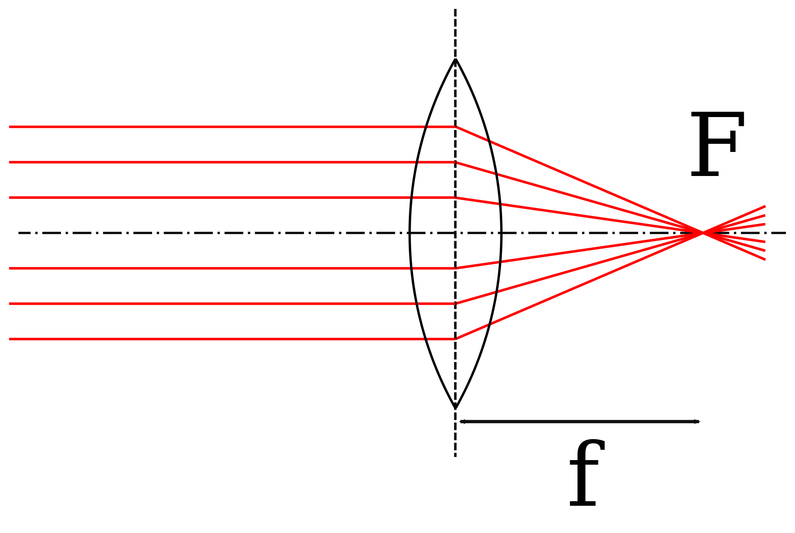

<!--
author:   Herbert Schletter

email:    herbert.schletter@physik.tu-chemnitz.de

version:  0.0.1

language: de

narrator: Deutsch Male

comment:  Skriptum zur Vorlesung „Physik (mit Experimenten)“

link:     https://cdn.jsdelivr.net/chartist.js/latest/chartist.min.css

script:   https://cdn.jsdelivr.net/chartist.js/latest/chartist.min.js

-->

# Elementarkurs Experimentalphysik

*Skriptum zum Kurs „Physik (mit Experimenten)“*

**Dr. Herbert Schletter**

Wintersemester 2021/2022

Hinweis zum Urheberrecht
========================

Dieses Skriptum steht unter einer  [Creative Commons Namensnennung 4.0 International Lizenz](http://creativecommons.org/licenses/by/4.0/).

Ausgenommen hiervon sind Inhalte (insbesondere Abbildungen), die aus externen
Quellen übernommen wurden und dort unter einer anderslautenden Lizenz
veröffentlicht wurden. Derartige Inhalte sind im Skript stets mit einem eigenen
Lizenzhinweis versehen, der Vorrang vor der hier genannten Lizenz besitzt.

## Vorwort
Dieses Skriptum wurde konzipiert und verfasst als Lehrmaterial zur Vorlesung
„Physik (mit Experimenten)“ für die Studiengänge ‚Wirtschaftsingenieurwesen‘ und
‚Lehramt an Grundschulen‘ an der Technischen Universität Chemnitz. Es bietet
einen Überblick über grundlegende Konzepte und Arbeitsmethoden der Physik mit
einem Schwerpunkt auf die Gebiete der klassischen Physik.

Da ein Skriptum auf den jeweiligen Vorlesungsinhalt abgestimmt ist, erreicht es
nicht den Umfang und die Ausführlichkeit eines Lehrbuchs und kann daher auch ein
solches nicht ersetzen. Es bietet jedoch eine didaktische Einführung in das
Themengebiet.

Der diesem Skriptum zu Grunde liegende Physikkurs hat einen Umfang von 15
Vorlesungen. Dieser recht geringe zeitliche Umfang erfordert eine Konzentration
des Vorlesungsinhalts auf die zentralen physikalischen Prinzipien der einzelnen
Stoffgebiete zusammen mit den grundlegenden mathematischen Herleitungen.
Aufgrund dieser Stoffreduktion trägt dieses Skriptum die Bezeichnung
„Elementarkurs“.

## Einführung

Am Beginn dieses Kurses soll zunächst geklärt werden, welche Zielstellung hierin
verfolgt wird. Wie der Titel bereits besagt, handelt es sich um eine
(grundlegende) Einführung in die Physik, konkret: in die Experimentalphysik
(dieser Begriff wird im Laufe dieser Einführung noch erklärt werden). Es muss
daher zunächst in ganz allgemeiner Form geklärt werden, womit sich die Physik
beschäftigt. Die folgenden Seiten beschreiben die grundlegende Zielstellung der
Physik und verschiedene Wege, wie dieses Ziel erreicht werden kann.

### Was ist Physik?

> Die Physik ist eine Naturwissenschaft, die Vorgänge der (unbelebten) Natur
qualitativ und quantitativ beschreibt. Sie fragt nach den Eigenschaften und
gegenseitigen Wechselwirkungen physikalischer Körper.

Der Begriff „Körper“ bezeichnet dabei ganz allgemein eine definierte Menge an
Materie. Ihm können sehr vielfältige und unterschiedliche Eigenschaften
zugeordnet werden. Aus diesem Grund entwickelten sich im Laufe der Zeit
verschiedene Teilgebiete der Physik, in denen Körper jeweils unter bestimmten
Gesichtspunkten charakterisiert werden.

Die Physik strebt danach, komplexe Phänomene auf grundlegende, allgemeingültige
und möglichst einfache Gesetzmäßigkeiten zurück zu führen. Um diese
Gesetzmäßigkeiten quantitativ auszudrücken, bedient sich die Physik der
Mathematik. Dabei ist das wesentliche Ziel der Physik ein qualitatives
*Verständnis* der Naturvorgänge. Die quantitative Beschreibung dieser Vorgänge
durch mathematische Formeln ist dem nachgeordnet und kann das Verständnis nicht
ersetzen.

Die Physik strebt eine möglichst einfache Beschreibung der Natur an. Diese
Einfachheit kann jedoch nur soweit gehen, dass die Realität nicht durch zu
starke Vereinfachungen verfälscht widergegeben wird. Die Komplexität
physikalischer Formeln und Beschreibungen widerspiegelt daher lediglich die
Komplexität der uns umgebenden Natur.

Für eine solche einfache Beschreibung der Naturvorgänge ist es erforderlich
(und charakteristisch für die Physik), diese Vorgänge auf ihre wesentlichen
Eigenschaften zu reduzieren und Unwesentliches außen vor zu lassen. Ein solches
vereinfachtes oder reduziertes Abbild der Natur wird als **Modell** bezeichnet.
Physikalische Modelle sind stets nur unter bestimmten Voraussetzungen anwendbar.
So wird uns in den ersten Kapiteln das Modell des Massepunkts begegnen, bei dem
die Form und Größe eines Körpers als unwesentliche Eigenschaften ignoriert
werden und lediglich die Masse berücksichtigt wird, die – modellhaft – in einem
Punkt gedacht wird. Für die Beschreibung einer geradlinigen Bewegung ist dieses
Modell ausreichend, für die Rotation jedoch nicht mehr. Für letztere müssen dann
andere Modelle herangezogen werden.

Mitunter werden Modelle soweit reduziert, dass sie die Realität nur noch
näherungsweise widergeben (z.B. durch Vernachlässigung der unvermeidbaren
Reibung bei der Beschreibung von Bewegungen). Es muss dann geprüft werden,
ob ein solches Modell den konkreten Sachverhalt mit ausreichender Genauigkeit
beschreibt. Ist dies nicht der Fall, muss ein entsprechend aufwändigeres Modell
angewendet werden.

#### Entwicklung der Physik

Die Menschheit hatte seit jeher ein Interesse an der Naturbeobachtung. Die
Physik in ihrem heutigen Sinn entstand jedoch erst im 17. Jahrhundert und ist
eng mit den Personen Galileo Galilei und Isaac Newton verbunden. Seither ist die
Physik geprägt durch:

1.  systematisches Experimentieren anstelle einer bloßen Naturbeobachtung und
2.  eine enge Verknüpfung von Theorie und Experiment.

Vom 17. bis 19. Jahrhundert entwickelten sich die Teilbereiche, die heute als
klassische Physik bezeichnet werden: Mechanik, Wärmelehre, Elektrizitätslehre &
Optik. Ab ca. 1900 entstand die moderne Physik, zu der (unter anderem) die
relativistische Physik, Quantenphysik, Atom-, Molekül- und Festkörperphysik
sowie die Elementarteilchenphysik gezählt wird. Die einzelnen Teilgebiete der
Physik lassen sich nicht scharf voneinander abgrenzen. So werden beispielsweise
die Gesetze der Mechanik auch in der Elektrizitäts- oder Wärmelehre angewendet
und finden sich auch in der modernen Physik wieder.

### Arbeitsmethoden der Physik

Die Physik kennt zwei grundsätzliche Herangehensweisen zur Untersuchung von
Naturvorgängen:

In der **Experimentalphysik** werden Naturvorgänge durch Experimente (siehe
unten) empirisch untersucht. Durch systematische Veränderung der Einflussgrößen
werden physikalische Zusammenhänge ermittelt. Mit Hilfe mathematischer Methoden
können Beziehungen zwischen den physikalischen Größen hergestellt und die
ermittelten Ergebnisse in Formeln ausgedrückt werden.

Die **theoretische Physik** orientiert sich stärker an der mathematischen
Vorgehensweise. Dabei bilden physikalische Grundgesetze, Axiome oder Annahmen
die Basis der Überlegungen. Darauf aufbauend werden dann – unter Anwendung der
Gesetze der Mathematik – neue Zusammenhänge und Gesetze geschlussfolgert. Die
zugrunde liegenden Gesetze müssen dabei so formuliert werden, dass sie die
Gegebenheiten der Natur widerspiegeln.

Beide Herangehensweisen ergänzen sich und müssen identische Ergebnisse liefern.
So sollen experimentelle Befunde auch theoretisch (ausgehend von physikalischen
Grundgesetzen) erklärt werden. Umgekehrt werden Berechnungen und Vorhersagen der
theoretischen Physik experimentell überprüft.

Der vorliegende Physikkurs ist in der Experimentalphysik angesiedelt. Das kann
jedoch nicht bedeuten, dass auf die Anwendung der Mathematik verzichtet wird.
Vielmehr werden auch hier mathematische Methoden genutzt um Beziehungen zwischen
physikalischen Größen herzustellen und gefundene Zusammenhänge zu begründen.

### Experimente & Messungen

Experimente sind elementarer Bestandteil jeder *Natur*wissenschaft.

Ein **Experiment** ist eine gezielte Frage an die Natur. D.h. durch Experimente
werden Zusammenhänge der Natur gezielt und systematisch untersucht. Der Aufbau
und die Durchführung eines Experiments müssen dieser Zielstellung entsprechen:

- Der Versuchsaufbau muss den relevanten Effekt widerspiegeln.

- Störende Einflussfaktoren sollen ausgeschlossen oder minimiert werden (z.B.
  Vermeidung von Reibungsverlusten in der Mechanik, Abschirmung gegen
  elektromagnetische Felder).

- Experimente müssen systematisch durchgeführt werden, indem Einflussfaktoren
  einzeln unter sonst gleichen Bedingungen geändert werden.

- Messungen müssen mit ausreichender Genauigkeit erfolgen.

Diese Anforderungen bedingen einen entsprechenden apparativen Aufwand für das
Experimentieren, der sich in der Größe und den Kosten von Versuchsaufbauten
widerspiegelt. Mitunter sind selbst bauliche Anforderungen an die Laborräume
einzuhalten, damit ein Experiment gelingt (z.B. Sonderfundamente für atomar
auflösende Elektronenmikroskope).

Im Experiment sollen Zusammenhänge der Natur quantitativ erfasst werden. Dazu
müssen relevante Größen gemessen werden. Eine **Messung** ist ein Vergleich
einer (unbekannten) Größe mit einem Maßnormal. Dieser Vergleich kann direkt
(z.B. Längenmessung mit einem Lineal) oder indirekt (z.B. Massebestimmung mit
Digitalwaage) erfolgen. Die Maßnormale verkörpern eine festgelegte Quantität der
zu messenden Größe. Beispiele für Maßnormale sind: Lineal für die Längenmessung,
Massestücke, ein Metronom als Zeitnormal aber auch elektrische Multimeter usw.
Die Maßnormale definieren dabei auch die Maßeinheiten der jeweiligen Größe.

Eine physikalische Größe ist definiert als:

$$\textrm{Größe}=\textrm{Zahlenwert}\cdot\textrm{Einheit}$$
Beispielsweise könnten für einen Menschen Körpergröße $h$ und Masse $m$ wie
folgt angegeben werden:

$$\begin{array}{c}
        h=1{,}88\cdot 1~\mathrm{Meter}=1{,}88~\mathrm m \\
        m=87\cdot 1~\mathrm{Kilogramm}=87~\mathrm{kg}
\end{array}$$

Physikalische Größen ohne Maßeinheiten existieren nicht. Für jede Größe muss
eine Einheit definiert sein. Daraus ergibt sich eine sehr große Zahl
physikalischer Einheiten. Um diese zu systematisieren werden Einheitensysteme
(oder: Maßsysteme) angewendet. Ein Einheitensystem definiert einen Satz
physikalischer Grundgrößen mit den zugehörigen Grundeinheiten. Daraus können
alle weiteren Größen mit ihren Einheiten abgeleitet werden.

In der Physik ist das Système international d'unités – kurz: SI-System –
allgemein gebräuchlich. Die sieben SI-Grundgrößen mit ihren Grundeinheiten sind
in der nachfolgenden Tabelle zusammengestellt. Alle weiteren physikalischen
Einheiten lassen sich aus diesen Grundeinheiten ableiten. Für die Einheit der
elektrischen Spannung – das Volt – gilt beispielsweise

$$1~\mathrm V=1~\frac{\mathrm{kg\cdot m^2}}{\mathrm{A\cdot s^3}} \, .$$

| SI-Grundgröße           | Grundeinheit                 |
|:------------------------|:-----------------------------|
| Länge                   | Meter ($1~\mathrm m$)        |
| Zeit                    | Sekunde ($1~\mathrm s$)      |
| Masse                   | Kilogram ($1~\mathrm {kg}$)  |
| (absolute) Temperatur   | Kelvin ($1~\mathrm K$)       |
| Stoffmenge              | Mol ($1~\mathrm{mol}$)       |
| Elektrische Stromstärke | Ampere ($1~\mathrm A$)       |
| Lichtstärke             | Candela ($1~\mathrm{cd}$)    |

Vorsicht ist geboten bei Einheiten, die keine dezimalen Umrechnungsfaktoren
besitzen. Das betrifft unter anderem Zeitangaben in Minuten oder Stunden. Hier
sollten Angaben stets in Sekunden erfolgen. Ebenso sollten Winkelangaben im
Bogenmaß (Radiant) vorgenommen werden.

Wie oben bereits angegeben ist eine Messung der Vergleich einer Größe mit einem
Maßnormal. Ein solcher Vergleich ist jedoch niemals völlig exakt. Es treten
stets **Messunsicherheiten** (Messfehler) auf, die sich unter anderem aus
Unzulänglichkeiten oder der begrenzten Anzeigegenauigkeit des Messinstruments
ergeben. Diese Messunsicherheiten müssen ermittelt und zum Messwert angegeben
werden. Die Angabe eines Messergebnisses ohne Unsicherheit ist für die Praxis
wertlos. Die Bestimmung der Messunsicherheit ist somit ebenso wichtig (und
  ebenso schwierig) wie die Messung selbst.

Die Angabe der Messunsicherheit kann als absolute oder relative Unsicherheit
erfolgen. Für die Masse der oben angegebenen Person könnte die vollständige
Angabe wie folgt aussehen:

$$m=87\pm 4~\mathrm{kg}\quad\textrm{bzw.}\quad m=87~\mathrm{kg}\pm5\,\% \, .$$

### Bezugssysteme

Die Physik beschreibt Naturvorgänge in ihrer räumlichen und zeitlichen
Entwicklung. Dazu müssen physikalische Größen orts- und/oder zeitabhängig
gemessen, berechnet und angegeben werden. Mathematisch bedient sich die Physik
hierbei der Methoden der Vektorrechnung sowie der Integral- und
Differentialrechnung. Darüber hinaus müssen geeignete Bezugsystem definiert
werden, damit Orts- und Zeitangaben eindeutig erfolgen können.

Für die Zeit wird ein Referenzzeitpunkt festgelegt. In vielen Fällen ist dies
implizit der Beginn des Experiments oder der Messung. Es können jedoch auch
beliebige andere Referenzzeiten definiert werden.

Für Ortsangaben muss ein geeignetes Koordinatensystem definiert werden. Dieses
sollte dem betreffenden Sachverhalt so angepasst werden, dass eine einfache
Beschreibung des Vorgangs möglich ist. Tatsächlich kann durch die Wahl eines
geeigneten Koordinatensystems der Rechenaufwand erheblich reduziert werden. Für
lineare (eindimensionale) Probleme (z.B. geradlinige Bewegung) genügt auch ein
eindimensionales Koordinatensystem ($x$-Achse). Für zwei- oder dreidimensionale
Beschreibungen werden entsprechend 2D $\left( x,y \right)$ oder 3D
$\left( x,y,z \right)$ Koordinatensysteme verwendet.

Die bisher genannten Koordinatensysteme sind rechtwinklige, oder kartesische
Koordinatensysteme. Es handelt sich um sogenannte Rechtssysteme, d.h. die Lage
der Achsen zueinander kann durch die Finger der rechten Hand ermittelt werden.
Wie in der folgenden Abbildung dargestellt, entsprechen Daumen, Zeigefinger und
Mittelfinger – rechtwinklig abgespreizt – der $x$-, $y$- und $z$-Achse.

. \[Quelle: User:Acdx, cmglee, [„Right hand rule Cartesian axes“](https://commons.wikimedia.org/wiki/File:Right_hand_rule_Cartesian_axes.svg), [CC BY-SA 4.0](https://creativecommons.org/licenses/by-sa/4.0/legalcode), via Wikimedia Commons\]")

Anstelle dieser rechtwinkligen Koordinatensysteme können auch
Winkelkoordinatensysteme verwendet werden. In zwei Dimensionen sind dies die
Polarkoordinaten $\left(\phi ,r\right)$, die beispielsweise bei der Beschreibung
von Kreisbewegungen angewendet werden. In 3D lassen sich anhand von
Winkelangaben Zylinderkoordinaten $\left( \phi ,r,z\right)$ und Kugelkoordinaten
$\left(\phi , \theta ,r\right)$ aufstellen. Letztere werden beispielsweise für
Positionsangaben auf der Erde genutzt: die geografische Länge und Breite
entsprechen den Winkeln $\phi$ und $\theta$ eines Kugelkoordinatensystems,
dessen Ursprung im Erdmittelpunkt liegt.

Um ein physikalisches Problem räumlich zu beschreiben, muss zunächst ein
Koordinatensystem festgelegt werden. Diese Festlegung kann willkürlich erfolgen.
Es existieren oftmals mehrere gleichwertige Koordinatensysteme. Nach Festlegung
eines Koordinatensystems sollte dieses für die gesamte Beschreibung beibehalten
werden. Der Wechsel in ein anderes System ist zwar prinzipiell möglich, jedoch
mit einem mitunter erheblichen Rechenaufwand verbunden.

## Mechanik

Die Mechanik ist ein Teilgebiet der klassischen Physik. Sie beschreibt die
Bewegungseigenschaften von Körpern sowie die Wirkung von Kräften.

### Kinematik

Die Kinematik ist ein Teilgebiet der Mechanik und befasst sich mit der
Beschreibung der Bewegung von Körpern. Die Ursachen der Bewegung (genauer: der
  Änderungen eines Bewegungszustands) werden nicht betrachtet.

Für die Bewegung eines Körpers auf geraden oder gekrümmten Bahnen spielen Form
und Größe dieses Körpers keine Rolle und können vernachlässigt werden. Auf diese
Weise gelangt man zum Modell des Massepunktes bzw. der Punktmasse, bei dem die
gesamte Masse des betrachteten Körpers in einem Punkt vereinigt ist (vgl.
Hinweise zu physikalischen Modellen im Kapitel [Einführung](#was-ist-physik?)).
Die Lage dieses Massepunktes innerhalb des ursprünglichen Körpers ist nicht frei
wählbar, sondern entspricht dem Schwerpunkt (oder Massenmittelpunkt), für den
eine genaue Berechnungsvorschrift existiert. Auf letztere wird jedoch in diesem
Kurs nicht näher eingegangen. Das Modell der Punktmasse kann nicht angewendet
werden zur Beschreibung einer Eigenrotation eines Körpers oder bei Verformung
des Körpers.

Ziel der Kinematik ist also, die Position eines Massepunktes im Raum sowie deren
zeitliche Änderung (= Bewegung) anzugeben. Zu diesem Zweck benötigen wir eine
Größe, die die Position erfasst. Dies ist der **Ortsvektor** $\vec r$. Er zeigt
stets vom Koordinatenursprung zur aktuellen Position des Massepunktes. Im
allgemeinen Fall ist der Ortsvektor dreidimensional mit den Komponenten

$$\vec{r}(t)=\begin{pmatrix} x(t) \\ y(t) \\ z(t) \end{pmatrix} .$$

Bei ebenen (zweidimensionalen) Bewegungen enthält der Ortsvektor entsprechend
nur zwei Komponenten. Bei geradlinigen Bewegungen reduziert sich der Ortsvektor
auf eine skalare Größe.

Bewegt sich der Massepunkt, so ändert sich sein Ortsvektor, d.h. der Ortsvektor
ist zeitabhängig: $\vec{r}= \vec{r}(t)$. Der Zusammenhang $\vec{r}(t)$ wird als
**Orts-Zeit-Gesetz** oder **Weg-Zeit-Gesetz** bezeichnet. Anhand dieses
Orts-Zeit-Gesetzes lassen sich grundlegende Bewegungsformen unterscheiden, die
im Folgenden zunächst für die geradlinige Bewegung betrachtet werden.

#### Geradlinige Bewegung

Bei der Beschreibung einer geradlinigen Bewegung wird der Ortsvektor ersetzt
durch eine skalare Positions- oder Wegangabe, z.B. $x(t)$.

##### Gleichförmig geradlinige Bewegung

Eine geradlinige Bewegung wird als gleichförmig bezeichnet, wenn in gleichen
Zeitabschnitten $\Delta t$ jeweils gleiche Strecken $\Delta x$ zurückgelegt
werden. In der grafischen Darstellung des Orts-Zeit-Gesetzes $x(t)$ entspricht
dies einer Geraden (siehe nachfolgende Abbildung, links). Der Anstieg dieser
Geraden gibt an, wie schnell sich die Position des Massepunktes (das heißt sein
Ortsvektor) ändert und wird als Geschwindigkeit $v$ definiert:

$$v=\frac{\Delta x}{\Delta t} \qquad\textrm{Einheit: } \left[ v \right]=1~\frac{\mathrm m}{\mathrm s}$$

Wird diese Berechnung – wie hier angegeben – für einen makroskopischen Zeitraum
$\Delta t$ durchgeführt, so ergibt sich die Durchschnittsgeschwindigkeit während
des betrachteten Zeitraums. Für die gleichförmige Bewegung ist die konkrete Wahl
des Zeitintervalls jedoch unerheblich, da das Orts-Zeit-Gesetz eine Gerade
darstellt und damit die Geschwindigkeit für alle Zeitintervalle gleich ist.
Folglich ist bei der gleichförmigen Bewegung die Geschwindigkeit eine Konstante
(siehe Abbildung, mittleres Diagramm).

Aus der Definition der Geschwindigkeit erhält man durch Umstellen für den in
einem Zeitintervall zurückgelegten Weg:

$$\Delta x = v\cdot\Delta t \, .$$

Setzt man den Beginn des betrachteten Zeitintervalls auf den Zeitpunkt $t=0$, so
erhält man das Weg-Zeit-Gesetz der gleichförmig geradlinigen Bewegung:

$$x(t) = vt+x_0 \, ,$$

wobei $x_0$ die Position des Körpers (Massepunkts) zum Zeitpunkt $t=0$ angibt.
Diese kann durch geeignete Wahl des Koordinatensystems häufig $x_0 = 0$ gesetzt
werden.

##### Beschleunigte geradlinige Bewegung

Bewegungen, bei denen die Geschwindigkeit nicht konstant ist, werden als
beschleunigt bezeichnet. Das Weg-Zeit-Gesetz ist dabei keine Gerade, d.h., in
gleichen Zeitintervallen $\Delta t$ werden zu unterschiedlichen Zeitpunkten
verschiedene Wege $\Delta x$ zurückgelegt. Zudem hängt die Bestimmung der
Durchschnittsgeschwindigkeit von der Länge des betrachteten Zeitintervalls ab.
Zur Bestimmung einer exakten Momentangeschwindigkeit muss daher das betrachtete
Zeitintervall infintesimal klein gewählt werden. Mathematisch entspricht dies
der Ableitung des Orts-Zeit-Gesetzes nach der Zeit:

$$v_\mathrm{momentan}(t) =\lim_{\Delta t \to 0}\frac{\Delta x}{\Delta t} = \frac{\mathrm d x(t)}{\mathrm dt} = \dot x(t) \, .$$

Der Zusammenhang $v(t)$ wird dabei als **Geschwindigkeits-Zeit-Gesetz**
bezeichnet.

Bei beschleunigten Bewegungen ist also die Geschwindigkeit keine Konstante:
$v(t)\neq\mathrm{const.}$ Um die Änderung der Geschwindigkeit zu quantifizieren,
wird die **Beschleunigung** $a$ als weitere physikalische Größe eingeführt, die
die zeitliche Veränderung der Geschwindigkeit erfasst. Mathematisch bedeutet
dies, dass die Ableitung der Geschwindigkeit nach der Zeit gebildet wird:

$$a (t) = \frac{\mathrm dv (t)}{\mathrm dt} = \frac{\mathrm d^2 x (t)}{\mathrm dt^2} = \ddot{x} (t) \qquad \textrm {Einheit:}\, [a] = 1~\frac{\mathrm m}{\mathrm s^2}$$

In physikalischer Sprechweise ist auch das Bremsen eine Beschleunigung, jedoch
mit negativem Vorzeichen $a<0$. Vektoriell ausgedrückt ist beim Bremsen die
Richtung der Beschleunigung dem Geschwindigkeitsvektor entgegengesetzt.

Ausgehend von der Beschleunigung erhält man das Weg-Zeit-Gesetz durch zweimalige
Integration. Für den Sonderfall der gleichmäßig beschleunigten Bewegung
($a= \mathrm{const.}$) folgt für das Geschwindigkeits-Zeit-Gesetz $v(t)$:

$$v (t) = \int\limits a\, \mathrm dt = a \cdot t + C_1 \,.$$

Die Integrationskonstante $C_1$ folgt mathematisch aus der Lösung des
unbestimmten Integrals und muss noch mit einer physikalischen Größe
identifiziert werden. Aus den Anfangsbedingungen (Anfangszeitpunkt $t = 0$)
folgt:

$$v(t = 0) = a \cdot 0 + C_1 = C_1\,.$$

Die Integrationskonstante entspricht also der Anfangsgeschwindigkeit zum
Zeitpunkt $t = 0$, d.h. $C_1 = v_0$. Das Geschwindigkeits-Zeit-Gesetz der
gleichmäßig beschleunigten Bewegung lautet also:

$$v (t) = a \cdot t + v_0 \,.$$

Das Weg-Zeit-Gesetz erhält man durch Integration des
Geschwindigkeits-Zeit-Gesetzes:

$$x(t)= \int\limits v (t)\mathrm dt = \int\limits (a \cdot t + v_0) \mathrm dt = \frac{1}{2}a t^2 + v_0 t + C_2$$

Über die Anfangsbedingungen lässt sich wiederum die physikalische Bedeutung der
Integrationskonstante $C_2$ finden:

$$x(t = 0) =\frac{a}{2} \cdot 0^2 + v_0 \cdot 0 + C_2 = C_2$$

Die Konstante $C_2$ entspricht also der Anfangsposition $x_0$ des Körpers zum
Zeitpunkt $t=0$. Damit erhalten wir das Weg-Zeit-Gesetz der gleichmäßig
beschleunigten Bewegung:

$$x(t)=\frac{1}{2} a t^2 + v_0 t + x_0$$

Für ungleichmäßig beschleunigte Bewegungen ($a \neq \mathrm{const.}$) ist die
Vorgehensweise prinzipiell gleich. Ausgehend vom zeitlichen Verlauf der
Beschleunigung $a(t)$ erhält man durch ein- bzw. zweimalige Integration das
Geschwindigkeits-Zeit-Gesetz und das Orts-Zeit-Gesetz. Die hergeleiteten
Beziehungen für $x(t)$, $v(t)$ und $a(t)$ spiegeln sich auch in den grafischen
Darstellungen des Orts-Zeit-Gesetzes, Geschwindigkeits-Zeit-Gesetzes und
Beschleunigungs-Zeit-Gesetzes wider. Für die gleichmäßig beschleunigte Bewegung
sind diese Diagramme in der nachfolgenden Abbildung dargestellt.

Ein Spezialfall der gleichmäßig beschleunigten Bewegung ist der freie Fall. Zu
dessen Beschreibung definieren wir folgendes eindimensionale Koordinatensystem,
wobei wir die Koordinate $x$ der Anschaulichkeit wegen durch die Höhe $h$
ersetzen (siehe Abbildung):

-   $h$-Achse in vertikaler Richtung, positive Richtung zeigt nach oben.
-   Der Nullpunkt der $h$-Achse entspricht dem Startpunkt
    der Bewegung, d.h. $h_0=0$.

<!--
style = "width: 2cm;"
-->

Im freien Fall wird der Körper nach unten (d.h. in Richtung der negativen
$h$-Achse) beschleunigt. Dabei wirkt die Fallbeschleunigung, die in der Nähe der
Erdoberfläche annähernd konstant den Wert $a=g=9{,}81~\frac{\mathrm m}{\mathrm s^2}$
aufweist (siehe folgende Abbildung). Für das Orts-Zeit-Gesetz gilt demnach:

$$h=-\frac{g}{2}t^2$$

Beginnt der freie Fall nicht in der Höhe $h=0$, so ist die Anfangshöhe $h_0$ zu
berücksichtigen:

$$h=-\frac{g}{2}t^2 + h_0$$

Von einem senkrechten Wurf wird gesprochen, wenn der Körper zusätzlich eine
Anfangsgeschwindigkeit $v_0$ in vertikale Richtung erhält. Für das
Orts-Zeit-Gesetz gilt dann:

$$h=-\frac{g}{2}t^2 + v_0 t + h_0$$

#### Überlagerung von Bewegungen – mehrdimensionale Bewegung

Bewegungen, die nicht geradlinig verlaufen, müssen in zwei- bzw.
dreidimensionalen Koordinatensystemen beschrieben werden. Der Ortsvektor besitzt
dann im allgemeinen Fall drei Komponenten:

$$\vec r(t)=\begin{pmatrix}x(t) \\ y(t) \\ z(t)\end{pmatrix}\, .$$
Gleiches gilt für die Geschwindigkeit

$$\vec v(t) =\dot{\vec r}(t) = \frac{\mathrm d}{\mathrm dt}\vec r(t) = \frac{\mathrm d}{\mathrm dt}\begin{pmatrix}x(t) \\ y(t) \\ z(t)\end{pmatrix}
        = \begin{pmatrix}\frac{\mathrm dx(t)}{\mathrm dt} \\ \frac{\mathrm dy(t)}{\mathrm dt} \\ \frac{\mathrm dz(t)}{\mathrm dt} \end{pmatrix}
        =\begin{pmatrix}v_\mathrm x(t) \\ v_\mathrm y(t) \\ v_\mathrm z(t)\end{pmatrix}$$

und die Beschleunigung

$$\vec a(t) =\dot{\vec v}(t) = \frac{\mathrm d}{\mathrm dt}\vec v(t)
        = \frac{\mathrm d}{\mathrm dt}\begin{pmatrix}v_\mathrm x(t) \\ v_\mathrm y(t) \\ v_\mathrm z(t)\end{pmatrix}
        = \begin{pmatrix}\frac{\mathrm dv_\mathrm x(t)}{\mathrm dt} \\ \frac{\mathrm dv_\mathrm y(t)}{\mathrm dt} \\ \frac{\mathrm dv_\mathrm z(t)}{\mathrm dt} \end{pmatrix}
        =\begin{pmatrix}a_\mathrm x(t) \\ a_\mathrm y(t) \\ a_\mathrm z(t)\end{pmatrix} \, .$$

Die Komponenten dieser Vektoren können getrennt voneinander jeweils als
geradlinige Bewegung betrachtet werden. D.h. die Bewegungen in verschiedene
Raumrichtungen überlagern sich ohne gegenseitige Beeinflussung. Diese
Eigenschaft wird als *Superposition* der Bewegung bezeichnet.

Wir betrachten die Bewegung auf einer gekrümmten Bahn am Beispiel des
waagerechten Wurfs. Für diesen definieren wir folgendes zweidimensionale
Koordinatensystem mit $x$- & $z$-Achse (siehe nachfolgende Abbildung):

-   Die x-Achse ist waagerecht orientiert, die z-Achse senkrecht

-   Der Abwurf erfolgt in positive $x$-Richtung:

    $$\vec v_0 = \begin{pmatrix} v_0 \\ 0 \end{pmatrix}$$

-   Die Fallbeschleunigung zeigt in negative $z$-Richtung:

    $$\vec{a} = \begin{pmatrix} 0 \\ -g \end{pmatrix}$$

-   Die Abwurfposition liegt über dem Koordinatenursprung:

    $$\vec r_0 = \begin{pmatrix} 0 \\ h_0 \end{pmatrix}$$

<!--
style = "width: 5cm;"
-->

Diese Bewegung wird nun komponentenweise betrachtet. In $x$-Richtung liegt eine
gleichförmige Bewegung mit der Geschwindigkeit $v_0$ vor:

$$x(t) = v_0 t$$

In $z$-Richtung liegt eine gleichmäßig beschleunigte Bewegung mit der
Anfangshöhe $h_0$ vor:

$$z(t) = - \frac{g}{2} t^2 + h_0$$

Beide Bewegungen überlagern sich, und es gilt für den waagerechten Wurf:

$$\vec{r}(t) = \begin{pmatrix} v_0t \\ h_0 - \frac{g}{2}t^2 \end{pmatrix}$$

In der vertikalen Richtung führt ein Körper beim waagerechten Wurf demnach
dieselbe Bewegung aus wie beim freien Fall. Hinzu kommt lediglich die
waagerechte Bewegung.

Mit dem eben hergeleiteten Orts-Zeit-Gesetz wird zwar der zeitliche Verlauf der
Bewegung beschrieben, nicht jedoch die Bahnkurve, auf der sich der Körper
bewegt. Um diese aufzustellen, muss der Parameter $t$ in der obigen Formel
eliminiert werden. Man erhält so die parameterfreie Darstellung $z(x)$. Die
$x$-Komponente lässt sich wie folgt umformen:

$$t = \frac{x}{v_0}$$

Eingesetzt in die $z$-Komponente erhält man:

$$z = h_0 - \frac{g}{2}t^2 = h_0 - \frac{g}{2v_0^2}x^2$$

Die Bahnkurve des waagerechten Wurfs ist somit eine nach unten geöffnete Parabel
mit dem Scheitelpunkt $\begin{pmatrix} 0\\ h_0 \end{pmatrix}$ (= Abwurfpunkt).

Mit dieser Vorgehensweise lassen sich Orts-Zeit-Gesetze und Bahnkurven für
beliebige Bewegungen bestimmen. Die Betrachtung des schrägen Wurfs
beispielsweise unterscheidet sich vom vorigen Beispiel lediglich darin, dass der
Abwurf nun um einen Winkel $\alpha$ gegen die Horizontale geneigt erfolgt. Die
Anfangsgeschwindigkeit beträgt demzufolge:

$$\vec v_0=\begin{pmatrix} v_0 \cdot \cos(\alpha) \\ v_0 \cdot \sin(\alpha) \end{pmatrix} \, .$$

Im Ergebnis ergibt sich wiederum eine parabelförmige Bahnkurve, deren
Scheitelpunkt nicht mehr mit dem Abwurfpunkt übereinstimmt, sondern von $h_0$,
$v_0$ und $\alpha$ abhängt.

### Dynamik

Die Dynamik befasst sich mit der Ursache von Bewegungen, oder genauer
ausgedrückt: mit der Ursache von Bewegungszustandsänderungen. Zunächst halten
wir qualitativ folgende grundlegende Beobachtungen fest:

- Körper (bzw. Massepunkte) ändern ihren Bewegungszustand nicht spontan. Für
  eine Änderung des Bewegungszustandes ist stets eine Wechselwirkung des Körpers
  mit seiner Umgebung erforderlich.

- Die Größe der Bewegungszustandsänderung wird durch die Stärke dieser
  Wechselwirkung bestimmt.

Wir schlussfolgern daraus, dass sich Körper einer Änderung ihres
Bewegungszustandes widersetzen. Diese (qualitative) Eigenschaft wird als
Trägheit bezeichnet. Um diese Erkenntnis auch quantitativ zu beschreiben,
benötigen wir zunächst eine Größe, die den Bewegungszustand eines Körpers oder
Massepunkts beschreibt. Des Weiteren müssen wir auch die Wechselwirkung des
Körpers mit seiner Umgebung durch eine physikalische Größe quantitativ erfassen.
Zur Beschreibung von Bewegungen kennen wir bereits die Geschwindigkeit als
physikalische Größe. Wir ergänzen dies durch eine weitere mechanische Größe: den
Impuls $\vec{p}$, der als das Produkt aus Masse und Geschwindigkeit definiert
ist:

$$\vec{p} = m \cdot \vec{v} \qquad \textrm {Einheit: } [\vec{p}\, ]= 1~\frac{\mathrm{kg\cdot m}}{\mathrm s}$$

Die besondere Bedeutung dieser Größe wird später noch diskutiert werden. Wir
betrachten sie zunächst als quantitativen Ausdruck eines Bewegungszustands. Der
Impuls ist eine vektorielle Größe. Seine Richtung stimmt mit der
Bewegungsrichtung überein.

Die Wechselwirkung zwischen zwei Körpern beschreiben wir durch die Kraft:

$$\textrm {Kraft: } \vec{F} \qquad \textrm {Einheit: }[\vec{F} ] = 1~\frac{\mathrm{kg\cdot m}}{\mathrm s^2}=1~\mathrm N \quad \textrm{(Newton)}$$

Der Vektorcharakter der Kraft widerspiegelt, dass die Wechselwirkung zwischen
Körpern stets gerichtet ist. Entsprechend gibt die Richtung des Kraftvektors die
Richtung der Wechselwirkung an, während der Betrag $|\vec{F }|$ die Stärke der
Wechselwirkung beschreibt. Ferner ist für Kräfte die vektorielle Addition
anzuwenden. Bei mehreren auf einen Körper wirkenden Kräften ergibt sich die
Gesamtkraft:

$$\vec F_{ges} = \vec F_1+\vec F_1+\cdots$$

Dies bedeutet auch, dass sich die einzelnen auf einen Körper wirkenden Kräfte
überlagern, ohne sich gegenseitig zu beeinflussen. Wie schon bei der
[Überlagerung von Bewegungen](#überlagerung-von-bewegungen-–-mehrdimensionale-bewegung)
spricht man auch hier von *Superposition* der Kräfte. Umgekehrt lässt sich eine
wirkende Kraft vektoriell in einzelne Komponenten zerlegen (siehe Abbildung).

<!--
style = "width: 5cm;"
-->

Mit diesen Definitionen von Impuls und Kraft können nun die anfänglichen,
qualitativen Beobachtungen auch quantitativ ausgedrückt werden. Die
entsprechenden Aussagen gehen auf Sir Isaac<!-- style ="font-variant: small-caps;" -->
Newton<!-- style ="font-variant: small-caps;" --> (1643 -- 1727) zurück.

#### Die Newton<!-- style ="font-variant: small-caps;" -->schen Axiome

Als Axiom bezeichnet man in der Physik einen Grundsatz, der sich nicht aus
anderen Gesetzmäßigkeiten ableiten lässt, dessen Gültigkeit jedoch durch
experimentelle Beobachtungen bestätigt ist.

Das **erste Newtonsche Axiom** behandelt die Trägheit eines Körpers:

> Ohne äußere Krafteinwirkung ist der Impuls einer Punktmasse zeitlich konstant.

Alternativ kann dieses sogenannte *Trägheitsprinzip* auch anhand der
Geschwindigkeit (anstelle des Impulses) formuliert werden:

> Ein Massepunkt verharrt im Zustand der Ruhe oder der gleichförmig geradlinigen
> Bewegung, solange keine Kraft auf ihn einwirkt.

Das erste Newtonsche Axiom behandelt also den Fall, dass effektiv keine
Kraftwirkung auf einen Massepunkt vorliegt. Das bedeutet nicht, dass gar keine
Kräfte auf ihn wirken dürfen. Gemäß dem Superpositionsprinzip können sich
mehrere auf einen Körper wirkende Kräfte gegenseitig kompensieren, sodass die
Gesamtkraft null ist. Auch in diesem Fall ändert der Körper seinen Impuls nicht.

In umgekehrter Lesart sagt das Trägheitsprinzip bereits aus, dass für eine
Änderung des Bewegungszustands eines Massepunkts stets eine Kraft einwirken
muss. Das **zweite Newtonsche Axiom** (auch *Aktionsprinzip* genannt) drückt den
Zusammenhang zwischen Kraft und Impuls quantitativ aus:

> Eine auf eine Punktmasse einwirkende Kraft bewirkt eine Änderung des Impulses
> dieser Punktmasse. Es gilt der Zusammenhang:
>
> $$\vec{F} = \frac{\mathrm d\vec{p}}{\mathrm d t} \qquad \textrm {bzw. } \int\limits_{t_1}^{t_2} \vec{F} \mathrm dt = \Delta \vec{p}$$

Das Integral $\int \vec{F} \mathrm dt$ wird auch als *Kraftstoß* bezeichnet und
ist identisch mit der Änderung des Impulses. Eine Impulsänderung kann auf
zweierlei Weise geschehen: durch Änderung der Geschwindigkeit oder durch
Änderung der Masse:

$$\frac{\mathrm d \vec{p}}{\mathrm dt}= \dot{\vec{p}}= m \cdot \dot{\vec{v}} + \dot{m} \cdot \vec{v}$$

Diese Formulierung gilt also auch für Systeme mit veränderlicher Masse, wie sie
beispielsweise in der Relativitätstheorie zu betrachten sind. In vielen Fällen
bleibt die Masse eines Körpers jedoch konstant ($\dot{m}=0$), und es kann
geschrieben werden:

$$\frac{\mathrm d \vec{p}}{\mathrm dt}=\vec{F} = m \dot{\vec{v}} = m \vec{a}$$

Dieser Ausdruck („Kraft ist Masse mal Beschleunigung“) ist die bekanntere – aber
nicht allgemeingültige – Formulierung des zweiten Newtonschen Axioms und wird
als Newtonsches Grundgesetz der Mechanik bezeichnet. Aus dieser Formel wird auch
ersichtlich, welche Rolle die Masse für die Bewegung der Körper spielt: Bei
gleicher Kraft wird ein Körper mit größerer Masse weniger stark beschleunigt
werden. D.h., er widersetzt sich stärker der Änderung seines Bewegungszustands.
Damit ist die Masse das quantitative Maß der Trägheit.

Des Weiteren gilt das als *Reaktionsprinzip* bezeichnete **dritte Newtonsche Axiom**:

> Stehen zwei Punktmassen nur miteinander, nicht aber mit anderen Punktmassen in
> Wechselwirkung, so ist die Kraft $\vec{F_1}$ auf die eine Punktmasse
> entgegengesetzt gleich der Kraft $\vec{F_2}$ auf die zweite Punktmasse:
> $\vec{F_1} = -\vec{F_2}$ („Actio = Reactio“)

Mit Hilfe der Newtonschen Axiome lassen sich nun (beliebige) Bewegungsprobleme
lösen. Ausgehend von den auf einen Massepunkt wirkenden Kräften wird dabei
dessen Orts-Zeit-Gesetz berechnet. Das prinzipielle Vorgehen folgt diesen
Schritten:

1.  Ermittlung aller auf einen Massepunkt wirkenden Kräfte $\vec F_i$

2.  Bestimmung der Gesamtkraft durch Vektoraddition aller Teilkräfte
    $\vec{F}_\mathrm{ges}= \sum_i \vec{F}_i$

3.  Berechnung der Beschleunigung anhand des Newtonschen Grundgesetzes
    (Voraussetzung: Vorgang mit konstanter Masse):

    $$\vec{a}= \frac{\vec{F}_{ges}}{m}$$

4.  Zeitliche Integration liefert das Geschwindigkeits-Zeit-Gesetz
    $\vec{v}(t)$ (siehe oben: [beschleunigte Bewegungen](#beschleunigte-geradlinige-bewegung)).

5.  Nochmalige zeitliche Integration ergibt das Orts-Zeit-Gesetz $\vec{r}(t)$.

#### Systeme aus mehreren Punktmassen und ihr Impuls

Bisher wurden einzelne Punktmassen betrachtet, auf die in irgendeiner Weise eine
Kraft einwirkt. Die Herkunft dieser Kraft wurde noch nicht berücksichtigt. Wir
haben jedoch bereits zu Beginn dieses Kapitels festgestellt, dass eine Kraft
immer aus der Wechselwirkung mit anderen Körpern bzw. Massepunkten resultiert.
Bezieht man diese mit in die Betrachtung ein, so erhält man ein System aus
mehreren Punktmassen, die jeweils einen Impuls $\vec{p_i}$ besitzen:

$$\vec{p_1}=m_1 \cdot \vec{v_1} \qquad \vec{p_2} = m_2 \cdot \vec{v_2} \qquad \textrm{usw.}$$

Der Gesamtimpuls dieses Systems ergibt sich als vektorielle Summe aller
Einzelimpulse:

$$\vec{p}_{ges}=\sum_i \vec{p_i}$$

Wir betrachten im Folgenden sogenannte abgeschlossene Systeme. Dafür müssen
folgende Bedingungen erfüllt sein:

-   Es wirken keine Kräfte von außen ein. Die Massepunkte des Systems stehen nur
    miteinander in Wechselwirkung.
-   Es können keine Massepunkte das System verlassen oder hinzukommen.

Prinzipiell können beliebig viele Punktmassen zu einem solchen System gehören.
Wir betrachten hier zunächst ein einfaches System aus zwei Massepunkten in einer
eindimensionalen Bewegung. Experimentell lässt sich dies realisieren durch zwei
Wagen, die sich reibungsfrei auf einer Schiene bewegen können. Anfangs befinden
sich beide Wagen in Ruhe. Für Einzel- und Gesamtimpuls gilt:

$$p_1 = p_2 =0 \qquad p_{ges}=0$$

Zwischen beiden Wagen befinde sich eine gespannte Feder, die plötzlich
freigegeben wird und die Wagen auseinanderdrückt. Das bedeutet, dass die Wagen
über die Feder miteinander wechselwirken. Das Experiment zeigt, dass die Wagen
dabei – abhängig von ihrer Masse – unterschiedlich stark in entgegengesetzte
Richtungen beschleunigt werden. Entsprechend unterscheiden sich ihre
Endgeschwindigkeiten nach vollständiger Entspannung der Feder. Es gilt jedoch:

$$m_1 v'_1 = -m_2 v'_2 \, .$$

Das bedeutet

$$p'_1 =-p'_2 \qquad \textrm{und } \qquad p'_{ges}= p'_1 +p'_2 =0 \, .$$

Dabei geben gestrichene Größen den Zustand nach der Wechselwirkung an. Der
Gesamtimpuls ändert sich bei dieser Wechselwirkung also nicht.

Unter Betrachtung der Newtonschen Axiome lässt sich dieses experimentelle
Ergebnis auch theoretisch begründen. Wir formulieren diese Begründung allgemein
in vektorieller Schreibweise, d.h. ohne die Beschränkung auf eine
eindimensionale Bewegung. Wenn zwei Massepunkte nur miteinander wechselwirken
(die Feder im obigen Experiment „vermittelt“ lediglich diese Wechselwirkung),
müssen zu jedem Zeitpunkt $t^*$ die auf die beiden Massepunkte wirkenden Kräfte
entgegengesetzt gleich groß sein (drittes Newtonsches Axiom):

$$\vec{F_1}(t^*) = - \vec{F_2}(t^*)$$

Demzufolge müssen auch die Kraftstöße auf beide Massepunkte über beliebige
Zeiträume stets entgegengesetzt gleich groß sein:

$$\int\limits_{t_1}^{t_2} \vec{F_1} \mathrm dt = - \int\limits_{t_1}^{t_2} \vec{F_2} \mathrm dt$$

Gemäß dem zweiten Newtonschen Axiom gilt für die Änderung der Impulse im
Zeitraum $t_1 \to t_2$ :

$$\Delta\vec{p_1}=\int\limits_{t_1}^{t_2} \vec{F_1} \mathrm dt \qquad \textrm{sowie} \qquad \Delta \vec{p_2} =\int\limits_{t_1}^{t_2} \vec{F_2} \mathrm dt$$

und somit:

$$\Delta \vec{p_1} = - \Delta \vec{p_2}$$

Zum Zeitpunkt $t_1$ (im obigen Experiment war dies vor der Freigabe der Feder)
gilt für den Gesamtimpuls:

$$\vec{p}_{ges}(t_1) = \vec{p_1}(t_1) + \vec{p_2}(t_1)$$

Zu einem beliebigen späteren Zeitpunkt $t_2$ (nicht nur nach vollständiger
  Entspannung der Feder) gilt:

$$\begin{aligned}
\vec{p}_{ges}(t_2) & = \vec{p_2}(t_2) + \vec{p_2}(t_2) \\
& = \vec{p_1}(t_1) + \Delta\vec{p_1}+ \vec{p_2}(t_1) + \Delta\vec{p_2} \\
& = \vec{p_1}(t_1) + \vec{p_2}(t_1) \\
& =\vec{p}_{ges}(t_1)\end{aligned}$$

Der Gesamtimpuls ist zu diesem Zeitpunkt also gleich dem Anfangs-Gesamtimpuls.
Da dies für beliebige Zeitpunkte gilt, schlussfolgern wir, dass sich der
Gesamtimpuls im Verlauf der Wechselwirkung nicht ändert.

Diese Feststellung kann für Systeme mit mehr als zwei Massepunkten
verallgemeinert werden. Solange keine äußeren Kräfte einwirken, treten
Wechselwirkungen im System immer paarweise entgegengesetzt auf. Folglich
existiert zu jeder Impulsänderung eines Massepunktes die entgegengesetzte
Änderung eines anderen Massepunktes. Dies führt zum sogenannten
**Impulserhaltungssatz**:

> In einem abgeschlossenen System ist der Gesamtimpuls eine Erhaltungsgröße,
> d.h. er bleibt zeitlich konstant.

Anhand dieses Erhaltungssatzes lassen sich viele Bewegungsprobleme
vergleichsweise einfach bearbeiten. Wir werden dies in einem
[späteren Kapitel](#anwendungen-der-erhaltungssätze) im Zusammenspiel mit einem
weiteren Erhaltungssatz praktizieren.

#### Kräfte

Während wir in den vorangegangenen Abschnitten stets eine Kraftwirkung
vorausgesetzt haben, ohne die Ursache dieser Kraft zu betrachten, sollen im
Folgenden einige grundlegende Kräfte, die uns aus unserer Anschauung bereits
bekannt sind, in Formeln gefasst werden.

##### Die Gewichtskraft

Bereits in der Kinematik hatten wir festgestellt, dass ein fallender Körper –
unabhängig von seiner Masse $m$ – die Beschleunigung $\vec{g}$ erfährt. Gemäß
dem zweiten Newtonschen Axiom ist hierfür eine beschleunigende Kraft

$$\vec{F}_G = m \vec{g}$$

erforderlich. Diese wird als Gewichtskraft bezeichnet und wirkt
selbstverständlich nicht nur auf fallende Körper, sondern jederzeit auf jeden
Körper. Damit ein Körper nicht fällt, muss eine gleich große Gegenkraft
aufgebracht werden. Da die Fallbeschleunigung in der Nähe der Erdoberfläche
räumlich (annähernd) konstant ist, gilt dies auch für die Gewichtskraft.

Vorsicht ist geboten bei der physikalisch korrekten Benennung von Masse und
Gewicht. Die Gewichtskraft (oder Gewicht) ist eine Kraft, die neben der Masse
auch von der jeweiligen Fallbeschleunigung abhängt. So wäre beispielsweise auf
dem Mond, dessen Fallbeschleunigung nur etwa 16 % des Wertes auf der
Erdoberfläche beträgt, die Masse eben dieselbe wie auf der Erde. Hingegen würde
sich das Gewicht auf ca. 16 % reduzieren.

##### Die Komponenten der Gewichtskraft - Hangabtriebskraft und Normalkraft

Auf der Erdoberfläche wirkt die Gewichtskraft stets senkrecht nach unten. Bei
einer geneigten Unterlage kann die Gewichtskraft gemäß dem Superpositionsprinzip
in zwei Teilkräfte zerlegt werden, die parallel beziehungsweise senkrecht zur
Unterlage orientiert sind (siehe Abbildung). Die Parallelkomponente heißt
Hangabtriebskraft $\vec{F}_H$, die senkrechte Komponente heißt Normalkraft
$\vec{F}_N$. Ist die Unterlage um den Winkel $\alpha$ gegen die Horizontale
geneigt, so gilt für die Beträge dieser beiden Kräfte:

$$\begin{aligned}F_H & = F_G \cdot \sin{\alpha} = m g \sin{\alpha} \\
F_N & = F_G \cdot \cos{\alpha} = m g \cos{\alpha}\end{aligned}$$

<!-- style ="width: 7cm;" -->

##### Die Gravitationskraft

Gravitation ist die Anziehung zwischen Körpern (Massepunkten) aufgrund ihrer
Masse. Befindet sich eine Masse $M$ im Koordinatenursprung, so erfährt eine
zweite Masse $m$ an einem (beliebigen) Ort $\vec{r}$ die Kraft

$$\vec{F}_{Grav} = -\Gamma\frac{mM}{r^2}\cdot \vec{e}_r \, ,$$

wobei $r=|\vec{r}|$ den Betrag des Ortsvektors bezeichnet. Die
Gravitationskonstante $\Gamma$ hat den Wert (siehe
  [CODATA2018](https://physics.nist.gov/cgi-bin/cuu/Value?bg))

$$\Gamma = 6{,}674\cdot 10^{-11}~\frac{\mathrm m^3}{\mathrm {kg\cdot s^2}} \, .$$

Der Ausdruck $\vec{e}_r$ bezeichnet einen Einheitsvektor (d.h. seine Länge ist
1) in Richtung $\vec{r}$ und gibt damit die Richtung dieser Kraft an: Sie wirkt
stets entlang des Ortsvektors zum Koordinatenursprung hin, an dem sich die Masse
$M$ befindet. Damit ist die Gravitation eine Zentralkraft.

Auf der Erdoberfläche spüren wir die Gravitation als Gewichtskraft. Es gilt also:

$$\begin{aligned}
F_G & = F_{Grav}(r=r_{Erde}) \\
mg & = \Gamma\frac{mM_{Erde}}{r^2_{Erde}} \, .\end{aligned}$$

Damit folgt für die Fallbeschleunigung

$$g = \Gamma\frac{M_{Erde}}{r^2_{Erde}} \, .$$

##### Die Federkraft

Die Dehnung oder Stauchung einer (linearen) Feder um eine Auslenkung $\vec{x}$
erfordert eine Kraft, die proportional zu dieser Auslenkung ist:

$$\vec{F} = k\vec{x}$$

Dieser Zusammenhang wird auch als lineares Kraftgesetz oder
Hooke<!-- style ="font-variant: small-caps;" -->sches Gesetz einer Feder
bezeichnet. Selbstverständlich wird dabei davon ausgegangen, dass die Kraft
entlang der Federachse angreift. Der Proportionalitätsfaktor $k$ heißt
Federkonstante und wird in der Einheit $[k]=1~\frac{\mathrm N}{\mathrm m}$
angegeben. Er gibt die „Härte“ der Feder an. „Weiche“ Federn besitzen eine
kleine Federkonstante, das heißt für eine Verformung um eine gewisse Strecke ist
entsprechend wenig Kraft aufzubringen.

Die Feder ihrerseits setzt dieser Verformung eine Kraft entgegen, die – gemäß
dem dritten Newtonschen Axiom – der äußeren Kraft entgegengesetzt, aber gleich
groß ist:

$$\vec{F}_F = -k\vec{x} \, .$$

Diese Kraft wird als Federkraft bezeichnet.

##### Reibungskräfte

Reale Bewegungsvorgänge unterliegen stets Einflüssen, die die Bewegung hemmen,
das heißt ihre Geschwindigkeit verringern. Solche Einflüsse werden als Reibung
bezeichnet. Der Reibung können verschiedene Mechanismen zu Grunde liegen;
dementsprechend existieren unterschiedliche Formeln, die die einzelnen
Reibungsprozesse beschreiben. Bei der Berechnung von Reibungskräften ist also
stets zu prüfen, welche Art Reibung vorliegt.

Wir beschränken uns hier auf eine der grundlegenden Reibungsformen: die
Festkörperreibung (auch trockene Reibung oder Coulomb-Reibung). Diese wirkt,
wenn zwei feste Körper miteinander in Kontakt stehen und sich gegeneinander
bewegen. Dies schließt also insbesondere den Fall ein, dass sich ein Körper auf
einer festen Unterlage fortbewegt. Die dabei wirkende Reibungskraft $\vec{F}_R$
ist (annähernd) unabhängig von der Geschwindigkeit:

$$F_R = \mu F_N$$

$F_N$ ist dabei die oben eingeführte Normalkraft, also die Kraft, mit der der
Körper auf seine Unterlage wirkt. Der Proportionalitätsfaktor $\mu$ wird als
Reibungskoeffizient bezeichnet und hängt von der Materialkombination von Körper
und Unterlage ab. In der Regel ist $\mu<1$.

Bewegt sich der Körper auf seiner Unterlage, so spricht man von Gleitreibung,
und der Koeffizient wird genauer als Gleitreibungskoeffizient
$\mu_\mathrm{Gleit}$ bezeichnet. Befindet sich der Körper auf seiner Unterlage
in Ruhe, so wirkt eine größere Reibungskraft, die als Haftreibung bezeichnet
wird. Der entsprechende Koeffizient heißt dann Haftreibungskoeffizient
$\mu_\mathrm{Haft}$. Es gilt:

$$\mu_\mathrm{Haft} \gt \mu_\mathrm{Gleit}$$

Um einen Körper auf seiner Unterlage in Bewegung zu setzen, ist also eine
größere Kraft erforderlich als für die anschließende Erhaltung dieser Bewegung.

Bisher wurden nur die Beträge der Reibungskräfte beschrieben. Ihre Richtung ist
stets so, dass sie die Bewegung hemmen. D.h., die Gleitreibung ist der
momentanen Geschwindigkeit entgegengerichtet. Die Haftreibung ist der
beschleunigenden Kraft entgegengesetzt.

##### Die goldene Regel der Mechanik

Es existieren verschiedene Vorrichtungen, die eine auf sie einwirkende Kraft
sowohl in ihrer Richtung als auch in ihrem Betrag verändern können. Solche
kraftumformende Einrichtungen haben große Bedeutung in der Technik. Zu ihren
wichtigsten Vertretern gehören unter anderem Hebel und Flaschenzug.

Wird ein Körper mit der Gewichtskraft $F_G$ an einem Flaschenzug mit insgesamt
4 Rollen aufgehängt, so ist an der Gegenseite des Flaschenzuges nur noch ein
Viertel dieser Gewichtskraft erforderlich, um den Körper zu halten. Um den
Körper hingegen um eine gewisse Höhe $h$ anzuheben, muss an der Gegenseite nun
(mit der reduzierten Kraft) das Seil um das Vierfache dieser Höhe gezogen
werden. Analoge Zusammenhänge gelten auch für alle weiteren kraftumformenden
Einrichtungen. Dies führt zur sogenannten „goldenen Regel der Mechanik“:

> Was man an Kraft spart, muss man an Weg zusetzen.

Anders ausgedrückt: das Produkt aus Kraft und Weg bleibt an einer
kraftumformenden Einrichtung stets dasselbe. Größen, die unter bestimmten
Umständen konstant bleiben, sind stets von großer Bedeutung für die Beschreibung
von Naturvorgängen. Daher führen wir das Produkt aus Kraft und Weg als
eigenständige Größe – die Arbeit $W$ – ein.

#### Die Arbeit

Wird ein Körper unter dem Einfluss einer Kraft $\vec{F}$ um das Wegelement
$\mathrm d\vec{s}$ verschoben, so wird an ihm die **Arbeit**

$$\mathrm dW = \vec{F}\cdot \mathrm d\vec{s}$$

verrichtet. Aus dieser Definition der Arbeit ergibt sich auch deren Einheit:

$$[W] = 1~\mathrm{Nm} = 1~\mathrm J \qquad \textrm{(Joule).}$$

Die obige Definition der Arbeit enthält ein Skalarprodukt aus der angreifenden
Kraft und dem (gerichteten) Wegelement, um das der Körper verschoben wird.
Physikalisch bedeutet dies, dass nur Kräfte bzw. Kraftkomponenten, die in
Wegrichtung angreifen, auch Arbeit verrichten. Kräfte oder Kraftkomponenten, die
senkrecht zum Weg angreifen, verrichten keine Arbeit. Kräfte, die schräg zum Weg
angreifen, müssen entsprechend dem Superpositionsprinzip in ihre Komponenten in
Wegrichtung beziehungsweise senkrecht dazu zerlegt werden. Nur die erstere
verrichtet dabei Arbeit. Wir werden im Laufe dieses Kurses noch Kräfte kennen
lernen, die stets senkrecht zum momentanen Wegelement angreifen und daher
niemals Arbeit verrichten.

Die differentielle Schreibweise in der obigen Formel berücksichtigt den
allgemeinen Fall, dass sich die Kraft entlang des Weges ändert (dies ist
beispielsweise beim Spannen einer Feder der Fall, siehe unten). Die gesamte zu
verrichtende Arbeit ergibt sich durch Integration entlang des Verschiebewegs:

$$W = \int\limits_{\vec{r}_1}^{\vec{r}_2}\vec{F}\cdot \mathrm d \vec{s} \, .$$

Sofern die Kraft über den gesamten Verschiebeweg konstant ist und stets in
Wegrichtung wirkt, vereinfacht sich dieser Ausdruck zu

$$W = F\cdot s \, ,$$

wobei $s$ für die Länge des gesamten Verschiebewegs steht.

Um die Bedeutung dieser physikalischen Größe besser zu verstehen, wollen wir
anhand der uns bekannten Kräfte einige Arten der Arbeit betrachten.

##### Die Beschleunigungsarbeit

Ein Körper der Masse m soll aus dem Stand auf eine Geschwindigkeit $v$
beschleunigt werden. Dies geschehe mit einer konstanten Beschleunigung $a$ auf
einem Weg der Länge $s$. Da die Wahl von $a$ und $s$ willkürlich ist, sollen
diese beiden Größen in der endgültigen Formel eliminiert werden. Wir gehen
ferner davon aus, dass die zur Beschleunigung erforderliche Kraft $\vec{F}$
konstant ist und stets parallel zur Bewegungsrichtung angreift. Wir können daher
die vereinfachte Formel für die Arbeit ansetzen:

$$W = F\cdot s \, .$$

In diese setzen wir für die Kraft das Newtonsche Grundgesetz ein:

$$W = m a\cdot s$$

Für die Beschleunigung erhalten wir aus dem Weg-Zeit-Gesetz der gleichmäßig
beschleunigten Bewegung:

$$s = \frac{a}{2}t^2 \quad \Rightarrow \quad a = \frac{2s}{t^2} \, .$$

Für die in dieser Formel auftretende Zeit formen wir das
Geschwindigkeits-Zeit-Gesetz um:

$$v= at \quad \Rightarrow \quad t= \frac{v}{a}$$

Dies setzen wir in die Formel für die Beschleunigung ein und erhalten:

$$a= \frac{2s}{t^2} = \frac{2sa^2}{v^2} \quad \Rightarrow \quad \frac{2sa}{v^2} = 1 \quad \Rightarrow \quad a = \frac{v^2}{2s} \, .$$

Wird dieser Ausdruck in die Formel für die Arbeit eingesetzt, so folgt:

$$W = ma \cdot s = m \frac{v^2}{2s} \cdot s = \frac{1}{2} mv^2 \, .$$

Damit haben wir die zum Erreichen einer Geschwindigkeit $v$ (aus dem Stand)
erforderliche Arbeit:

$$W_\mathrm{Beschl}= \frac{m}{2}v^2 \, .$$

##### Die Hubarbeit

Ein Körper der Masse $m$ soll um eine Höhe $\Delta h$ angehoben werden. Die
Kraft, die hierfür aufzubringen ist, entspricht der Gewichtskraft dieses
Körpers[^1]:

$$F=mg=\mathrm{const} \, .$$

Wir gehen weiterhin davon aus, dass der Körper senkrecht gehoben wird, also
$\vec{F} \, || \, \mathrm d\vec{s}$. Damit ergibt sich für die Hubarbeit:

$$W = F \cdot s = F \cdot \Delta h = mg\Delta h \, .$$

[^1]: Tatsächlich wird im ersten Moment des Anhebens der Körper zusätzlich beschleunigt, d.h. es wirkt eine größere Kraft. Im Gegenzug wirkt eine geringere Kraft, wenn der Körper bei Erreichen der neuen Höhe abgebremst wird. Diese Beiträge von zusätzlicher und verringerter Kraft kompensieren sich jedoch gegenseitig, sodass der Ansatz der (konstanten) Gewichtskraft korrekt ist.

##### Die Federspannarbeit

Eine Feder mit der Federkonstante $k$ soll um eine Auslenkung $x_\mathrm{max}$
gedehnt werden. Hierfür muss die Kraft $\vec{F}= k\vec{x}$ aufgewendet werden.
Diese Kraft hängt selbst von der momentanen Auslenkung ab und ändert sich also
im Verlauf der Dehnung. In diesem Fall muss also tatsächlich das Integral zur
Berechnung der Arbeit ausgewertet werden. Wir gehen jedoch auch hier davon aus,
dass die Kraft stets in Wegrichtung (d.h. entlang der Federachse) angreift,
sodass $\vec F\cdot \mathrm d\vec x = F\mathrm dx$ gesetzt werden kann. Dann
gilt:

$$W = \int \limits_0^{x_\mathrm{max}} F \mathrm dx=
    \int \limits_0^{x_\mathrm{max}} kx\mathrm dx= \frac{1}{2}kx^2_\mathrm{max} \, .$$

##### Reibungsarbeit

Wie wir oben festgestellt haben, wirken bei der Bewegung eines Körpers stets
Reibungskräfte, die diese Bewegung hemmen, d.h. die Geschwindigkeit verringern.
Damit sich ein Körper auch unter dem Einfluss von Reibung mit unveränderter
Geschwindigkeit bewegt, muss ständig eine Kraft auf diesen Körper wirken, die
den Effekt der Reibung kompensiert. Zur Aufrechterhaltung der Bewegung muss also
Arbeit gegen die Reibung verrichtet werden.

Damit ein Körper mit unveränderter Geschwindigkeit eine gewisse Wegstrecke $s$
gleitet, muss die Gleitreibung kompensiert werden. Dabei wird die Arbeit

$$W = Fs = \mu_G F_N s$$
verrichtet.

#### Die Leistung

Wir haben nun verschiedene Arten der Arbeit kennen gelernt. In vielen
Situationen ist es darüber hinaus von Interesse, in welcher Zeit eine bestimmte
Arbeit verrichtet wird. So ist beispielsweise bei Sportwagen die Zeitdauer für
die Beschleunigungsarbeit von $0~\frac{\mathrm{km}}{\mathrm h}$ auf
$100~\frac{\mathrm{km}}{\mathrm h}$ ein wichtiges Merkmal. Wir führen daher eine
weitere Größe ein, die die Zeitdauer erfasst, in der eine bestimmte Arbeit
verrichtet wird. Dazu teilen wir die verrichtete Arbeit durch die dafür
benötigte Zeit und erhalten so die **Leistung** $P$ :

$$P= \frac{W}{\Delta t} \qquad \textrm{Einheit: } [P]=1~\frac{\mathrm J}{\mathrm s}= 1~\mathrm W \quad \textrm{(Watt).}$$

Genau genommen, handelt es sich hierbei um eine mittlere Leistung über den
(makroskopischen) Zeitraum $\Delta t$. Durch den Übergang zu infinitesimal
kleinen Zeitintervallen erhält man die momentane Leistung:

$$P=\frac{\mathrm dW}{\mathrm dt} \, .$$

Die Leistung ist als physikalische Größe nicht auf die Mechanik beschränkt und
wird uns auch in späteren Kapiteln wieder begegnen (unter anderem als
elektrische Leistung). Speziell für die Mechanik lässt sich eine weitere,
äquivalente Formel für die Leistung angeben, die aus der obigen Definition der
momentanen Leistung folgt:

$$P= \frac{\mathrm dW}{\mathrm dt}= \frac{\vec{F}\cdot \mathrm d \vec{s}}{\mathrm dt}= \vec{F}\cdot \frac{\mathrm d\vec{s}}{\mathrm dt}= \vec{F} \cdot \vec{v} \, .$$

Mechanische Leistung ist also das Produkt aus Kraft und Geschwindigkeit. Setzt
man in diese Formel die Momentangeschwindigkeit ein, so erhält man die momentane
Leistung. Entsprechend ergibt sich bei einer Durchschnittsgeschwindigkeit die
mittlere Leistung. Beide Formeln für die Leistung sind (in der Mechanik)
gleichwertig. Für die Berechnung einer konkreten Fragestellung wird schlicht die
zweckmäßigere Formel ausgewählt.

#### Die Energie

Wenn an einem Körper Arbeit verrichtet wird, so ändert sich in irgendeiner Weise
ein Zustand dieses Körpers (z.B. Bewegungszustand, Lage im Schwerefeld der Erde,
Federspannung). Die dabei verrichtete Arbeit bleibt auf diese Weise im Körper
gespeichert und kann von diesem genutzt werden, um seinerseits Arbeit zu
verrichten. Diese „gespeicherte Arbeit“ wird als **Energie** bezeichnet. Sie ist
die Fähigkeit eines Körpers, Arbeit zu verrichten. Abhängig vom „Zustand“, in
dem die Energie im Körper gespeichert ist, unterscheidet man verschiedene Arten
der Energie.

##### Energieformen der Mechanik

**Kinetische Energie** (oder Bewegungsenergie) ist die Energie, die ein Körper
aufgrund seiner Geschwindigkeit besitzt. Sie ist gleich der
Beschleunigungsarbeit, die erforderlich ist, um den Körper auf seine
Geschwindigkeit zu beschleunigen:

$$E_\mathrm{kin}=\frac{1}{2}mv^2 \, .$$

Als **potentielle Energie** bezeichnet man Energie, die ein Körper auf Grund
seiner Lage besitzt. Im Schwerefeld der Erde wird durch Hubarbeit die
potentielle Energie verändert:

$$\Delta E_{pot}= mg \Delta h \, .$$

Der Nullpunkt der potentiellen Energie kann dabei willkürlich festgelegt werden
(muss dann aber beibehalten werden!). Interessant sind lediglich Änderungen
beziehungsweise Differenzen der potentiellen Energie. Meist wird verkürzt
geschrieben:

$$E_\mathrm{pot} = mgh \, .$$

Auch beim Spannen einer Feder muss Arbeit verrichtet werden, die dann als
Energie in der Feder gespeichert ist. Diese Federenergie wird ebenfalls zur
potentiellen Energie gezählt und ist gleich der zum Spannen erforderlichen
Arbeit:

$$E_\mathrm{pot,Feder}= \frac{1}{2} k x^2 \, ,$$

wobei $x$ die Dehnung oder Stauchung der Feder aus dem entspannten Zustand
angibt.

##### Energieumwandlung

Ein Körper, der sich in einer gewissen Höhe $h$ befindet, besitzt dort die
entsprechende potentielle Energie $E_\mathrm{pot}=mgh$. Im freien Fall aus
dieser Höhe verliert der Körper beständig potentielle Energie, da seine Höhe
abnimmt. Gleichzeitig nimmt – aufgrund der beschleunigten Bewegung – seine
kinetische Energie zu. Energetisch betrachtet wird also beim freien Fall die
anfängliche potentielle Energie des Körpers für die Beschleunigungsarbeit
aufgewendet und somit in kinetische Energie umgewandelt. Dabei gilt (als
experimentelles Ergebnis):

$$\Delta E_{pot} = -\Delta E_{kin} \, .$$

Die mechanische Gesamtenergie des Körpers (Summe aus kinetischer und
  potentieller Energie) ändert sich dabei nicht.

Dies gilt selbst dann noch, wenn der Körper nicht senkrecht fällt, sondern sich
auf anderen (schrägen oder gekrümmten) Bahnen abwärts bewegt. Wenn alle diese
Bahnen denselben Höhenunterschied bewältigen, so ist auch die Geschwindigkeit
des Körpers am Ende identisch. Die Umwandlung von kinetischer und potentieller
Energie geschieht unabhängig vom Weg und hängt lediglich von Anfangs- und
Endpunkt ab.

Energie und Reibung
-------------------

Was geschieht nun aber mit der Arbeit, die gegen die Reibungskraft verrichtet
wurde? Bewegt sich ein Körper unter dem Einfluss der Reibung, ohne dass eine
äußere Kraft die Reibung kompensiert, so muss der Körper selbst aus seinem
Vorrat an kinetischer Energie diese Reibungsarbeit aufbringen. Dabei nimmt
seine kinetische Energie ab, d.h. der Körper wird kontinuierlich langsamer und
kommt schließlich zum Stillstand, wenn seine gesamte anfängliche
Bewegungsenergie für die Reibungsarbeit aufgewendet wurde. In diesem Fall ändert
sich – anders als im oben diskutierten Beispiel – die mechanische Gesamtenergie.

Damit sich ein Körper trotz Reibung mit konstanter Geschwindigkeit bewegt, muss
von außen Arbeit zur Kompensation der Reibung an ihm verrichtet werden. Diese
Arbeit ändert nicht den Bewegungszustand des Körpers, erhöht also auch nicht
dessen Energie.

##### Der Energiesatz der Mechanik

Die vorangegangene Betrachtung zeigt, dass mechanische Energie „verloren“ gehen
kann. Tatsächlich existieren neben kinetischer und potentieller Energie weitere
(nicht-mechanische) Energieformen wie elektrische Energie oder thermische
Energie (Wärme). Auch die Reibung bewirkt eine Energieumwandlung: von
kinetischer Energie in thermische Energie. Solche Prozesse, die mechanische
Energie in andere Energieformen umwandeln, heißen *dissipative Prozesse* bzw.
*dissipative Kräfte*. Dabei ist die Energieumwandlung nicht wegunabhängig. Den
Gegensatz dazu bilden *konservative Kräfte* bzw. *konservative Prozesse*. Sie
wandeln die mechanischen Energieformen nur ineinander um. Dabei ist (wie im
Beispiel oben) die Umwandlung unabhängig vom Weg. Führt man diese Erkenntnisse –
in verallgemeinerter Form – zusammen, so erhält man den Energiesatz der Mechanik:

> Die verschiedenen Formen mechanischer Energie lassen sich ineinander und in
> andere Energieformen umwandeln. Wirken in einem System ausschließlich
> konservative Kräfte, so ist die gesamte mechanische Energie eine
> Erhaltungsgröße. Es gilt:
>
> $$E_\mathrm{ges}=E_\mathrm{pot} + E_\mathrm{kin} = \mathrm{const} \, .$$

#### Anwendungen der Erhaltungssätze

Wir kennen nun zwei elementare Erhaltungssätze der Mechanik: Impulssatz und
Energiesatz. Ihre Anwendung bietet einen Ansatz zur Lösung zahlreicher
mechanischer Probleme. Wir wollen dies an einigen Beispielen betrachten.

{{1}}
************************************************
Beispiel 1: Pendel und Hemmungspendel
=====================================

Ein Fadenpendel der Masse $m$ wird in eine Höhe $h_1$ ausgelenkt (die Ruhelage
des Pendels sei in der Höhe $h=0$). Von dort losgelassen bewegt sich das Pendel
beschleunigt nach unten und erreicht bei Durchqueren der Ruhelage seine maximale
Geschwindigkeit. Wenn die Reibung vernachlässigt werden kann, gilt der
Energiesatz der Mechanik, und für die Maximalgeschwindigkeit folgt:

$$mgh_1 = \frac{1}{2}mv^2_\mathrm{max} \quad  \Rightarrow \quad v_\mathrm{max} = \sqrt{2gh_1} \, .$$

Auf der Gegenseite steigt der Pendelkörper nach oben. Dabei wird kinetische
Energie in potentielle umgewandelt. Seine Maximalhöhe $h_2$ auf dieser Seite
erreicht er, wenn diese Energieumwandlung vollständig ist. Also:

$$mgh_2 = \frac{1}{2}mv^2_\mathrm{max} = mgh_1 \quad  \Rightarrow \quad  h_2 = h_1 \, .$$

Der Pendelkörper erreicht also auf beiden Seiten dieselbe Höhe.

Wird nun durch einen Anschlag die Fadenlänge des Pendels auf der zweiten Seite
verkürzt (Hemmungspendel), so ändert sich zwar die Schwingungsdauer, nicht aber
die erreichte Höhe des Pendelkörpers. Für die energetische Betrachtung gilt
weiterhin die Gleichheit:

$$mgh_2 = \frac{1}{2}mv^2_\mathrm{max} = mgh_1 \quad  \Rightarrow \quad  h_2 = h_1 \, .$$
*******************************************

{{2}}
***********************************************
Beispiel 2: Zentrale Stöße
==========================

Als Stoß bezeichnet man in der Physik eine (beliebige) Wechselwirkung zweier
Körper, bei der Impuls übertragen wird. Da diese Wechselwirkung der beiden
Stoßpartner ein abgeschlossenes System darstellt, kann der Impulssatz stets
angewendet werden. Hingegen ist der Energiesatz nicht in jedem Fall anwendbar,
da Stöße auch dissipative Vorgänge enthalten können, beispielsweise durch
Entstehung von Wärme oder dauerhafte Verformung der Stoßpartner. Man
unterscheidet daher zwischen elastischen Stößen, bei denen nur konservative
Kräfte wirken und der Energiesatz der Mechanik anwendbar ist, und inelastischen
Stößen, bei denen der Energiesatz der Mechanik nicht gilt. Ein Spezialfall der
letzteren ist die gemeinsame Weiterbewegung beider Stoßpartner, die auch als
(vollkommen) plastischer Stoß bezeichnet wird.

Wir betrachten hier als einen konkreten Fall den elastischen Stoß zwischen zwei
Körpern gleicher Masse ($m_1=m_2=m$), wobei Körper 2 vor dem Stoß in Ruhe sei
($v_2=0$). Gesucht sind die Geschwindigkeiten der beiden Körper nach dem Stoß,
die wir – zur besseren Unterscheidung – mit $v'_1$ und $v'_2$ bezeichnen.

Da es sich um einen elastischen Stoß handelt, können wir den Energiesatz
anwenden. Die kinetische Energie vor dem Stoß (zu der nur Körper 1 beiträgt)
muss gleich der kinetischen Gesamtenergie nach dem Stoß sein:

$$\frac{1}{2}mv^2_1 + \frac{1}{2}mv^2_2 = \frac{1}{2}mv^2_1 = \frac{1}{2}mv'^2_1 + \frac{1}{2}mv'^2_2 \, .$$

Daraus folgt für die Geschwindigkeiten:

$$v_1^2=v'^2_1+v'^2_2 \, .$$

Weiterhin gilt der Impulssatz:

$$mv_1+mv_2=mv_1=mv'_1+mv'_2 \, .$$

Umstellen dieser Gleichung nach $v'_1$ ergibt:

$$v'_1=v_1-v'_2 \, .$$

Dies wird in die obige Formel für die Geschwindigkeiten eingesetzt:

$$v_1^2=(v_1-v'_2 )^2+v'^2_2=v_1^2-2v_1 v'_2+2v'^2_2 \, .$$

Umstellen dieser Gleichung ergibt:

$$0=v'_2 (v_1-v'_2 ) \, .$$

Dies ist erfüllt, wenn gilt:

$$v'_2=v_1 \, .$$

Setzt man dies nun in die Formel für $v'_1$ ein, so folgt:

$$v'_1=v_1-v'_2=v_1-v_1=0 \, .$$

Die beiden Körper tauschen also ihre Geschwindigkeiten: Körper 1 kommt zur Ruhe,
Körper 2 bewegt sich mit $v_1$ weiter.
*********************************************************

##### Zusammenfassung

Wir kennen nun zwei grundsätzliche Herangehensweise zur Berechnung mechanischer
Fragestellungen:

-   Auswertung der auf einen Körper wirkenden Kräfte und Anwendung des 2.
    Newtonschen Axioms

-   Betrachtung von Impuls- und Energiesatz

Der Lösungsweg über das 2. Newtonsche Axiom erfordert die Kenntnis aller auf
einen Körper (oder in einem System mehrerer Körper) wirkenden Kräfte in ihrer
räumlichen und zeitlichen Abhängigkeit. Zudem ist er rechnerisch aufwändiger, da
er die Integration der Bewegungsgesetze erfordert (Beschleunigung,
Geschwindigkeit, Weg). Im Gegenzug liefert diese Herangehensweise die
vollständigen Informationen über den Bewegungsablauf in Form des
Geschwindigkeits-Zeit-Gesetzes und Orts-Zeit-Gesetzes.

Der Ansatz über die Erhaltungssätze ist einerseits konzeptionell einfacher, da
keine detaillierte Kenntnis der wirkenden Kräfte erforderlich ist. Zudem ist
diese Herangehensweise auch rechnerisch einfacher, da keine Integration
erforderlich ist. Allerdings liefert dieser Lösungsweg auch nicht den
vollständigen Bewegungsablauf, sondern nur eine Aussage über einzelne Zustände,
insbesondere Ausgangs- und Endzustand einer Wechselwirkung. Ferner sind die
Erhaltungssätze nur unter bestimmten Voraussetzungen anwendbar: Der Impulssatz
gilt nur in abgeschlossenen Systemen, der Energiesatz nur bei konservativen
Prozessen.

Welcher dieser Lösungswege im konkreten Fall zu wählen ist, hängt von der
jeweiligen Problemstellung ab. Sind beide Ansätze anwendbar, wird
zweckmäßigerweise der einfachere gewählt.

### Rotation — Dreh- und Kreisbewegung

Die Rotation ist eine Sonderform der zweidimensionalen Bewegung, für die eigenständige Größen und Gesetzmäßigkeiten definiert werden. Diese zusätzlichen Größen vereinfachen einerseits die Berechnungen zur Rotation, andererseits ermöglichen sie eine anschaulichere Beschreibung, da sie die speziellen Eigenschaften der Rotation widerspiegeln.

Zur Rotation zählen sowohl die Bewegung eines Massepunktes auf einer Kreisbahn mit festem Radius $r$ (Kreisbewegung) als auch die Eigenrotation eines ausgedehnten Körpers um seine „Körperachse“ (Drehbewegung). Letztere lässt sich nicht im Modell der Punktmasse beschreiben. Hierfür wird das Modell des starren Körpers eingeführt. Dieser stellt eine unveränderliche (insbesondere unverformbare) Masseverteilung dar.

Bewegt sich ein Massepunkt auf einer Kreisbahn, so ändert sich permanent die Richtung seiner Geschwindigkeit, da diese tangential zur Kreisbahn orientiert ist. Damit ist die Kreisbewegung stets eine beschleunigte Bewegung, selbst wenn der Betrag der Geschwindigkeit konstant ist. Damit der Geschwindigkeitsvektor stets tangential zur Kreisbahn verläuft, muss diese permanente Beschleunigung radial zum Zentrum der Kreisbahn gerichtet sein. Daher wird sie als Zentripetalbeschleunigung $\vec{a}_z$ bezeichnet (siehe nachfolgende Abbildung).

<!--
style = "width: 7cm;"
-->

#### Drehwinkel und Winkelgeschwindigkeit

Zur Beschreibung einer Kreisbewegung definieren wir ein kartesisches Koordinatensystem, wobei die Kreisbahn in der $(x,y)$-Ebene liegt (siehe Abbildung). Der Ursprung dieses Koordinatensystems entspricht der Drehachse, d.h. dem Zentrum der Kreisbahn. Die Drehachse selbst ist somit identisch mit der $z$-Achse des Koordinatensystems.

$-Ebene. Die Position des Massepunkts (rot) kann sowohl durch $(x,y)$-Koordinaten als auch anhand des Drehwinkels $\phi$ angegeben werden.")<!--
style = "width: 6cm;"
-->

Neben diesen kartesischen Koordinatenachsen werden für die Kreisbewegung weitere wichtige Einheitsvektoren definiert (siehe folgende Abbildung): Die Richtung der Drehachse wird durch den axialen Einheitsvektor $\vec e_\mathrm{ax}$ repräsentiert. Weiterhin wird für jeden Punkt auf der Kreisbahn der radiale ($\vec e_\mathrm{rad}$) und der tangentiale Einheitsvektor ($\vec e_\mathrm{tang}$) definiert. Während der axiale Einheitsvektor konstant ist, ändern radialer und tangentialer Einheitsvektor eines Massepunktes bei der Kreisbewegung permanent ihre Richtung.

<!--
style = "width: 6cm;"
-->

Da der Ursprung des (kartesischen) Koordinatensystems im Zentrum der Kreisbahn liegt, ist folglich der Betrag des Ortsvektors $|\vec{r}|$ des betrachteten Massepunktes identisch mit dem (unveränderlichen) Radius der Kreisbahn $r$. Zur Ortsbestimmung $\vec{r}(t)$ des Massepunktes genügt dann eine skalare Angabe des aktuellen Drehwinkels $\phi(t)$ (bezogen auf die $x$-Achse, gemessen entgegen dem Uhrzeigersinn – siehe obere Abbildung). Zwischen den kartesischen Koordinaten und dem Drehwinkel bestehen die Zusammenhänge:

$$\vec{r}(t) = \begin{pmatrix}
x(t) \\ y(t) \end{pmatrix} = \begin{pmatrix}
r \cdot \cos \phi(t) \\ r \cdot \sin \phi(t) \end{pmatrix} \, .$$

Der in einer gewissen Zeitdauer zurückgelegte Weg $s$ entspricht einem Kreisbogen. Mit den Gesetzen der Geometrie gilt:

$$\begin{aligned}
& s = r (\phi_{Ende} - \phi_{Anfang}) \\
\textrm{bzw.} \quad & s= r \cdot \Delta \phi \\
\textrm{bzw.} \quad & \mathrm ds  = r \cdot \textrm{d} \phi \, .
\end{aligned}$$

Analog zur Geschwindigkeit der Translation (= geradlinige Bewegung) lässt sich auch für den Drehwinkel eine Änderungsrate angeben. Sie wird als Winkelgeschwindigkeit $\omega$ bezeichnet und ist definiert als:

$$\omega = \frac{\textrm d \phi}{\textrm d t} \qquad \textrm{Einheit: } [\omega] = \mathrm s^{-1} \quad \textrm{(Winkelangabe im Bogenmaß).}$$

Selbstverständlich ist auch die Rotation durch eine Bewegungsrichtung gekennzeichnet. Die Winkelgeschwindigkeit soll diese Richtung widerspiegeln – es muss sich also um eine vektorielle Größe $\vec{\omega}$ handeln. Dazu wird neben dem oben definierten Betrag auch eine Richtung festgelegt. Die Winkelgeschwindigkeit wird dabei als axialer Vektor definiert, d.h. ihre Richtung verläuft entlang der Drehachse. Damit steht der Winkelgeschwindigkeitsvektor senkrecht auf der Ebene der Kreisbahn. Für ihre Richtung gilt die Rechte-Hand-Regel: Zeigt der ausgestreckte Daumen der rechten Hand in Richtung des $\vec{\omega}$-Vektors, so zeigen die gekrümmten Finger dieser Hand die Drehrichtung des Massepunkts an (siehe Abbildung).

<!-- style = "width: 7cm;" -->

, so geben die gekrümmten Finger die Bewegungsrichtung der Rotation (blauer Pfeil) an. \[Quelle: [Herbert Schletter](https://commons.wikimedia.org/wiki/User:HerrvomDorf) (derived from a work by [SVGguru](https://commons.wikimedia.org/wiki/User:SVGguru)), [Winkelgeschwindigkeit Rechte-Hand-Regel](https://commons.wikimedia.org/wiki/File:Winkelgeschwindigkeit_Rechte-Hand-Regel.svg), [CC BY-SA 4.0](https://creativecommons.org/licenses/by-sa/4.0/legalcode), via Wikimedia Commons\]")<!-- style = "width: 7cm;" -->

Mit den oben eingeführten Einheitsvektoren lässt sich die Winkelgeschwindigkeit folgendermaßen angeben:

$$\vec\omega = \frac{\mathrm d \phi}{\mathrm d t}\cdot\vec e_\mathrm{ax} \, .$$

Weiterhin kann natürlich auch für die Kreisbewegung eine (translatorische) Geschwindigkeit $\vec{v}$ als zeitliche Änderung des Ortsvektors $\vec{r}$ angegeben werden. Zur besseren Unterscheidung wird sie als Bahngeschwindigkeit bezeichnet. Für sie gilt in Komponentenschreibweise bei konstantem Bahnradius $r$:

$$\begin{aligned}
\vec{v} & = \frac{\mathrm{d}}{\mathrm dt}\vec{r} = \frac{\mathrm d}{\mathrm dt} \left[ r \cdot \begin{pmatrix} \cos \phi \\ \sin \phi \end{pmatrix} \right] \\
& = r \cdot \frac{\mathrm{d}}{\mathrm dt} \begin{pmatrix} \cos \phi \\ \sin \phi \end{pmatrix} = r \cdot \begin{pmatrix} -\sin \phi \cdot \dot{\phi} \\ \cos \phi \cdot \dot{\phi} \end{pmatrix} \\
& = r \cdot \dot{\phi} \cdot \begin{pmatrix}-\sin \phi (t) \\ \cos \phi (t)\end{pmatrix} \, .
\end{aligned}$$

Der letzte Klammerausdruck ist identisch mit dem Einheitsvektor $\vec e_\mathrm{tang}$. Ferner gilt $\dot{\phi}= \omega$. Damit erhält man:

$$\vec{v}=\dot{\vec{r}} = r\omega \cdot  \vec{e}_{tang} \, .$$

Der gleiche Ausdruck ergibt sich bei Bildung des Kreuzprodukts $\vec{\omega} \times \vec{r}$. Es gilt also (bei konstantem Bahnradius):

$$\vec{v}= \dot{\vec{r}} =\vec{\omega} \times \vec{r} \, .$$

Für den Betrag der Bahngeschwindigkeit folgt: $v=\omega r$. Ihre Richtung verläuft stets tangential zur Kreisbahn.

#### Beschleunigung bei der Kreisbewegung

Verläuft eine Rotation mit konstanter Winkelgeschwindigkeit, so spricht man von einer gleichförmigen Kreisbewegung. Wie oben bereits diskutiert, ändert sich auch in diesem Fall die Bahngeschwindigkeit. Es liegt also eine (Bahn-) Beschleunigung vor.

Im allgemeinen Fall kann sich auch die Winkelgeschwindigkeit der Rotation ändern. In diesem Fall definiert man die Winkelbeschleunigung $\vec{\alpha}$ als zeitliche Änderung der Winkelgeschwindigkeit:

$$\vec{\alpha} = \frac{\mathrm d \vec{\omega}}{\mathrm dt} \qquad \textrm{Einheit: } [\vec{\alpha}] = \mathrm s^{-2}$$

Aus dieser Definition folgt, dass auch die Winkelbeschleunigung ein axialer Vektor ist:

$$\vec\alpha=\alpha\cdot\vec e_\mathrm{ax} \, .$$

Analog zur Translation lassen sich mit den Größen $\alpha, \omega$ und $\phi$ die Bewegungsgesetze der Rotation aufstellen. So gilt für die gleichmäßig beschleunigte Kreisbewegung:

$$\begin{aligned}
\alpha & = \textrm{const.} \\
\omega(t) & = \alpha t + \omega_0 \\
\phi (t) & = \frac{\alpha}{2} t^2 + \omega_0 t +\phi_0\end{aligned}$$

Für die Bahnbeschleunigung als zeitliche Änderung der Bahngeschwindigkeit ergibt sich:

$$\vec{a} = \dot{\vec{v}} = \frac{\mathrm d}{\mathrm d t } (\vec{\omega} \times \vec{r}) = \dot{\vec{\omega}} \times \vec{r} + \vec{\omega} \times \dot{\vec{r}}$$

Die Bahnbeschleunigung enthält also zwei Komponenten. Für den ersten Ausdruck erhalten wir mit $\dot{\vec{\omega}}= \vec{\alpha}$:

$$\dot{\vec{\omega}} \times \vec{r} = \vec{\alpha} \times  \vec{r}
    =\alpha r\cdot\left(\vec e_\mathrm{ax}\times\vec e_\mathrm{rad}\right)
    = \alpha r \cdot \vec{e}_{tang} \equiv \vec{a}_t \, .$$

Dies ist die Tangentialkomponente der Bahnbeschleunigung, die eine Änderung des Betrages der Bahngeschwindigkeit verursacht. Sie tritt nur bei Vorliegen einer Winkelbeschleunigung auf.

Für die zweite Komponente der Bahnbeschleunigung erhalten wir:

$$\vec{\omega} \times \dot{\vec{r}} = \vec{\omega} \times (\vec{\omega} \times \vec{r}) \, .$$

Für ein solches doppeltes Kreuzprodukt bietet die Mathematik die allgemeine Formel:

$$\vec{a} \times (\vec{b} \times \vec{c}) = \vec{b} (\vec{a} \cdot \vec{c}) - \vec{c}(\vec{a} \cdot \vec{b}) \, .$$

Angewendet auf obigen Ausdruck folgt:

$$\vec{\omega} \times (\vec{\omega} \times \vec{r}) = \vec{\omega} (\vec{\omega} \cdot \vec{r}) - \vec{r}(\vec{\omega} \cdot \vec{\omega}) \, .$$

Mit $\vec{\omega} \perp \vec{r}$ wird das Skalarprodukt $\vec{\omega} \cdot \vec{r}= 0$ und es gilt:

$$\vec{\omega} \times\dot{\vec{r}} = -\omega^2 \vec{r} \equiv \vec{a}_r \, .$$

Dies ist die Radialkomponente der Bahnbeschleunigung. Sie ist stets zum Koordinatenursprung gerichtet und somit identisch mit der eingangs bereits qualitativ hergeleiteten Zentripetalbeschleunigung $\vec{a}_\mathrm z$. Diese Komponente bewirkt eine permanente Richtungs-, jedoch keine Betragsänderung der Bahngeschwindigkeit. Für ihren Betrag gilt (mit $v=\omega r$):

$$a_\mathrm r = \omega^2 r = \frac{v^2}{r} \, .$$

Gemäß dem zweiten Newtonschen Axiom existiert zu jeder translatorischen Beschleunigung eine Kraft. Folglich muss auch zu den beiden Komponenten der Bahnbeschleunigung die zugehörige tangentiale und radiale Kraftkomponente vorliegen. Die tangentiale Kraftkomponente ändert den Betrag der Bahngeschwindigkeit und damit die kinetische Energie des Massepunkts. Sie verrichtet also Beschleunigungsarbeit, wie auch aus der Definition der Arbeit $\mathrm dW=\vec{F} \cdot \vec{\mathrm d s}$ mit $\vec{F} \, || \, \vec{\mathrm ds}$ beziehungsweise $\vec{F} \, || \, \vec{v}$ folgt.

Die radiale Komponente der Kraft bewirkt lediglich eine Richtungsänderung der Bahngeschwindigkeit. Analog zur Zentripetalbeschleunigung heißt diese Kraft Zentripetalkraft $\vec{F}_\mathrm z$. Sie ändert nicht die kinetische Energie des Massepunktes, kann also keine Arbeit verrichten. Tatsächlich ergibt sich mit $\vec{F}_\mathrm z \perp \vec{\mathrm d s}$ für diese Kraft $\mathrm dW=\vec{F}_\mathrm z \cdot \vec{\mathrm ds}=0$.

#### Dynamik der Rotation

Nachdem bisher Rotationsbewegungen nur beschrieben wurden, soll jetzt auch die Ursache dieser Bewegungen – d.h. genauer der Änderung eines Rotationsbewegungszustands – untersucht werden. Zu Beginn steht auch hier die Feststellung, dass ein rotierender Massepunkt oder Körper seinen Rotationszustand nur durch eine Wechselwirkung mit der Umgebung ändert. Zunächst muss also eine Größe gefunden werden, die die Stärke dieser Wechselwirkung ausdrückt. In der Translation wurde hierfür die Kraft eingeführt als Maß der Wechselwirkung zwischen Körpern. Für die Rotation hingegen reicht die Kraft zur Beschreibung der Wechselwirkungen nicht aus. Stattdessen ergeben sich folgende experimentelle Erkenntnisse:

-   Nur tangential angreifende Kräfte ändern den Rotationszustand. Radial wirkende Kräfte haben keinen Einfluss darauf.

-   Damit eine Kraft eine Rotationsänderung hervorruft, muss sie in einem endlichen Abstand von der Drehachse angreifen. Kräfte, die an der Drehachse angreifen, haben keinen Einfluss auf den Rotationszustand.

-   Die Stärke der Wechselwirkung wächst mit dem Betrag der (tangential angreifenden) Kraft sowie mit zunehmendem Abstand von der Drehachse, in dem diese Kraft angreift.

Diese Feststellungen führen zur Definition des **Drehmoments** $\vec{M}$:

$$\vec{M} =\vec{r} \times \vec{F} \quad M= rF \cdot \sin \angle(\vec{r},\vec{F}) \quad \textrm{Einheit: } [\vec{M}] = 1~\mathrm{Nm} \, .$$

Diese Definition enthält alle geforderten Eigenschaften der Wechselwirkung: Das Kreuzprodukt zwischen Radiusvektor und Kraft berücksichtigt nur tangentiale Kraftkomponenten, und der Betrag des Drehmoments widerspiegelt die gefundenen Abhängigkeiten von $r$ und $F$. Die Richtung des Drehmoments ist durch das Kreuzprodukt eindeutig festgelegt und zeigt entlang der Drehachse; es handelt sich also auch hier um einen axialen Vektor:

$$\vec M = rF \cdot \sin \angle(\vec{r},\vec{F}) \cdot\vec e_\mathrm{ax} \, .$$

Als Ausdruck des quantitativen Zusammenhangs zwischen Drehmoment und Rotationszustandsänderung wird eine Formel analog dem zweiten Newtonschen Axiom der Translation gesucht. Zur Bestimmung dieser Formel setzen wir das Newtonsche Grundgesetz in der Form $\vec{F}=m\vec{a}$ in die Definition des Drehmoments ein:

$$\begin{aligned}
\vec{M} & =\vec{r} \times \vec{F} = m \cdot \vec{r} \times \vec{a} \\
& = m \cdot \vec{r} \times (\vec{a}_\mathrm t + \vec{a}_\mathrm r) \\
& = m\vec{r} \times \vec{a}_\mathrm t + m\vec{r} \times \vec{a}_\mathrm r \, .
\end{aligned}$$

Der letzte Summand ist dabei null, da $\vec{r} \, || \, \vec{a}_\mathrm r$. Mit der Definition der Tangentialbeschleunigung (siehe oben) gilt weiterhin:

$$\vec{M} = m\vec{r} \times \vec{a}_\mathrm t = m\vec{r} \times (\vec{\alpha} \times \vec{r})
= m\vec{\alpha} r^2 - m \vec{r}(\vec{r} \cdot \vec{\alpha}) \, .$$

Da $\vec{r} \perp \vec{\alpha}$ , gilt $\vec{r} \cdot \vec{\alpha} = 0$ und es folgt:

$$\vec{M} = mr^2\vec{\alpha} \, .$$

Diese Formel folgt dem gleichen Schema wie das Newtonsche Grundgesetz $\vec{F}=m \cdot \vec{a}$ („Wechselwirkung = Trägheit $\cdot$ Beschleunigung“), wenn der Ausdruck $mr^2$ als Maß für die Trägheit bei der Rotation aufgefasst werden kann. Tatsächlich bestätigen Experimente die Schlussfolgerung, dass für die Trägheit bezüglich der Rotation neben der Masse einer Punktmasse auch deren (quadratischer) Abstand von der Drehachse entscheidend ist. Basierend auf diesem experimentellen Ergebnis sowie auf der obigen theoretischen Herleitung definieren wir daher das **Trägheitsmoment** $J$:

$$J = mr^2 \qquad \textrm{Einheit: } [J] = 1~\mathrm{kg\cdot m^2}$$

Diese Formel gilt zunächst nur für eine Punktmasse. Ein ausgedehnter (starrer) Körper kann als ein Ensemble vieler infinitesimaler Punktmassen gedacht werden. Integration der Trägheitsmomente aller dieser Einzel-Punktmassen über das gesamte Körpervolumen liefert dann das Trägheitsmoment des Körpers. Für grundlegende Körperformen (Kugel, Zylinder usw.) sind die resultierenden Formeln in Nachschlagewerken zu finden.

Damit kann das zweite Newtonsche Axiom der Rotation wie folgt geschrieben werden:

$$\vec{M} = J\vec{\alpha} \, .$$

Es ist anzumerken, dass diese Formel nur bei konstantem Trägheitsmoment gilt, d.h. sowohl Masse als auch Bahnradius der Rotation müssen konstant sein.

#### Der Drehimpuls

Für die Translation wurde der Impuls definiert nach dem Schema „Trägheit $\cdot$ Geschwindigkeit“. Wir können nach gleichem Schema eine analoge Größe für die Rotation definieren, indem wir das Trägheitsmoment $J$ als Maß für die Trägheit sowie die Winkelgeschwindigkeit verwenden. So erhalten wir den **Drehimpuls** $L$:

$$\vec{L}= J\vec{\omega} \quad \textrm{Einheit: } [\vec{L}] = 1~\frac{\mathrm{kg\cdot m^2}}{\mathrm s}$$

Tatsächlich zeigt das Experiment, dass der Drehimpuls für die Rotation die gleiche Bedeutung hat wie der Impuls für die Translation. So ist der Drehimpuls der quantitative Ausdruck eines Rotationsbewegungszustands. Damit kann das zweite Newtonsche Axiom in allgemeinerer Form ausgedrückt werden, die auch Änderungen des Trägheitsmoments zulässt:

$$\vec{M}=\dot{\vec{L}} \qquad \textrm{bzw.} \qquad \int_{t_1}^{t_2} \vec{M} \mathrm dt = \Delta \vec{L} \, .$$

Qualitativ ausgedrückt bedeutet diese Formel, dass durch das Einwirken eines Drehmoments der Drehimpuls eines Körpers oder Massepunkts verändert wird.

Des Weiteren gilt auch für den Drehimpuls ein Erhaltungssatz innerhalb abgeschlossener Systeme. Zur bisherigen Definition eines abgeschlossenen Systems kommt nun jedoch die Forderung nach dem Fehlen äußerer Drehmomente hinzu. D.h. ein abgeschlossenes System liegt vor, wenn

-   keine Teilchen das System verlassen oder betreten können,

-   keine äußeren Kräfte einwirken und

-   keine äußeren Drehmomente einwirken.

Damit lautet der **Drehimpulserhaltungssatz**:

> In einem abgeschlossenen System ist der (Gesamt-) Drehimpuls eine Erhaltungsgröße.

Der Drehimpuls kann in Bezug auf den translatorischen Impuls $\vec{p}$ auch in folgender Form definiert werden:

$$\vec{L}= \vec{r} \times \vec{p} \, .$$

Beide Definitionen sind identisch, wie folgende Rechnung zeigt:

$$\begin{aligned}
\vec{r} \times \vec{p} & = m\vec{r} \times \vec{v} \\
& = m\vec{r} \times (\vec{\omega} \times \vec{r})
    = m[\vec{\omega}(\vec{r} \cdot \vec{r})- \vec{r}(\vec{r}\cdot \vec{\omega})] \\
& = m\vec{\omega}(\vec{r}\cdot \vec{r}) = mr^2\vec{\omega} \\
& = J\vec{\omega}
\end{aligned}$$

#### Energie der Rotation

Bei der Behandlung der Translation hatten wir festgestellt, dass in der Bewegung eines Körpers Energie gespeichert ist (= kinetische Energie). Es stellt sich die Frage, ob gleiches auch für die Rotationsbewegung gilt. Um dies zu untersuchen betrachten wir folgendes Experiment: Ein Jo-Jo wird als Ganzes aus einer gewissen Höhe $h_0$ fallen gelassen. Es führt dabei einen freien Fall mit der Fallbeschleunigung $g$ aus. Energetisch betrachtet wird dabei potentielle Energie in kinetische umgewandelt. Für die Fallstrecke gilt der Zusammenhang:

$$E^\mathrm{oben}_\mathrm{pot} = E^\mathrm{unten}_\mathrm{kin} \qquad \textrm{bzw.} \qquad mgh_0 = \frac{m}{2} v^2_\mathrm{unten} \, .$$

Nun wird das Jo-Jo am Fadenende gehalten. Bei der Bewegung nach unten führt es keinen freien Fall aus, sondern rotiert so, dass der Faden abgewickelt wird. Dabei bewegt es sich signifikant langsamer nach unten als im freien Fall. Die kinetische Energie der Translation am Ende der Fallstrecke ist also kleiner als im obigen Fall. Der „fehlende“ Energiebetrag ist in der Rotationsbewegung gespeichert. Der allgemeine Zusammenhang

$$E^\mathrm{oben}_\mathrm{pot} = E^\mathrm{unten}_\mathrm{kin}$$

gilt dabei weiterhin. Die kinetische Energie setzt sich nun jedoch aus zwei Anteilen zusammen: der Translations- und der Rotationsenergie:

$$E_\mathrm{kin} = E_\mathrm{trans} + E_\mathrm{rot} \, .$$

In Analogie zur Translation und in Einklang mit experimentellen Ergebnissen definieren wir die Rotationsenergie:

$$E_\mathrm{rot} = \frac{1}{2} J \omega^2 \, .$$

Bei der Betrachtung der kinetischen Energie sind die jeweils vorliegenden Bewegungsformen (Translation / Rotation) zu unterscheiden. Bei einer reinen Translation eines Körpers besitzt dieser selbstverständlich nur Translationsenergie. Rotiert ein Körper um seine eigene Achse ohne sich als Ganzes fortzubewegen, so liegt eine reine Rotation vor und die gesamte kinetische Energie dieses Körpers ist als Rotationsenergie gespeichert. Eine Rollbewegung ist eine Überlagerung von Translation (Fortbewegung des Körpers als Ganzes) und Rotation (Drehung um die Körperachse). In diesem Fall teilt sich die kinetische Energie auf Translations- und Rotationsenergie auf. Das Verhältnis, in dem Translations- und Rotationsenergie zueinander stehen, wird bestimmt durch den Rollradius sowie die Massenverteilung bezüglich der Drehachse – eine große Masse in weiter Entfernung von der Drehachse erzeugt ein höheres Trägheitsmoment und demzufolge einen höheren Anteil Rotationsenergie $\frac{1}{2}$.

#### Zusammenfassung

Die folgende Übersicht stellt analoge Größen von Translation und Rotation einander gegenüber und nennt die Zusammenhänge zwischen diesen Größen.

Position eines Massepunkts
==========================
- Translation: Ortsvektor $\vec r$ oder Weg $s$
- Rotation: Winkel $\phi$
- Zusammenhang: $\mathrm ds = r\cdot \mathrm d\phi$  

  oder: $\Delta s = r\cdot \Delta\phi$

Geschwindigkeit
===============
- Translation: $\vec v = \frac{\mathrm d\vec r}{\mathrm d t}$
- Rotation: $|\vec{\omega}| = \frac{\mathrm d \phi}{\mathrm dt}$
- Zusammenhang: $\vec{v} = \vec{\omega} \times \vec{r}$  

  beziehungsweise: $v = \omega r$

Beschleunigung
==============
- Translation: $\vec{a}= \frac{\mathrm d \vec{v}}{\mathrm dt} = \frac{\mathrm d^2 \vec{r}}{\mathrm dt^2}$
- Rotation: $\vec{\alpha} = \frac{\mathrm d \vec{\omega}}{\mathrm dt}$
- Zusammenhang: $\vec{a}_\mathrm t = \vec{\alpha} \times \vec{r}$  

  und $\vec{a}_\mathrm z = - \omega^2 \vec{r}$

Wechselwirkung
==============
- Translation: Kraft $\vec{F}$.
- Rotation: Drehmoment $\vec{M}$.
- Zusammenhang: $\vec{M}= \vec{r} \times \vec{F}$  

  beziehungsweise: $M = rF$, wenn $\vec{r} \perp \vec{F}$

Trägheit
========
- Translation: Masse $m$.
- Rotation: Trägheitsmoment $J$.
- Zusammenhang: $J = mr^2$ (Punktmasse)

2. Newtonsches Axiom
=====================
- Translation: $\int_{t_1}^{t_2} \vec{F}\mathrm dt = \Delta \vec{p}$  

  beziehungsweise: $\vec{F}=m\vec{a} \, \, (m=\textrm{const.})$
- Rotation: $\int_{t_1}^{t_2} \vec{M}\mathrm dt = \Delta L$  

  beziehungsweise: $\vec{M}=J\vec{\alpha} \,\,(J=\textrm{const.})$

Kinetische Energie
==================
- Translation: $E_\mathrm{trans}= \frac{1}{2}mv^2$
- Rotation: $E_\mathrm{rot} = \frac{1}{2} J \omega^2$
- Zusammenhang: $E_\mathrm{kin,gesamt} =E_\mathrm{trans} + E_\mathrm{rot}$

Impuls/ Drehimpuls
==================
- Translation: Impuls $\vec{p}= m\vec v$
- Rotation: $\vec{L}=J \vec{\omega}$  

  beziehungsweise: $L = J\omega$
- Zusammenhang: $\vec{L}= \vec{r} \times \vec{p}$  

  beziehungsweise: $L = rp$, wenn $\vec{r} \perp \vec{p}$

### Mechanische Schwingungen

Mechanische Schwingungen sind ein Spezialfall der Bewegung, bei dem sich ein definierter Bewegungsablauf permanent wiederholt. Aufgrund ihres häufigen und vielfältigen Auftretens besitzt diese Bewegungsform eine hohe praktische Bedeutung. Daher werden auch hierfür eigene Größen und Gesetze definiert, die die Charakteristik der Schwingung – den sich wiederholenden Bewegungsablauf – widerspiegeln.

Schwingungen treten nicht nur in der Mechanik, sondern in allen Teilbereichen der Physik auf. Entsprechend allgemein fällt die Definition einer Schwingung aus:

> Eine Schwingung ist eine zeitlich periodische Änderung einer beliebigen physikalischen Größe.

Bei mechanischen Schwingungen ist es die periodische Änderung einer mechanischen Größe – in der Regel eine Auslenkung $x$. Es können sich jedoch auch beliebige andere Größen zeitlich periodisch ändern, z.B. Geschwindigkeit, Kraft, Energie…

#### Kinematik der Schwingung

Wir betrachten zunächst allgemein eine beliebige physikalische Größe $A(t)$, die einer periodischen Änderung unterliegt, d.h. die eine Schwingung ausführt. Inder folgende  Abbildung sind zwei mögliche Verläufe dieser periodischen Änderung durch Sinus- und Kosinusfunktion dargestellt. Tatsächlich kann der funktionale Verlauf $A(t)$ aber beliebig periodisch sein. Weitere technisch bedeutsame Schwingungen sind beispielsweise Rechteck, Dreieck und Sägezahn. Im Rahmen dieses Kurses beschäftigen wir uns jedoch nur mit sogenannten harmonischen Schwingungen. Diese werden durch eine einzelne Sinus- oder Kosinusfunktion beschrieben.

<!--
style = 'width: 12cm;'
-->

Zur Beschreibung der Schwingung definieren wir neue Größen (siehe obige Abbildung):

-   $A_0$ … Amplitude – Maximale Auslenkung; Die Werte von $A(t)$ liegen stets im Intervall $[-A_0;A_0 ]$.

-   $T$ … Periodendauer – Zeit zum Durchlaufen einer vollständigen Periode $[T]=1~\mathrm s$

-   $f= \frac{1}{T}$ … Frequenz – Zahl der Schwingungen pro Zeiteinheit $[f] = 1~\mathrm s^{-1}= 1~\mathrm{Hz}\,$

-   $\omega=2\pi \cdot f=\frac{2\pi}{T}$ … Kreisfrequenz

#### Die freie, ungedämpfte Schwingung (am Beispiel des Federschwingers)

Eine Schwingung wird als *frei* bezeichnet, wenn sie (nach der anfänglichen Auslenkung) nicht durch eine äußere Kraft angetrieben wird. Die Bezeichnung *ungedämpft* heißt, dass keine Reibungskräfte existieren sollen, was in realen Experimenten selbstverständlich nur näherungsweise der Fall sein kann.

Für die mathematische Beschreibung betrachten wir folgendes Federpendel (siehe Abbildung):

- Masse $m$ an einer
- Feder mit Federkonstante $k$,
- lineare Auslenkung in $x$-Richtung,
- Ruhelage bei $x=0$.

<!--
style = 'width: 6cm;'
-->

Aus der Dynamik wissen wir, dass die Feder ihrer Auslenkung die Federkraft entgegensetzt, d.h., es wirkt die Kraft

$$F_F = -kx \, .$$

Die Richtung dieser Kraft weist stets zur Ruhelage der Feder. Eine solche *rücktreibende* Kraft ist Voraussetzung für eine mechanische Schwingung. Zur Bestimmung des Bewegungsablaufs setzen wir das zweite Newtonsche Axiom (in der vereinfachten Form) an:

$$F= ma = m \ddot{x} \, .$$

Mit der Federkraft gilt demnach für das Federpendel:

$$-kx = m \ddot{x}$$

beziehungsweise nach Umstellen:

$$\ddot{x}= -\frac{k}{m}x \, .$$

Mathematisch betrachtet handelt es sich hierbei um eine lineare, homogene Differentialgleichung 2. Ordnung mit konstanten Koeffizienten. Verbal ausgedrückt besagt diese Formel, dass eine Funktion $x(t)$ gesucht ist, die bei zweimaliger Ableitung wieder sich selbst (mit negativem Vorzeichen und einem Vorfaktor) ergibt. Aus der Mathematik wissen wir, dass Sinus- & Kosinusfunktionen diese Forderung erfüllen. Daher wollen wir untersuchen, ob eine solche Funktion tatsächlich diese Differentialgleichung erfüllt. Wir wählen den allgemeinen Ansatz:

$$x(t)= A \cdot \sin(\omega_0 t +\sigma) \, .$$

Um diesen Ansatz zu überprüfen, müssen wir die Funktion $x(t)$ zweimal ableiten und in die Bewegungsgleichung einsetzen. Es gilt:

$$\dot{x}(t)= A \cdot \omega_0 \cdot \cos(\omega_0 t + \sigma)$$

und

$$\ddot{x}(t) = -A \cdot \omega_0^2 \cdot \sin(\omega_0 t + \sigma) \, .$$

Eingesetzt in die obige Differentialgleichung ergibt sich:

$$\begin{aligned}
\ddot{x} &= -\frac{k}{m} x \\
-A \cdot \omega_0^2 \cdot \sin(\omega_0 t + \sigma) &= - \frac{k}{m} \cdot A \cdot \sin(\omega_0 t + \sigma) \, .\end{aligned}$$

Dies ist erfüllt, wenn gilt

$$\omega_0 = \sqrt{\frac{k}{m}} \, .$$

Damit ist unser Ansatz bestätigt und zugleich eine Formel für die Kreisfrequenz gefunden. Für die Periodendauer eines Federpendels ergibt sich

$$T = \frac{2\pi}{\omega_0} = 2\pi \sqrt{\frac{m}{k}} \, .$$

Die beiden Größen $A$ und $\sigma$ sind bisher noch offengeblieben. Sie ergeben sich aus den Anfangsbedingungen. $A$ ist leicht als die Amplitude der Schwingung zu identifizieren: $A=x_0$. Die Größe $\sigma$ bestimmt, mit welchem Schwingungszustand die Schwingung zum Zeitpunkt $t=0$ startet (Ruhelage, Maximalauslenkung oder ein beliebiger Zwischenzustand). Beginnt beispielsweise die Schwingung bei maximaler Auslenkung, so gilt $\sigma= \frac{\pi}{2}$ , und das Orts-Zeit-Gesetz des Federschwingers lautet:

$$x(t) = x_0 \cdot \sin(\omega_0 t + \frac{\pi}{2}) = x_0 \cdot \cos(\omega_0 t) \, .$$

##### Anmerkung zur Energie eines Federschwingers

Das Federpendel besitzt – je nach aktuellem Schwingungszustand – unterschiedliche Beträge der kinetischen und potentiellen Energie:

$$E_\mathrm{pot} = \frac{1}{2} k x^2$$

sowie

$$E_\mathrm{kin} = \frac{1}{2}m v^2 = \frac{1}{2} m \dot{x}^2 \, .$$

Setzen wir für $x$ und $\dot{x}$ unser Orts-Zeit-Gesetz beziehungsweise dessen erste Ableitung ein (siehe oben), so erhalten wir:

$$E_\mathrm{pot} = \frac{1}{2} k x_0^2 \cos^2(\omega_0 t)$$

und

$$E_\mathrm{kin} = \frac{1}{2} m x_0^2 \frac{k}{m} \sin^2(\omega_0 t) \, .$$

Sowohl potentielle als auch kinetische Energie schwingen, d.h., sie ändern sich zeitlich periodisch. Für die Gesamtenergie ergibt sich:

$$\begin{aligned}
E_\mathrm{ges} & = E_\mathrm{pot} + E_\mathrm{kin}\\
& = \frac{1}{2} k x_0^2 \left[\sin^2(\omega_0 t) + \cos^2(\omega_0 t)\right] \\
& = \frac{1}{2}k x_0^2 = \mathrm{const} \, .
\end{aligned}$$

Die Gesamtenergie des Pendels bleibt also stets konstant. Sie wird nur zwischen kinetischer und potentieller Energie hin und her transformiert.

#### Die freie gedämpfte Schwingung (am Beispiel des Federschwingers)

Um in der mathematischen Beschreibung einer Schwingung auch die Reibung zu berücksichtigen, muss diese als weitere Kraftkomponente aufgenommen werden. Als Gesamtkraft wird dann für das Federpendel angesetzt:

$$F_{gesamt} = F_F + F_{Reib} \, .$$

Ausgangspunkt zur Ermittlung der Bewegungsgesetze ist nach wie vor das zweite Newtonsche Axiom, in das nun beide Kraftkomponenten eingesetzt werden müssen:

$$F_{gesamt} = F_F + F_{Reib} = m \ddot{x} \, .$$

Der Reibung können unterschiedliche Mechanismen zu Grunde liegen (z.B. Festkörper-, Flüssigkeits- oder Gasreibung). Entsprechend existieren verschiedene Formeln für die Reibungskraft. Die weitere mathematische Herleitung (auf die wir hier verzichten) wird dadurch rechnerisch aufwändiger, folgt aber dem gleichen Schema wie zuvor. Im Ergebnis zeigt diese Herleitung ebenso wie das Experiment, dass auch gedämpfte Pendel eine Schwingung ausführen können. Dabei nimmt jedoch die Amplitude im zeitlichen Verlauf ab. Die mathematische Herleitung für diesen Fall liefert das Orts-Zeit-Gesetz

$$x(t)=x_0 e^{-\delta t} \cdot \sin(\omega t + \sigma) \, .$$

Die Größe $\delta$ charakterisiert die Stärke der Dämpfung. Der Ausdruck $x_0 e^{-\delta t}$ widerspiegelt die zeitliche Abnahme der Amplitude. Eine genaue Betrachtung zeigt zudem, dass die Kreisfrequenz nun abgenommen hat. D.h., die Schwingung verläuft (geringfügig) langsamer als im ungedämpften Fall: $\omega < \omega_0$.

Tatsächlich tritt dieses Verhalten jedoch nur auf, wenn die Dämpfung hinreichend klein ist. Bei zu großer Dämpfung kann das Pendel nicht mehr schwingen[^1].

[^1]: Von einer Schwingung wird gesprochen, wenn das Pendel mindestens einmal seine Ruhelage durchquert.

Die theoretische Herleitung liefert – ebenso wie die experimentellen Befunde – eine Unterscheidung in drei verschiedene Bewegungsabläufe, die in Abhängigkeit von der Stärke der Dämpfung auftreten können:

-   Schwingfall: Bei hinreichend kleiner Dämpfung schwingt das System: Die Ruhelage wird mindestens einmal durchquert, bevor das Pendel zur Ruhe kommt. Die Stärke der Dämpfung bestimmt, wieviel Zeit bis zum Stillstand vergeht.

-   Kriechfall: Bei sehr großer Dämpfung schwingt das Pendel nicht: Die Ruhelage wird nicht durchquert. Das Pendel kehrt lediglich langsam in die Ruhelage zurück.

-   Aperiodischer Grenzfall: Dieser tritt bei genau einem Wert der Dämpfung auf. Dabei schwingt das Pendel nicht, sondern kehrt schnellstmöglich in die Ruhelage zurück, ohne diese zu durchqueren. Kleinere Dämpfungen führen in den Schwingfall, größere in den Kriechfall.

Der aperiodische Grenzfall besitzt große Bedeutung für Systeme, bei denen eine Schwingung durch geeignete Dämpfung vermieden werden soll, zum Beispiel der Stoßdämpfer am Auto oder die Dämpfung einer Schwingtür.

#### Erzwungene Schwingungen

Bisher wurden Schwingungen betrachtet, die – abgesehen von der erstmaligen Auslenkung – ohne äußere Krafteinwirkung abliefen. Nun soll der Fall betrachtet werden, dass von außen eine Kraft auf das Pendel einwirkt und es „antreibt“. Diese Kraft soll periodisch wirken mit beliebiger Frequenz (nicht zwangsläufig die Eigenfrequenz des Pendels). Auf die mathematische Behandlung verzichten wir hier. Wir stützen unsere Feststellungen auf experimentelle Ergebnisse.

Ist die Erregerfrequenz sehr verschieden von der Eigenfrequenz des Pendels (deutlich größer oder deutlich kleiner), so werden nur sehr kleine Amplituden erreicht. Das Pendel schwingt dabei mit der Erregerfrequenz, nicht mit seiner Eigenfrequenz.

Liegt die Erregerfrequenz jedoch sehr nah an der Eigenfrequenz des schwingungsfähigen Systems, so werden sehr große Amplituden erreicht. Dieser Fall wird als Resonanz bezeichnet. Dabei wird in jeder Periode Energie vom Erreger auf das Pendel übertragen, sodass dessen Amplitude stetig anwächst. Ist das schwingungsfähige System ausreichend stark gedämpft, so stellt sich früher oder später ein Gleichgewicht ein, bei dem durch die Reibung genau so viel Energie abgeführt wird, wie durch die Erregung eingebracht wird. Die Amplitude wächst dann nicht weiter an, sondern bleibt begrenzt.

Bei geringer Dämpfung kann im Resonanzfall aber die Amplitude und die Bewegungsgeschwindigkeit des Pendels so stark anwachsen, dass es schließlich zu einer Beschädigung oder Zerstörung des schwingungsfähigen Systems kommen kann. Ein eindrucksvolles Beispiel für diese „Resonanzkatastrophe“ ist der Einsturz der Tacoma Narrows Bridge.

## Wärmelehre
Die Wärmelehre beschäftigt sich mit den Zuständen und Zustandsänderungen thermodynamischer Systeme.

Jeder Körper (egal ob fest, flüssig oder gasförmig) sowie jede Kombination von Körpern – eingeschlossen in einem Behälter mit definiertem Volumen – stellt ein thermodynamisches System dar.

### Zustandsgrößen und Zustandsgleichung

Der Zustand eines thermodynamischen Systems wird durch sogenannte Zustandsgrößen beschrieben. Dazu gehören insbesondere:

-   Volumen $V$: Dieses wird durch den umschließenden Behälter festgelegt.

-   Teilchenzahl $N$: Die Anzahl $N$ der im thermodynamischen System enthaltenen (mikroskopischen) Teilchen. Anstelle der Teilchenzahl kann auch die Masse $m$ des Systems angegeben werden. Des Weiteren ist eine Angabe der Stoffmenge $n$ möglich. Es gilt der Zusammenhang

    $$N = n \cdot N_A \qquad \textrm{Einheit: } [n] =
    1~\mathrm{mol}\, .$$

    Dabei ist $N_A = 6{,}022\cdot 10^{23}~\mathrm{mol^{-1}}$
    die Teilchenanzahl in einem Mol (Avogadro<!-- style ="font-variant: small-caps;" -->-Konstante).

-   Temperatur $\vartheta$ bzw. absolute Temperatur $T$: Die absolute Temperatur wird in der Einheit Kelvin angegeben: $[T]=1~\mathrm K$. Für die Temperatur $\vartheta$ existieren weitere Einheiten wie die Celsius-Skala. Die Umrechnung lautet:

    $$\frac{T}{\mathrm K} = \frac{\vartheta}{\mathrm{°C}}
    + 273,15 \, .$$

    In den Formeln der Wärmelehre wird stets die absolute
    Temperatur angewendet!

-   Druck $p$: Die Teilchen, aus denen das thermodynamische System besteht, stoßen in ihrer Bewegung gegen die Wände des Behälters und üben damit eine Kraft $F$ auf diese aus. Der Druck in einem thermodynamischen System ist definiert als

    $$p= \frac{F}{A} \qquad
    \textrm{Einheit: } [p] = 1~\frac{\mathrm N}{\mathrm m^2}
    = 1~\mathrm{Pa} \quad \textrm{(Pascal),}$$

    wobei $A$ die Fläche der Gefäßwand ist, auf die die
    Kraft $F$ wirkt.

Diese Größen sind nicht unabhängig voneinander. Tatsächlich bestehen zwischen ihnen funktionale Zusammenhänge. Eine mathematische Gleichung, die einen Zusammenhang zwischen Druck, Temperatur, Teilchenzahl und Volumen herstellt, wird als **Zustandsgleichung** eines thermodynamischen Systems bezeichnet.

Zur Beschreibung realer Systeme werden auch in der Wärmelehre Modelle angewendet, anhand derer Herleitungen und Berechnungen durchgeführt werden können. Das einfachste Modell eines thermodynamischen Systems ist das **ideale Gas**. Dabei gelten die folgenden vereinfachenden Annahmen:

1.  Die Gasteilchen werden als Punktmassen aufgefasst, deren Volumen vernachlässigbar klein ist. Dadurch steht ihnen in ihrer Bewegung das gesamte Behältervolumen zur Verfügung.

2.  Die Teilchen treten miteinander und mit den Wänden nur in elastischen Stößen in Wechselwirkung. Eine gegenseitige Anziehung oder Abstoßung findet jedoch nicht statt.

In der Realität erfüllen Gase, die sich deutlich oberhalb ihrer Kondensationstemperatur und bei nicht zu hohem Druck befinden, diese Annahmen sehr gut. So kann beispielsweise Luft unter Normalbedingungen als ideales Gas aufgefasst werden.

Für ein ideales Gas gilt die Zustandsgleichung:

$$pV = nRT \, .$$

Dabei ist $R=8{,}314~\frac{\mathrm J}{\mathrm{mol\cdot K}}$ die allgemeine Gaskonstante. Alle möglichen Zustände (charakterisiert durch die Größen $p$, $V$, $n$ und $T$), die ein ideales Gas annehmen kann, erfüllen diese Zustandsgleichung. Andere Zustände sind für ein ideales Gas nicht möglich.

Mit der Zustandsgleichung können Zustandsänderungen eines thermodynamischen Systems (sogenannte thermodynamische Prozesse) berechnet werden. Um das prinzipielle Vorgehen einer solchen Berechnung zu verdeutlichen, betrachten wir beispielhaft folgenden Prozess: Ein ideales Gas wird, ausgehend von dem Druck $p_0$ und der Temperatur $T_0$ in ein festes Volumen $V$ eingesperrt und auf die Temperatur $T_1>T_0$ erwärmt. Als Folge dieser Erwärmung wird sich der Druck des Gases ändern.

Zunächst wird unterschieden, welche Größen bei dem zu untersuchenden Vorgang konstant bleiben und welche sich verändern. Für das obige Beispiel gilt:

- konstante Größen: Stoffmenge $n$, Volumen $V$
- veränderliche Größen: Temperatur $T$, Druck $p$

Nun wird die Zustandsgleichung für Anfangs- und Endzustand
aufgestellt:

$$\begin{aligned}
p_0 V &= nRT_0 \\
p_1 V &= nRT_1 \, .\end{aligned}$$

Diese Gleichungen werden jeweils so umgestellt, dass die veränderlichen Größen $p$ und $T$ auf der einen Seite stehen, während die konstanten Größen $n$, $V$ und $R$ auf der anderen Seite erscheinen:

$$\frac{p_0}{T_0} = \frac{nR}{V} = \frac{p_1}{T_1} \, .$$

Damit ergibt sich:

$$p_1 = p_0 \cdot \frac{T_1}{T_0} > p_0 \, .$$

Der Druck steigt also in Folge der Erwärmung an. Verallgemeinert
ergibt sich für konstante Stoffmenge und konstantes Volumen:

$$\frac{p}{T} = \mathrm{const.} \qquad \textrm{bzw.} \quad p \propto T \, .$$

Andere Zustandsänderungen können ganz analog behandelt werden. Nach der jeweils konstanten Zustandsgröße benennt man die Zustandsänderungen:

-   isotherm: $T = \mathrm{const}$
-   isobar: $p= \mathrm{const}$
-   isochor: $V = \mathrm{const}$ (siehe obiges Beispiel)

Neben der Berechnung einer Zustandsänderung lassen sich thermodynamische Prozesse grafisch darstellen, indem jeweils zwei Zustandsgrößen in einem Diagramm gegeneinander aufgetragen werden. Besonders häufig werden hierfür $p$-$V$-Diagramme genutzt (siehe folgende Abbildung). Dabei ergeben isotherme Prozesse eine Hyperbel ($p\propto V^{-1})$, isobare Prozesse erscheinen als horizontale Gerade ($p=\mathrm{const}$) und isochore Prozesse als vertikale Gerade ($V=\mathrm{const}$).

### Temperatur, innere Energie und Wärme

Die Teilchen (Atome, Moleküle), aus denen ein thermodynamisches System besteht, sind in ständiger (ungeordneter) Bewegung, selbst dann, wenn das System insgesamt in Ruhe ist. Aufgrund des ungeordneten Charakters dieser Bewegung und der großen Teilchenanzahl realer Systeme ist die Vektorsumme aller Einzel-Geschwindigkeiten null, weswegen das Gesamtsystem keine Bewegung aufweist. Trotzdem ist in dieser ungeordneten Bewegung kinetische Energie gespeichert. Diese wird als **thermische Energie** $E_\mathrm{therm}$ oder **innere Energie** $U$ des thermodynamischen Systems bezeichnet. Auch sie ist eine Zustandsgröße des Systems.

Die innere Energie eines thermodynamischen Systems ist mit der Temperatur verknüpft. Exakter ausgedrückt: Die Temperatur ist ein Maß für die mittlere kinetische Energie eines Teilchens im Körper:

$$\overline{E_\mathrm{kin}} = \frac{1}{2} m \overline{v^2} \propto T \, .$$

Die thermische Energie eines Systems ist die Summe aller Einzelenergien der Teilchen, aus denen das System besteht. Folglich gilt:

$$E_\mathrm{therm} \propto N \cdot T \, .$$

Befinden sich zwei thermodynamische Systeme miteinander in Kontakt, so wissen wir aus Erfahrung, dass sich ihre Temperaturen einander angleichen. Das wärmere System kühlt ab, während das kältere erwärmt wird. Man spricht vom thermodynamischen Gleichgewicht zweier Systeme, wenn sie dieselbe Temperatur besitzen. Allgemein können wir formulieren:

> Zwei miteinander in Kontakt stehende thermodynamische Systeme streben ein thermodynamisches Gleichgewicht an. Befinden sich die Systeme A und B im thermodynamischen Gleichgewicht und die Systeme B und C im thermodynamischen Gleichgewicht, so sind auch die Systeme A und C im thermodynamischen Gleichgewicht.

Diese Aussage wird als **Nullter Hauptsatz der Wärmelehre** bezeichnet.

Beim Temperaturausgleich gibt das wärmere System thermische Energie ab und kühlt dabei ab. Das kältere System nimmt diese Energie auf, wodurch es sich erwärmt, bis die Temperaturen beider Systeme übereinstimmen. Thermische Energie kann also zwischen thermodynamischen Systemen übertragen werden. Diese übertragene thermische Energie wird als **Wärme** $Q$ bezeichnet. Ihre Einheit ist das Joule: $[Q]=1~\mathrm J$.

Durch die Zu- oder Abfuhr von Wärme wird also die innere Energie und damit die Temperatur eines thermodynamischen Systems verändert. Wie groß diese Temperaturänderung bei einem vorgegebenen Wärmeaustausch ausfällt, hängt vom Körper bzw. dessen Material ab. In jedem Fall ist die Temperaturänderung proportional zur aufgenommenen oder abgegebenen Wärme:

$$Q \propto \Delta T \, .$$

Diese Proportionalität gilt, solange keine Änderung des Aggregatzustands (fest – flüssig – gasförmig) erfolgt. Der Proportionalitätsfaktor in diesem Zusammenhang wird als **Wärmekapazität** $C$ bezeichnet und gibt an, welche Wärme einem Körper zugeführt werden muss, um dessen Temperatur um $1~\mathrm K$ zu erhöhen:

$$Q = C \cdot \Delta T \qquad
\textrm{Einheit: } [C] = 1~\frac{\mathrm J}{\mathrm K} \, .$$

Die Wärmekapazität eines Körpers hängt ab von dessen Masse und dem Material, aus dem er besteht. Für jedes Material lässt sich eine **spezifische Wärmekapapzität** $c$ bestimmen, die angibt, welche Wärme erforderlich ist, um $1~\mathrm{kg}$ dieses Materials um $1~\mathrm K$ zu erwärmen. Besteht ein Körper der Masse $m$ nur aus einem Material der Wärmekapazität $c$, so gilt:

$$Q = mc \Delta T \qquad
\textrm{Einheit: } [c]= 1~\frac{\mathrm J}{\mathrm{kg\cdot K}} \, .$$

Die spezifische Wärmekapazität von Wasser beträgt $c_\mathrm W=4{,}19~\frac{\mathrm{kJ}}{\mathrm{kg\cdot K}}$. Dies ist mehr als zehnmal so viel wie für die meisten festen Körper. Daher eignet sich Wasser gut zur Wärmespeicherung oder Wärmeübertragung.

Mit diesen Formeln können nun auch Wärmeaustauschprozesse berechnet werden, wie sie beispielsweise beim Mischen zweier Flüssigkeiten stattfinden. Der Wärmeaustausch findet so lange statt, bis beide Körper dieselbe Temperatur $T_M$ aufweisen (Dies hatten wir oben bereits als Nullten Hauptsatz der Thermodynamik formuliert). Dabei gibt der wärmere Körper 1 die Wärme

$$Q = m_1 c_1 (T_1 - T_M) = m_1 c_1 |\Delta T_1|$$

an Körper 2 ab, dessen Temperatur gemäß

$$Q = m_2 c_2 (T_M - T_2) = m_2 c_2 |\Delta T_2|$$

auf die Mischungstemperatur $T_M$ ansteigt. Setzt man beide Formeln gleich (da die Wärme $Q$ in beiden Fällen den gleichen Wert hat), so erhält man nach Umstellen für die Mischungstemperatur:

$$T_M = \frac{m_1 c_1 T_1 +m_2 c_2 T_2}{m_1 c_1 + m_2 c_2} \, .$$

### Der erste Hauptsatz der Wärmelehre

Bisher wurde nur betrachtet, dass die Innere Energie eines Systems durch Zu- oder Abfuhr von Wärme verändert wurde. Aus der Mechanik wissen wir jedoch, dass auch durch die Verrichtung von Arbeit die Energie eines Körpers erhöht werden kann. Dies gilt auch für die Innere Energie eines thermodynamischen Systems. Dies führt zum **Ersten Hauptsatz der Wärmelehre**:

> Die Änderung der Inneren Energie eines thermodynamischen Systems ist gleich der Summe der Arbeit, die am oder vom System verrichtet wird, und der zu- oder abgeführten Wärme:
>
> $$\Delta U = W +Q$$

Der erste Hauptsatz der Thermodynamik ist eine Formulierung des Energieerhaltungssatzes für thermodynamische Systeme. Er kann auf alle thermodynamischen Prozesse angewendet werden.

Hinweis zum Gebrauch der Vorzeichen: Wird Arbeit *an* einem thermodynamischen System verrichtet (z.B. indem ein Gas komprimiert wird), so erhöht dies die Innere Energie, und diese Arbeit wird positiv gerechnet ($W>0$), ebenso wie zugeführte Wärme. Abgegebene Wärme und Arbeit, die *vom* System verrichtet wird (z.B. indem sich ein Gas ausdehnt) erhalten negative Vorzeichen, da sie die Innere Energie verringern.

Betrachten wir nun beispielhaft ein ideales Gas, das anfangs ein Volumen $V_1$ einnimmt und dessen Volumen verkleinert werden soll. Im $p$-$V$-Diagramm (siehe Abschnitt [Zustandsgrößen und Zustandsgleichung](#zustandsgrößen-und-zustandsgleichung)) bewegen wir uns folglich von rechts nach links und sehen, dass der Druck dabei zunimmt. Dazu muss Arbeit gegen den Druck des Gases verrichtet werden:

$$\mathrm{d}W = F \cdot \mathrm{d}s = p \cdot A \cdot \mathrm{d}s = p \cdot \mathrm{d}V$$

beziehungsweise

$$W = \int p \mathrm{d}V \, .$$

Da diese Arbeit *am* System verrichtet wird, erhöht sie die Innere Energie und damit die Temperatur des Systems. Soll der Vorgang isotherm ablaufen, so muss gleichzeitig die Wärme $-Q=W$ abgeführt werden (daher das negative Vorzeichen). Erfolgt kein Wärmeaustausch mit der Umgebung (man spricht dann auch von einem adiabatischen Prozess), so erhöht sich die Temperatur des Gases. Dieser Effekt wird unter anderem in Dieselmotoren zur Zündung des Kraftstoff-Luft-Gemischs ausgenutzt.

### Aggregatzustände und Umwandlungswärme

Bisher wurde stets der Fall betrachtet, dass Wärme, die einem System zugeführt wird, vollständig in thermische Energie übergeht, das heißt, sie führt zu einer Temperaturerhöhung. Wie oben bereits erwähnt, gilt dies jedoch nur, solange sich der Aggregatzustand des Systems nicht ändert. Eine kontinuierliche Temperaturerhöhung führt jedoch früher oder später zum Erreichen der Schmelz- oder Siedetemperatur eines festen bzw. flüssigen Körpers.

Beim Schmelzen oder Sieden werden die Bindungen zwischen den einzelnen Teilchen im System aufgespalten. Dafür ist Energie erforderlich, die aus der zugeführten Wärme stammt. Während dieser Umwandlungsprozesse führt die Wärmezufuhr folglich nicht zu einer Temperaturänderung. Man spricht daher auch von latenter (verborgener) Wärme, da sie keine Temperaturänderung hervorruft. Die zugeführte Wärmeenergie ist dennoch im System gespeichert (in Form von Bindungsenergie) und wird bei Abkühlung während der Kondensation oder des Gefrierens wieder abgegeben.

Beispielhaft sollen hier die Phasenübergänge von Wasser betrachtet werden, ausgehend von Eis bei einer Temperatur $\vartheta \lt 0~\mathrm{°C}$. Die Wärmezufuhr erwärmt das Eis zunächst bis auf $\vartheta = 0~\mathrm{°C}$, wobei die Temperaturänderung der zugeführten Wärme proportional ist: $\Delta T \propto Q$ (siehe Seite.  ). Bei einer Temperatur von $0~\mathrm{°C}$ schmilzt das Eis, und die Temperatur steigt (vorerst) trotz fortwährender Wärmezufuhr nicht an. Erst wenn alles Eis geschmolzen ist, steigt die Temperatur wieder proportional zur Wärmezufuhr an, solange bis die Siedetemperatur von $\vartheta = 100~\mathrm{°C}$ erreicht ist. Während des Siedens wiederum bleibt die Temperatur konstant und steigt erst dann weiter an, wenn alles Wasser in Dampf umgewandelt wurde.

Dieser Vorgang ist in seinem zeitlichen Verlauf schematisch in der folgenden Abbildung dargestellt (unter der Annahme, dass eine konstante Wärmezufuhr erfolgt, also $Q \propto \Delta t$). Man beachte, dass die Anstiege der Geraden in den drei Bereichen unterschiedlich sind, da Eis, Wasser und Dampf unterschiedliche spezifische Wärmekapazitäten aufweisen.

 wird kontinuierlich Wärme zugeführt. Solange keine Änderung des Aggregatzustands erfolgt, steigt die Temperatur dabei linear an. Während der Aggregatzustandsänderungen hingegen bleibt die Temperatur konstant, da die zugeführte Energie für die jeweilige Umwandslungswärme aufgewendet wird.")

Die zur Phasenumwandlung erforderliche Energie ist materialabhängig und als spezifische Umwandlungswärme $q_\mathrm u$ (beziehungsweise genauer als spezifische Schmelzwärme $q_\mathrm s$ und spezifische Verdampfungswärme $q_\mathrm v$) tabelliert. Ihre Einheit ist

$$[q_\mathrm u]=1~\frac{\mathrm J}{\mathrm{kg}} \, .$$

Die spezifischen Umwandlungswärmen sind um Größenordnungen größer als die zur Erwärmung um $1~\mathrm K$ erforderlichen spezifischen Wärmen.

## Elektrizitätslehre

Die **Elektrizitätslehre** befasst sich mit den Eigenschaften und
Wechselwirkungen elektrischer Ladungen.

Tatsächlich lässt sich eine Wechselwirkung beobachten, die mit den bisher
behandelten mechanischen Prozessen nicht zu erklären ist. Bereits in der Antike
wurde diese Wechselwirkung beispielsweise bei Bernstein beobachtet. Daher
stammt auch die Bezeichnung Elektrizität: das griechische Wort für Bernstein
lautet ‚*elektron*‘ (ἤλεκτρον).

### Elektrische Ladungen – Elektrostatik

Zur quantitativen Beschreibung dieser neuen Wechselwirkung wird
eine Größe eingeführt, die angibt, wie stark ein Körper auf diese
Wechselwirkung anspricht. Diese Größe wird als **elektrische Ladung** bezeichnet
und erhält das Formelzeichen $Q$.

$$\textrm{Einheit: } [Q]= 1~\mathrm{As} = 1~\mathrm C \quad \textrm{(Coulomb)}$$

Im Rahmen der Elektrostatik werden zunächst ruhende Ladungen betrachtet. Aus
experimentellen Beobachtungen schlussfolgern wir die Eigenschaften der
elektrischen Ladung beziehungsweise der zugehörigen Wechselwirkung:

- Es gibt zwei Arten von Ladungen; diese werden als positiv ($+$) und negativ
  ($-$) bezeichnet.

- Zwischen gleichartigen Ladungen ($++$ oder $--$) herrscht eine abstoßende
  Wechselwirkung, während sich verschiedenartige Ladungen ($+-$) gegenseitig
  anziehen.

- Ungleichnamige Ladungen kompensieren sich gegenseitig. Ein Körper ist
  „ungeladen“, wenn er die gleiche Anzahl positiver und negativer Ladungen
  trägt. Er ist dabei nicht frei von Ladungen.

- Ladungen lassen sich trennen (z.B. durch Reibung geeigneter Materialien
  aneinander). Dabei entsteht ein Ungleichgewicht zwischen positiven und
  negativen Ladungen, und die betreffenden Körper sind „geladen“. Elektrische
  Ladungen können jedoch nicht erzeugt werden. Das Aufladen eines Körpers
  geschieht stets durch Ladungstrennung!

- Ladungen sind (nahezu) beliebig teilbar.

Aus dem Millikan<!-- style ="font-variant: small-caps;" -->-Experiment (auf
dessen Behandlung hier verzichtet wird) folgt, dass die Ladung eine gequantelte
Größe ist. D.h., es existiert eine kleinste, unteilbare Ladung, die sogenannte
Elementarladung $e$. Jede in der Natur vorkommende Ladung ist ein ganzzahliges
Vielfaches der Elementarladung. Sie beträgt

$$e = 1{,}602\cdot 10^{-19}~\mathrm C \, .$$

Beispielweise trägt ein Elektron genau diese Elementarladung:
$Q_\mathrm{El}=-e$. Elektronen sind in vielen Fällen für den Transport von
Ladungen verantwortlich – z.B. für den Stromfluss in Metallen, aber auch für die
Ladungstrennung durch Reibung (Triboelektrizität).

#### Coulomb<!-- style ="font-variant: small-caps;" -->kraft und elektrisches Feld

Die oben qualitativ beschriebene Wechselwirkung trägt den Namen elektrostatische
oder COULOMB-Wechselwirkung. Wie in der Mechanik wird die Stärke dieser
Wechselwirkung durch eine Kraft – die Coulombkraft – beschrieben. Befinden sich
zwei Ladungen $Q_1$ und $Q_2$ im Abstand $r$ voneinander, so beträgt diese
Kraft:

$$F_\mathrm C = \frac{1}{4\pi \varepsilon_0} \cdot \frac{Q_1 Q_2}{r^2} \, .$$

Die im Vorfaktor auftretende Konstante $\varepsilon_0$ heißt elektrische
Feldkonstante. Andere Bezeichnungen sind Influenzkonstante oder Permittivität
des Vakuums. Ihr Wert beträgt
(Quelle: [CODATA2018](https://physics.nist.gov/cgi-bin/cuu/Value?ep0)):

$$\varepsilon_0 = 8{,}854\cdot 10^{-12}~\frac{\mathrm{A \, s}}{\mathrm{V \, m}} \, .$$

Die obige Formel gibt nur den Betrag der Kraft an, nicht ihre Richtung. Wie oben
bereits qualitativ diskutiert, wirkt diese Kraft immer entlang der
Verbindungslinie beider Ladungen – entweder anziehend ($+-$) oder abstoßend
($++$ oder $--$). Die Richtung der Coulombkraft wird also ausgedrückt durch den
Verbindungsvektor $\vec r$ zwischen beiden Ladungen, beziehungsweise durch
dessen Richtung $\vec e_r$:

$$\vec F_\mathrm C = \frac{1}{4\pi \varepsilon_0} \cdot \frac{Q_1 Q_2}{r^2} \cdot \vec e_r \, .$$

Ausgehend vom Coulombgesetz lässt sich folgende Überlegung anstellen: Befindet
sich irgendwo im Raum eine Ladung $Q$, wird eine zweite Probeladung $q$ an jeder
Stelle des Raumes eine Kraft spüren, die von ihrer Position relativ zu $Q$
abhängt. Man sagt, im Raum herrsche ein **elektrisches Feld** $\vec{E}$, das
durch die Ladung $Q$ erzeugt wird und das die Kraftwirkung vermittelt. Es gilt
ganz allgemein:

$$\vec{F}= q\vec{E} \, .$$

Vergleicht man diese Formel mit der Coulombkraft, so ergibt sich für das
elektrische Feld, das durch die Ladung $Q$ erzeugt wird:

$$\vec{E} = \frac{1}{4 \pi \varepsilon_0} \cdot \frac{Q}{r^2} \cdot \vec{e_r} \, .$$

Da die Kraft eine vektorielle Größe ist, gilt gleiches auch für das elektrische
Feld. Seine Richtung zeigt entlang des Verbindungsvektors $\vec{e_r}$ zwischen
$Q$ und $q$.

Das elektrische Feld kann in Feldlinienbildern dargestellt werden. Mit
Feldlinien zeigt man an, in welche Richtung eine positive Probeladung eine Kraft
erfahren würde. Der Feldlinienverlauf einer Ladungsanordnung kann auch
experimentell sichtbar gemacht werden, da sich ungeladene Partikel im
elektrischen Feld in Form der Feldlinien ausrichten. Zu Demonstrationszwecken
werden hierfür in der Regel Grieskörner verwendet, die in Rhizinusöl schwimmen.

Für die Darstellung von elektrischen Feldlinienbildern gelten folgende
Konventionen, die die experimentellen Beobachtungen widerspiegeln:

- Feldlinien beginnen beziehungsweise enden an elektrischen Ladungen.
- Die Richtung der Feldlinien weist von positiven Ladungen weg und zu negativen
  Ladungen hin (Kraftwirkung auf positive Probeladung).
- Die Dichte der Feldlinien gibt Auskunft über die Stärke des Feldes und damit
  auch über den Kraftbetrag. Dichtere Feldlinien widerspiegeln eine höhere
  Feldstärke.

 Ladung. Die Feldstärke ist unmittelbar an der Ladung am größten. [Quelle: [Geek3](https://commons.wikimedia.org/wiki/User:Geek3), [VFPt plus thumb](https://commons.wikimedia.org/wiki/File:VFPt_plus_thumb.svg), [CC BY-SA 3.0](https://creativecommons.org/licenses/by-sa/3.0/legalcode), via Wikimedia Commons]")

 Ladung. Die Feldstärke ist unmittelbar an der Ladung am größten. [Quelle: [Geek3](https://commons.wikimedia.org/wiki/User:Geek3), [VFPt minus thumb](https://commons.wikimedia.org/wiki/File:VFPt_minus_thumb.svg), [CC BY-SA 3.0](https://creativecommons.org/licenses/by-sa/3.0/legalcode), via Wikimedia Commons]")

 Ladung. [Quelle: [Geek3](https://commons.wikimedia.org/wiki/User:Geek3), [VFPt charges plus minus thumb](https://commons.wikimedia.org/wiki/File:VFPt_charges_plus_minus_thumb.svg), [CC BY-SA 3.0](https://creativecommons.org/licenses/by-sa/3.0/legalcode), via Wikimedia Commons]")

#### Energie des elektrischen Felds – Coulomb<!-- style ="font-variant: small-caps;" -->energie

Aus der Mechanik wissen wir, dass bei der Bewegung eines Körpers unter dem
Einfluss einer Kraft Arbeit verrichtet wird. Dieser Grundsatz gilt
selbstverständlich auch im Zusammenhang der Coulombkraft. Ausgangspunkt zur
Berechnung der Arbeit, die bei Bewegung in einem elektrischen Feld verrichtet
wird, ist die Kraft auf eine Probeladung $q$:

$$\vec F = q \vec E \, .$$

Wird die Ladung $q$ entgegen dieser Kraft bewegt, so muss die Arbeit

$$\mathrm d W = \vec F \vec{\mathrm{d}s} = -q \vec E \vec{\mathrm{d}s}$$

verrichtet werden. Das negative Vorzeichen bedeutet dabei, dass die Bewegung
entgegen der Kraft erfolgt.

Für die weitere Beschreibung führen wir das **elektrische Potential** $\phi$ als
neue Größe ein, indem wir die verrichtetete Arbeit durch die Probeladung teilen.
Auf diese Weise erhalten wir eine Größe, die vom konkreten Betrag der
Probeladung unabhängig ist:

$$\mathrm{d}\phi = \frac{1}{q}\mathrm dW \, .$$

Das an dieser Stelle abstrakt eingeführte Potential $\phi$ stellt eine
*messbare* Größe dar und beschreibt – wie auch die Feldstärke $\vec E$ – den
felderfüllten Raum. Aus der obigen Einführung des Potentials lässt sich auch ein
(einfacher) Zusammenhang zwischen Feldstärke und Potential ableiten:[^1]

$$\mathrm{d}\phi = \frac{1}{q}\mathrm dW = -\vec E \vec{\mathrm{d}s} \, .$$

[^1]: Tatsächlich ist der Zusammenhang zwischen elektrischem Potential $\phi$ und Feldstärke $\vec E$ weitaus tiefgründiger. Im Rahmen dieser Kurses wird dies jedoch nicht weiter betrachtet.

Um die gesamte Arbeit zu berechnen, müssen wir entlang des Verschiebeweges von
$\vec r_1$ nach $\vec r_2$ integrieren:

$$W = \int\limits_{\vec r_1}^{\vec r_2} \mathrm{d}W = -q \int\limits_{\vec r_1}^{\vec r_2} \vec E \vec{\mathrm ds}
= q \int\limits_{\vec r_1}^{\vec r_2} \mathrm d \phi \, .$$

Aus Experimenten sowie aus einer formal-theoretischen Beschreibung des
Coulombfeldes kann geschlussfolgert werden, dass der Wert dieses Integrals
unabhängig ist vom konkret gewählten Weg, sondern nur von Ausgangs- und Endpunkt
abhängt.[^2] Für die Arbeit im elektrischen Feld gilt dann:

$$W = q \int\limits_{\vec r_1}^{\vec r_2} \mathrm d\phi = q \big(\phi(\vec r_2)- \phi(\vec r_1)\big) = qU \, .$$

[^2]: Einen ähnlichen Sachverhalt kennen wir bereits von der Energieumwandlung im Schwerefeld der Erde.

Wir definieren dabei die Differenz des elektrischen Potentials als eigenständige
Größe: die **elektrische Spannung** $U$. Ihre Einheit ist

$$[U]=1~\mathrm V \quad \textrm{(Volt)} \, .$$

Die an einer Ladung $q$ verrichtete elektrische Arbeit bleibt als Coulombenergie
in dieser Ladung gespeichert. Damit ist die Coulombkraft (im Sinne der
Elektrizitätslehre) eine konservative Kraft. Folglich trägt jede Ladung in einem
elektrischen Feld die Energie

$$E_\mathrm {C}=qU \, .$$

Überlässt man eine Ladung im elektrischen Feld sich selbst, so wird sie unter
Einwirkung des Feldes und der damit verbundenen Coulombkraft beschleunigt. Um
die Endgeschwindigkeit nach Durchfliegen einer Spannung $U$ berechnen zu können,
kann in gewohnter Weise der Energiesatz genutzt werden. Es gilt:

$$E_\mathrm{C}+E_\mathrm{kin} = const.$$

bzw.

$$\begin{aligned}
E_\mathrm{C}^\mathrm{Anfang} & = E_\mathrm{kin}^\mathrm{Ende}\\
qU & = \frac{m}{2}v^2\\
v & = \sqrt{\frac{2qU}{m}}
\end{aligned}$$

#### Homogenes elektrisches Feld – Plattenkondensator

Eine besondere Form des elektrischen Feldes ist das homogene elektrische Feld,
bei dem an allen Orten dieselbe Feldstärke herrscht:
$\vec E(\vec r)=\overrightarrow{\mathrm{const.}}$ Im Feldlinienbild äußert sich
dies dadurch, dass alle Feldlinien parallel und in gleichen Abständen verlaufen.
Für ein homogenes elektrisches Feld vereinfachen sich die obigen Formeln, und
man erhält den Zusammenhang zwischen Feldstärke und Potentialdifferenz zwischen
zwei Punkten im Abstand $d$ entlang der Feldlinien:

$$Ed = U \quad \Leftrightarrow \quad E = \frac{U}{d} \, .$$

, [VFPt capacitor-square-plate](https://commons.wikimedia.org/wiki/File:VFPt_capacitor-square-plate.svg), [CC BY-SA 4.0](https://creativecommons.org/licenses/by-sa/4.0/legalcode), via Wikimedia Commons]")<!--
style ="width: 10cm;"
-->

Praktisch realisieren lässt sich ein solches Feld mit einem Plattenkondensator
(siehe obige Abbildung): zwei ebene, einander gegenüber parallel aufgestellte
Platten (Fläche $A$) im Abstand $d$. Eine Platte wird positiv aufgeladen (Ladung
$+Q$), die andere erhält eine gleich große negative Ladung $-Q$. Als Folge
dieser Aufladung entsteht ein elektrisches Feld zwischen den Kondensatorplatten.
Im Inneren des Kondensators ist dieses Feld homogen. Lediglich in den
Randbereichen ist diese Homogenität gestört.

Die einfache Beschreibung des homogenen elektrischen Feldes erlaubt einen
weiteren Zugang zur Berechnung von Geschwindigkeiten, welche Ladungen im Feld
erreichen. Ausgangspunkt ist die kinematische Beschreibung einer gleichmäßig
beschleunigten Bewegung (ohne Anfangsgeschwindigkeit und ohne Anfangsweg):

$$\begin{aligned}
a & =\textrm{const.} \\
v & = at \Rightarrow t=\frac{v}{a}\\
s & =\frac{a}{2} t^2 = \frac{a}{2} \cdot \frac{v^2}{a^2}=\frac{v^2}{2a}
\end{aligned}$$

Für die Beschleunigung gilt das Grundgesetz der Mechanik:

$$F = ma \, .$$

Die wirkende Kraft ist die Coulombkraft im homogenen elektrischen Feld:

$$F = qE = q \frac{U}{s} \, .$$

Damit ergibt sich die Beschleunigung:

$$a = \frac{qU}{ms} \, .$$

Eingesetzt in das Weg-Zeit-Gesetz:

$$s = \frac{v^2}{2a} = \frac{v^2}{2} \cdot \frac{ms}{qU}$$

Umstellen dieser Formel führt zur Geschwindigkeit:

$$v = \sqrt{\frac{2qU}{m}} \, .$$

Dies ist identisch mit der Formel, die oben bereits aus dem Energieansatz
abgeleitet wurde.

#### Kapazität eines Kondensators

Mit dem elektrischen Feld eines Plattenkondensators ist auch eine Spannung
(Potentialdifferenz) zwischen den Kondensatorplatten verknüpft:

$$U=Ed \, .$$

Sowohl experimentelle Untersuchungen als auch theoretische Berechnungen zeigen,
dass diese Spannung proportional zur Ladung auf den Kondensatorplatten ist:

$$Q = C \cdot U$$

Der in dieser Formel auftretende Proportionalitätsfaktor $C$ wird als
**Kapazität** bezeichnet. Ihre Einheit ist

$$[C] = 1~\frac{\mathrm{A \, s}}{\mathrm V} = 1~\mathrm F \quad \textrm{(Farad)} \, .$$

Die Kapazität widerspiegelt das „Speichervermögen“ des Kondensators, das in
zweierlei Weise aufgefasst werden kann:

1. Auf den Kondensator wird eine definierte Ladungsmenge $Q$ aufgebracht: Die
   dabei auftretende Spannung zwischen den Kondensatorplatten wird durch die
   Kapazität bestimmt. Kondensatoren größerer Kapazität erreichen bei gleicher
   Ladung kleinere Spannungen.

2. Der Kondensator wird auf eine vorgegebene Spannung $U$ aufgeladen: Die
   Kapazität des Kondensators bestimmt, welche Ladungsmenge dabei auf den
   Kondensatorplatten gespeichert wird. Kondensatoren größerer Kapazität
   speichern bei gleicher Spannung eine größere Ladungsmenge.

Die Kapazität eines Plattenkondensators wird durch dessen Geometrie bestimmt:

$$C = \frac{\varepsilon_0 \varepsilon_\mathrm r A}{d} \, .$$

Der zusätzliche Faktor $\varepsilon_\mathrm r$ ist die relative Permittivität
(Dielektrizitätszahl) des Füllmaterials zwischen den Kondensatorplatten.
Selbstversändlich sollte dieses Füllmaterial keinen Ladungstransport
ermöglichen, da sonst der Kondensator unmittelbar wieder entladen würde. Solche
Materialien werden als Isolatoren oder Dielektrika bezeichnet. Für Vakuum oder
Luft ist $\varepsilon_\mathrm r=1$. Dielektrika mit großem
$\varepsilon_\mathrm r$ steigern die Kapazität des Kondensators.

Plattenkondensatoren besitzen äußerst geringe Kapazitäten (Größenordnung: einige
$~\mathrm{pF}$). Sie dienen hauptsächlich der Erzeugung homogener Felder für
Experimente. Für den elektrotechnischen Einsatz existieren andere Bauformen mit
höherer Kapazität. Alle Arten von Kondensatoren beruhen auf dem Prinzip, dass
auf zwei voneinander isolierten Elektroden Ladungen gespeichert werden. Ebenso
gilt für alle Bauformen die Proporptionalität $Q=CU$. Lediglich der Zusammenhang
zwischen Kapazität und Geometrie des Kondensators hängt von der Bauform ab.

#### Bewegte Ladungen

Bereits im Zusammenhang mit dem
[elektrischen Feld](#energie-des-elektrischen-felds-–-coulombenergie) wurde darauf
hingeiwesen, dass durch eine elektrische Spannung Ladungsträger (d.h. elektrisch
geladene Teilchen) in Bewegung versetzt werden. Eine solche gerichtete Bewegung
elektrischer Ladungen wird als **elektrischer Strom** bezeichnet. Dieser
Stromfluss ist charakterisiert durch die Ladungsmenge, die in einer definierten
Zeit durch einen Querschnitt fließt. Das führt zur Definition der Stromstärke
$I$:

$$I = \frac{\mathrm dQ}{\mathrm dt} \quad \textrm{bzw.} \quad I = \frac{Q}{t} \,\textrm{(bei konstantem Strom)} \, .$$

Ihre Einheit ist das Ampere:

$$[I] = 1~\mathrm A \quad\textrm{(Ampere – SI-Grundeinheit).}$$

Grundsätzlich können alle Arten von Ladungsträgern zu einem Stromfluss
beitragen. In Metallen rufen Elektronen mit der Ladung $-e$ den Stromtransport
hervor. In Flüssigkeiten oder Gasen können auch positiv oder negativ geladene
Ionen für den Stromtransport verantwortlich sein.

Der elektrische Strom als solcher ist nicht wahrnehmbar. Er äußert sich jedoch
in verschiedenen Wirkungen, anhand derer ein Stromfluss erkannt und die
Stromstärke gemessen werden kann:

- Thermische Wirkung: Erwärmung des Materials, durch das der Strom fließt.

- Magnetische Wirkung: Erzeugung eines Magnetfeldes.

Darüber hinaus können in manchen Fällen mit einem Stromfluss weitere Effekte
verbunden sein:

-   Hervorrufen chemischer Reaktionen (z.B. Elektrolyse)

-   Erzeugung von Licht (z.B. Leuchtstoffröhre, LED)

-   Wärmetransport (z.B. Peltierelement)

Voraussetzung für einen Stromfluss innerhalb eines Materials ist – neben dem
Vorliegen eines elektrischen Feldes – die Existenz beweglicher Ladungsträger.
Tatsächlich existieren in allen Materialien elektrische Ladungsträger
(Elektronen, Ionen). In vielen Fällen sind diese jedoch so fest gebunden, dass
sie sich nicht als einzelne Ladungen bewegen können. In solchen Materialien kann
daher kein elektrischer Strom fließen. Sie heißen (elektrische) Isolatoren. Im
Gegensatz dazu verfügen elektrische Leiter über bewegliche Ladungsträger. In
ihnen können elektrische Ströme fließen.

### Stromkreise

Um den Stromfluss durch einen Leiter kontinuierlich aufrecht zu erhalten, müssen
permanent Ladungen zu- und abgeführt werden. Dies geschieht, indem die Enden des
Leiters an eine Strom- beziehungsweise Spannungsquelle angeschlossen werden. So
entsteht ein (geschlossener) Stromkreis. Der Aufbau von Stromkreisen wird in
Schaltbildern dargestellt (siehe Abbildung).

 und ohmschem Widerstand (unten).")<!--
style ="width: 5cm;"
-->

#### Elektrischer Widerstand

Jedes elektrisch leitfähige Material „behindert“ die Bewegung der Ladungsträger
(unter anderem durch Stöße mit ungeladenen oder unbeweglichen Teilchen). Als
Folge hiervon stellt sich bei einer vorgegebenen Spannung in einem elektrischen
Leiter eine bestimmte Stromstärke ein. Der Quotient aus Spannung und Stromstärke
wird als elektrischer Widerstand $R$ bezeichnet und charakterisiert den Leiter:

$$R = \frac{U}{I} \quad \textrm{Einheit: }[R] = 1~\frac{\mathrm V}{\mathrm A} = 1~\Omega \quad\textrm{(Ohm).}$$

Der elektrische Widerstand eines Leiters ist nicht in jedem konstant. Es
existieren zahlreiche Bauelemente, daren Widerstand von den aktuellen
Betriebsbedingungen (Stromstärke, Spannung) abhängt. Die Angabe eines einzelnen
Widerstandswerts reicht in diesem Fall nicht zur Charakterisierung des
Bauelements aus. Stattdessen können Kennlinien angegeben werden, die den
Zusammenhang $I(U)$ zwischen Spannung und Stromstärke eines Bauelements grafisch
darstellen. Beispiele für typische Kennlinien verschiedener Bauelemente zeigt
die folgende Abbildung.

, während eine Diode (dritte Darstellung) ein Beispiel für ein nicht-ohmsches Bauelement ist. [Quelle: [Sbyrnes321](https://commons.wikimedia.org/wiki/User:Sbyrnes321), [I U Kennlinien einfach](https://commons.wikimedia.org/wiki/File:I_U_Kennlinien_einfach.png), [CC BY-SA 3.0](https://creativecommons.org/licenses/by-sa/3.0/legalcode), via Wikimedia Commons]")

Im einfachsten Fall ist die Kennlinie eines elektrischen Bauelements eine
Gerade. Der Widerstand dieses Bauelements ist folglich konstant und unabhängig
von den Betriebsbedingungen. Solche Bauelemente werden als
ohm<!-- style ="font-variant: small-caps;" -->sche Bauelemente bezeichnet, da
sie dem ohm<!-- style ="font-variant: small-caps;" -->schen Gesetz gehorchen:

$$R = \frac{U}{I}= \mathrm{const.}$$

Beispielsweise besitzen Metalle einen konstanten elektrischen Widerstand —
zumindest, solange sie nicht durch den Stromfluss zu stark erhitzt werden. Führt
hingegen die thermische Wirkung des Stroms zu einer Erwärmung des Metalls, so
steigt in Folge dieser Temperaturerhöhung auch der Widerstand des metallischen
Leiters an. Wenn dieser Effekt vermieden wird, zeigen Metalle ohmsches Verhalten.
Damit lässt sich ein ohmscher Widerstand in Form eines homogenen Drahts
realisieren. Bei gegebener Länge $l$ und Querschnittsfläche $A$ hat dieser einen
elektrischen Widerstand von

$$R = \rho \frac{l}{A}\, .$$

Der hier auftretende spezifische elektrische Widerstand $\rho$ ist eine
Materialkonstante, die die Leitungseigenschaften charakterisiert. Ihre Einheit
ist:

$$[\rho]=1~\frac{\mathrm{\Omega \, mm^2}}{\mathrm m} \, .$$

Gute elektrische Leiter besitzen niedrige spezifische Widerstände. Z.B.:

-   Kupfer: $\rho = 0{,}017~\frac{\mathrm{\Omega \, mm^2}}{\mathrm m}$ (guter Leiter)
-   Blei: $\rho = 0{,}2~\frac{\mathrm{\Omega \, mm^2}}{\mathrm m}$ (schlechter Leiter)
-   Glas: $\rho > 1\cdot 10^{16}~\frac{\mathrm{\Omega \, mm^2}}{\mathrm m}$ (Isolator)

Anmerkung zur Bezeichnung: Die Adjektive „elektrisch“ (für die physikalische
Größe) bzw. „ohmsch“ (für das Bauelement) werden häufig weggelassen und beides
nur als Widerstand bezeichnet. Aus dem Zusammenhang ergibt sich dann, ob von der
physikalischen Größe oder vom Bauelement die Rede ist.

Der Widerstand anderer (nicht-ohmscher) Bauelemente kann von verschiedenen
Einflussgrößen abhängen. Z.B.:

-   Temperatur (Glühlampe, Heiß- & Kaltleiter)
-   Spannung (Halbleiterdioden)
-   Helligkeit (Photowiderstand)

Diese Abhängigkeiten sind Grundlage verschiedenster Bauelemente und werden auch
messtechnisch genutzt.

#### Kirchhoff<!-- style ="font-variant: small-caps;" -->sche Regeln

Elektrische Stromkreise können durch Verzweigungen beliebig komplex werden
(siehe nachfolgende Abbildung). Sie bestehen jedoch stets aus einfachen
(unverzweigten) Bausteinen, die als *Maschen* bezeichnet werden und die an
sogenannten *Knoten* miteinander verbunden sind. Zur Berechnung der Spannungen
und Ströme in einem Stromkreis dienen die beiden Kirchhoffschen Regeln, die auch
als Knoten- und Maschenregel bekannt sind.

<!--
style ="width: 7cm;"
-->

Die Maschenregel gibt Auskunft über die Spannungen innerhalb einer Masche:

> Die Summe aller Spannungen an Verbrauchern (Widerständen) in einer Masche ist
> gleich der Summe der Urspannungen in dieser Masche:
>
> $$U_0 = U_1 + U_2 + \dots$$

Die Knotenregel gibt Auskunft über die Ströme an einem Knoten:

> Die Summe aller in einen Knoten einfließenden Ströme ist gleich der Summe der
> ausfließenden Ströme:
>
> $$I_\mathrm{ein,1} + I_\mathrm{ein,2} + \dots = I_\mathrm{aus,1} + I_\mathrm{aus,2} + \dots$$

Anhand dieser Formeln lassen sich nun die Gesamtwiderstände elektrischer
Schaltungen bestimmen. Für komplexe Stromkreise werden hierzu für jeden Knoten
beziehungsweise für jede Masche die entsprechenden Formeln aufgeschrieben und
das daraus resultierende Gleichungssystem gelöst.

Insbesondere folgen aus den Kirchhoffschen Regeln die Formeln für Parallel- und
Reihenschaltung von Widerständen. Wir betrachten hierfür zwei ohmsche
Widerstände. Tatsächlich gelten diese Zusammenhänge aber für beliebige
Bauelemente.

 und Reihenschaltung (unten) von zwei ohmschen Bauelementen an einer Spannungsquelle.")<!-- style="width:8cm;" -->

Bei der *Reihenschaltung* zweier Widerstände befindet sich zwischen diesen keine
Verzweigung. Aus der Knotenregel folgt, dass durch beide Widerstände derselbe
Strom fließen muss. Die Maschenregel besagt, dass sich die Spannungsabfälle
beider Widerstände $U_1$ und $U_2$ zur Gesamtspannung $U_\mathrm{ges}$ addieren.
Sind keine weiteren Bauelemente an die Spannungsquelle angeschlossen, so ist
diese Gesamtspannung gleich der Betriebsspannung der Spannungsquelle. Für den
Gesamtwiderstand der Reihenschaltung ergibt sich damit:

 $$R_{ges} = \frac{U_{ges}}{I} = \frac{U_1 + U_2 + \dots}{I} = \frac{U_1}{I} + \frac{U_2}{I} + \dots = R_1 + R_2 + \dots$$

 Der Gesamtwiderstand einer Reihenschaltung ist die Summe aller
 Einzelwiderstände.

Bei einer *Parallelschaltung* zweier Widerstände bilden diese eine Masche. Laut
Maschenregel müssen ihre Spannungsabfälle identisch sein: $U_1=U_2=U$. Der
Spannungsabfall über einem der beiden Widerstände wird dabei als Urspannung
dieser Masche aufgefasst. An den Knoten teilt sich der Gesamtstrom in zwei
Teilströme auf, die über je einen der beiden Widerstände fließen:
$I_{ges}=I_1+I_2$. Für den Gesamtwiderstand der Parallelschaltung gilt
demzufolge:

$$\frac{1}{R_{ges}} = \frac{I_{ges}}{U} = \frac{I_1 + I_2 + \dots}{U} = \frac{I_1}{U} + \frac{I_2}{U} + \dots =\frac{1}{R_1} + \frac{1}{R_2} + \dots$$

Der Gesamtwiderstand ist dabei kleiner als der kleinste Teilwiderstand.

#### Messung von Strom und Spannung

Um den Stromfluss durch ein Bauelement zu bestimmen, muss durch das Amperemeter
(Strommessgerät) derselbe Strom fließen wie durch das betrachtete Baulement.
Gemäß den Kirchhoffschen Regeln müssen Amperemeter und Bauelement hierfür in
Reihe (ohne dazwischenliegenden Knoten) angeschlossen werden. Allerdings besitzt
das Amperemeter selbst auch einen unvermeidbaren elektrischen Widerstand
(sogenannter Innenwiderstand). Die angelegte Spannung teilt sich folglich auf in
einen Anteil am Bauelement und einen Anteil am Messgerät. Um die Funktion des
Stromkreises möglichst wenig zu beeinflussen, benötigen Amperemeter einen
möglichst kleinen Innenwiderstand. Realistisch sind dabei Werte von einigen
$\mathrm{m\Omega}$.

Bei der Spannungsmessung wiederum muss am Messgerät (Voltmeter) dieselbe
Spannung anliegen wie am Bauelement. Folglich muss das Voltmeter parallel zum
betrachteten Baulement angeschlossen werden. Da jedoch auch das Voltmeter einen
endlichen Innenwiderstand besitzt, fließt ein Teil des Stroms über das
Messgerät. Um die Funktion des Stromkreises möglichst wenig zu beeinflussen,
muss der Stromfluss durch das Messgerät möglichst klein gehalten werden.
Voltmeter benötigen also möglichst hohe Innenwiderstände, die in der Praxis im
Bereich mehrerer $\mathrm{M\Omega}$ liegen.

#### Elektrische Leistung

Bereits im [vorangegangenen Kapitel](#energie-des-elektrischen-felds-–-coulombenergie)
wurde festgestellt, dass elektrische Felder Arbeit an beweglichen Ladungsträgern
verrichten, indem sie diese beschleunigen. Der Betrag dieser Arbeit war bestimmt
durch die Größe der Ladung sowie durch die anliegende Potentialdifferenz:

$$W_\mathrm{el} = QU \, .$$

Auch für einen kontinuierlichen Stromfluss muss permanent Arbeit gegen den
elektrischen Widerstand des Leiters beziehungsweise Bauelements verrichtet
werden. Wird keine elektrische Arbeit mehr verrichtet (zum Beispiel durch
Abschalten der Spannung), so kommt auch der Stromfluss zum Erliegen.

In der Mechanik hatten wir die Leistung definiert als den Quotienten aus
verrichteter Arbeit und der dafür benötigten Zeit. Dies lässt sich
selbstverständlich auch auf die elektrische Arbeit anwenden:

$$P_\mathrm{el} = \frac{\mathrm d W_\mathrm{el}}{\mathrm d t} = \dot{Q} U + Q \dot{U} \, .$$

Für den Fall konstanter Spannung ($U=$const) erhalten wir:

$$P_{el} = \dot{Q}U = UI \, .$$

Die elektrische Leistung ist das Produkt aus Spannung und Strom. Hohe Ströme
bewirken (bei fester Spannung) eine hohe Leistung. Die dabei verrichtete Arbeit
ergibt sich aus der Leistung und der Dauer der Leistungsabgabe:

$$W = \int P \mathrm dt \, .$$

Diese Arbeit wird durch den Stromfluss an den elektrischen Verbrauchern
verrrichtet. Sie ist es auch, die bei der „Stromrechung“ bezahlt werden muss.
Aus der obigen Gleichung folgt eine weitere Einheit der Arbeit:

$$[W]=1~\mathrm{Ws} \quad \textrm{bzw.} \quad [W]=1~\mathrm{kWh} \, .$$

Dabei gilt

$$1~\mathrm J = 1~\mathrm{Ws} \, .$$

Die gemeinhin als „Stromzähler“ bezeichneten Messgeräte am Hausanschluss werden
korrekterweise als Kilowattstundenzähler bezeichnet, denn sie zeigen die
elektrische Arbeit an, wie das folgende Foto zeigt:

 messen die zugeführte elektrische Arbeit, die vom Stromanbieter in Rechnung gestellt wird.")<!--
  style="width:10cm;"
-->

An einem ohmschen Widerstand wird die gesamte durch den Strom verrichtete Arbeit
in Wärme umgewandelt und an die Umgebung abgegeben (thermische Wirkung des
Stroms). Andere Bauelemente setzen einen Teil der Arbeit entsprechend ihres
Bestimmungszwecks um, zum Beispiel in Licht (Glühlampe, LED) oder in Bewegung
(Elektromotor). Ein Teil der eingesetzten elektrischen Arbeit wird dabei jedoch
stets in Wärme umgewandelt und an die Umgebung abgegeben. Der Wirkungsgrad
$\eta$ gibt an, wie groß der Anteil der nutzbaren Arbeit beziehungsweise
Leistung ist:

$$\eta = \frac{\textrm{bestimmungsgemäß nutzbare Arbeit}}{\textrm{Gesamtarbeit}} = \frac{W_\mathrm{nutz}}{W_\mathrm{ges}}
= \frac{P_\mathrm{nutz}}{P_\mathrm{ges}} = \frac{P_\mathrm{nutz}}{UI}$$

Beispielsweise besitzt eine Glühlampe einen Wirkungsgrad von nur $\eta =(3 \dots 5)\%$.

Mit dem ohmschen Gesetz lassen sich weitere Formeln für die elektrische Leistung
angeben:

$$P_{el} = UI = RI^2 = \frac{U^2}{R} \, .$$

Bei gleicher Stromstärke wird an Bauelementen mit großem Widerstand eine
entsprechend größere Leistung umgesetzt. Bei gleicher Spannung wird an
Bauelementen mit großem Widerstand eine entsprechend kleinere Leistung umgesetzt.

## Optik

Die Optik befasst sich mit den Eigenschaften und der Ausbreitung des Lichts.

Licht ist ein Quantenphänomen, das sich in seiner Gesamtheit unserer Vorstellung
entzieht. Zur Beschreibung des Lichts nutzen wir Modelle der klassischen Physik,
die die beobachtbaren Eigenschaften des Lichts widergeben und die auch unserer
Anschauung zugänglich sind. Aufbauend auf die grundlegenden Verhaltensweisen des
Lichts haben sich im Laufe der Zeit die folgenden drei Modelle herausgebildet,
die bis heute Anwendung finden:

- Das **Strahlenmodell** beschreibt die geradlinige Ausbreitung des Lichts
  (Strahlenoptik oder geometrische Optik).

- Das **Wellenmodell** beschreibt die Welleneigenschaften des Lichts wie
  Interferenz und Beugung (Wellenoptik oder Physikalische Optik).

- Mit **Teilchenmodell** dem werden Vorgänge beschrieben, bei denen dem Licht
  ein Impuls zuzuordnen ist (Teilchenoptik).

In der klassischen Physik schließen sich Teilchen- und Welleneigenschaften
gegenseitig aus. Das Licht trägt jedoch beide Eigenschaften und zeigt je nach
experimentellem Aufbau eine dieser beiden Verhaltensweisen. Zur Beschreibung
muss dann jeweils das Modell angewendet werden, das den beobachteten
Eigenschaften entspricht. Keines der drei Modelle kann das Licht vollständig
beschreiben. Daher ist auch eine völlige Trennung dieser Modelle nicht möglich.

### Geometrische Optik – Strahlenoptik

Das einfachste Modell zur Beschreibung des Lichts ist das des Lichtstrahls. Es
erlaubt grundlegende Aussagen zur Ausbreitung des Lichts, unterliegt jedoch –
wie jedes physikalische Modell – gewissen Einschränkungen:

- Die Abmessungen und Abstände der experimentellen Aufbauten müssen wesentlich
  größer sein als die Wellenlänge des Lichts (d.h. $\gg 0{,}5~\mathrm{\mu m}$),
  damit keine Wellenphänomene auftreten.

- Es sind keine quantitativen Aussagen zu Lichtenergien oder Intensitäten
  möglich.

- Wechselwirkungen des Lichts mit Materie können nicht beschrieben werden.
  Hierfür wird in der Regel die Teilchenoptik benötigt.

#### Ausbreitung des Lichts, Fermat<!--style="font-variant:small-caps;"-->sches Prinzip

Innerhalb eines homogenen Mediums breitet sich Licht geradlinig, allseitig und
gleichförmig aus. Ein Gegenstand wird für uns sichtbar, wenn Licht, das von ihm
ausgeht, in unser Auge gelangt. Von jedem Punkt der Oberfläche des Gegenstandes
geht ein Strahlenbündel aus. Dabei spielt es keine Rolle, ob das Licht von dem
betreffenden Gegenstand selbst erzeugt oder von ihm reflektiert wird.

Die Ausbreitung des Lichts erfolgt mit hoher, aber endlicher Geschwindigkeit. Im
Vakuum beträgt die Lichtgeschwindigkeit

$$c_\mathrm{Vakuum} = c_0 = 2{,}99792458\cdot 10^8~\frac{\mathrm m}{\mathrm s}
  \approx 3\cdot 10^8~\frac{\mathrm m}{\mathrm s} \, .$$

Es ist eine der Grundaussagen der Relativitätstheorie, dass dies die
größtmögliche Geschwindigkeit in der Natur ist. Innerhalb eines Mediums breitet
sich das Licht mit geringerer Geschwindigkeit aus. Dies wird beschrieben durch
die Brechzahl $n$ des betreffenden Mediums, die das Verhältnis der
Vakuumlichtgeschwindigkeit zur Lichtgeschwindigkeit in diesem Medium angibt:

$$c_\mathrm{Medium} = c_\mathrm M = \frac{c_0}{n} < c_0 \quad \textrm{bzw. } \quad n= \frac{c_0}{c_M} \, .$$

Medien mit hoher Brechzahl heißen **optisch dicht**, solche mit niedriger
Brechzahl heißen **optisch dünn**. Das Vakuum ist demzufolge das optisch dünnste
Medium. Einige Beispiele für Brechzahlen sind in der folgenden Tabelle
zusammengefasst.

| Material  |          Brechzahl $n$ | Bezeichnung   |
|:----------|-----------------------:|:-------------:|
| Vakuum    |                $1{,}0$ | Optisch dünn  |
| Luft      | $1{,}000272 \approx 1$ |               |
| Wasser    |               $1{,}33$ |               |
| Quarzglas |               $1{,}46$ |               |
| Plexiglas |               $1{,}49$ |               |
| Diamant   |               $2{,}42$ | Optisch dicht |

Im Rahmen der Strahlenoptik lässt sich die Ausbreitung des Lichts anhand des
**Fermat<!-- style="font-variant:small-caps;" -->schen Prinzips** erklären:

> Der Lichtweg zwischen zwei Punkten verläuft stets so, dass er ein Extremum
> hinsichtlich der Zeit hat.
>
> $$T_{A\rightarrow B}\rightarrow \textrm{Extremum}$$

In der Regel ist dies der Weg mit der kürzesten Laufzeit. Dies ist nicht
notwendigerweise der geometrisch kürzeste Weg. Eine alternative Formulierung des
Fermatschen Prinzips nutzt den optischen Weg $\sigma$:

$$\sigma = n\cdot s \, ,$$

wobei $s$ der geometrische (d.h. der tatsächlich zurückgelegte) Lichtweg ist.
Damit lautet das Fermatsche Prinzip:

> Das Licht folgt zwischen zwei Punkten stets dem kürzesten optischen Weg.
>
> $$\sigma_\mathrm{ges} = \sum \sigma_i = \sum n_i s_i \rightarrow \textrm{Min}$$

Der kürzeste optische Weg besitzt die geringste Laufzeit. Somit sind beide
Formulierungen äquivalent. Mathematisch betrachtet stellt das Fermatsche Prinzip
eine Extremwertaufgabe dar. Aus seiner Anwendung folgen die geradlinige
Ausbreitung innerhalb eines Mediums sowie das **Reflexions- und Brechungsgesetz**:

> Trifft Licht auf eine Grenzfläche zwischen zwei Medien mit den Brechzahlen
> $n_1$ und $n_2$, so wird im Allgemeinen ein Teil des Lichts reflektiert und ein
> Teil transmittiert:
><!-- style="width:6cm;"-->
> Für den reflektierten Strahl gilt (Reflexionsgesetz):
>
> $$\alpha_r = \alpha_1$$
>
> Für den transmittierten Strahl gilt (Brechungsgesetz):
>
> $$\frac{\sin{\alpha_1}}{\sin \alpha_2} = \frac{n_2}{n_1} \quad \textrm{bzw.} \quad n_1 \sin \alpha_1 = n_2 \sin \alpha_2$$

Alle Winkelangaben beziehen sich dabei auf das Einfallslot. Dieses steht
senkrecht auf der Grenzfläche im Auftreffpunkt des einfallenden Strahls.
Beim Übergang vom optisch dünneren in das optisch dichtere Medium ($n_1<n_2$)
erfolgt die Brechung zum Lot hin ($\alpha_1>\alpha_2$). Im umgekehrten Fall
erfolgt die Brechung vom Lot weg. Dabei kommt es zur Totalreflexion, wenn der
Einfallswinkel (der dann im optisch dichteren Medium liegt) größer wird als der
Grenzwinkel der Totalreflexion. In diesem Fall verschwindet der transmittierte
Strahl, und die gesamte Intensität des eingestrahlten Lichts wird reflektiert.
Für den Grenzwinkel der Totalreflexion gilt:

$$\alpha_{Gr} = \arcsin \frac{n_2}{n_1} \, .$$

#### Brechung an gekrümmten Grenzflächen – Linsen

Bisher wurden stets ebene Grenzflächen betrachtet. Dabei spielt es keine Rolle,
an welcher Stelle ein Lichtstrahl auftrifft. Der Einfallswinkel ist an jeder
Stelle gleich. Folglich werden parallel einfallende Strahlen gleich gebrochen
und verlaufen auch nach der Grenzfläche parallel.

Bei gekrümmten Grenzflächen hingegen ändert sich das Einfallslot entlang der
Grenzfläche. Folglich haben auch parallel einfallende Strahlen unterschiedliche
Einfalls- und Brechungswinkel. Somit verlaufen sie nach der Grenzfläche nicht
mehr parallel. Im allgemeinen Fall einer beliebigen Krümmungsgeometrie muss
dabei tatsächlich jeder Lichtstrahl einzeln in seinem Verlauf betrachtet werden,
wofür geeignete Computerprogramme existieren. Einen Spezialfall mit hoher
praktischer Relevanz stellt die Brechung an sphärischen Grenzflächen dar,
also an Grenzfläche, die Ausschnitt aus einer Kugeloberfläche sind. Für diesen
Fall lassen sich eigene Formeln für den Verlauf der gebrochenen Strahlen
angeben.

Optische Bauelemente, die aus zwei sphärischen Flächen (bzw. einer sphärischen
und einer ebenen Fläche) bestehen, heißen Linsen. Speziell von dünnen Linsen
spricht man, wenn die Dicke der Linse sehr viel kleiner ist als der
Krümmungsradius ihrer Oberflächen. Nur mit solchen Linsen wollen wir uns im
Folgenden beschäftigen.

Strahlenbündel, die parallel zur optischen Achse auf eine Linse treffen, werden
entweder konvergent oder divergent. Im ersten Fall spricht man von einer
Sammellinse, im zweiten von einer Zerstreuungslinse. In beiden Fällen lässt sich
die Brennweite $f$ sowie der Brennpunkt $\mathrm F$ der Linse angeben, wie die
folgenden Abbildungen zeigen.

Bei Zerstreuungslinsen befindet sich der (virtuelle) Brennpunkt auf der
Einfallseite des Lichts. Die Brennweite ist dabei negativ ($f<0$)!

Die Brennweite einer Linse hängt ab von der Brechzahl des Linsenmaterials sowie
der Linsengeometrie, die durch die Krümmungsradien $r_1$ und $r_2$ der beiden
Grenzflächen angegeben wird. Die sogenannte Linsenmacherformel gibt an, wie
diese Größen die Brennweite beeinflussen. Für eine Linse in Luft gilt:

$$\frac{1}{f} = (n-1) \biggl( \frac{1}{r_1} - \frac{1}{r_2}\biggr)$$

Dabei haben Sammellinsen eine konvexe (nach außen gewölbte) Geometrie, während
Zerstreuungslinsen konkav (nach innen gewölbt) sind. Befindet sich die Linse in
einem anderen Medium als Luft oder Vakuum, so muss auch dessen Brechzahl
berücksichtigt werden. Die obige Formel wird dann entsprechend angepasst.

#### Optische Abbildung

Als optische Abbildung bezeichnet man die Erzeugung eines Bildes von einem
Gegenstand. Dieses Bild soll auf einer Abbildungsfläche – allgemein als Schirm
bezeichnet – sichtbar werden. Je nach konkreter Abbildungsaufgabe kann dieser
Schirm beispielsweise die Leinwand eines Projektors, der Sensorchip einer Kamera
oder auch die Netzhaut des Auges sein.

Damit ein solches Bild entsteht, müssen die von einem Punkt des Objekts
ausgehenden Lichtstrahlen wieder zu einem Bildpunkt auf dem Schirm vereinigt
werden. Bilder, die auf diese Weise entstehen, heißen reelle Bilder. Das
Gegenstück hierzu bilden virtuelle Bilder, auf die später eingegangen werden
wird.

Wie oben bereits festgestellt, besitzen Sammellinsen die Eigenschaft,
einfallende Strahlen in einem Punkt zu vereinigen. Damit erfüllen sie die
Grundvoraussetzung zur Erzeugung eines (reellen) Bildes. Bisher wurde dies
lediglich auf den Brennpunkt eines achsenparallel einfallenden Strahlenbündels
angewendet. Tatsächlich zeigt das Experiment, dass mit Sammellinsen eine
optische Abbildung möglich ist.

Zur Beschreibung der optischen Abbildung an einer Sammellinse werden zunächst
einige Größen wie in der folgenden Abbildung gezeigt definiert:

Mit diesen Größen kann nun die Abbildung berechnet werden. Die
Abbildungsgleichung verknüpft Gegenstands- und Bildweite der Abbildung mit der
Brennweite der Linse:

$$\frac{1}{f} = \frac{1}{b} + \frac{1}{g} \, .$$

Daneben erlaubt die Definition des Abbildungsmaßstabs $V$ eine Aussage über die
Bild- und Gegenstandsgröße:

$$V = \frac{B}{G} = - \frac{b}{g} \, .$$

Mit dieser Definition kann auch unterschieden werden, ob das entstandene Bild
vergrößert oder verkleinert ist sowie, ob es aufrecht oder
kopfstehend/seitenverkehrt ist. In letzterem Fall ist die Bildgröße negativ, was
durch das negative Vorzeichen in der Definition des Abbildungsmaßstabs
ausgedrückt wird.

Neben der Berechnung der optischen Abbildung kann das entstehende Bild auch
geometrisch konstruiert werden, indem die Verläufe einzelner Lichtstrahlen durch
die Linse nachvollzogen werden. Für eine dünne Linse kann dabei die
zweimalige Lichtbrechung an den beiden Grenzflächen ersetzt werden durch eine
einmalige Brechung an der Hauptebene der Linse. Ferner wählt man zur
Bildkonstruktion zweckmäßig solche Strahlen aus, deren Verlauf besonders einfach
nachzuvollziehen ist. Dies sind Strahlen, die auf der Gegenstandsseite parallel
zur optischen Achse (Parallelstrahl), durch den Brennpunkt (Brennpunktstrahl)
sowie durch den Linsenmittelpunkt (Mittelpunktstrahl) verlaufen. Ob diese
Strahlen tatsächlich zum Bild beitragen, spielt für die Bildkonstruktion keine
Rolle. Dabei gelten die Zusammenhänge:

- Ein Parallelstrahl<!-- style="color:green;" --> wird auf der Bildseite zum
  Brennpunktstrahl.

- Der Mittelpunktstrahl<!-- style="color:red;" --> verläuft ohne Brechung durch
  die Linse.

- Der Brennpunktstrahl<!-- style="color:blue;" --> wird nach der Brechung zum
  Parallelstrahl.

.")

Befindet sich der Gegenstand innerhalb der Brennweite der Linse ($g<f$) (siehe
folgende Abbildung), so verlaufen die Strahlen nach der Brechung divergent und
es entsteht kein reelles Bild. Die rückwärtigen Verlängerungen der Strahlen
treffen sich jedoch in einem virtuellen Bildpunkt auf der Objektseite der Linse.
Die Lichtstrahlen scheinen aus diesem Punkt zu stammen. Man spricht dabei von
einem virtuellen Bild. Virtuelle Bilder können nicht auf einem Schirm abgebildet
werden, wohl aber mit dem Auge oder optischen Instrumenten betrachtet werden.
Das virtuelle Bild an einer Sammellinse wird unter anderem bei der Lupe genutzt.

In der folgenden Tabelle sind die verschiedenen Abbildungskonstellationen einer
Sammellinse mit den zugehörigen Bildeigenschaften zusammengefasst. Außerdem
existieren in Internet verschiedene Simulationen der Strahlenverläufe an Linsen,
anhand derer die Einflüsse verschiedener Parameter wie Gegenstands- oder
Brennweite untersucht werden können, zum Beispiel auf den Seiten von
[LEIFIphysik](https://www.leifiphysik.de/optik/optische-linsen/versuche/sammellinse-simulation).

| **Gegenstandsweite** | **Bildweite** | **Abbildungsmaßstab** | **Bildeigenschaften**               |
|:---------------------|:--------------|:----------------------|:------------------------------------|
| $g> 2f$              | $f<b<2f$      | $|V|<1$               | reell, verkleinert, seitenverkehrt  |
| $g= 2f$              | $b=2f$        | $|V|=1$               | reell, gleich groß, seitenverkehrt  |
| $f<b<2f$             | $b>2f$        | $|V|>1$               | reell, vergrößert, seitenverkehrt   |
| $g=f$                | $b=\infty$    | ---                   | virtuell                            |
| $g<f$                | $b<0$         | $V>1$                 | virtuell, vergrößert, seitenrichtig |
