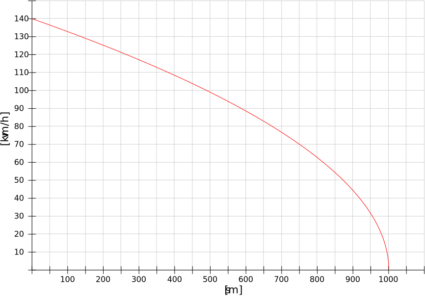

<!--
author:   Herbert schletter

email:    herbert.schletter@physik.tu-chemnitz.de

version:  0.0.1

language: de

narrator: Deutsch Female

comment:  Übungsaufgaben zum Kurs „Physik (mit Experimenten)“

link:     https://cdn.jsdelivr.net/chartist.js/latest/chartist.min.css

script:   https://cdn.jsdelivr.net/chartist.js/latest/chartist.min.js

-->

# Übungsaufgaben zum Elementarkurs Experimentalphysik

**Dr. Herbert Schletter**

Technische Universität Chemnitz

, [Physics 2](https://commons.wikimedia.org/wiki/File:Physics_2.jpg), [CC BY-SA 3.0](https://creativecommons.org/licenses/by-sa/3.0/legalcode), via Wikimedia Commons]")

## Hinweis zum Urheberrecht

Diese Aufgabensammlung steht unter einer  [Creative Commons Namensnennung 4.0 International Lizenz](http://creativecommons.org/licenses/by/4.0/).

Ausgenommen hiervon sind Inhalte (insbesondere Abbildungen), die aus externen
Quellen übernommen wurden und dort unter einer anderslautenden Lizenz
veröffentlicht wurden. Derartige Inhalte sind im Skript stets mit einem eigenen
Lizenzhinweis versehen, der Vorrang vor der hier genannten Lizenz besitzt.

## Kinematik und Dynamik

### Verständnisfragen

#### Horizontale Bewegung

An einem Bahnhof fährt ein ICE gerade in dem Moment los, als auf dem
Nachbargleis ein Güterzug mit konstanter Geschwindigkeit an ihm vorbeifährt. Die
Orts-Zeit-Gesetze beider Züge sind in folgendem Diagramm dargestellt:

<!-- style="width:16cm;" -->

Die horizontale Achse stellt die Zeit $t$ (in Sekunden), die vertikale Achse den
zurückgelegten Weg $s$ (in Metern) dar.

Welche der folgenden Aussagen sind richtig?

[[X]] Zum Zeitpunkt $t=40~\mathrm{s}$ hat der ICE den Güterzug eingeholt.
[[ ]] Zum Zeitpunkt $t=40~\mathrm{s}$ haben beide Züge dieselbe Geschwindigkeit.
[[X]] Die Durchschnittsgeschwindigkeit auf dem Streckenintervall $[0\dots 800~\mathrm m]$ ist für beide Züge gleich.
[[X]] Zu einem Zeitpunkt $t<40~\mathrm s$ haben beide Züge dieselbe Geschwindigkeit.
[[ ]] Über die Geschwindigkeiten der Züge kann keine Aussage getroffen werden, da nur die Orts-Zeit-Gesetze dargestellt sind.
[[ ]] Wenn der Güterzug nicht gebremst hätte, wäre er nicht vom ICE eingeholt worden.

#### Senkrechter Wurf I

Ein Körper wird aus einer Höhe $h_0 >0$ senkrecht nach oben geworfen und landet
später auf dem Boden ($h=0$). Wählen Sie aus, welche Diagramme (Nummer 1 bis 7)
für diesen Vorgang den Zusammenhang $h(t)$ (Höhe-Zeit), $v(t)$
(Geschwindigkeit-Zeit) und $a(t)$ (Beschleunigung-Zeit) korrekt darstellen. Die
horizontale Achse entspricht in allen Diagrammen der Zeit $t$.

<!-- style="width:12cm;" -->

<!-- style="width:12cm;" -->

<!-- style="width:12cm;" -->

<!-- style="width:12cm;" -->

<!-- style="width:12cm;" -->

<!-- style="width:12cm;" -->

<!-- style="width:12cm;" -->

[[**1**] [**2**] [**3**] [**4**] [**5**] [**6**] [**7**]]
[  [X]     [ ]     [ ]     [ ]     [ ]     [ ]     [ ]  ] Darstellung $h(t)$
[  [ ]     [ ]     [X]     [ ]     [ ]     [ ]     [ ]  ] Darstellung $v(t)$
[  [ ]     [ ]     [ ]     [X]     [ ]     [ ]     [ ]  ] Darstellung $a(t)$

#### Senkrechter Wurf II

Ein Körper wird senkrecht nach oben geworfen. Was gilt für die Geschwindigkeit
und die Beschleunigung im höchsten Punkt?

[[X]] Der Betrag der Geschwindigkeit ist null: $\left| v \right| = 0$.
[[ ]] Der Betrag der Geschwindigkeit ist größer als null: $\left| v \right| > 0$.
[[ ]] Der Betrag der Beschleunigung ist null: $\left| a \right| = 0$.
[[X]] Der Betrag der Beschleunigung ist größer als null: $\left| a \right| > 0$.
********************************************************************************

                                  {{1}}
*  Der Betrag der Geschwindigkeit ist null: $\left| v \right| = 0$.
   *  **Richtig**: Im höchsten Punkt der Bahn ändert sich die Bewegungsrichtung
      von *aufwärts* zu *abwärts*. Die Geschwindigkeit wechselt dabei das
      Vorzeichen und ist für einen Moment Null.
*  Der Betrag der Geschwindigkeit ist größer als null: $\left| v \right| > 0$.
   * **Falsch**: siehe oben.
*  Der Betrag der Beschleunigung ist null: $\left| a \right| = 0$.
   * **Falsch**: Während des gesamten Vorgangs wirkt konstant die
      Fallbeschleunigung $\left | a \right | = g$.
*  Der Betrag der Beschleunigung ist größer als null: $\left| a \right| > 0$.
   *  **Richtig**: siehe oben.

********************************************************************************

#### Grimsehlversuch I

Zwei Kugeln befinden sich auf einer Startvorrichtung, von der sie gleichzeitig
und aus gleicher Höhe ihre Bewegung beginnen: Kugel 1 fällt senkrecht nach
unten, Kugel 2 wird waagerecht abgeworfen.

Welche Aussagen über die Bewegung der Kugeln sind richtig?

[[X]] Beide Kugeln erreichen gleichzeitig den Boden, da in vertikale Richtung dieselbe Bewegung ausgeführt wird.
[[ ]] Beide Kugeln haben bei Auftreffen auf den Boden dieselbe Geschwindigkeit, da auf beide Kugeln dieselbe Beschleunigung (Fallbeschleunigung) wirkt.
[[X]] Die waagerecht abgeworfene Kugel behält in horizontale Richtung ihre Anfangsgeschwindigkeit bei.
[[X]] Die Kugeln befinden sich zu jedem Zeitpunkt in derselben Höhe.
[[X]] Der Abstand zwischen den Kugeln nimmt kontinuierlich zu.
[[ ]] Die senkrecht fallende Kugel erreicht den Boden eher, da sie einen kürzeren Weg zurücklegt.
[[ ]] Die horizontale Bewegung der abgeworfenen Kugel wird immer langsamer. So entsteht die charakteristische Parabelform der Flugbahn.
*****************************************************************************

*  Beide Kugeln erreichen gleichzeitig den Boden, da in vertikale Richtung
   dieselbe Bewegung ausgeführt wird.

   *  **Richtig**: Für Bewegungen gilt das Prinzip der ungestörten Überlagerung
      (Superposition). Die vertikale Bewegung ist demnach unabhänhgig von der
      horizontalen Bewegung und für beide Kugeln identisch.

*  Beide Kugeln haben bei Auftreffen auf den Boden dieselbe Geschwindigkeit, da
   auf beide Kugeln dieselbe Beschleunigung (Fallbeschleunigung) wirkt.

   *  **Falsch**: Die vertikale Geschwindigkeitskomponente ist für beide Kugeln
      identisch. Die abgeworfene Kugel besitzt zusätzlich eine horizontale
      Geschwindigkeitskomponente, sodass ihre Gesamtgeschwindigkeit größer ist.

*  Die waagerecht abgeworfene Kugel behält in horizontale Richtung ihre
   Anfangsgeschwindigkeit bei.

   *  **Richtig**: Bei Vernachlässigung der Luftreibung (was hier gerechtfertigt
      ist) liegt in horizontale Richtung keinerlei Beschleunigung vor.

*  Die Kugeln befinden sich zu jedem Zeitpunkt in derselben Höhe.

   *  **Richtig**: Dies ist gleichbedeutend mit der ersten Aussage.

*  Der Abstand zwischen den Kugeln nimmt kontinuierlich zu.

   *  **Richtig**: Die abgeworfene Kugel bewegt sich mit konstanter
      Geschwindigkeit in horizontale Richtung und entfernt sich dabei von der
      anderen Kugel.

*  Die senkrecht fallende Kugel erreicht den Boden eher, da sie einen kürzeren
   Weg zurücklegt.

   *  **Falsch**: Für die Bestimmung der Fallzeit spielt nur der vertikale
      Bewegungsablauf eine Rolle. Dieser ist für beide Kugeln identisch. Somit
      erreichen auch beide Kugeln gleichzeitig den Boden. Die zusätzliche
      horizontale Bewegung der abgeworfenen Kugel hat keinen Einfluss hierauf.
      Natürlich legt die abgeworfene Kugel einen längeren Weg zurück, sie
      besitzt jedoch auch (aufgrund der Abwurfs) eine höhere
      Gesamtgeschwindigkeit.

*  Die horizontale Bewegung der abgeworfenen Kugel wird immer langsamer. So
   entsteht die charakteristische Parabelform der Flugbahn.

   *  **Falsch**: Die horizontale Geschwindigkeit der abgeworfenen Kugel bleibt
      konstant (siehe dritte Aussage). Die Parabelform entsteht durch die
      aufgrund der Fallbeschleunigung zunehmende vertikale Geschwindigkeit.

****************************************************************************

#### Erster Newtonsches Axiom

Ein Körper bewegt sich geradlinig mit konstanter Geschwindigkeit. Was lässt sich
dabei über die auf den Körper wirkenden Kräfte schlussfolgern?

[[ ]] Es dürfen keinerlei Kräfte auf den Körper einwirken, da sich sonst seine Geschwindigkeit in jedem Fall ändern würde.
[[ ]] Es können nur Kräfte senkrecht zur Bewegungsrichtung angreifen.
[[X]] Es können beliebige Kräfte auf den Körper einwirken, solange ihre (vektorielle) Summe null ist.
[[ ]] Jede einzelne Kraft, die auf den Körper wirkt, muss zeitlich konstant sein.

#### Zweites Newtonsches Axiom

Das zweite Newtonsche Axiom beinhaltet die Formel
$\int_{t_1}^{t_2}F \mathrm dt = \Delta p$. Welche der folgenden
Schlussfolgerungen aus dieser Formel sind richtig?

[[X]] Ein Körper ändert seinen Impuls, wenn die Summe aller auf ihn wirkenden Kräfte nicht null ist.
[[ ]] Die Änderung des Impulses ist unabhängig vom gewählten Zeitintervall $[t_1, t_2]$.
[[X]] Die Formel $F=m\cdot a$ ist ein Sonderfall der obigen Formel (bei konstanter Masse).
[[ ]] Je größer die Masse eines Körpers, umso stärker wird er (bei gleichem Kraftstoß) beschleunigt.
[[ ]] Die Formel erlaubt keinerlei Rückschlüsse auf die Geschwindigkeit, da nur der Impuls berechnet werden kann.
[[X]] Auch kleine Kräfte können eine starke Impulsänderung bewirken, wenn sie über einen langen Zeitraum wirken.

### Übungsaufgaben

#### Von 0 auf 100
Bei Autos wird gelegentlich angegeben, wie lange sie „von 0 auf 100“ brauchen.
Gemeint ist die Zeitdauer für die Beschleunigung aus dem Stand auf
$v_\mathrm{end} = 100~\frac{\mathrm{km}}{\mathrm h}$. Für die folgenden
Berechnungen wird davon ausgegangen, dass die Beschleunigung während des
gesamten Vorgangs konstant ist.

1.  Wie groß ist die Beschleunigung $a$, wenn die Geschwindigkeit von
    $v_\mathrm{end} = 100~\frac{\mathrm{km}}{\mathrm h}$ nach
    $t=12{,}3~\mathrm s$ erreicht wird?

    [[ $0{,}48~\frac{\mathrm m}{\mathrm s^2}$ | $1{,}37~\frac{\mathrm m}{\mathrm s^2}$ | ($2{,}26~\frac{\mathrm m}{\mathrm s^2}$) | $3{,}15~\frac{\mathrm m}{\mathrm s^2}$ ]]

2.  Welche Strecke $s$ legt das Fahrzeug dabei zurück?

    [[ $s=53~\mathrm m$ | ($s=171~\mathrm m$) | $s=224~\mathrm m$ | $s=396~\mathrm m$ ]]

#### Bremsvorgang eines Zugs
Ein Regionalexpress ist mit einer Geschwindigkeit von
$v_0 = 140~\frac{\mathrm{km}}{\mathrm h}$ unterwegs. Bei der Annäherung an
einen Bahnhof zeigt das Vorsignal „Halt erwarten“. Der Zug kann also nicht in
den Bahnhof einfahren, sondern muss am Einfahrsignal, das sich $1000~\mathrm m$
nach dem Vorsignal befindet, anhalten. Der Triebfahrzeugführer (so die korrekte
Bezeichnung!) startet beim Passieren des Vorsignals den Bremsvorgang des Zugs.
Die Bremsverzögerung wählt er dabei so, dass der Zug genau am Einfahrsignal zum
Stillstand käme.

1. Welche Beschleunigung erfährt der Zug bei diesem Bremsvorgang?

   [[ $a=0{,}14~\frac{\mathrm m}{\mathrm s^2}$ | ($a=0{,}76~\frac{\mathrm m}{\mathrm s^2}$) | $a=1{,}29~\frac{\mathrm m}{\mathrm s^2}$ | $a=1{,}58~\frac{\mathrm m}{\mathrm s^2}$ | $a=2{,}21~\frac{\mathrm m}{\mathrm s^2}$ ]]

2. Welche der folgenden Darstellungen gibt das korrekte Geschwindigkeits-Orts-Gesetz
   für diesen Bremsvorgang wieder?

   - Diagramm 1

     

   - Diagramm 2

     

   - Diagramm 3

     

   [[ Diagramm 1 | Diagramm 2 | (Diagramm 3) ]]

3. Als sich der Zug noch $180~\mathrm m$ vor dem Einfahrsignal befindet,
   schaltet dieses um und gibt die Einfahrt in den Bahnhof mit einer
   Höchstgeschwindigkeit von $v=40~\frac{\mathrm{km}}{\mathrm h}$ frei. Muss der
   Zug zu diesem Zeitpunkt noch weiter abgebremst werden oder hat er diese
   Höchstgeschwindigkeit bereits unterschritten?

   [[ (Der Zug muss weiter abbremsen.) | Der Zug hat diese Geschwindigkeit bereits unterschritten. ]]

#### Zielwerfen
Bei einer Spielshow sollen die Kandidaten von einer erhöhten Plattform aus Bälle
auf eine auf den Boden gemalte Zielscheibe werfen. Das Zentrum der Zielscheibe
(mit der Maximalpunktzahl 10) hat einen Durchmesser von
$D_\mathrm Z = 80~\mathrm{cm}$. Die umgebenden Ringe (in absteigender Wertigkeit
von 9 bis 1 Punkte) haben jeweils eine Breite von
$b_\mathrm R = 40~\mathrm{cm}$. Der horizontale Abstand zwischen der
Werferplattform und dem Mittelpunkt der Zielscheibe beträgt
$x_\mathrm m = 7~\mathrm m$. Der Abwurf erfolgt in einer Höhe
$h_0 = 9~\mathrm m$ über dem Boden. In allen Fällen wird davon ausgegangen, dass
der Ball in horizontale Richtung abgeworfen wird.

1. Mit welcher Geschwindigkeit muss der Kandidat den Ball abwerfen, damit genau
   der Mittelpunkt der Zielscheibe getroffen wird?

   [[ $v=0{,}7~\frac{\mathrm m}{\mathrm s}$ | $v=1{,}6~\frac{\mathrm m}{\mathrm s}$ | $v=2{,}5~\frac{\mathrm m}{\mathrm s}$ | $v=3{,}4~\frac{\mathrm m}{\mathrm s}$ | $v=4{,}3~\frac{\mathrm m}{\mathrm s}$ | ($v=5{,}2~\frac{\mathrm m}{\mathrm s}$) | $v=6{,}1~\frac{\mathrm m}{\mathrm s}$ | $v=7{,}0~\frac{\mathrm m}{\mathrm s}$ ]]

2. Die Bewegung der Wurfarms lässt sich verständlicherweise nur mit begrenzter
   Genauigkeit steuern. Folglich werden einige Bälle langsamer und andere
   schneller als diese (unter 1. berechnete) optimale Geschwindigkeit
   abgeworfen. Welche Punktzahl wird erreicht, wenn der Abwurf mit einer um 25%
   höheren Geschwindigkeit erfolgt?

   [[ 10 Punkte | 9 Punkte | 8 Punkte | 7 Punkte | (6 Punkte) |  5 Punkte | 4 Punkte | 3 Punkte | 2 Punkte | 1 Punkt | 0 Punkte ]]

3. Welche Punktzahl wird erreicht, wenn der Abwurf mit einer um 25% geringeren
   Geschwindigkeit erfolgt?

   [[ 10 Punkte | 9 Punkte | 8 Punkte | 7 Punkte | (6 Punkte) |  5 Punkte | 4 Punkte | 3 Punkte | 2 Punkte | 1 Punkt | 0 Punkte ]]

4. Welche Punktzahl wird erreicht, wenn der Abwurf zwar mit der (unter 1.
   berechneten) optimalen Geschwindigkeit erfolgt, jedoch nicht exakt Richtung
   Mittelpunkt der Zielscheibe, sondern mit einer seitlichen Abweichung von
   $\alpha = 5°$?

   [[ 10 Punkte | (9 Punkte) | 8 Punkte | 7 Punkte | 6 Punkte |  5 Punkte | 4 Punkte | 3 Punkte | 2 Punkte | 1 Punkt | 0 Punkte ]]

#### Der „Kirchenflug“ von Limbach-Oberfrohna

Am 25. Januar 2009 ereignete sich in Limbach-Oberfrohna ein spektakulärer
Unfall: Ein Auto kam mit hoher Geschwindigkeit von der Straße ab und raste eine
Böschung hinauf, die in diesem Moment wie eine Sprungschanze fungierte. Vom Ende
der Böschung flog das Fahrzeug durch die Luft und landete schließlich im Dach
der Kirche. Das Auto verschwand dabei fast vollständig zwischen dem Gebälk des
Dachstuhls. Spektakulär ist der Unfall auch deshalb, weil der Fahrer zwar schwer
verletzt aber ohne bleibende Schäden den Unfall überlebte.

Aus den zahlreichen Medienberichten über diesen Unfal war zu entnehmen, dass der
Flug eine Weite von $35~\mathrm m$ überspannte und in einer Höhe von circa
$6~\mathrm m$ endete. Der Steigungswinkel der Böschung wird mit $17°$
angenommen. Berechnen Sie daraus die Geschwindigkeit des Fahrzeugs zu Beginn
des Flugs.

[[ $v_0 = 55~\frac{\mathrm{km}}{\mathrm m}$ | $v_0 = 75~\frac{\mathrm{km}}{\mathrm m}$ | $v_0 = 95~\frac{\mathrm{km}}{\mathrm m}$ | $v_0 = 115~\frac{\mathrm{km}}{\mathrm m}$| ($v_0 = 135~\frac{\mathrm{km}}{\mathrm m}$)]]

**Hinweis:** Die Zahlen in der Aufgabenstellung wurden überwiegend den
Medienberichten entnommen beziehunsgweise aus den dortigen Angaben hergeleitet.
Teilweise fanden sich unterschiedliche Angabe zur Höhe des Aufschlagpunkts.
Insofern ist diese Aufgabe eine Anlehnung an den tatsächlichen Unfallhergang.
Sie erhebt jedoch nicht den Anspruch, eine detaillierte Rekonstruktion
darzustellen.

#### Achterbahn mit Katapultstart
Der Zug einer Achterbahn werde bei einem sogenannten Katapultstart auf einer
horizontalen Beschleunigungsstrecke auf eine Endgeschwindigkeit von
$v_\mathrm e = 100~\frac{\mathrm {km}}{\mathrm h}$ beschleunigt. Das
Antriebssystem übt dabei eine Kraft von $F = 80~\mathrm{kN}$ auf den
Achterbahnzug aus, der eine Masse von $m = 7{,}5~\mathrm t$ besitzt.

1.  Wie lang muss die Beschleunigungsstrecke sein?

    [[ ($s_\mathrm B = 36{,}17~\mathrm m$) | $s_\mathrm B = 47{,}53~\mathrm m$ | $s_\mathrm B = 53{,}47~\mathrm m$ | $s_\mathrm B = 75{,}34~\mathrm m$ ]]

2.  Geben Sie die Beschleunigung des Achterbahnzugs in $\frac{\mathrm m}{\mathrm s^2}$
    sowie in Vielfachen der Fallbeschleunigung an.

    [[ $a= 4{,}8~\frac{\mathrm m}{\mathrm s^2}$ | $a= 6{,}1~\frac{\mathrm m}{\mathrm s^2}$ | $a= 8{,}4~\frac{\mathrm m}{\mathrm s^2}$ | ($a= 10{,}7~\frac{\mathrm m}{\mathrm s^2}$) ]]

    [[ ($a=1{,}1~g$) | $a=3{,}3~g$ | $a=5{,}5~g$ | $a=7{,}7~g$ ]]

#### Dynamik mit Modellbahnwagen
Auf einer geradlinigen, horizontalen Modellbahnschiene stehen zwei
identische Güterwagen. Außerdem befindet sich in der Mitte der Schiene eine
Halterung mit einer gespannten Feder. Die beiden Wagen liegen links und rechts
an dieser Feder an, sodass sie nach deren Freigabe auseinandergedrückt werden.
Die Feder selbst ist in der Halterung nicht fixiert, sondern wird lediglich für
eine Bewegung parallel zum Gleis geführt. Die Bewegungsstrecke der beiden Wagen
wird jeweils durch einen Prellbock festgelegt, der auf dem Gleis fixiert ist.

Die Leermasse beider Wagen beträgt $m_\mathrm W =63~\mathrm g$. Wagen 2 besitzt
zudem eine Beladung unbekannter Masse. Die Prellböcke wurden so eingestellt,
dass beide Wagen nach Entspannung der Feder das Bahnende gleichzeitig
nach $t=0{,}87~\mathrm s$ erreichen. Die Bewegungsstrecken der beiden Wagen
betragen dabei $s_1 = 43~\mathrm{cm}$ und $s_2 = 27~\mathrm{cm}$.

Reibungseffekte können vernachlässigt werden. Weiterhin kann davon ausgegangen
werden, dass die Dehnung der Feder sehr klein im Vergleich zu den
Bewegungsstrecken ist. Die gesamte Bewegung kann daher als gleichförmig
angenommen werden (Vernachlässigung der Beschleunigungsstrecke).

1.  Welche Masse hat die Beladung des zweiten Wagens?

    [[ $m_\mathrm B = 17~\mathrm g$ | ($m_\mathrm B = 37~\mathrm g$) | $m_\mathrm B = 57~\mathrm g$ | $m_\mathrm B = 77~\mathrm g$ | $m_\mathrm B = 97~\mathrm g$ ]]

2.  Am Prellbock des Wagens 1 wurde beim Aufprall eine durchschnittliche Kraft
    von $F= 420~\mathrm{mN}$ gemessen. Wie lang dauerte dieser Aufprall, bei dem der
    Wagen zum Stillstand kam?

    [[ ($t = 74~\mathrm{ms}$) | $t = 165~\mathrm{ms}$ | $t = 254~\mathrm{ms}$ | $t = 345~\mathrm{ms}$ ]]

### Hausaufgaben

#### Grimsehlversuch II
Im sogenannten Grimsehl-Versuch starten zwei identische Kugeln zeitgleich und
aus gleicher Höhe ihre Bewegung: die eine führt einen freien Fall aus, während
die andere horizontal abgeworfen wird. Die horizontal abgeworfene Kugel erreicht
nach einer Flugzeit von $t_\mathrm f =0{,}57~\mathrm s$ den Boden. Ihr
Auftreffpunkt liegt $d=78~\mathrm{cm}$ von dem der anderen Kugel entfernt.

1.  In welcher Höhe über dem Boden befand sich der Abwurfpunkt?
2.  Welche Anfangsgeschwindigkeit besaß die horizontal abgeworfene Kugel?
3.  Welche Geschwindigkeiten $v_\mathrm{Fall}$ beziehungsweise $v_\mathrm{Wurf}$ besitzen die Kugeln beim Auftreffen auf den Boden?

-----

- Antwort Teilaufgabe 1

[[ $h_0 = 0{,}36~\mathrm m$ | $h_0 = 0{,}74~\mathrm m$ | $h_0 = 1{,}07~\mathrm m$ | ($h_0 = 1{,}59~\mathrm m$) | $h_0 = 2{,}48~\mathrm m$ ]]
********************************************************************************

Zunächst ist festzuhalten, dass beide Kugeln gleichzeitig den Boden erreichen,
da in vertikale Richtung in beiden Fällen ein freier Fall vorliegt. Das
Höhe-Zeit-Gesetz des freien Falls lautet:

$$h(t) = h_0 - \frac g2 t^2 \, .$$
Nach der Flugzeit $t_\mathrm f$ haben beide Kugeln den Boden ($h=0$) erreicht:

$$h(t_\mathrm f) = h_0 - \frac g2 t_\mathrm f^2 = 0 \, .$$

Daraus ergibt sich für die Anfangshöhe:

$$h_0 = \frac g2 t_\mathrm f^2 = 1{,}59~\mathrm m \, .$$

********************************************************************************

- Antwort Teilaufgabe 2

[[ $v_0 = 0{,}71~\frac{\mathrm m}{\mathrm s}$ | ($v_0 = 1{,}37~\frac{\mathrm m}{\mathrm s}$) | $v_0 = 3{,}71~\frac{\mathrm m}{\mathrm s}$ | $v_0 = 7{,}13~\frac{\mathrm m}{\mathrm s}$ ]]
********************************************************************************

Die horizontale Bewegungskomponente der abgeworfenen Kugel entspricht einer
gleichförmigen Bewegung mit der Abwurfgeschwindigkeit. Die Überlagerung mit der
Fallbewegung beeinflusst die horizontale Bewegung nicht. Während der Flugzeit
$t_\mathrm f$ wird die horizontale Strecke $d$ zurückgelegt. Das bedeutet für
die Abwurfgeschwindigkeit:

$$v_0 = \frac{d}{t_\mathrm f} = 1{,}37~\frac{\mathrm m}{\mathrm s} \, .$$

********************************************************************************

- Antwort Teilaufgabe 3

[[ $v_\mathrm{Fall} = 1{,}4~\frac{\mathrm m}{\mathrm s}$ | $v_\mathrm{Fall} = 4{,}2~\frac{\mathrm m}{\mathrm s}$ | ($v_\mathrm{Fall} = 5{,}6~\frac{\mathrm m}{\mathrm s}$) | $v_\mathrm{Fall} = 5{,}8~\frac{\mathrm m}{\mathrm s}$ | $v_\mathrm{Fall} = 7{,}0~\frac{\mathrm m}{\mathrm s}$ ]]
********************************************************************************

Die frei fallende Kugel besitzt nur die vertikale Geschwindigkeitskomponente,
die eine gleichmäßig beschleunigte Bewegung mit der Fallbeschleunigung
darstellt. Die Endgeschwindigkeit nach der Fallzeit $t_\mathrm f$ ist damit:

$$v_\mathrm{Fall} = g\cdot t_\mathrm f = 5{,}6~\frac{\mathrm m}{\mathrm s} \, .$$

********************************************************************************

[[ $v_\mathrm{Wurf} = 1{,}4~\frac{\mathrm m}{\mathrm s}$ | $v_\mathrm{Wurf} = 4{,}2~\frac{\mathrm m}{\mathrm s}$ | $v_\mathrm{Wurf} = 5{,}6~\frac{\mathrm m}{\mathrm s}$ | ($v_\mathrm{Wurf} = 5{,}8~\frac{\mathrm m}{\mathrm s}$) | $v_\mathrm{Wurf} = 7{,}0~\frac{\mathrm m}{\mathrm s}$ ]]
********************************************************************************

Bei der horizontal abgeworfenen Kugel überlagern sich die horizontale und vertikale Geschwindigkeitskomponente vektoriell. Die vertikale Komponente ist identisch mit der frei fallenden Kugel, die horizontale Bewegung erfolgt gleichförmig mit der Abwurfgeschwindigkeit. Als Gesamtgschwindigkeit ergibt sich daraus:

$$v_\mathrm{Wurf} = \sqrt{v_\mathrm{hor}^2 + v_\mathrm{vert}^2} = \sqrt{\frac{d^2}{t_\mathrm f^2}+g^2t_\mathrm f^2}
        = 5{,}8~\frac{\mathrm m}{\mathrm s} \, .$$

********************************************************************************

## Arbeit und Erhaltungssätze
### Verständnisfragen

#### Reibung I
Ein PKW bremst auf trockener, horizontaler Farbahn von seiner
Anfangsgeschwindigkeit bis zum Stillstand ab. Dabei legt er den Bremsweg $s_0$
zurück. Treffen Sie Aussagen zum Bremsweg für die folgenden Situationen.

Hinweis: Es wird nur der in der jeweiligen Teilaufgabe genannte Parameter
geändert. Alle anderen Größen entsprechen der oben beschriebenen Situation.
Insbesondere ist die vom Bremssystem auf die Räder ausgeübte Kraft in allen
Fällen identisch.

1. Der PKW sei mit der doppelten Anfangsgeschwindigkeit unterwegs.
   [[ (Der Bremsweg beträgt $4\cdot s_0$.) | Der Bremsweg beträgt $2\cdot s_0$. | Der Bremsweg beträgt $1\cdot s_0$. | Der Bremsweg beträgt $0{,}5\cdot s_0$. | Der Bremsweg beträgt $0{,}25\cdot s_0$. ]]

2. Die Masse des PKW werde verdoppelt.
   [[ Der Bremsweg beträgt $4\cdot s_0$. | (Der Bremsweg beträgt $2\cdot s_0$.) | Der Bremsweg beträgt $1\cdot s_0$. | Der Bremsweg beträgt $0{,}5\cdot s_0$. | Der Bremsweg beträgt $0{,}25\cdot s_0$. ]]

3. Der PKW sei auf nasser Straße unterwegs, sodass die Reibung zwischen Rad und
   Straße verringert ist. Es kommt *nicht* zum Blockieren der Räder.
   [[ Der Bremsweg wird größer. | (Der Bremsweg bleibt gleich.) | Der Bremsweg wird kleiner. ]]

4. Der PKW sei auf nasser Straße unterwegs, sodass die Reibung zwischen Rad und
   Straße verringert ist. Dabei blockieren die Räder und der PKW rutscht.
   [[ (Der Bremsweg wird größer.) | Der Bremsweg bleibt gleich. | Der Bremsweg wird kleiner. ]]

5. Der Bremsvorgang geschehe auf einer Gefällestrecke.
   [[ (Der Bremsweg wird größer.) | Der Bremsweg bleibt gleich. | Der Bremsweg wird kleiner. ]]

6. Während des Bremsvorgangs herrscht starker Gegenwind.
   [[ Der Bremsweg wird größer. | Der Bremsweg bleibt gleich. | (Der Bremsweg wird kleiner.) ]]

#### Erhaltungssätze I

Im Folgenden sind einige physikalische Vorgänge aus dem Bereich der Mechanik
beschrieben. Entscheiden Sie jeweils, ob der Energiesatz der Mechanik oder der
Impulserhaltungssatz anwendbar sind. Zu jedem Vorgang ist das System angegeben,
das für den Impulserhaltungssatz betrachtet werden soll. Die Reibung sei bei
allen Bewegungsvorgängen vernachlässigbar.

[[Energiesatz der Mechanik anwendbar] [Impulserhaltungssatz anwendbar]]
[ [X] [ ] ] Schwingung eines Federpendels, bestehend aus einem Massestück an einer Feder (System: Federpendel)
[ [X] [X] ] elastischer Stoß zweier Gleiter auf der Luftkissenbahn (System: beide Gleiter)
[ [ ] [X] ] Das Projektil einer Pistole trifft auf eine Zielscheibe und bleibt in dieser stecken. (System: Projektil und Zielscheibe)
[ [ ] [ ] ] Vollbremsung eines PKW bis zum Stillstand (System: PKW)
[ [ ] [X] ] Zwei Eishockeyspieler prallen zusammen und klammern sich aneinander fest. (System: beide Spieler)
[ [X] [X] ] Ein perfekter Gummiball wird gegen eine Wand geworfen und prallt von dieser ab. (System: Gummiball und Wand)
[ [X] [ ] ] Ein Apfel fällt vom Baum senkrecht nach unten. (System: Apfel und Apfelbaum)

### Übungsaufgaben

#### Achterbahn
Der Wagen einer Achterbahn (Masse $m=5~\mathrm{t}$) wird aus dem Stand heraus
auf horizontaler Strecke beschleunigt. Anschließend rollt der Wagen (ohne
weiteren Antrieb) einen Hügel hinauf zum höchsten Punkt der Bahn, der sich
$h=32~\mathrm{m}$ über der Beschleunigungsstrecke befindet. Auf diesem höchsten
Punkt besitzt der Wagen noch eine Geschwindigkeit
$v_\mathrm{o}=5~\frac{\mathrm m}{\mathrm s}$. Welche Beschleunigungsarbeit hat
das Antriebssystem am Wagen verrichtet?

[[ ($W_\mathrm{Beschl} = 1632~\mathrm{kJ}$) | $W_\mathrm{Beschl} = 3114~\mathrm{kJ}$ | $W_\mathrm{Beschl} = 18992~\mathrm{J}$ ]]

#### Reibung II
Auf einer horizontalen Luftkissenbahn bewegt sich ein Gleiter (Masse
$m=200~\mathrm g$) zunächst reibungsfrei mit einer Geschwindigkeit von
$v_0 = 0{,}2~\frac{\mathrm m}{\mathrm s}$. Als die Luftzufuhr abgestellt wird,
kommt der Gleiter schlagartig mit der Bahn in Kontakt und wird reibungsbedingt
innerhalb einer Strecke von $s=2~\mathrm{cm}$ zum Stillstand gebracht.

1. Gesucht ist der Gleitreibungskoeffizient $\mu_\mathrm G$ zwischen Bahn und
   Gleiter.

   [[ ($\mu_\mathrm G = 0{,}102$) | $\mu_\mathrm G = 0{,}153$ | $\mu_\mathrm G = 0{,}204$ $\mu_\mathrm G = 0{,}255$ | $\mu_\mathrm G = 0{,}306$ ]]

2. Wie ändert sich der Bremsweg, wenn der Gleitreibungskoeffizient
   $\mu_\mathrm G$ verdoppelt wird?

   [[ Der Bremsweg vervierfacht sich. | Der Bremsweg verdoppelt sich. | Der Bremsweg bleibt gleich. | (Der Bremsweg beträgt die Hälfte des ursprünglichen Werts.) | Der Bremsweg beträgt ein Viertel des ursprünglichen Werts.  ]]

3. Wie ändert sich der Bremsweg, wenn die Geschwindigkeit $v_0$ des Gleiters
   verdoppelt wird?

    [[ (Der Bremsweg vervierfacht sich.) | Der Bremsweg verdoppelt sich. | Der Bremsweg bleibt gleich. | Der Bremsweg beträgt die Hälfte des ursprünglichen Werts. | Der Bremsweg beträgt ein Viertel des ursprünglichen Werts.  ]]

4. Wie verändert sich der Bremsweg, wenn die Masse $m$ des Gleiters verdoppelt
   wird?

   [[ (Der Bremsweg vervierfacht sich.) | Der Bremsweg verdoppelt sich. | Der Bremsweg bleibt gleich. | Der Bremsweg beträgt die Hälfte des ursprünglichen Werts. | Der Bremsweg beträgt ein Viertel des ursprünglichen Werts.  ]]

#### Alpe d’Huez
Der in den französischen Alpen gelegene Ort Alpe d'Huez gehört zu den
berühmtesten Etappenzielen der Tour de France. Der Anstieg von Le
Bourg-d’Oisans hinauf nach Alpe d’Huez überwindet auf einer Streckenlänge von
$13{,}8~\mathrm{km}$ einen Höhenunterschied von $1090~\mathrm m$. Der
(bisherige) Rekord für diese Strecke liegt bei einer Fahrzeit von 36 Minuten und
40 Sekunden.

1. Welcher mittleren Leistung entspricht dies, wenn das Fahrrad eine Masse von
   $m_\mathrm R = 8{,}2~\mathrm{kg}$ hat und für den Radfahrer eine Masse von
   $m_\mathrm F = 59~\mathrm{kg}$ angenommen wird?

2. Angenommen, der Fahrer sei tatsächlich die gesamte Strecke über mit dieser
   mittleren Leistung unterwegs: mit welcher Geschwindigkeit absolviert er dabei
   einen Streckenabschnitt mit 8% Steigung?

-----

* Antwort Teilaufgabe 1
  [[ $P=266{,}3~\mathrm W$ | ($P=326{,}6~\mathrm W$) | $P=632{,}6~\mathrm W$ | $P=663{,}2~\mathrm W$ ]]

* Antwort Teilaufgabe 2
  [[ $v=3{,}8~\frac{\mathrm m}{\mathrm s}$ | $v=4{,}6~\frac{\mathrm m}{\mathrm s}$ | $v=5{,}4~\frac{\mathrm m}{\mathrm s}$ | ($v=6{,}2~\frac{\mathrm m}{\mathrm s}$) ]]

#### Ballschleuder
Eine einfache Ballschleuder sei mit mit einer Feder der Federkonstante
$k=120~\frac{\mathrm N}{\mathrm m}$ ausgestattet. Beim Spannen wird diese Feder
um $d=20~\mathrm{cm}$ zusammengedrückt. Es wird damit ein Tennisball (Masse
$m_\mathrm B = 58~\mathrm g$) unter einem Winkel von $\alpha = 45°$ abgeschossen.

1. Welche Geschwindigkeit $v_0$ hat der Ball nach dem Abwurf?
2. Welche maximale Höhe erreicht der Ball auf seiner Flugbahn?

-----

* Antwort Teilaufgabe 1

  [[ ($ v_0 = 9{,}1~\frac{\mathrm m}{\mathrm s}$) | $ v_0 = 10{,}2~\frac{\mathrm m}{\mathrm s}$ | $ v_0 = 11{,}3~\frac{\mathrm m}{\mathrm s}$ | $ v_0 = 12{,}4~\frac{\mathrm m}{\mathrm s}$ | $ v_0 = 13{,}5~\frac{\mathrm m}{\mathrm s}$ ]]

* Antwort Teilaufgabe 2

  [[ $h_\mathrm{max} = 0{,}3~\mathrm m$ | $h_\mathrm{max} = 1{,}2~\mathrm m$ | ($h_\mathrm{max} = 2{,}1~\mathrm m$) | $h_\mathrm{max} = 3{,}0~\mathrm m$ ]]

#### Modelleisenbahn I
Auf einer Modellbahnanlage rollt ein Waggon der Masse $m_1=65~\mathrm g$ auf
horizontaler Strecke mit der Anfangsgeschwindigkeit
$v_1 = 0{,}3~\frac{\mathrm m}{\mathrm s}$ gegen einen ruhenden Waggon der Masse
$m_2 = 90~\mathrm g$. Die Kupplung zwischen beiden Waggons rastet dabei ein
und sie rollen gemeinsam weiter.

1. Gesucht ist die Geschwindigkeit $v_\mathrm n$ der beiden Wagen nach dem Zusammenstoß.
   [[ ($v_\mathrm n = 0{,}126~\frac{\mathrm m}{\mathrm s}$) | $v_\mathrm n = 0{,}238~\frac{\mathrm m}{\mathrm s}$ | $v_\mathrm n = 0{,}300~\frac{\mathrm m}{\mathrm s}$ | $v_\mathrm n = 0{,}534~\frac{\mathrm m}{\mathrm s}$ ]]

2. Berechnen Sie den Energiebetrag $E_\mathrm{diss}$, der bei diesem Vorgang
   durch dissipative Vorgänge verloren geht.
   [[ $E_\mathrm{diss} = 0{,}8~\mathrm{mJ}$ | ($E_\mathrm{diss} = 1{,}7~\mathrm{mJ}$) | $E_\mathrm{diss} = 2{,}6~\mathrm{mJ}$ | $E_\mathrm{diss} = 3{,}5~\mathrm{mJ}$]]

#### Eisläufer

Auf einer Eislaufbahn prallen zwei Eisläufer aufeinander. Person 1 (Masse
$m_1 = 85~\mathrm{kg}$) hatte zuvor eine Geschwindigkeit von
$v_1 = 0{,}8~\frac{\mathrm m}{\mathrm s}$. Person 2
(Masse $m_2 = 63~\mathrm{kg}$) hatte eine anfängliche Geschwindigkeit
$v_2 = 1{,}4~\frac{\mathrm m}{\mathrm s}$. Der Zusammenstoß geschah in einem
rechten Winkel zueinander. Um einen Sturz zu vermeiden klammern sich die beiden
Eisläufer aneinder fest und rutschen gemeinsam weiter. Der gesamte Vorgang wird
als reibungsfrei angenommen.

1. Mit welcher Geschwindigkeit bewegen sich die Eisläufer nach dem Stoß weiter?
2. In welche Richtung verläuft diese Bewegung (bezogen auf die ursprüngliche
   Bewegungsrichtung der ersten Person)?

-----

* Antwort Teilaufgabe 1
  [[ $v' = 0{,}60~\frac{\mathrm m}{\mathrm s}$ | ($v' = 0{,}75~\frac{\mathrm m}{\mathrm s}$) | $v' = 1{,}28~\frac{\mathrm m}{\mathrm s}$ | $v' = 1{,}66~\frac{\mathrm m}{\mathrm s}$ | $v' = 2{,}20~\frac{\mathrm m}{\mathrm s}$]]

* Antwort Teilaufgabe 2

  Der Winkel zwischen der Geschwindigkeit nach dem Stoß und der anfänglichen
  Bewegungsrichtung von Person 1 beträgt

  [[ $\alpha = 25°$ | $\alpha = 34°$ | $\alpha = 43°$ | ($\alpha = 52°$) | $\alpha = 61°$ | $\alpha = 70°$ ]]

#### Stoß zweier Bälle

Bei einer Spielshow soll eine Billardkugel (Masse $m_\mathrm B = 170~\mathrm g$)
so mit Tischtennisbällen (Masse $m_\mathrm T = 2{,}7~\mathrm g$) beworfen
werden, dass sie den Zielbereich des Spielfelds erreicht. Welche Geschwindigkeit
$v_\mathrm B'$ erhält die anfangs ruhende Billardkugel, wenn sie von einem
Tischtennisball mit der Geschwindigkeit
$v_\mathrm T = 5~\frac{\mathrm m}{\mathrm s}$ zentral und elastisch getroffen
wird?

-----

* Antwort
  [[ $v_\mathrm B' = -0{,}24~\frac{\mathrm m}{\mathrm s}$ |  $v_\mathrm B' = -0{,}16~\frac{\mathrm m}{\mathrm s}$ | $v_\mathrm B' = -0{,}08~\frac{\mathrm m}{\mathrm s}$ | $v_\mathrm B' = 0$ | $v_\mathrm B' = 0{,}08~\frac{\mathrm m}{\mathrm s}$ | ($v_\mathrm B' = 0{,}16~\frac{\mathrm m}{\mathrm s}$) | $v_\mathrm B' = 0{,}24~\frac{\mathrm m}{\mathrm s}$ ]]

### Hausaufgaben

#### Modelleisenbahn II
Auf einer Modellbahnanlage fährt eine Lokomotive mit einer konstanten
Geschwindigkeit $v=15~\frac{\mathrm{mm}}{\mathrm s}$. Dabei stößt sie gegen
einen ruhenden Waggon der Masse $m_\mathrm{W}=75~\mathrm g$. Dieser Stoßvorgang
erstreckt sich über eine Zeitdauer $t_\mathrm s = 0,08~\mathrm s$. Dabei rastet
die Kupplung zwischen Lok und Waggon ein, sodass sich beide gemeinsam
weiterbewegen. Die Lokomotive behält bei dem gesamten Vorgang ihre
Geschwindigkeit bei.

1. Welche Arbeit $W$ muss der Motor der Lokomotive beim Ankuppeln des Waggons
   verrichten, um die ursprüngliche Geschwindigkeit beizubehalten?

2. Welche mittlere Kraft $F$ wirkt während des Stoßvorgangs auf den Waggon?

-----

*  Antwort Teilaufgabe 1

[[ $W=6{,}26~\mathrm{\mu J}$ | $W=7{,}63~\mathrm{\mu J}$ | ($W=8{,}44~\mathrm{\mu J}$) | $W=9{,}21~\mathrm{\mu J}$]]
********************************************************************************

Da die Geschwindigkeit der Lok unverändert bleiben soll, muss der angekuppelte
Wagen auf die Geschwindigkeit $v$ beschleunigt werden. Die dabei zu verrichtende
Arbeit entspricht der Änderung der kinetischen Energie die Waggons:

$$W = \Delta E_\mathrm{kin, Waggon} = \frac{m_\mathrm W}{2}v^2 = 8{,}44~\mathrm{\mu J} \, .$$

********************************************************************************

*  Antwort Teilaufgabe 2

[[ $F = 8~\mathrm{mN}$ | $F = 10~\mathrm{mN}$ | $F = 12~\mathrm{mN}$ | ($F = 14~\mathrm{mN}$) ]]
********************************************************************************

Gemäß dem zweiten Newtonschen Axiom ist die Impulsänderung des Waggons identisch
dem auf ihn wirkenden Kraftstoß:

$$\Delta p = Ft_\mathrm s \, .$$

Da der Waggon anfangs in Ruhe war, entspricht die Impulsänderung seinem Impuls
nach dem Stoß:

$$\Delta p = m_\mathrm W v \, .$$

Für die mittlere Kraft während des Stoßvorgangs folgt daraus:

$$F=\frac{\Delta p}{t_\mathrm s} = \frac{m_\mathrm W v}{t_\mathrm s} = 14~\mathrm{mN} \, .$$

********************************************************************************

#### Ballistisches Pendel
Zur Bestimmung der Geschossgeschwindigkeit eines Luftgewehrs wird ein
ballistisches Pendel verwendet: Dabei trifft das Projektil aus kurzer Entfernung
auf einen freischwingend aufgehängten Kugelfangkasten und bleibt in diesem
stecken. Dieser wird dabei um eine horizontale Strecke von $s=5{,}5~\mathrm{cm}$
ausgelenkt. Die Masse des Projektils beträgt $m_\mathrm P=0{,}5~\mathrm g$, die
des Kugelfangs $m_\mathrm K = 400~\mathrm g$. Die Pendellänge des Kugelfangs
beträgt $l= 750~\mathrm{mm}$.

1.  Bestimmen Sie die Geschwindigkeit $v_\mathrm P$ des Projektils.

2.  In Deutschland ist für frei verkäufliche Waffen die Mündungsenergie (d.h.
    die Energie des Projektils unmittelbar nach Verlassen des Laufs) auf
    $E_\mathrm{max}=7{,}5~\mathrm J$ begrenzt. Vergleichen Sie dies mit der eben
    errechneten Projektilgeschwindigkeit.

-----

*  Antwort Teilaufgabe 1:
[[ $v_\mathrm P = 38{,}6~\frac{\mathrm m}{\mathrm s}$ | $v_\mathrm P = 84{,}4~\frac{\mathrm m}{\mathrm s}$ | $v_\mathrm P = 117{,}9~\frac{\mathrm m}{\mathrm s}$ | ($v_\mathrm P = 160{,}2~\frac{\mathrm m}{\mathrm s}$) ]]
********************************************************************************

Beim Stoß des Projektils mit dem Kugelfang wird Impuls und Energie übertragen.
Da der Stoß plastisch verläuft (das Projektil bleibt im Kugelfang stecken), gilt
der Energiesatz der Mechanik nicht. Der Impulserhaltungssatz hingegen kann
angewendet werden und lautet in diesem Fall:

$$\begin{aligned}
    p_\mathrm{ges,vor} & = p_\mathrm{ges,nach} \\
    m_\mathrm{P}v_\mathrm P & = (m_\mathrm P + m_\mathrm K) v'_\mathrm K \, ,
\end{aligned}$$

wobei die gestrichene Größe für die Geschwindigkeit nach dem Stoß steht. Für die
anfängliche Projektilgeschwindighkeit bedeutet dies:

$$v_\mathrm P = \frac{m_\mathrm P + m_\mathrm K}{m_\mathrm P}v'_\mathrm K \, .$$

Die Geschwindigkeit $v'_\mathrm K$ des Kugelfangs nach dem Stoß wird aus dessen
Pendelbewegung bestimmt. Hierfür gilt der Energiesatz der Mechanik, der für den
Vergleich von tiefstem und höchstem Punkt (Höhe $h$) folgende Form hat:

$$\begin{aligned}
    E_\mathrm{pot,oben} & = E_\mathrm{kin,unten} \\
    (m_\mathrm P + m_\mathrm K)gh & = \frac 12 (m_\mathrm P + m_\mathrm K) {v'_\mathrm K}^2 \, .
\end{aligned}$$

Daraus folgt

$$v'_\mathrm K = \sqrt{2gh} \, .$$

<!-- style="width:5cm;" -->

Die Höhe des Pendels im Umkehrpunkt wurde jedoch nich direkt gemessen, sondern
lediglich die horizontale Auslenkung. Aus der obigen Darstellung ist
ersichtlich, dass der Satz des Pythagoras angewendet werden kann in der Form

$$l^2=(l-h)^2+s^2 \, .$$

Daraus lässt sich die Höhe des Pendels im Umkehrpunkt ermitteln:

$$\begin{aligned}
    (l-h)^2 & = l^2 - s^2 \\
    l-h & = \sqrt{l^2-s^2} \\
    h & = l-\sqrt{l^2-s^2} = 2{,}02~\mathrm{mm} \, .
\end{aligned}$$

Die zweite Lösung $h=l+\sqrt{l^2-s^2}$ wurde dabei übergangen, da $h<l$ sein
muss (das Pendel kann nicht über den Aufhängepunkt steigen).

Setzt man dies in die Geschwindigkeit des Kugelfangs nach dem Stoß (siehe oben)
ein, so folgt:

$$\begin{aligned}
v'_\mathrm K & = \sqrt{2gh} \\
& = \sqrt{2g\left(l-\sqrt{l^2-s^2}\right)} \\
& = 0{,}2~\frac{\mathrm m}{\mathrm s} \, .
\end{aligned}$$

Dies wiederum wird eingesetzt in die aus dem Impulssatz gefolgerte Gleichung für
die anfängliche Projektilgeschwindigkeit:

$$\begin{aligned}
v_\mathrm P & = \frac{m_\mathrm P + m_\mathrm K}{m_\mathrm P}v'_\mathrm K \\
& = \frac{m_\mathrm P + m_\mathrm K}{m_\mathrm P}\sqrt{2g\left(l-\sqrt{l^2-s^2}\right)} \\
& = 160{,}2~\frac{\mathrm m}{\mathrm s} \, .
\end{aligned}$$

********************************************************************************

*  Antwort Teilaufgabe 2:
[[ (Das Luftgewehr ist in Deutschland frei verkäuflich.) | Das Luftgewehr darf in Deutschland nicht frei verkauft werden. ]]
********************************************************************************

Aus der vorgegebenen maximalen kinetischen Energie

$$E_\mathrm{kin,max} = \frac 12 m_\mathrm P v_\mathrm{max}^2$$

ergibt sich für die gegebene Projektilmasse eine maximale
Geschossgeschwindigkeit

$$v_\mathrm{max} = \sqrt{\frac{2E_\mathrm{kin.max}}{m_\mathrm P}} = 173{,}2~\frac{\mathrm m}{\mathrm s} \, .$$

Alternativ kann aus der oben ermittelten Geschossgeschwindigkeit die
Mündungsenergie dieses Luftgewehrs bestimmt werden:

$$E_\mathrm P = \frac 12 m_\mathrm P v_\mathrm P^2 = 6{,}4~\mathrm J \, .$$

Beide Rechnungen führen zu der Schlussfolgerung, dass das Luftgewehr im
zulässigen Bereich arbeitet und diesen recht gut ausnutzt.

********************************************************************************

#### Bewässerungsfahrzeug
Ein Bewässerungsfahrzeug ist mit einem Wasserbehälter ausgerüstet, aus dem pro
Sekunde 5 Liter Wasser ausfließen. Der Behälter ist anfangs mit
$V_0 = 1{,}8~\mathrm m^3$ Wasser gefüllt. Die Leermasse des
Bewässerungsfahrzeugs beträgt $m_\mathrm T = 2{,}9~\mathrm t$. Das Fahrzeug sei
mit einer Geschwindigkeit von $v = 5~\frac{\mathrm m}{\mathrm s}$ auf einem Feld
unterwegs. Der Rollreibungskoeffizient zwischen Rädern und Feldboden beträgt
$\mu_\mathrm R = 0{,}14$. Welche mechanische Arbeit verrichtet das Fahrzeug bis
zur vollständigen Entleerung des Wasserbehälters, wenn die Bewegung

1. horizontal
2. mit 5% Steigung

erfolgt?

-----

*  Antwort Teilaufgabe 1

[[ $W=8{,}3~\mathrm{MJ}$ | ($W=9{,}4~\mathrm{MJ}$) | $W=10{,}5~\mathrm{MJ}$ | $W=11{,}6~\mathrm{MJ}$ | $W=12{,}7~\mathrm{MJ}$ ]]
********************************************************************************

Die mechanische Arbeit ist allgemein in der Form

$$\mathrm d W = \vec F \cdot \mathrm d\vec s$$

definiert. Da in diesem Fall von einer Kraftwirkung entlang der
Bewegungsrichtung ausgegangen werden kann, wird im Folgenden auf das
Skalarprodukt verzichtet. Ferner wird das Wegelement
$\mathrm d s = v\,\mathrm dt$ durch die gegebene Geschwindigkeit ausgedrückt:

$$\mathrm d W = Fv\mathrm dt \, .$$

Bei horizontaler Bewegung muss keine Hubarbeit verrichtet werden und es bleibt
nur die Reibungskraft zu berücksichtigen:

$$F=F_\mathrm R = \mu_\mathrm R F_\mathrm N = \mu_\mathrm R mg \, .$$

Aufgrund der horizontalen Bewegung ist die Normalkraft in diesem Fall gleich der
Gewichtskraft. Die Masse setzt sich zusammen aus der Leermasse des Fahrzeugs
$m_\mathrm F$ und der (zeitabhängigen) Masse des Wassers $m_\mathrm W (t)$:

$$m = m_\mathrm F + m_\mathrm W (t) = m_\mathrm F + m_0 - q t \, ,$$

wobei $q$ die zeitliche Änderung der Wassermasse angibt:
$q = 5~\frac{\mathrm{kg}}{\mathrm s}$. Die Zeit sei dabei so gewählt, dass bei
$t=0$ die Entleerung es Behälters beginnt. Die Anfangsmasse des Wasser beträgt
$m_0 = 1800~\mathrm{kg}$. Für die Arbeit folgt daraus:

$$\mathrm d W = \mu_\mathrm R vg \left( m_\mathrm F + m_0 - qt \right) \, .$$

Zur Bestimmung der gesamten verrichteten Arbeit muss dieser Ausdruck über das
Zeitintervall $\left[t=0, t_\mathrm e \right]$ integriert werden. Der Zeitpunkt
$t_\mathrm e$ der vollständigen Entleerung ergibt sich zu

$$t_\mathrm e = \frac{m_0}{q} = 360~\mathrm s \, .$$

Damit ergibt sich für die Arbeit:

$$\begin{aligned}
W & =\mu_\mathrm R vg\int\limits_{t=0}^{t_\mathrm e} \left( m_\mathrm F + m_0 -qt\right)\mathrm dt \\
& = \mu_\mathrm R vg\left( \left( m_\mathrm F + m_0 \right) t_\mathrm e - \frac{q}{2} t_\mathrm e^2 \right) \\
& = 9{,}4~\mathrm{MJ}
\end{aligned}$$

********************************************************************************

*  Antwort Teilaufgabe 2

[[ $W=8{,}3~\mathrm{MJ}$ | $W=9{,}4~\mathrm{MJ}$ | $W=10{,}5~\mathrm{MJ}$ | $W=11{,}6~\mathrm{MJ}$ | ($W=12{,}7~\mathrm{MJ}$) ]]
********************************************************************************

Auch bei der Bewegung auf einer ansteigenden Strecke gilt für die mechanische
Arbeit:

$$\mathrm d W = Fv\mathrm dt \, .$$

Für die Kraft sind nun jedoch zwei Beitäge zu berücksichtigen:

1. Die Reibungskraft

   $$F_\mathrm R = \mu_\mathrm R F_\mathrm N = \mu_\mathrm R mg\cos\alpha$$

2. Die Hangabtriebskraft

   $$F_\mathrm H = mg\sin\alpha$$

Die Gesamtkraft ist demzufolge:

$$F=F_\mathrm R + F_\mathrm H = mg\left( \mu_\mathrm R \cos \alpha + \sin\alpha \right) \, .$$

Zwischen der in Prozent angegebenen Steigung $S$ und dem Steigungswinkel
$\alpha$ gilt der Zusammenhang:

$$S=\tan\alpha \quad\mathrm{bzw.} \quad \alpha = \arctan S \, .$$

Eingesetzt in die Formel für die mechanische Arbeit folgt:

$$\mathrm dW = vg\left( \mu_\mathrm R \cos\left( \arctan S \right) + \sin\left( \arctan S \right) \right) m \mathrm dt \, .$$

Der in Teilaufgabe 1 betrachtete Fall der horizontalen Bewegung folgt als
Sonderfall aus dieser Formel mit $S=0$. Für die zeitlich veränderliche Masse
bleibt der Ausdruck aus der ersten Teilaufgabe unverändert:

$$m = m_\mathrm F + m_0 - q t \, .$$

Zur Bestimmung der gesamten mechanischen Arbeit muss wiederum über das
Zeitintervall $\left[t=0, t_\mathrm e \right]$ integriert werden:

$$W = vg\left( \mu_\mathrm R \cos\left( \arctan S \right) + \sin\left( \arctan S \right) \right) \int\limits_{t=0}^{t_\mathrm e} \left( m_\mathrm F + m_0 -qt\right)\mathrm dt \, .$$

Der Ausdruck im Integral hat sich gegenüber der ersten Teilaufgabe nicht
verändert und es folgt:

$$\begin{aligned}
W &  = vg\left( \mu_\mathrm R \cos\left( \arctan S \right) + \sin\left( \arctan S \right) \right) \left( \left( m_\mathrm F + m_0 \right) t_\mathrm e - \frac{q}{2} t_\mathrm e^2 \right) \\
& = 12{,}7~\mathrm{MJ} \, .
\end{aligned}$$

********************************************************************************

## Rotation und Schwingungen
### Verständnisfragen

#### Pohlsche Rollen

Gegeben sind zwei Rollen (Zylinder) mit gleicher Masse und gleichen Abmessungen:

*  Rolle 1 besitzt einen Kern aus Eisen, der von einem Mantel aus Holz umgeben ist.
*  Rolle 2 besteht im Inneren aus Holz und ist von einem Eisenmantel umgeben.

Beide Rollen befinden sich anfangs am oberen Ende einer geneigten Ebene und
beginnen gleichzeitig hinabzurollen. Die Reibung sei dabei vernachlässigbar.

[[Rolle 1 (innen Eisen, außen Holz)] [Rolle 2 (innen Holz, außen Eisen)] [beide Rollen gleich]]
[ (X) ( ) ( )] Welche Rolle erreicht das untere Ende der Bahn eher?
[ (X) ( ) ( )] Welche Rolle hat am unteren Ende der Bahn die höhere Geschwindigkeit?
[ ( ) ( ) (X)] Welche Rolle hat am unteren Ende die größere kinetische Energie?
[ ( ) (X) ( )] Welche Rolle hat am unteren Ende der Bahn die größere Rotationsenergie?
[ ( ) (X) ( )] Welche Rolle hat das größere Trägheitsmoment?
[ ( ) ( ) (X)] Auf welche Rolle wirkt das größere Drehmoment?

#### Federpendel

Gegeben ist ein Federpendel bestehend aus einer Feder mit der Federkonstanten
$k$ und einem daran angehängten Massestück der Masse $m$. In dieser
Konfiguration kann das Pendel als ungedämpft betrachtet werden. Seine
Kreisfrequenz beträgt $\omega_0$.

Treffen Sie möglichst präzise Aussagen, wie sich die folgenden Änderungen am
Pendel auf dessen Kreisfrequenz auswirken. Dabei wird stets nur der in der
jeweiligen Teilaufgabe genannte Parameter geändert. Alle anderen Größen bleiben
wie oben beschrieben.

* Die angehängte Masse wird halbiert. Die Kreisfrequenz
[[ verdoppelt sich | (erhöht sich um den Faktor $\sqrt 2$) | erhöht sich geringfügig | ändert sich nicht | verringert sich geringfügig | verringert sich um den Faktor $\sqrt 2$ | halbiert sich]]

* Die Feder wird gegen eine mit der vierfachen Federkonstante ausgetauscht. Die Kreisfrequenz
[[ (verdoppelt sich) | (erhöht sich um den Faktor $\sqrt 2$) | erhöht sich geringfügig | ändert sich nicht | verringert sich geringfügig | verringert sich um den Faktor $\sqrt 2$ | halbiert sich]]

* Das Pendel befinde sich auf dem Mond, wo die Fallbeschleunigung nur 16% des Wertes auf der Erdoberfläche beträgt. Die Kreisfrequenz
[[ erhöht sich um 16% | erhöht sich um $\sqrt{16}$% | erhöht sich geringfügig | (ändert sich nicht) | verringert sich geringfügig | verringert sich um $\sqrt{16}$% | verringert sich um 16%]]

Das Pendel befinde sich komplett unter Wasser, sodass die Reibung nun eine signifikante Rolle spielt. Die Kreisfrequenz
[[ verdoppelt sich | erhöht sich um den Faktor $\sqrt 2$ | erhöht sich geringfügig | ändert sich nicht | (verringert sich geringfügig) | verringert sich um den Faktor $\sqrt 2$ | halbiert sich]]

## Wärmelehre
### Verständnisfragen

#### Temperaturausgleich
Eine kalte Teetasse wird mit frisch gebrühtem Tee gefüllt. In der Folge wird
sich der Tee abkühlen und die Tasse erwärmen. Welche der folgenden Aussagen sind
dabei korrekt? (Wechselwirkungen mit der weiteren Umgebung seien
vernachlässigbar.)

[[ ]] Der Temperaturausgleich endet, wenn Tee und Tasse dieselbe innere Energie besitzen.
[[X]] Der Temperaturausgleich endet, wenn Tee und Tasse dieselbe Temperatur besitzen.
[[X]] Die gesamte innere Energie von Tee und Tasse ändert sich nicht: $U_\mathrm{Tee} + U_\mathrm{Tasse}=const.$
[[ ]] Es stellt sich immer genau die Temperatur ein, die dem Mittelwert der anfänglichen Tassen- und Teetemperatur entspricht.
[[ ]] Aufgrund der hohen Wärmekapazität von Wasser gibt der Tee mehr Wärme ab, als die Tasse aufnimmt.
[[ ]] Es stellt sich stets eine Temperatur ein, die näher an der anfänglichen Teetemperatur liegt, da das Wasser eine größere Wärmekapazität besitzt als die Tasse.
[[X]] Die Ausgleichstemperatur von Tee und Tasse, die sich einstellt, hängt neben den Anfangstemperaturen und den relevanten Wärmekapazitäten auch von den Massen von Tasse und Tee ab.
[[X]] Der Temperaturausgleich geschieht durch die Übertragung von Wärme zwischen Tee und Tasse.

#### Innere Energie
In einem Standzylinder, der durch einen (verschiebbaren) Kolben dicht
verschlossen ist, befindet sich eine gewisse Stoffmenge eines (idealen) Gases.

Betrachten Sie die folgenden Prozesse und bewerten Sie,

*  ob Arbeit am System ($W>0$) beziehungsweise vom System ($W<0$) verrichtet wird,
*  ob das System Wärme aufnimmt ($Q>0$) oder abgibt ($Q<0$),
*  ob und mit welchem Vorzeichen sich die innere Energie $U$ dieses Gases ändert.

1. Der Zylinder mit dem Gas wird erhitzt, wobei sich der Kolben allmählich aus
   dem Zylinder hinausbewegt.

[[$\lt 0$] [$=0$] [$\gt 0$]]
[ [X] [ ] [ ] ] Arbeit $W$
[ [ ] [ ] [X] ] Wärme $Q$
[ [ ] [ ] [X] ] Innere Energie $\Delta U$

2. Der Zylinder mit dem Gas wird erhitzt. Der Kolben sei dabei fixiert, sodass
   er seine Position nicht ändert.

[[$\lt 0$] [$=0$] [$\gt 0$]]
[ [ ] [X] [ ] ] Arbeit $W$
[ [ ] [ ] [X] ] Wärme $Q$
[ [ ] [ ] [X] ] Innere Energie $\Delta U$

3. Der Kolben wird langsam in den Zylinder gedrückt, wobei ein ständiger
   Temperaturausgleich mit der Umgebung stattfindet.

[[$\lt 0$] [$=0$] [$\gt 0$]]
[ [ ] [ ] [X] ] Arbeit $W$
[ [X] [ ] [ ] ] Wärme $Q$
[ [ ] [X] [ ] ] Innere Energie $\Delta U$

4. Der Kolben wird sehr schnell in den Zylinder gedrückt, sodass kein
   Temperaturausgleich mit der Umgebung stattfindet.

[[$\lt 0$] [$=0$] [$\gt 0$]]
[ [ ] [ ] [X] ] Arbeit $W$
[ [ ] [X] [ ] ] Wärme $Q$
[ [ ] [ ] [X] ] Innere Energie $\Delta U$

### Rechenaufgaben

#### Kühlschrank
Gegeben ist ein Kühlschrank, der ein Luftvolumen von
$V_\mathrm L = 0,8~\mathrm m^3$ enthält. Anfangs sei dieser Kühlschrank
ausgeschaltet und habe die Temperatur $\vartheta_1 = 23~^\circ\mathrm{C}$. Dabei
betrage der Luftdruck im Kühlschrank $p_1 = 101,325~\mathrm{kPa}$. Anschließend
wird der Kühlschrank bei verschlossener Tür in Betrieb genommen und kühlt den
Innenraum auf eine Temperatur von $\vartheta_2 = 4~^\circ\mathrm C$ ab.

Welcher Druck $p_2$ herrscht im Kühlschrank am Ende des Abkühlvorgangs, wenn
kein Ausgleich mit der Umgebung stattfindet?

[[ $p_2 = 91{,}2~\mathrm{kPa}$ | $p_2 = 92{,}4~\mathrm{kPa}$ | $p_2 = 93{,}6~\mathrm{kPa}$ | ($p_2 = 94{,}8~\mathrm{kPa}$) | $p_2 = 96{,}0~\mathrm{kPa}$ ]]

#### Solar-Luftschiff
Sogenannte Solar-Luftschiffe sind ein Outdoor-Spielzeug. Sie bestehen aus einer
dünnen schwarzen schlauchförmigen Folie, die mit Luft gefüllt und verschlossen
wird. Durch Sonnenbestrahlung erwärmt sich die Luft soweit, dass das Luftschiff
aufsteigt.

Ein solches Solarluftschiff sei anfänglich mit einem Volumen von
$V_\mathrm a = 1~\mathrm m^3$ Luft bei einer Temperatur von
$\vartheta_\mathrm a = 13~\mathrm{°C}$ befüllt. Sobald sich das Volumen des
Luftschiffs um $40~\mathrm l$ vergrößert hat, beginnt es zu schweben. Auf welche
Temperatur $\vartheta_\mathrm e$ hat sich die eingeschlossene Luft dabei erwärmt?

[[ ($\vartheta_\mathrm e = 24{,}4~\mathrm{°C}$) | $\vartheta_\mathrm e = 36{,}6~\mathrm{°C}$ | $\vartheta_\mathrm e = 48{,}8~\mathrm{°C}$ | $\vartheta_\mathrm e = 60{,}0~\mathrm{°C}$ | $\vartheta_\mathrm e = 72{,}2~\mathrm{°C}$ ]]

#### Kerzenheizung
Eine Kerzenflamme gibt bei der Verbrennung innerhalb einer Stunde eine Wärme von
$Q = 250~\mathrm{kJ}$ an die Umgebung ab.

Diese Kerze befinde sich in einem geschlossenen Raum, der ein Luftvolumen von
$V_\mathrm{L}=30~\mathrm{m}^3$ enthält. Die anfängliche Lufttemperatur betrage
$\vartheta_1=20~^{\circ}\mathrm{C}$. Um welchen Temperaturbetrag $\Delta T$
erwärmt die Kerze die Luft innerhalb einer Stunde? (Die Wärmeabgabe an die Wände
oder Gegenstände im Raum sei vernachlässigbar.)

Die Dichte der Luft beträgt $\rho_\mathrm{L}=1{,}204~\frac{\mathrm{kg}}{\mathrm{m}^3}$.
Ihre Wärmekapazität ist $c_\mathrm{L}=1{,}005~\frac{\mathrm{kJ}}{\mathrm{kg \cdot K}}$.

[[ ($\Delta T = 6{,}89~\mathrm K$) | $\Delta T = 8{,}96~\mathrm K$ | $\Delta T = 9{,}68~\mathrm K$ ]]

#### Teekanne
Bei der Zubereitung eines Tees werden $m_\mathrm W = 850~\mathrm g$ kochendes
Wasser in eine Teekanne aus Keramik (Masse $m_\mathrm K = 880~\mathrm g$,
spezifische Wärmekapazität $c_\mathrm K = 0{,}73~\frac{\mathrm{kJ}}{\mathrm{kg\cdot K}}$)
gegossen. Welche Temperatur $\vartheta_\mathrm M$ hat das Wasser nach dem
Temperaturausgleich mit der Kanne? Vor dem Befüllen besaß die Kanne
Raumtemperatur ($\vartheta_\mathrm K = 22~\mathrm{°C}$). Wärmeabgabe an die
Umgebung darf vernachlässigt werden.

[[ $\vartheta_\mathrm M = 76~\mathrm{°C}$ | $\vartheta_\mathrm M = 82~\mathrm{°C}$ | ($\vartheta_\mathrm M = 88~\mathrm{°C}$) | $\vartheta_\mathrm M = 94~\mathrm{°C}$]]

#### Adiabatische Kompression
In einem Zylinder, der durch einen (beweglichen) Kolben dicht verschlossen ist,
befindet sich eine gewisse Menge Luft mit der Masse
$m_\mathrm L = 0{,}5~\mathrm g$, deren Temperatur anfangs
$\vartheta_1 = 23~^\circ\mathrm C$ beträgt. Der Kolben werde schlagartig in den
Zylinder gepresst, wobei sich die eingeschlossene Luft auf
$\vartheta_2 = 78~^\circ\mathrm C$ erwärmt. Ein Wärmeaustausch mit der Umgebung
finde dabei nicht statt. Die spezifische Wärmekapazität der Luft beträgt
$c_\mathrm L = 1{,}005~\frac{\mathrm{kJ}}{\mathrm{kg\cdot K}}$.

Welche Arbeit $W$ wurde beim Hineinpressen des Kolbens in den Zylinder
verrichtet?

[[ ($W = 27{,}64~\mathrm J$) | $W = 42{,}76~\mathrm J$ | $W = 64{,}27~\mathrm J$ | $W = 76{,}42~\mathrm J$ ]]

## Elektrizitätslehre
### Verständnisfragen

#### Glühlampen
Gegeben sind zwei Glühlampen mit den Angaben

*  6 V / 5 W (Lampe 1) und
*  6 V / 2 W (Lampe 2).

Diese beiden Lampen werden einmal parallel und einmal in Reihe an eine
Spannungsquelle mit $U_0 = 6~\mathrm V$ angeschlossen. Entscheiden Sie für die
angegebenen Konstellationen, ob diese in Parallelschaltung, in Reihenschaltung
oder in keinem der beiden Fälle eintritt.

[[Reihenschaltung] [Parallelschaltung] [Diese Konstellation tritt nicht auf.]]
[( ) ( ) (X)] Keine der Lampen leuchtet.
[( ) ( ) (X)] Nur Lampe 1 leuchtet (möglicherweise mit reduzierter Helligkeit).
[(X) ( ) ( )] Nur Lampe 2 leuchtet (möglicherweise mit reduzierter Helligkeit).
[( ) ( ) (X)] Beide Lampen leuchten, jedoch mit reduzierter Helligkeit.
[( ) (X) ( )] Beide Lampen leuchten mit ihrer normalen Helligkeit.

#### Sitzheizung
Eine Heizmatte, die für den Anschluss an $U=12~\mathrm V$ vorgesehen ist,
besitzt zwei unabhängige Heizwicklungen, die jeweils einen Widerstand von
$R=6~\Omega$ besitzen. Durch unterschiedliche Beschaltung dieser Heizwicklungen
lassen sich drei verschiedene Leistungsstufen der Heizmatte erreichen.

Wählen Sie die Beschaltungen für diese drei Leistungsstufen aus und
berechnen Sie die jeweilige Leistung.

Heinweis: Betrachten Sie die Heizwicklungen als ohmsche Widerstände. Die
Versorgungsspannung soll nicht geändert werden.

*  **Heizstufe 1 – geringste Leistung**

   Beschaltung:
   [[ (Reihenschaltung) | Parallelschaltung | eine Heizwicklung einzeln ]]

   Leistung:
   [[ $P_1 = 1~\mathrm W$ | $P_1 = 2~\mathrm W$ | $P_1 = 3~\mathrm W$ | $P_1 = 6~\mathrm W$ | ($P_1 = 12~\mathrm W$) | $P_1 = 24~\mathrm W$ | $P_1 = 48~\mathrm W$]]

*  **Heizstufe 2 – mittlere Leistung**

   Beschaltung:
   [[ Reihenschaltung | Parallelschaltung | (eine Heizwicklung einzeln) ]]

   Leistung:
   [[ $P_2 = 1~\mathrm W$ | $P_2 = 2~\mathrm W$ | $P_2 = 3~\mathrm W$ | $P_2 = 6~\mathrm W$ | $P_2 = 12~\mathrm W$ | ($P_2 = 24~\mathrm W$) | $P_2 = 48~\mathrm W$]]

*  **Heizstufe 3 – größte Leistung**

   Beschaltung:
   [[ Reihenschaltung | (Parallelschaltung) | eine Heizwicklung einzeln ]]

   Leistung:
   [[ $P_3 = 1~\mathrm W$ | $P_3 = 2~\mathrm W$ | $P_3 = 3~\mathrm W$ | $P_3 = 6~\mathrm W$ | $P_3 = 12~\mathrm W$ | $P_3 = 24~\mathrm W$ | ($P_3 = 48~\mathrm W$)]]

### Rechenaufgaben

#### Elektrostatische Wechselwirkung
Zum Nachweis der elektrostatischen Wechselwirkung werden zwei Tischtennisbälle
(Masse $m=2{,}7~\mathrm g$, Durchmesser $D=40~\mathrm{mm}$)
genutzt, die jeweils an einem $l=1~\mathrm m$ langen Faden im Abstand
$d=10~\mathrm{cm}$ voneinander aufgehängt sind (Abstand gemessen zwischen den
Mittelpunkten der Bälle). Beide Bälle werden mit derselben
elektrischen Ladung $Q$ aufgeladen. Dabei werden sie jeweils um eine horizontale
Strecke $\Delta x = 4~\mathrm{cm}$ aus ihrer Ruhelage ausgelenkt. Welchen Betrag
hat die Ladung $Q$ auf jedem der Bälle?

[[ ($Q=145~\mathrm{nC}$) | $Q=381~\mathrm{\mu C}$ | $Q=571~\mathrm{mC}$ | $Q=219~\mathrm{C}$ ]]

#### Tauchsieder
Ein Fahrrad-Heimtrainer ist mit einem Generator zur Stromerzeugung ausgestattet.
Damit kann – abhängig von der Drehzahl – eine Spannung von maximal
$50~\mathrm V$ erzeugt werden.

An diesen Generator ist ein Tauchsieder angeschlossen, der für einen Betrieb mit
Netzspannung ($U_0 = 230~\mathrm V$) ausgelegt ist und dabei eine Leistung von
$P_0=1000~\mathrm W$ aufweist. Tatsächlich wird der Tauchsieder vom Generator
aber lediglich mit einer Spannung von $U_\mathrm G = 42~\mathrm V$ versorgt.

1. Welcher Strom $I_\mathrm G$ fließt dabei durch den Tauchsieder?

   [[ $I_\mathrm G = 0{,}15~\mathrm A$ | $I_\mathrm G = 0{,}47~\mathrm A$ | ($I_\mathrm G = 0{,}79~\mathrm A$) | $I_\mathrm G = 1{,}11~\mathrm A$ | $I_\mathrm G = 1{,}43~\mathrm A$ ]]

2. Welche Leistung $P_\mathrm G$ weist der Tauchsieder dabei auf?

   [[ ($P_\mathrm G = 33~\mathrm W$) | $P_\mathrm G = 77~\mathrm W$ | $P_\mathrm G = 121~\mathrm W$ | $P_\mathrm G = 165~\mathrm W$ | $P_\mathrm G = 209~\mathrm W$ | $P_\mathrm G = 253~\mathrm W$ ]]

#### Lichterbogen
Ein Lichterbogen für die Weihnachtsbeleuchtung besitzt 7 Glühlampen und ist für
den Anschluss an $230~\mathrm V$ (Haushaltsteckdose) vorgesehen. Die Glühlampen
tragen jeweils die Bezeichnung „34 V / 3 W“.

, [Schwibbogen. Volkskunst. Erzgebirge. IMG 4455WI](https://commons.wikimedia.org/wiki/File:Schwibbogen._Volkskunst._Erzgebirge._IMG_4455WI.jpg), [CC BY-SA 4.0](https://creativecommons.org/licenses/by-sa/4.0/legalcode)]")

1. Wie müssen diese Lampen innerhalb des Lichterbogens angeschlossen sein, um
   bei einem Betrieb mit 230 V nicht beschädigt zu werden?
   [[ (Reihenschaltung) | Parallelschaltung ]]

2. Berechnen Sie den elektrischen Widerstand $R_\mathrm L$ eines Lämpchens.
   [[ $R_\mathrm L = 360~\Omega$ | $R_\mathrm L = 365~\Omega$ | $R_\mathrm L = 370~\Omega$ | $R_\mathrm L = 375~\Omega$ | $R_\mathrm L = 380~\Omega$ | ($R_\mathrm L = 385~\Omega$) ]]

3. Berechnen Sieden Gesamtwiderstand $R_\mathrm{ges}$ aller 7 Lämpchen (in der
   korrekten Schaltung).

   [[ $R_\mathrm{ges} = 55~\Omega$ | $R_\mathrm{ges} = 385~\Omega$ | $R_\mathrm{ges} = 770~\Omega$ | ($R_\mathrm{ges} = 2695~\Omega$) ]]

4. Berechnen Sie die Gesamtleistung $P_\mathrm{ges}$ des Lichterbogens (mit der
   korrekten Schaltung der Glühlampen).
   [[ $P_\mathrm{ges} = 18{,}2~\mathrm W$ | ($P_\mathrm{ges} = 19{,}6~\mathrm W$) | $P_\mathrm{ges} = 21{,}0~\mathrm W$ | $P_\mathrm{ges} = 22{,}4~\mathrm W$ ]]

#### Modelleisenbahn – Motor
Auf einer Modellbahnanlage bewegt sich ein Zug, der aus einer Lokomotive (Masse
$m_\mathrm L = 180~\mathrm g$) und fünf identischen Wagen (Masse jeweils
$m_\mathrm W = 62~\mathrm g$) besteht. Anfangs habe der Zug eine Geschwindigkeit
von $v_1 = 5~\frac{\mathrm{cm}}{\mathrm s}$ und beschleunigt dann innerhalb von
$t_\mathrm b = 4~\mathrm s$ auf $v_2 = 15~\mathrm{\frac{cm}{s}}$. Während des
Beschleunigungsvorgangs fließt ein Strom von $I=130~\mathrm{\mu A}$ zum
Elektromotor der Lok. Die Versorgungsspannung beträgt $U=12~\mathrm V$.
Reibungseffekte seien vernachlässigbar.

1. Welche mechanische Arbeit $W_\mathrm B$ verrichtet der Motor der Lok während
   der Beschleunigung?
   [[ ($W_\mathrm B = 4{,}9~\mathrm{mJ}$) | $W_\mathrm B = 5{,}8~\mathrm{mJ}$ | $W_\mathrm B = 6{,}7~\mathrm{mJ}$ | $W_\mathrm B = 7{,}6~\mathrm{mJ}$ | $W_\mathrm B = 8{,}5~\mathrm{mJ}$]]

2. Welchen Wirkungsgrad $\eta$ weist der Motor der Lok bei diesem
   Beschleunigungsvorgang auf?
   [[ $\eta = 0{,}13$ | $\eta = 0{,}36$ | $\eta = 0{,}51$ | ($\eta = 0{,}78$) | $\eta = 0{,}94$ ]]

#### Pumpspeicherwerk
Das Pumpspeicherwerk Markersbach im Erzgebirge ist das zweitgrößte seiner Art in
Deutschland. Auf den Internetseiten des Betreibers finden sich hierzu folgende
Informationen: Das Kraftwerk liefert eine maximale elektrische Leistung von
$P_\mathrm{el} = 1046~\mathrm{MW}$. Hierfür nutzt es sechs Turbinen, die jeweils
einen Wasserdurchfluss von $70~\frac{\mathrm m^3}{\mathrm s}$ aufweisen. Die
Fallhöhe (Höhenunterschied zwischen Ober- und Unterbecken) beträgt
$\Delta h = 288~\mathrm m$. Bei vollständig gefülltem Oberbecken kann das
Kraftwerk vier Stunden unter Volllast betrieben werden.

1. Welches Wasservolumen muss im Oberbecken gespeichert sein, um die genannte
   Betriebsdauer zu gewährleisten?

   [[ $V=3{,}012\cdot 10^3~\mathrm{m^3}$ | $V=4{,}024\cdot 10^4~\mathrm{m^3}$ | $V=5{,}036\cdot 10^5~\mathrm{m^3}$ | ($V=6{,}048\cdot 10^6~\mathrm{m^3}$) | $V=7{,}060\cdot 10^7~\mathrm{m^3}$ | $V=8{,}072\cdot 10^8~\mathrm{m^3}$ ]]

2. Berechnen Sie den Wirkungsgrad der Stromerzeugung in diesem Kraftwerk
   (bezogen auf die mechanische Energie des Wassers).

   [[ $\eta = 97~\%$ | $\eta = 94~\%$ | $\eta = 91~\%$ | ($\eta = 88~\%$) | $\eta = 85~\%$ | $\eta = 82~\%$ | $\eta = 79~\%$ ]]

3. Die erzeugte elektrische Energie wird mit einer Spannung von $U=380~\mathrm{kV}$
   in das Übertragungsnetz eingespeist. Welcher Strom fließt dabei, wenn das
   Kraftwerk mit maximaler Leistung arbeitet?

   [[ $I=1{,}25~\mathrm{kA}$ | $I=1{,}50~\mathrm{kA}$ | $I=1{,}75~\mathrm{kA}$ | $I=2{,}00~\mathrm{kA}$ | $I=2{,}25~\mathrm{kA}$ | $I=2{,}50~\mathrm{kA}$ | ($I=2{,}75~\mathrm{kA}$) ]]

## Optik
### Verständnisfragen

#### Einzelspalt
Ein roter Laserstrahl trifft auf eine schmale Spaltblende. Auf einem Schirm
hinter dieser Blende ist ein Interferenzmuster zu beobachten. Welche der
folgenden Aussagen sind richtig?

[[X]] Die größte Intensität ist im nullten Maximum zu beobachten, das sich geradlinig (in Strahlrichtung) hinter dem Spalt befindet.
[[ ]] Die Maxima höherer Ordnung weisen alle identische Intensitäten auf, da stets der gleiche Anteil an Teilwellen beiträgt.
[[X]] Minima entstehen an Positionen, an denen sich alle ankommenden Teilwellen gegenseitig auslöschen.
[[X]] Zwei Teilwellen löschen sich gegenseitig aus, wenn ihr Gangunterschied ein ungeradzahliges Vielfaches der halben Wellenlänge ist: $\Delta s = \frac{2m+1}{2}\lambda$.
[[ ]] Eine Verbreiterung des Spalts bewirkt, dass die Abstände zwischen benachbarten Maxima größer werden.
[[ ]] Wird der ursprüngliche rote Laser gegen einen grünen ausgetauscht, so ändern sich die Positionen der Maxima und Minima nicht.

### Übungsaufgaben

#### Kamera
Mit einer Fotokamera soll eine Aufnahme von einem $G= 42~\mathrm m$ hohen Turm
gemacht werden. Das Objektiv der Kamera (das als dünne Linse behandelt wird) hat
eine Brennweite von $f=85~\mathrm{mm}$. Der Bildsensor der Kamera hat eine Höhe
von $B=36~\mathrm{mm}$. In welcher Entfernung $g$ vom Turm muss sich die Kamera
mindestens befinden, damit dieser vollständig auf dem Bild erscheint?

[[ $g = 32{,}73~\mathrm m$ | $g = 59{,}51~\mathrm m$ | ($g = 99{,}25~\mathrm m$) | $g = 141{,}83~\mathrm m$ | $g = 182{,}26~\mathrm m$]]

#### Interferenz am Einzelspalt

Ein Laserstrahl mit der Wellenlänge $\lambda=635~\mathrm{nm}$ ist auf einen
schmalen Spalt gerichtet. Auf einem Schirm, der sich $l=1~\mathrm m$ hinter dem
Spalt befindet, wird dabei ein Interferenzmuster beobachtet. Die beiden Maxima
erster Ordnung (die sich links und rechts neben dem zentralen Maximum nullter
Ordnung befinden), haben einen Abstand $x=1{,}75~\mathrm{cm}$ voneinander.
Berechnen sie daraus die Spaltbreite $d$.

[[ ($d=0{,}11~\mathrm{mm}$) | $d=0{,}18~\mathrm{mm}$ | $d=0{,}25~\mathrm{mm}$ | $d=0{,}32~\mathrm{mm}$ | $d=0{,}39~\mathrm{mm}$ | $d=0{,}46~\mathrm{mm}$ | $d=0{,}53~\mathrm{mm}$ ]]

### Hausaufgaben

#### Brechzahl des Wassers
Zur Bestimmung der Brechzahl $n_\mathrm W$ von Wasser wird folgendes Experiment
durchgeführt (siehe Abbildung): Über einem hohen Standzylinder aus Glas befindet
sich ein Laser-Entfernungssensor. Dieses Messgerät sendet Lichtpulse aus, die am
angepeilten Objekt reflektiert werden und zurück in den Sensor gelangen. Der
Sensor misst die Laufzeit des Lichts von der Aussendung bis zur Rückkehr des
reflektierten Lichts.

<!-- style="width:8cm;" -->

Der Laserstrahl dieses Messgerätes ist auf eine Reflektorscheibe gerichtet, die
sich unter dem Standzylinder befindet. Zunächst ist im Zylinder nur der Boden
etwas mit Wasser bedeckt. Der Lasersensor bestimmt dabei eine Laufzeit von
$t_1=5{,}18~\mathrm{ns}$. Nun wird Wasser in den Standzylinder gefüllt, sodass
der Wasserspiegel um $\Delta h=30~\mathrm{cm}$ angehoben wird. Die Laufzeit des
Lichts beträgt am Ende der Befüllung $t_2=5{,}92~\mathrm{ns}$. Bestimmen Sie
daraus den Brechungsindex von Wasser $n_\mathrm W$ (der Brechungsindex von Luft
hat den Wert $n_\mathrm L=1$).

[[ $n_\mathrm W = 1{,}30$ |  $n_\mathrm W = 1{,}33$ | ($n_\mathrm W = 1{,}37$) | $n_\mathrm W = 1{,}40$ ]]
********************************************************************************

Der Laufweg des Lichts lässt sich in zwei Anteile aufspalten:

1.  $s_\mathrm W=2\Delta h$: Die Strecke, um die der Wasserspiegel steigt. Zu
    Beginn legt das Licht diesen Weg durch Luft zurück, am Ende des Experiments
    durch Wasser. Da das Licht den Standzylinder zweimal passiert (Hin- und
    Rückweg) ist die Höhendiffernz doppelt zu berücksichtigen.

2.  $s_\mathrm R$: Die gesamte restliche Strecke durch Glas, Luft und die
    Anfangsmenge an Wasser. Für diese Strecke tritt keine Veränderung ein.

Der gesamte zurückgelegte Weg ist dann $s_\mathrm{ges}=s_\mathrm W + s_\mathrm R$.

Die Laufzeit des Lichts lässt sich in analoger Weise in die beiden Anteile
$t_\mathrm W$ und $t_\mathrm R$ aufteilen:
$t_\mathrm{ges}=t_\mathrm W +t_\mathrm R$.

Zu Beginn des Experiments:

$$t_1= t_\mathrm{W(Luft)}+t_\mathrm R$$

und am Ende des Experiments:

$$t_2= t_\mathrm{W(Wasser)}+t_\mathrm R$$

Für die Zeitdifferenz

$$t_2-t_1= t_\mathrm{W(Wasser)}+t_\mathrm R-(t_\mathrm{W(Luft)}+t_\mathrm R)=t_\mathrm{W(Wasser)}- t_\mathrm{W(Luft)}$$

ist dabei nur die Teilstrecke $s_\mathrm W$ relevant. Für deren zugehörige
Laufzeit gilt am Anfang des Experiments:

$$t_\mathrm{W(Luft)}=\frac{s_\mathrm W}{c_0}$$
sowie am Ende des Experiments:

$$t_\mathrm{W(Wasser)}=\frac{s_\mathrm W}{c_\mathrm W}=\frac{s_\mathrm W}{c_0}n_\mathrm W$$

Einsetzen in die Formel für die Zeitdifferenz:

$$\begin{aligned}
t_2 - t_1 & =\frac{s_\mathrm W}{c_0}n_\mathrm W - \frac{s_\mathrm W}{c_0} \\
& = \frac{s_\mathrm W}{c_0}\left( n_\mathrm W -1 \right) \\
& = \frac{2\Delta h}{c_0}\left( n_\mathrm W -1 \right)
\end{aligned}$$

Umstellen liefert die Formel für die Brechzahl:

$$n_\mathrm W = 1+\frac{c_0}{2\Delta h}\left(t_2 - t_1 \right) \, .$$

Mit den Zahlenwerten aus der Aufgabenstellung ergibt sich:

$$n_\mathrm W =1{,}37$$

********************************************************************************

#### Beamer-Objektiv
Das Objektiv eines Beamers hat die Brennweite $f=100~\mathrm{mm}$. Der Chip,
der das zu projizierende Bild im Inneren des Beamers erzeugt hat eine Breite von
$G=30~\mathrm{mm}$. In welcher Entfernung vom Objektiv (das als dünne Linse
behandelt wird) muss eine $3~\mathrm m$ breite Leinwand aufgestellt werden,
damit das entstehende Bild diese gerade ausfüllt?

[[ $b=4{,}1~\mathrm m$ | $b=6{,}1~\mathrm m$ | $b=8{,}1~\mathrm m$ | ($b=10{,}1~\mathrm m$) ]]
********************************************************************************

Die Abbildungsgleichung einer dünnen Linse lautet

$$\frac 1f = \frac 1b + \frac 1g \, .$$

Weiterhin ist der Abbildungsmaßstab definiert:

$$\left | V \right | = \frac{\left | B \right |}{G}=\frac{b}{g} \, .$$

Die Bildgröße ist negativ (kopfstehendes / seitenverkehrtes Bild). Damit ist
auch $V$ negativ. Wir rechnen hier nur mit Beträgen und schreiben kurz:

$$V= \frac BG =\frac bg \, .$$

Dies wird nach $g$ umgestellt:

$$g=\frac GB \cdot b$$

und in die Abbildungsgleichung eingesetzt:

$$\frac 1f = \frac 1b + \frac BG \cdot \frac 1b = \left( 1+ \frac BG\right)\frac 1b \, .$$

Daraus ergibt sich für die Bildweite:

$$b=\left(1+\frac BG\right) f = \left(1+\frac{3000~\mathrm{mm}}{30~\mathrm{mm}}\right) \cdot 100~\mathrm{mm}=10{,}1~\mathrm m \, .$$

********************************************************************************

## Moderne Physik
### Verständnisfragen

#### Äußerer Photoeffekt
Beim äußeren Photoeffekt trifft Licht auf eine Metallplatte und löst Elektronen
aus dieser Platte heraus. Welche der folgenden Aussagen zu diesem Effekt sind
richtig?

[[X]] Um Elektronen aus der Metallplatte freizusetzen, muss deren Austrittsarbeit überwunden werden.
[[X]] Es werden nur Elektronen aus den höchsten besetzten Energieniveaus freigesetzt.
[[ ]] Der Effekt tritt nur auf, wenn die Platte mit einer sehr hohen Lichtintensiät bestrahlt wird.
[[X]] Der Effekt tritt nur bei hinreichend kleinen Wellenlängen des bestrahlenden Lichts auf.
[[X]] Ein Elektron nimmt stets nur die Energie eines Photons auf. Reicht dessen Energie nicht zur Freisetzung, so bleibt das Elektron in der Platte gebunden.
[[X]] Wird ein Elektron aus der Platte freigesetzt, so besitzt es eine kinetische Energie, die der Differenz zwischen der Energie des eintreffenden Photons und der Bindungsenergie die Elektrons entspricht.

#### Photon
Im Rahmen der Quantenoptik werden Lichtteilchen als Photonen bezeichnet. Welche
der folgenden Aussagen sind korrekt?

[[X]] Die Energie eines Photons wird durch dessen Frequenz bzw. Wellenlänge bestimmt.
[[ ]] Ein Photon kann beliebige Anteile seiner Energie abgeben.
[[ ]] Das (einzelne) Photon besitzt nur Teilcheneigenschaften. Die Welleneigenschaften des Lichts entstehen erst durch Überlagerung vieler Photonen.
[[X]] Das Photon besitzt einen Impuls, der experimentell nachgewiesen werden kann.
[[X]] Die Lichtintensität, die auf einem Sensor registriert wird, entspricht der Anzahl der Photonen, die pro Zeiteinheit auf diesen Sensor auftreffen.
[[ ]] Photonen sind ein reines Gedankenmodell, das experimentell nicht zugänglich ist, da keine Detektion einzelner Photonen möglich ist.

### Hausaufgaben

#### Äußerer Photoeffekt
Eine negativ geladene Zinkplatte soll durch den äußeren Photoeffekt entladen
werden. Welche Wellenlänge $\lambda_\mathrm{max}$ darf das dabei zur Bestrahlung eingesetzte Licht
höchstens haben, damit dieser Effekt auftreten kann? Die Austrittsarbeit von
Zink beträgt $W_\mathrm A=4{,}34~\mathrm{eV}$.

[[ $\lambda_\mathrm{max} = 162~\mathrm{nm}$ | ($\lambda_\mathrm{max} = 286~\mathrm{nm}$) | $\lambda_\mathrm{max} = 347~\mathrm{nm}$ | $\lambda_\mathrm{max} = 491~\mathrm{nm}$ ]]
********************************************************************************

Eine Entladung durch den äußeren Photoeffekt tritt auf, wenn die Photonenenergie
die Austrittsarbeit erreicht oder übersteigt: $E_\mathrm{Ph}\ge W_\mathrm A$.
Für die minimale Photonenenergie bedeutet das:

$$E_\mathrm{Ph,min}=\frac{hc}{\lambda_\mathrm{max}}=W_\mathrm A \, .$$

Für die maximale Wellenlänge des bestrahlenden Lichts folgt daraus

$$\begin{aligned}
\lambda_\mathrm{max} & =\frac{hc}{W_\mathrm A} \\
& = \frac{4{,}136\cdot 10^{-15}~\mathrm{eVs}\cdot 3\cdot 10^8~\frac{\mathrm m}{\mathrm s}}{4{,}34~\mathrm{eV}}\\
& =286~\mathrm{nm} \, .
\end{aligned}$$

********************************************************************************
#### Energiebilanz des Photoeffekts
In einer Photozelle werden die durch den äußeren Photoeffekt emittierten
Elektronen im Vakuum durch ein angelegtes elektrisches Gegenfeld abgebremst. In
einer solchen Zelle befinde sich eine Kaliumschicht
($W_\mathrm A=2{,}28~\mathrm{eV}$), die mit dem blauen Licht einer
Quecksilberdampflampe ($\lambda=436~\mathrm{nm}$) bestrahlt wird.

1. Welche kinetische Energie besitzen die dabei aus der Kaliumschicht
   emittierten Elektronen?

2. Mit welcher Spannung muss das elektrische Gegenfeld mindestens betrieben
   werden, damit die Elektronen vollständig abgebremst werden?

-----

* Antwort Teilaufgabe 1
[[ ($E_\mathrm{kin} = 0{,}54~\mathrm{eV}$) | $E_\mathrm{kin} = 1{,}08~\mathrm{eV}$ | $E_\mathrm{kin} = 1{,}38~\mathrm{eV}$ | $E_\mathrm{kin} = 2{,}13~\mathrm{eV}$]]
********************************************************************************

Die Energiebilanz des äußeren Photoeffekts lautet (unter der Voraussetzung, dass
die Photonenenergie die Austrittsarbeit übersteigt):

$$\frac{hc}{\lambda} = E_\mathrm{Ph} = W_\mathrm A + E_\mathrm{kin} \, .$$

Umstellen dieser Gleichung nach der kinetischen Energie und Einsetzen der
Zahlenwerte ergibt

$$\begin{aligned}
E_\mathrm{kin} & = \frac{hc}{\lambda}-W_\mathrm A \\
& = \frac{4{,}136\cdot 10^{-15}~\mathrm{eVs}\cdot 2{,}99\cdot 10^8~\frac{\mathrm m}{\mathrm s}}{439\cdot 10^{-9}~\mathrm m} - 2{,}28~\mathrm{eV}\\
&= 0{,}54~\mathrm{eV} \, .
\end{aligned}$$

********************************************************************************

* Antwort Teilaufgabe 2
[[ $U_\mathrm{gegen} = 0{,}27~\mathrm V$ | ($U_\mathrm{gegen} = 0{,}54~\mathrm V$) | $U_\mathrm{gegen} = 0{,}81~\mathrm V$ | $U_\mathrm{gegen} = 1{,}08~\mathrm V$ ]]
********************************************************************************

Um die emittierten Elektronen gerade abzubremsen, müssen sie ihre kinetische
Energie als Arbeit gegen das elektrische Feld aufbringen. Für die Arbeit im
elektrischen Feld gilt $W_\mathrm{el} =QU$.

$$E_\mathrm{kin}=W_\mathrm{el}=eU_\mathrm{gegen}$$

Damit ergibt sich für die Gegenspannung

$$U_\mathrm{gegen}=\frac{E_\mathrm{kin}}{e} = \frac{0{,}54~\mathrm{eV}}{e} = 0{,}54~\mathrm{V} \, .$$

********************************************************************************

#### Balmerserie des Wasserstoffs
Die Balmer-Serie enthält die von Wasserstoffatomen emittierte elektromagnetische
Strahlung, die auf Übergänge eines Elektrons von einem höheren Energieniveau in
das Niveau $E_2$ hervorgerufen wird. Berechnen Sie die größte und zweitgrößte
sowie die kleinstmögliche Wellenlänge dieser Serie.

-----
*  Größte Wellenlänge der Balmerserie
[[ $\lambda = 1875~\mathrm{nm}$ | $\lambda = 1281~\mathrm{nm}$ | $\lambda = 820~\mathrm{nm}$ | ($\lambda = 656~\mathrm{nm}$) | $\lambda = 486~\mathrm{nm}$ | $\lambda = 434~\mathrm{nm}$ | $\lambda = 389~\mathrm{nm}$ | $\lambda = 365~\mathrm{nm}$ | $\lambda = 122~\mathrm{nm}$ | $\lambda = 97~\mathrm{nm}$ ]]
********************************************************************************

Für die Energieniveaus $E_n$ im Wasserstoffatom gilt:

$$E_n = -hR_\mathrm H\cdot\frac {1}{n^2} \, .$$

Die Balmerserie enthält die Übergänge $E_n \rightarrow E_2$ für $n>2$. Die
Energie des abgestrahlten Photons entspricht der Energiedifferenz der
beteiligten Niveaus. Für die Balmerserie bedeutet das:

$$\begin{aligned}
E_\mathrm{Ph} & = E_n - E_2\\
& = -\frac{hR_\mathrm H}{n^2} + \frac{hR_\mathrm H}{2^2} \\
& = hR_\mathrm H\left(\frac 14-\frac{1}{n^2}\right) \\
& = hR_\mathrm H\cdot \frac{n^2-4}{4n^2} \, .
\end{aligned}$$

Weiterhin gilt der Zusammenhang zwischen Photonenenergie und Wellenlänge:

$$E_\mathrm{Ph} = \frac{hc}{\lambda} \quad \longrightarrow \quad \lambda = \frac{hc}{E_\mathrm{Ph}} \, .$$

Durch Einsetzen der obigen Photonenenergie erhält man die allgemeine Gleichung
für die Wellenlängen der Balmerserie:

$$\lambda_{n\rightarrow 2} = \frac{hc}{hR_\mathrm H}\cdot\frac{4n^2}{n^2-4} = \frac{4cn^2}{R_\mathrm H\left(n^2-4\right)} \,.$$

Die größte Wellenlänge dieser Serie entspricht dem Übergang mit der kleinsten
Energiedifferenz, also $n=3$:

$$\lambda_{3\rightarrow 2} = \frac{4c3^2}{R_\mathrm H\left(3^2-4\right)} = 656~\mathrm{nm} \, .$$

********************************************************************************

*  Zweitgrößte Wellenlänge der Balmerserie
[[ $\lambda = 1875~\mathrm{nm}$ | $\lambda = 1281~\mathrm{nm}$ | $\lambda = 820~\mathrm{nm}$ | $\lambda = 656~\mathrm{nm}$ | ($\lambda = 486~\mathrm{nm}$) | $\lambda = 434~\mathrm{nm}$ | $\lambda = 389~\mathrm{nm}$ | $\lambda = 365~\mathrm{nm}$ | $\lambda = 122~\mathrm{nm}$ | $\lambda = 97~\mathrm{nm}$ ]]
********************************************************************************

Die nächstkürzere Wellenlänge entspricht $n=4$:

$$\lambda_{4\rightarrow 2} = \frac{4c4^2}{R_\mathrm H\left(4^2-4\right)} = 486~\mathrm{nm} \, .$$

********************************************************************************

*  Kleinstmögliche Wellenlänge der Balmerserie
[[ $\lambda = 1875~\mathrm{nm}$ | $\lambda = 1281~\mathrm{nm}$ | $\lambda = 820~\mathrm{nm}$ | $\lambda = 656~\mathrm{nm}$ | $\lambda = 486~\mathrm{nm}$ | $\lambda = 434~\mathrm{nm}$ | $\lambda = 389~\mathrm{nm}$ | ($\lambda = 365~\mathrm{nm}$) | $\lambda = 122~\mathrm{nm}$ | $\lambda = 97~\mathrm{nm}$ ]]
********************************************************************************

Die kürzeste Wellenlänge entspricht dem Übergang $E_\infty = 0 \rightarrow E_2$
mit $E_\mathrm{Ph} = \left|E_2\right|$:

$$\lambda_{\infty\rightarrow 2} = \frac{hc}{\left|E_2\right|} = \frac{4c}{R_\mathrm H} = 365~\mathrm{nm} \, .$$

********************************************************************************
