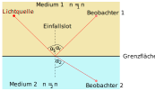

<!--
author:   Herbert schletter

email:    herbert.schletter@physik.tu-chemnitz.de

version:  2025.08.19

language: de

narrator: Deutsch Female

comment:  Übungsaufgaben zum Kurs „Physik (mit Experimenten)“

link:     https://cdn.jsdelivr.net/chartist.js/latest/chartist.min.css

script:   https://cdn.jsdelivr.net/chartist.js/latest/chartist.min.js

-->

# Übungsaufgaben zum Elementarkurs Experimentalphysik

**Dr. Herbert Schletter**

Technische Universität Chemnitz

, [Physics 2](https://commons.wikimedia.org/wiki/File:Physics_2.jpg), [CC BY-SA 3.0](https://creativecommons.org/licenses/by-sa/3.0/legalcode), via Wikimedia Commons]")

## Hinweis zum Urheberrecht

Diese Aufgabensammlung steht unter einer  [Creative Commons Namensnennung 4.0 International Lizenz](http://creativecommons.org/licenses/by/4.0/).

Ausgenommen hiervon sind Inhalte (insbesondere Abbildungen), die aus externen
Quellen übernommen wurden und dort unter einer anderslautenden Lizenz
veröffentlicht wurden. Derartige Inhalte sind im Skript stets mit einem eigenen
Lizenzhinweis versehen, der Vorrang vor der hier genannten Lizenz besitzt.

## Verwendung dieser Aufgabensammlung
Diese Aufgabensammlung ist abgestimmt auf das Vorlesungsskriptum „Elementarkurs
Experimentalphysik“ und vertieft dessen Inhalten durch Verständnisfragen und
Berechnungsaufgaben. Der Aufgabenumfang ist auf eine Dauer von einem Semester
mit einer Doppelstunde (90 Minuten) Übung alle zwei Wochen ausgelegt. Die
Aufgabenkomplexe sind nach dem Verlauf des Skriptums geordnet und in einzelne
Übungen gegliedert, die jeweils auf einen Übungstermin ausgerichtet sind.

Mit Ausnahme der ersten Übung enthalten die Übungen in der Regeln drei
Aufgabenbereiche:

- Verständnisfragen: Hier sollen physikalische Sachverhalte qualitativ beurteilt
  oder beschrieben werden. Die Beantwortung kann in LiaScript direkt in der
  Aufgabe vorgenommen und es erfolgt eine Ergebniskontrolle. Bei einigen
  Aufgaben werden mit der Lösung zusätzliche Erläuterungen eingeblendet.
  Die Verständnisfragen dienen vor allem dem Selbststudium. Eine Besprechung im
  Übungstermin erfolgt nur auf Nachfrage seitens der Studenten.
- Übungsaufgaben: Hierbei handelt es sich um Berechnungsaufgaben, die für eine
  Besprechung in den Übungen vorgesehen sind. Die Aufgaben selbst
  sollten bereits vor dem jeweiligen Übungstermin bearbeitet werden, damit
  eventuelle Unklarheiten bei der Herangehensweise zielgerichtet diskutiert
  werden können. Zur Selbstkontrolle kann bei jeder Aufgabe der Ergebniswert
  überprüft werden. Weitere Erläuterungen sind nicht bei den Aufgaben
  hinterlegt. Diese sollen in der Übung erfolgen.
- Hausaufgaben: Dies sind Berechnungsaufgaben, die für das Selbststudium
  vorgesehen sind. Ebenso wie bei den Übungsaufgaben ist auch hier eine
  Ergebniskontrolle möglich. Zusätzlich wird bei den Hausaufgaben zusammen
  mit der Lösung ein vollständiger Lösungsweg eingeblendet. Eine Besprechung
  dieser Aufgaben in der Übung erfolgt nur auf Nachfrage.

## Übung 1: Mathematische & physikalische Grundlagen
Die erste Übung enthält vor allem eine Wiederholung mathematischer (und in
geringerem Umfang auch physikalischer) Methoden, die als „Handwerkszeug“ in
Vorlesungen und Übungen des Physikkurses wichtig sind. Wenn alle Aufgaben dieses
Komplexes sorgfältig bearbeitet wurden, kann diese Übung auch als kompaktes
Kompendium für die weiteren Übungen dienen.

Da es sich bei den meisten Aufgaben um ein Zusammentragen von Informationen
handelt, ist in dieser ersten Übung keine Ergebniskontrolle vorgesehen. Ebenso
entfällt die Unterteilung in Verständnisfragen, Übungs- und Hausaufgaben. Der
gesamte Komplex wird zum ersten Übungstermin besprochen werden.

### Differentialrechnung
Ziel der Differentialrechnung ist die Bestimmung der Ableitung einer gegebenen
Funktion. Die Ableitung der Funktion $f(x)$ ist definiert als

$$\left .\frac{\mathrm{d}f(x)}{\mathrm{d}x}\right |_{x=x_0} = \lim_{x\rightarrow x_0} \frac{f(x)-f(x_0)}{x-x_0}$$

und gibt den Anstieg der Funktion im Punkt $x_0$ an. Funktionen können von
beliebigen Größen abhängen und entsprechend nach jeder dieser Größen abgeleitet
werden. In der Physik treten besonders häufig Ableitungen nach einer
Ortskoordinate $x$ sowie nach der Zeit $t$ auf. Für diese haben sich die
folgenden Kurzschreibweisen etabliert:

$$\frac{\mathrm d f(x)}{\mathrm d x} = f'(x) \qquad \frac{\mathrm d^2 f(x)}{\mathrm d x^2} = f''(x)$$
$$\frac{\mathrm d f(t)}{\mathrm d t} = \dot f(t) \qquad \frac{\mathrm d^2 f(t)}{\mathrm d t^2} = \ddot f(t)$$

#### Ableitungsregeln
Vervollständigen Sie die folgenden Ableitungsregeln:

- Ableitung mit konstanten Faktoren:
  $$\frac{\mathrm d}{\mathrm dx}\left( c\cdot f(x) \right) =$$
- Ableitung von Summen und Differenzen:
  $$\frac{\mathrm d}{\mathrm dx}\left( f(x) \pm g(x) \right) =$$
- Produktregel:
  $$\frac{\mathrm d}{\mathrm dx}\left( f(x) \cdot g(x) \right) =$$
- Quotientenregel:
  $$\frac{\mathrm d}{\mathrm dx}\left( \frac{f(x)}{g(x)} \right) =$$
- Kettenregel:
  $$\frac{\mathrm d}{\mathrm dx}\left( f(g(x)) \right) =$$

#### Spezielle Ableitungen
Ergänzen Sie die Ableitungen folgender Funktionen:

$$\frac{\mathrm d}{\mathrm dx}\left( \mathrm{const.} \right) = \qquad \frac{\mathrm d^2}{\mathrm dx^2}\left( \mathrm{const.} \right) =$$

$$\frac{\mathrm d}{\mathrm dx}\left( x^n \right) = \qquad \frac{\mathrm d^2}{\mathrm dx^2}\left( x^n \right) =$$

$$\frac{\mathrm d}{\mathrm dx}\left( \sin x \right) = \qquad \frac{\mathrm d^2}{\mathrm dx^2}\left( \sin x \right) =$$

$$\frac{\mathrm d}{\mathrm dx}\left( e^x \right) = \qquad \frac{\mathrm d^2}{\mathrm dx^2}\left( e^x \right) =$$

$$\frac{\mathrm d}{\mathrm dx}\left( \ln x \right) = \qquad \frac{\mathrm d^2}{\mathrm dx^2}\left( \ln x \right) =$$

### Integralrechnung
Ziel der Integralrechnung ist die Bestimmung einer Stammfunktion $G(x)$ zu einer
gegebenen Funktion $g(x)$:

$$G(x)=\int g(x)\mathrm dx \, .$$

Dabei gilt:

$$\frac{\mathrm d}{\mathrm dx}G(x) = G'(x) = g(x) \, .$$

Der Ausdruck $\int g(x)\mathrm dx$ wird als unbestimmtes Integral bezeichnet und
ergibt die Funktion $G(x)$. Das Ergebnis einer (unbestimmten) Integration kann
überprüft werden, indem die ermittelte Stammfunktion $G(x)$abgeleitet wird.
Dabei muss die ursprüngliche Funktion $g(x)$ reproduziert werden.

Die Bestimmung einer Stammfunktion ist nicht eindeutig: Es tritt stets eine
(zunächst unbestimmte) additive Konstante auf (sogenannte
Integrationskonstante). Für ein konkretes physikalisches Problem wird der Wert
dieser Konstante aus den Anfangs- oder Randbedingungen bestimmt.

Ein bestimmtes Integral

$$\int_a^b g(x)\mathrm dx = \left. G(x)\right|_a^b = G(b) - G(a)$$

ist durch seine Integrationsgrenzen $a$ und $b$ gekennzeichnet und liefert einen
Zahlenwert, der der Fläche unter der Funktion im Intervall $[a,b]$ entspricht.

#### Unbestimmte Integrale spezieller Funktionen
Lösen Sie die folgenden unbestimmten Integrale:

$$\int c\mathrm dx =$$

$$\int x^n \mathrm dx =$$

$$\int\sin x\mathrm dx =$$

$$\int\cos x\mathrm dx =$$

$$\int e^x \mathrm dx =$$

$$\int\frac 1x \mathrm dx =$$

$$\int f'(x) \mathrm dx =$$

#### Integrationsregeln
Ergänzen Sie die folgenden Integrationsregeln:

- Vielfache oder Bruchteile einer Funktion:
  $$\int c\cdot f(x)\mathrm dx =$$
- Summen von Funktionen:
  $$\int \left[ f(x) \pm g(x) \right] \mathrm dx =$$
- gleiche Integrationsgrenzen:
  $$\int_a^a f(x) \mathrm dx =$$
- vertauschte Intgerationsgrenzen:
  $$\int _b^a f(x) \mathrm dx = \dots \int _a^b f(x) \mathrm dx$$

### Vektoren
Zahlreiche Größen der Physik sind neben ihrem Betrag (einschließlich Einheit)
auch durch eine Richtung gekennzeichnet (z.B. Geschwindigkeit, Kraft). Diese
gerichteten (oder vektoriellen) Größen werden mathematisch durch Vektoren
beschrieben. Das Gegenstück zu den vektoriellen Größen bilden skalare Größen,
die nur duch ihren Betrag gekennzeichnet sind (z.B. Masse. Energie).

Veranschaulicht werden Vektoren durch Pfeile, deren Länge den Betrag den Betrag
des Vektors widerspiegelt. In einem kartesischen Koordinatensystem werden
Vektoren angegeben durch ihre Komponenten in $x$-, $y$- und $z$-Richtung:

$$\vec a = \begin{pmatrix}a_\mathrm x \\ a_\mathrm y \\ a_\mathrm z \end{pmatrix} \, .$$

Alternativ kann ein Vektor als Betrag und Richtung angegeben werden:

$$\vec a = \left |\vec a \right | \cdot \vec e_a \, ,$$

wobei der Ausdruck $\vec e_a$ einen sogenannten Einheitsvektor mit dem Betrag
$1$ bezeichnet. Einheitsvektoren können für beliebige Richtungen angegeben
werden. Von grundlegender Bedeutung sind die Einheitsvektoren entlang der
Koordinatenachsen:

$$\vec e_x =\begin{pmatrix}1\\0\\0\end{pmatrix} \qquad \vec e_y =\begin{pmatrix}0\\1\\0\end{pmatrix} \qquad \vec e_z =\begin{pmatrix}0\\0\\1\end{pmatrix} \, .$$
Damit kann ein Vektor auch in der Form

$$\vec a = a_\mathrm x\vec e_x + a_\mathrm y\vec e_y + a_\mathrm z\vec e_z$$

angegeben werden.

#### Rechenregeln für Vektoren
Vervollständigen Sie die folgenden Rechenregeln für Vektoren:

- Addition von Vektoren:
  $$\vec a + \vec b =$$
- Subtraktion von Vektoren:
  $$\vec a - \vec b =$$
- Multiplikation mit einem Skalar:
  $$c\cdot\vec a =$$
- Berechnung des Betrags:
  $$\left |\vec a\right | =$$
- Berechnung eines Einheitsvektors:
  $$\vec e_a =$$
- Gelten für die Vektoraddition das Kommutativ- und das Assoziativgesetz?

#### Skalarprodukt
Das Skalarprodukt ist das Produkt zweier Vektoren, das eine Zahl (Skalar)
ergibt. Es wird durch einen Punkt dargestellt. Ergänzen Sie hierzu die folgenden
Informationen:

- Berechnung des Skalarprodukts:
  $$\vec a\cdot\vec b =$$
- Wie verhält sich das Skalarprodukt bei parallelen bzw. bei zueinander
  senkrechten Vektoren?
- Gelten für das Skalarprodukt das Kommutativgesetz, das Assoziativgesetz und
  das Distributivgesetz (in Verbindung mit der Vektoraddition)?
- Wie lässt sich das Skalarprodukt geometrisch veranschaulichen?

#### Kreuzprodukt
Das Kreuzprodukt (oder Vektorprodukt) ist das Produkt zweier Vektoren, das einen
Vektor ergibt. Es wird durch ein Kreuz dargestellt. Ergänzen Sie hierzu die
folgenden Informationen:

- Berechnung des Kreuzprodukts:
  $$\vec a \times\vec b = \begin{pmatrix}a_\mathrm x \\ a_\mathrm y \\ a_\mathrm z\end{pmatrix}\times\begin{pmatrix}b_\mathrm x \\ b_\mathrm y \\ b_\mathrm z\end{pmatrix}=$$
- Betrag des Kreuzprodukts:
  $$\left | \vec a \times \vec b \right | =$$
- Welche Orientierung besitzt der Ergebnisvektor des Kreuzprodukts (bezogen auf
  die beiden Ausgangsvektoren)?
- Wie verhält sich das Kreuzprodukt bei parallen bzw. zueinander senkrechten
  Vektoren?
- Wie lassen sich Richtung und Betrag des Kreuzprodukts geometrisch
  veranschaulichen?
- Wie verhalten sich die Kreuzprodukte der Einheitsvektoren entlang der
  Koordinatenachsen:
  $$\vec e_x \times \vec e_y =$$
  $$\vec e_y \times \vec e_z =$$
  $$\vec e_z \times \vec e_x =$$
- Gelten für das Kreuzprodukt das Kommutativgesetz, das Assoziativgesetz und das
  Distributivgesetz (in Verbindung mit der Vektoraddition)?

### Größen und Einheiten

#### Einheitenvorsätze
Ergänzen Sie die Faktoren, die durch folgende Einheitenvorsätze angegeben werden:

- Bruchteile:
  $$\textrm{Dezi}\quad\mathrm d=$$
  $$\textrm{Zenti}\quad\mathrm c=$$
  $$\textrm{Milli}\quad\mathrm m=$$
  $$\textrm{Mikro}\quad\mathrm \mu=$$
  $$\textrm{Nano}\quad\mathrm n=$$
- Vielfache:
  $$\textrm{Deka}\quad\mathrm {da}=$$
  $$\textrm{Hekto}\quad\mathrm h=$$
  $$\textrm{Kilo}\quad\mathrm k=$$
  $$\textrm{Mega}\quad\mathrm M=$$
  $$\textrm{Giga}\quad\mathrm G=$$

#### Einheitenumrechnung I
Rechnen Sie folgende Einheiten ineinander um:

- $\mathrm{dam}$ in $\mathrm{mm}$
- $\mathrm{m^2}$ in $\mathrm{mm^2}$
- $\mathrm{h}$ in $\mathrm{s}$
- $\frac{\mathrm{m}}{\mathrm s}$ in $\frac{\mathrm{km}}{\mathrm h}$
- $\frac{\mathrm{g}}{\mathrm{cm^3}}$ in $\frac{\mathrm{kg}}{\mathrm{m^3}}$

#### Einheitenumrechnung II
In den folgenden Formeln werden diese Größen mit ihren Einheiten verwendet:

- Weg $s$ in $\mathrm m$,
- Geschwindigkeit $v$ in $\frac{\mathrm m}{\mathrm s}$,
- Zeit $t$ in $\mathrm s$,
- Masse $m$ in $\mathrm{kg}$.

Eventuell vorhandene Indizes ändern nicht die genannten Einheiten. Ermitteln Sie
die Einheit des Ergebnisses folgender Formeln:

$$v_0 \cdot t + s_0$$

$$\frac{v_0^2}{2\cdot s}$$

$$m\cdot v$$

$$\sqrt{v_0^2 \left ( 1-\frac{s}{s_\mathrm B} \right)}$$

$$\frac{m}{2}v^2$$

$$\frac{s}{v}$$

## Übung 2: Kinematik und Dynamik

### Verständnisfragen

#### Bewegungsdiagramme
Ein Personenzug nähert sich seinem Endbahnhof. Auf der freien Strecke vor dem
Bahnhof gilt eine Höchstgeschwindigkeit von
$v_\mathrm{strecke} = 120~\frac{\mathrm{km}}{\mathrm h}$. Im Bahnhofsbereich
darf der Zug nicht schneller als $v_\mathrm{bhf} = 40~\frac{\mathrm{km}}{\mathrm h}$
fahren. Die nachfolgenden Teilaufgaben enthalten jeweils eine andere
Darstellung des Bewegungsablaufs dieses Zugs, jeweils beginnend auf der freien
Strecke bis in den Bahnhof.

*Hinweis*: In jeder Teilaufgabe lassen sich die Fragen allein anhand des
zugehörigen Diagramms beantworten, auch wenn manche Aspekte in einer anderen
Darstellung offensichtlicher sein mögen.

<section>
##### Teil 1: Ort-Zeit-Diagramm

Das folgende Diagramm zeigt des Ort-Zeit-Diagramm $s(t)$ des Zugs:

<figure>

<figcaption>
  Ort-Zeit-Diagramm des Zugs.
</figcaption>
</figure>
   
Die folgenden Aussagen beziehen sich auf das oben dargestellte Diagramm.
Beurteilen Sie deren Richtigkeit.

[[X]] Das Diagramm enthält genau zwei Abschnitte mit gleichförmiger Bewegung.
[[X]] Am Ende des dargestellten Intervalls hat der Zug angehalten.
[[X]] Seine größte Geschwindigkeit hat der Zug in den ersten Sekunden des dargestellten Intervalls.
[[X]] Zu keinem Zeitpunkt nimmt die Geschwindigkeit des Zugs zu.
[[ ]] In der Mitte des dargestellten Zeitintervalls hat der Zug genau die Hälfte seines Gesamtwegs zurückgelegt.
[[X]] Zu irgendeinem Zeitpunkt entsprach die Momentangeschwindigkeit des Zugs genau der Durchschnittsgeschwindigkeit für das gesamte dargestellte Intervall.
*******************************************************************************

- Das Diagramm enthält genau zwei Abschnitte mit gleichförmiger Bewegung.
  
  - **Richtig**: Bei gleichförmiger Bewegung ist die Ort-Zeit-Kurve eine Gerade.
    Dies ist im Diagramm in den ersten 10 Sekunden sowie im Zeitintervall zwischen
    $t\approx 50~\mathrm s$ und $t\approx 90~\mathrm s$ der Fall

- Am Ende des dargestellten Intervalls hat der Zug angehalten.
  
  - **Richtig**: Am rechten Rand des Diagramms erreicht die Ort-Zeit-Kurve einen
    horizontalen Verlauf.

- Seine größte Geschwindigkeit hat der Zug in den ersten Sekunden des dargestellten
  Intervalls

  - **Richtig**: In den ersten 10 Sekunden ist der Anstieg der Ort-Zeit-Kurve am
    größten.

- Zu keinem Zeitpunkt nimmt die Geschwindigkeit des Zugs zu.

  - **Richtig**: An keiner Stelle im Diagramm nimmt der Anstieg der Ort-Zeit-Kurve
    zu.

- In der Mitte des dargestellten Zeitintervalls hat der Zug genau die Hälfte seines
  Gesamtwegs zurückgelegt.

  - **Falsch**: Die Mitte des Zeitintervalls liegt bei $t\approx 60~\mathrm s$. Zu
    diesem Zeitpunkt hat der Zug bereits mehr als $1250~\mathrm m$ zurückgelegt,
    was deutlich mehr als die Hälfte der insgesamt $\approx 1800~\mathrm m$ ist.

- Zu irgendeinem Zeitpunkt entsprach die Momentangeschwindigkeit des Zugs genau
  der Durchschnittsgeschwindigkeit für das gesamte dargestellte Intervall.

  - **Richtig**: Dies ist eine mathematische Notwendigkeit für eine stetige
    Funktion. Die Durchschnittsgeschwindigkeit hat einen Wert zwischen
    Maximalgeschwindigkeit (zu Beginn des Intervalls) und Null (am Ende des
    Intervalls). Beim kontinuierlichen Abbremsen wird auch dieser Wert der
    Geschwindigkeit zu irgendeinem Zeitpunkt erreicht.

*******************************************************************************

</section>
<section>
##### Teil 2: Geschwindigkeit-Zeit-Diagramm

Das folgende Diagramm zeigt des Geschwindigkeit-Zeit-Diagramm $v(t)$ des Zugs:

<figure>

<figcaption>
  Geschwindigkeit-Zeit-Diagramm des Zugs.
</figcaption>
</figure>
   
Die folgenden Aussagen beziehen sich auf das oben dargestellte Diagramm.
Beurteilen Sie deren Richtigkeit.

[[X]] Im ersten Bremsvorgang (vor Erreichen des Bahnhofsbereichs) hatte die gewählte Verzögerung einen Betrag von $8000~\frac{\mathrm{km}}{\mathrm h^2}$. (**Hinweis**: Dieser Bremsvorgang dauerte exakt $t = 36~\mathrm s$.)
[[ ]] Beide Bremsvorgänge erfolgen mit derselben Verzögerung.
[[ ]] Beide Bremsvorgänge dauerten gleich lang.
[[X]] Zu Beginn der beiden Bremsvorgänge wechselt die Beschleunigung sprunghaft auf ihren Maximalwert.
[[X]] Die Beschleunigung ist zu keinem Zeitpunkt größer als Null.
[[X]] Beide Bremsvorgänge entsprechen einer gleichmäßig beschleunigten Bewegung.
*******************************************************************************

- Im ersten Bremsvorgang (vor Erreichen des Bahnhofsbereichs) hatte die
  gewählte Verzögerung einen Betrag von $8000~\frac{\mathrm{km}}{\mathrm h^2}$.
  (**Hinweis**: Dieser Bremsvorgang dauerte exakt $t = 36~\mathrm s$.)

  - **Richtig**: Innerhalb von $\Delta t = 36~\mathrm s = 0{,}01~\mathrm h$
    verringerte sich die Geschwindigkeit um $\Delta v = 80~\frac{\mathrm{km}}{\mathrm h}$.

- Beide Bremsvorgänge erfolgen mit derselben Verzögerung.

  - **Falsch**: Die Anstiege der Geschwindigkeit-Zeit-Kurve für die beiden
    Bremsvorgänge sind unterschiedlich.

- Beide Bremsvorgänge dauerten gleich lang.
  
  - **Falsch**: Die Dauer der Bremsvorgänge kann an der horizontalen Achse
    abgelesen werden.

- Zu Beginn der beiden Bremsvorgänge wechselt die Beschleunigung sprunghaft
  auf ihren Maximalwert.
  
  - **Richtig**: So entsteht jeweils der scharfe „Knick“ im
    Geschwindigkeitsverlauf.

- Die Beschleunigung ist zu keinem Zeitpunkt größer als Null.
  
  - **Richtig**: Die Geschwindigkeit bleibt entweder konstant ($a=0$) oder
    nimmt ab ($a<0$).

- Beide Bremsvorgänge entsprechen einer gleichmäßig beschleunigten Bewegung.
  
  - **Richtig**: Dies ist erkennbar am linearen Verlauf der Geschwindigkeit.

*******************************************************************************
</section>
<section>
##### Teil 3: Geschwindigkeit-Ort-Diagramm

Das folgende Diagramm zeigt des Geschwindigkeit-Ort-Diagramm $v(s)$ des Zugs:

<figure>

<figcaption>
  Geschwindigkeit-Ort-Diagramm des Zugs.
</figcaption>
</figure>

Die folgenden Aussagen beziehen sich auf das oben dargestellte Diagramm.
Beurteilen Sie deren Richtigkeit.

[[X]] Der Zug legte insgesamt mehr als einen halben Kilomter Strecke in gleichförmiger Bewegung zurück.
[[ ]] Das Diagramm enthält zwei Zeitabschnitte, in denen der Zug im Stillstand war.
[[ ]] Die dargestellten Bremsvorgänge können nicht mit konstanter Beschleunigung (Verzögerung) erfolgt sein, da die zugehörigen Kurvenabschnitte gekrümmt sind.
[[X]] Die Strecke, die der Zug mit $40~\frac{\mathrm{km}}{\mathrm h}$ zurückgelegt hat, ist größer als die, die er mit $120~\frac{\mathrm{km}}{\mathrm h}$ zurückgelegt hat.
[[ ]] Die Fläche unter der Kurve ist ein Maß für die Beschleunigung.
[[X]] Aus dem Diagramm lässt sich nicht unmittelbar ablesen, wieviel Zeit die einzelnen Bewegungsabschnitte in Anspruch genommen haben.
*******************************************************************************

- Der Zug legte insgesamt mehr als einen halben Kilomter Strecke in
  gleichförmiger Bewegung zurück.
  
  - **Richtig**: Gleichförmige Bewegung entspricht den horizontalen Abschnitten
    der Geschwindigkeit-Ort-Kurve. Die zurückgelegte Strecke kann als Länge
    dieser Abschnitte auf der horizontalen Achse abgelesen werden.

- Das Diagramm enthält zwei Zeitabschnitte, in denen der Zug im Stillstand war.

  - **Falsch**: Erst am Ende der Kurve kommt der Zug zum Stillstand. Die
    horizontalen Abschnitte im Kurvenverlauf entsprechen einer gleichförmigen
    Bewegung.

- Die dargestellten Bremsvorgänge können nicht mit konstanter Beschleunigung
  (Verzögerung) erfolgt sein, da die zugehörigen Kurvenabschnitte gekrümmt
  sind.
  
  - **Falsch**: Eine konstante Beschleunigung führt zwar im $v(t)$-Diagramm zu
    einem linearen Verlauf, nicht jedoch im $v(s)$-Diagramm, da die in gleichen
    Zeitabschnitten zurückgelegten Strecken abnehmen (mit abnehmender
    Geschwindigkeit). Ein nichtlinearer Geschwindigkeitsverlauf in diesem
    Diagramm kann daher nicht als Beweis einer ungleichmäßigen Beschleunigung
    dienen. Tatsächlich wurde die Kurve im Diagramm für konstante
    Beschleunigungen während der Bremsphasen erstellt.

- Die Strecke, die der Zug mit $40~\frac{\mathrm{km}}{\mathrm h}$ zurückgelegt
  hat, ist größer als die, die er mit $120~\frac{\mathrm{km}}{\mathrm h}$#
  zurückgelegt hat.
  
  - **Richtig**: Dies folgt aus der Vergleich der Längen der beiden
    horizontalen Kurvenabschnitte.

- Die Fläche unter der Kurve ist ein Maß für die Beschleunigung.
  
  - **Falsch**: Die Beschleunigung ist die zeitliche Ableitung der
    Geschwindigkeit und kann in diesem Diagramm nicht unmittelbar abgelesen
    werden. Die Fläche unter Kurve müsste einer Größe der Art $s\cdot v$
    („Weg $\times$ Geschwindigkeit“) entsprechen, die jedoch in der Regel keine
    Aussagekraft besitzt.

- Aus dem Diagramm lässt sich nicht unmittelbar ablesen, wieviel Zeit die
  einzelnen Bewegungsabschnitte in Anspruch genommen haben.
  
  - **Richtig**: Das Diagramm zeigt keine Zeitabhängigkeit. Die dargestellte
    Ortsabhängigkeit müsste erst anhand der Geschwindigkeit umgerechnet werden.

*******************************************************************************
</section>

#### Züge

An einem Bahnhof fährt ein ICE gerade in dem Moment los, als auf dem
Nachbargleis ein Güterzug mit konstanter Geschwindigkeit an ihm vorbeifährt. Die
Orts-Zeit-Gesetze beider Züge sind in folgendem Diagramm dargestellt:

<!-- style="width:16cm;" -->

Die horizontale Achse stellt die Zeit $t$ (in Sekunden), die vertikale Achse den
zurückgelegten Weg $s$ (in Metern) dar.

Welche der folgenden Aussagen sind richtig?

[[X]] Zum Zeitpunkt $t=40~\mathrm{s}$ hat der ICE den Güterzug eingeholt.
[[ ]] Zum Zeitpunkt $t=40~\mathrm{s}$ haben beide Züge dieselbe Geschwindigkeit.
[[X]] Die Durchschnittsgeschwindigkeit auf dem Streckenintervall $[0\dots 800~\mathrm m]$ ist für beide Züge gleich.
[[X]] Zu einem Zeitpunkt $t<40~\mathrm s$ haben beide Züge dieselbe Geschwindigkeit.
[[ ]] Über die Geschwindigkeiten der Züge kann keine Aussage getroffen werden, da nur die Orts-Zeit-Gesetze dargestellt sind.
[[ ]] Wenn der Güterzug nicht gebremst hätte, wäre er nicht vom ICE eingeholt worden.
********************************************************************************

- Zum Zeitpunkt $t=40~\mathrm{s}$ hat der ICE den Güterzug eingeholt.

  - **Richtig**: Zu diesem Zeitpunkt schneiden sich die beiden Orts-Zeit-Kurven.
    Beide Züge befinden sich also an gleicher Position.

- Zum Zeitpunkt $t=40~\mathrm{s}$ haben beide Züge dieselbe Geschwindigkeit.

  - **Falsch**: Die Anstiege der beiden Kurven sind zu diesem Zeitpunkt
    unterschiedlich. Bei gleicher Geschwindigkeit könnte der ICE den Güterzug
    nicht überholen.

- Die Durchschnittsgeschwindigkeit auf dem Streckenintervall
  $[0\dots 800~\mathrm m]$ ist für beide Züge gleich.

  - **Richtig:** Für diesen Streckenabschnitt benötigen beide Züge 40 Sekunden.
    Die Durchschnittsgeschwindigkeit ist unabhängig von der Bewegungsform
    (gleichförmige Bewegung des Güterzugs, gleichmäßig beschleunigte Bewegung
    des ICE).

- Zu einem Zeitpunkt $t<40~\mathrm s$ haben beide Züge dieselbe Geschwindigkeit.

  - **Richtig**: Der Güterzug fährt die ganze Zeit über mit konstanter
    Geschwindigkeit. Der ICE ist anfangs langsamer, nach 40 Sekunden überholt er
    den Güterzug mit höherer Geschwindigkeit. Zu einem Zeitpunkt dazwischen muss
    der ICE ebenso schnell wie der Güterzug gewesen sein.

- Über die Geschwindigkeiten der Züge kann keine Aussage getroffen werden, da
  nur die Orts-Zeit-Gesetze dargestellt sind.

  - **Falsch**: Die Geschwindigkeit kann aus den Anstiegen der dargestellten
    Kurven abgelesen werden.

- Wenn der Güterzug nicht gebremst hätte, wäre er nicht vom ICE eingeholt
  worden.

  - **Falsch**: Der Güterzug war die gesamte dargestellte Zeit über mit konstanter
    Geschwindigkeit unterwegs. Er ist eingeholt und überholt worden, ohne dass
    er gebremst hat.

********************************************************************************

#### Senkrechter Wurf I

Ein Körper wird aus einer Höhe $h_0 >0$ senkrecht nach oben geworfen und landet
später auf dem Boden ($h=0$). Wählen Sie aus, welche Diagramme (Nummer 1 bis 7)
für diesen Vorgang den Zusammenhang $h(t)$ (Höhe-Zeit), $v(t)$
(Geschwindigkeit-Zeit) und $a(t)$ (Beschleunigung-Zeit) korrekt darstellen. Die
horizontale Achse entspricht in allen Diagrammen der Zeit $t$.

<!-- style="width:12cm;" -->

<!-- style="width:12cm;" -->

<!-- style="width:12cm;" -->

<!-- style="width:12cm;" -->

<!-- style="width:12cm;" -->

<!-- style="width:12cm;" -->

<!-- style="width:12cm;" -->

[[**1**] [**2**] [**3**] [**4**] [**5**] [**6**] [**7**]]
[  [X]     [ ]     [ ]     [ ]     [ ]     [ ]     [ ]  ] Darstellung $h(t)$
[  [ ]     [ ]     [X]     [ ]     [ ]     [ ]     [ ]  ] Darstellung $v(t)$
[  [ ]     [ ]     [ ]     [X]     [ ]     [ ]     [ ]  ] Darstellung $a(t)$
********************************************************************************

- **Höhe-Zeit-Diagramm** $h(t)$: Der Zusammenhang $h(t)$ wird durch **Diagramm 1**
  beschrieben: Die Bewegung beginnt in einer Höhe $h>0$. Anschließend nimmt die
  Höhe zunächst zu, da der Körper senkrecht nach oben geworfen wird. Nach
  Erreichen der maximalen Wurfhöhe, die durch den Scheitelpunkt der Kurve
  gegeben ist, nimmt die Höhe des Körpers wieder ab. Am Ende des dargestellten
  Vorgangs beträgt die Höhe $h=0$.
- **Geschwindigkeit-Zeit-Diagramm** $v(t)$: Der Zusammenhang $v(t)$ wird durch
  **Diagramm 3** beschrieben: Da der Körper nach oben geworfen wird, ist seine
  Geschwindigkeit anfangs positiv. Aufgrund der konstant wirkenden
  Fallbeschleunigung nimmt die Geschwindigkeit linear ab. Bei der maximalen
  Wurfhöhe wechselt die Geschwindigkeit das Vorzeichen und ist während der
  Abwärtsbewegung negativ.
- **Beschleunigung-Zeit-Diagramm** $a(t)$: Der Zusammenhang $a(t)$ wird durch
  **Diagramm 4** beschrieben: Die wirkende Beschleunigung ist konstant. Es ist
  die nach unten gerichtete (d.h. negative) Fallbeschleunigung
  $a = -g = -9{,}81~\frac{\mathrm m}{\mathrm s^2}$.

********************************************************************************

#### Bewegung auf der Luftkissenbahn

Eine Luftkissenbahn mit einer Gesamtlänge von $2~\mathrm m$ sei geneigt
aufgestellt, sodass das obere Ende um $\Delta h = 14{,}5~\mathrm{cm}$ höher
liegt als das untere Ende. Positionen auf der Luftkissenbahn werden durch die
Koordinate $x$ angegeben. Das untere Ende der Bahn entspricht $x = 0$, das obere
Ende liegt bei $x = 2~\mathrm m$.

Am unteren Ende der Bahn wird ein Gleiter nach oben angeschoben
(Anfangsgeschwindigkeit $v_0$). Danach erfolgt kein weiterer Eingriff in die
Bewegung des Gleiters. Sobald der Gleiter die Stelle $x = 10~\mathrm{cm}$
erreicht, startet die automatische Aufzeichnung des Orts-Zeit-Gesetzes. Das
resultierende Diagramm $x(t)$ ist in der nachfolgenden Abbildung gezeigt. Die
$x$-Koordinate (vertikale Achse) ist dabei in Metern angegeben. Zeitangaben
(horizontale Achse) erfolgen in Sekunden.

$-Diagramm der Bewegung auf der Luftkissenbahn")<!-- style="width:16cm;" -->

Welche der folgenden Aussagen bezüglich der ober dargestellten Bewegung sind
richtig?

[[X]] Der Betrag der auf den Gleiter wirkenden Beschleunigung wird durch die Fallbeschleunigung $g$ und den Neigungswinkel der Bahn bestimmt.
[[ ]] Aussagen zur Geschwindigkeit oder Beschleunigung des Gleiters können nicht getroffen werden, da nur das Orts-Zeit-Gesetz gezeigt ist.
[[X]] Auf den Gleiter wirkt permanent eine konstante Beschleunigung, die zum unteren Bahnende gerichtet ist.
[[ ]] Nach etwa 2 Sekunden erreicht der Gleiter seine größte Geschwindigkeit.
[[X]] Am Ende der Messdauer (bei $t = 4~\mathrm s$) befindet sich der Gleiter unmittelbar vor dem unteren Bahnende.
[[X]] Das zugehörige Geschwindigkeits-Zeit-Diagramm zeigt eine fallende Gerade.
[[ ]] Die auf den Gleiter wirkende Beschleunigung ist zunächst positiv und wechselt im Umkehrpunkt ($t \approx 2~\mathrm s$) das Vorzeichen. Der Betrag ändert sich dabei nicht.
[[ ]] Der Gleiter bewegt sich während der gesamten Messdauer aufwärts.
********************************************************************************

* Der Betrag der auf den Gleiter wirkenden Beschleunigung wird durch die
  Fallbeschleunigung g und den Neigungswinkel der Bahn bestimmt.

  * **Richtig**: Die Fallbeschleunigung ist stets senkrecht orientiert. Die
    Beschleunigung des Gleiters entspricht dem Anteil der Fallbeschleunigung
    parallel zur Luftkissenbahn.

* Aussagen zur Geschwindigkeit oder Beschleunigung des Gleiters können nicht
  getroffen werden, da nur das Orts-Zeit-Gesetz gezeigt ist.

  * **Falsch**: Geschwindigkeit und Beschleunigung entsprechen der ersten
    beziehungsweise zweiten Ableitung der Orts-Zeit-Kurve. Aus dem Kurvenverlauf
    lassen sich somit auch Rückschlüsse auf diese beiden Größen ziehen.

* Auf den Gleiter wirkt permanent eine konstante Beschleunigung, die zum unteren
  Bahnende gerichtet ist.

  * **Richtig**: Da die Bahn gerade ist, wirkt auch eine konstante
    Beschleunigung (siehe auch Aussage 1).

* Nach etwa 2 Sekunden erreicht der Gleiter seine größte Geschwindigkeit.

  * **Falsch**: Zu diesem Zeitpunkt befindet sich der Gleiter etwa im
    Umkehrpunkt seiner Bahn. Die Geschwindigkeit wechselt im Umkehrpunkt das
    Vorzeichen und ist für einen Moment Null. Große Geschwindigkeiten zeigen
    sich durch steile Anstiege der Orts-Zeit-Kurve, wie sie zu Beginn und am
    Ende der Messdauer vorliegen.

* Am Ende der Messdauer (bei $t = 4~\mathrm s$) befindet sich der Gleiter
  unmittelbar vor dem unteren Bahnende.

  * **Richtig**: Am rechten Rand des Diagramms endet die Kurve in der Nähe der
    Position $x = 0$.

* Das zugehörige Geschwindigkeits-Zeit-Diagramm zeigt eine fallende Gerade.

  * **Richtig**: Die Orts-Zeit-Kurve ist eine nach unten geöffnete Parabel.
    Deren Ableitung ist eine fallende Gerade. Ebenso lässt sich aus der
    konstanten Beschleunigung (Aussagen 1 und 3) auf eine linear abnehmende
    Geschwindigkeit schließen.

* Die auf den Gleiter wirkende Beschleunigung ist zunächst positiv und wechselt
  im Umkehrpunkt ($t \approx 2~\mathrm s$) das Vorzeichen. Der Betrag ändert
  sich dabei nicht.

  * **Falsch**: Im Umkehrpunkt wechselt zwar die Geschwindigkeit das Vorzeichen,
    nicht aber die Beschleunigung. Letztere ist konstant und negativ.

* Der Gleiter bewegt sich während der gesamten Messdauer aufwärts.

  * **Falsch**: Anfangs bewegt sich der Gleiter aufwärts und erreicht dann
    seinen Umkehrpunkt (Scheitelpunkt der Orts-Zeit-Kurve). Danach bewegt sich
    der Gleiter abwärts (fallender Ast der Parabel).

********************************************************************************

#### Senkrechter Wurf II

Ein Körper wird senkrecht nach oben geworfen. Was gilt für die Geschwindigkeit
und die Beschleunigung im höchsten Punkt?

[[X]] Der Betrag der Geschwindigkeit ist null: $\left| v \right| = 0$.
[[ ]] Der Betrag der Geschwindigkeit ist größer als null: $\left| v \right| > 0$.
[[ ]] Der Betrag der Beschleunigung ist null: $\left| a \right| = 0$.
[[X]] Der Betrag der Beschleunigung ist größer als null: $\left| a \right| > 0$.
********************************************************************************

*  Der Betrag der Geschwindigkeit ist null: $\left| v \right| = 0$.

   *  **Richtig**: Im höchsten Punkt der Bahn ändert sich die Bewegungsrichtung
      von *aufwärts* zu *abwärts*. Die Geschwindigkeit wechselt dabei das
      Vorzeichen und ist für einen Moment Null.

*  Der Betrag der Geschwindigkeit ist größer als null: $\left| v \right| > 0$.

   * **Falsch**: siehe oben.

*  Der Betrag der Beschleunigung ist null: $\left| a \right| = 0$.

   * **Falsch**: Während des gesamten Vorgangs wirkt konstant die
      Fallbeschleunigung $\left | a \right | = g$.

*  Der Betrag der Beschleunigung ist größer als null: $\left| a \right| > 0$.

   *  **Richtig**: siehe oben.

********************************************************************************

#### Grimsehlversuch I

Zwei Kugeln befinden sich auf einer Startvorrichtung, von der sie gleichzeitig
und aus gleicher Höhe ihre Bewegung beginnen: Kugel 1 fällt senkrecht nach
unten, Kugel 2 wird waagerecht abgeworfen.

Welche Aussagen über die Bewegung der Kugeln sind richtig?

[[X]] Beide Kugeln erreichen gleichzeitig den Boden, da in vertikale Richtung dieselbe Bewegung ausgeführt wird.
[[ ]] Beide Kugeln haben bei Auftreffen auf den Boden dieselbe Geschwindigkeit, da auf beide Kugeln dieselbe Beschleunigung (Fallbeschleunigung) wirkt.
[[X]] Die waagerecht abgeworfene Kugel behält in horizontale Richtung ihre Anfangsgeschwindigkeit bei.
[[X]] Die Kugeln befinden sich zu jedem Zeitpunkt in derselben Höhe.
[[X]] Der Abstand zwischen den Kugeln nimmt kontinuierlich zu.
[[ ]] Die senkrecht fallende Kugel erreicht den Boden eher, da sie einen kürzeren Weg zurücklegt.
[[ ]] Die horizontale Bewegung der abgeworfenen Kugel wird immer langsamer. So entsteht die charakteristische Parabelform der Flugbahn.
*****************************************************************************

*  Beide Kugeln erreichen gleichzeitig den Boden, da in vertikale Richtung
   dieselbe Bewegung ausgeführt wird.

   *  **Richtig**: Für Bewegungen gilt das Prinzip der ungestörten Überlagerung
      (Superposition). Die vertikale Bewegung ist demnach unabhänhgig von der
      horizontalen Bewegung und für beide Kugeln identisch.

*  Beide Kugeln haben bei Auftreffen auf den Boden dieselbe Geschwindigkeit, da
   auf beide Kugeln dieselbe Beschleunigung (Fallbeschleunigung) wirkt.

   *  **Falsch**: Die vertikale Geschwindigkeitskomponente ist für beide Kugeln
      identisch. Die abgeworfene Kugel besitzt zusätzlich eine horizontale
      Geschwindigkeitskomponente, sodass ihre Gesamtgeschwindigkeit größer ist.

*  Die waagerecht abgeworfene Kugel behält in horizontale Richtung ihre
   Anfangsgeschwindigkeit bei.

   *  **Richtig**: Bei Vernachlässigung der Luftreibung (was hier gerechtfertigt
      ist) liegt in horizontale Richtung keinerlei Beschleunigung vor.

*  Die Kugeln befinden sich zu jedem Zeitpunkt in derselben Höhe.

   *  **Richtig**: Dies ist gleichbedeutend mit der ersten Aussage.

*  Der Abstand zwischen den Kugeln nimmt kontinuierlich zu.

   *  **Richtig**: Die abgeworfene Kugel bewegt sich mit konstanter
      Geschwindigkeit in horizontale Richtung und entfernt sich dabei von der
      anderen Kugel.

*  Die senkrecht fallende Kugel erreicht den Boden eher, da sie einen kürzeren
   Weg zurücklegt.

   *  **Falsch**: Für die Bestimmung der Fallzeit spielt nur der vertikale
      Bewegungsablauf eine Rolle. Dieser ist für beide Kugeln identisch. Somit
      erreichen auch beide Kugeln gleichzeitig den Boden. Die zusätzliche
      horizontale Bewegung der abgeworfenen Kugel hat keinen Einfluss hierauf.
      Natürlich legt die abgeworfene Kugel einen längeren Weg zurück, sie
      besitzt jedoch auch (aufgrund der Abwurfs) eine höhere
      Gesamtgeschwindigkeit.

*  Die horizontale Bewegung der abgeworfenen Kugel wird immer langsamer. So
   entsteht die charakteristische Parabelform der Flugbahn.

   *  **Falsch**: Die horizontale Geschwindigkeit der abgeworfenen Kugel bleibt
      konstant (siehe dritte Aussage). Die Parabelform entsteht durch die
      aufgrund der Fallbeschleunigung zunehmende vertikale Geschwindigkeit.

****************************************************************************

#### Erstes Newtonsches Axiom

Ein Körper bewegt sich geradlinig mit konstanter Geschwindigkeit. Was lässt sich
dabei über die auf den Körper wirkenden Kräfte schlussfolgern?

[[ ]] Es dürfen keinerlei Kräfte auf den Körper einwirken, da sich sonst seine Geschwindigkeit in jedem Fall ändern würde.
[[ ]] Es können nur Kräfte senkrecht zur Bewegungsrichtung angreifen.
[[X]] Es können beliebige Kräfte auf den Körper einwirken, solange ihre (vektorielle) Summe null ist.
[[ ]] Jede einzelne Kraft, die auf den Körper wirkt, muss zeitlich konstant sein.
********************************************************************************

* Es dürfen keinerlei Kräfte auf den Körper einwirken, da sich sonst seine
  Geschwindigkeit in jedem Fall ändern würde.

  * **Falsch**: Entscheidend ist die resultierende Gesamtkraft. Diese kann Null
    sein, selbts wenn verschiedene (Einzel-) Kräfte auf den Körper einwirken.

* Es können nur Kräfte senkrecht zur Bewegungsrichtung angreifen.

  * **Falsch**: Diese Aussage ist doppelt inkorrekt: Einerseits bewirken auch
    senkrecht angreifende Kräfte eine Beschleunigung, wenn sie nicht kompensiert
    werden. Andererseits lassen sich auch Kräfte in Bewegungsrichtung
    kompensieren, sodass sie keine Änderung des Bewegungszustands verursachen.

* Es können beliebige Kräfte auf den Körper einwirken, solange ihre
  (vektorielle) Summe null ist.

  * **Richtig**: Kräfte überlagern sich vektoriell gemäß dem
    Superpositionsprinzip. Entscheidend für eine Änderung des Bewegungszustands
    ist eine von Null verschiedene Gesamtkraft.

* Jede einzelne Kraft, die auf den Körper wirkt, muss zeitlich konstant sein.

  * **Falsch**: Auch zeitlich veränderliche Kräfte können sich gegenseitig
    kompensieren, sodass die Gesamtkraft unverändert Null ist.

********************************************************************************

#### Zweites Newtonsches Axiom

Das zweite Newtonsche Axiom beinhaltet die Formel
$\int_{t_1}^{t_2}F \mathrm dt = \Delta p$. Welche der folgenden
Schlussfolgerungen aus dieser Formel sind richtig?

[[X]] Ein Körper ändert seinen Impuls, wenn die Summe aller auf ihn wirkenden Kräfte nicht null ist.
[[ ]] Die Änderung des Impulses ist unabhängig vom gewählten Zeitintervall $[t_1, t_2]$.
[[X]] Die Formel $F=m\cdot a$ ist ein Sonderfall der obigen Formel (bei konstanter Masse).
[[ ]] Je größer die Masse eines Körpers, umso stärker wird er (bei gleichem Kraftstoß) beschleunigt.
[[ ]] Die Formel erlaubt keinerlei Rückschlüsse auf die Geschwindigkeit, da nur der Impuls berechnet werden kann.
[[X]] Auch kleine Kräfte können eine starke Impulsänderung bewirken, wenn sie über einen langen Zeitraum wirken.
********************************************************************************

* Ein Körper ändert seinen Impuls, wenn die Summe aller auf ihn wirkenden Kräfte
  nicht null ist.

  * **Richtig**: Eine Änderung des Bewegungszustands (was gleichbedeutend ist
    mit einer Änderung des Impulses) geschieht stets durch die Einwirkung einer
    (resultierenden) Kraft.

* Die Änderung des Impulses ist unabhängig vom gewählten Zeitintervall
  $[t_1, t_2]$.

  * **Falsch**: Je länger die Kraft einwirkt, umso größer wird die resultierende
    Impulsänderung sein.

* Die Formel $\vec F=m\cdot \vec a$ ist ein Sonderfall der obigen Formel (bei
  konstanter Masse).

  * **Richtig**: Die obige Formel lautet in differenzieller Schreibweise
    $\vec F = \dot{\vec p}$. Bei konstanter Masse gilt $\dot{\vec p} = m\vec a$.

* Je größer die Masse eines Körpers, umso stärker wird er (bei gleichem
  Kraftstoß) beschleunigt.

  * **Falsch**: Der Gegenteil ist der Fall: Bei größerer Masse erfordert
    dieselbe Impulsänderung eine kleinere Geschwindigkeitsänderung. Körper mit
    größerer Masse werden also weniger stark beschleunigt bei gleichem
    Kraftstoß.

* Die Formel erlaubt keinerlei Rückschlüsse auf die Geschwindigkeit, da nur der
  Impuls berechnet werden kann.

  * **Falsch**: Da \vec p = m\vec v gilt, können aus der Impulsänderung auch
    Rückschlüsse auf die Geschwindigkeit gezogen werden, wenn Informationen über
    die Masse vorliegen.

* Auch kleine Kräfte können eine starke Impulsänderung bewirken, wenn sie über
  einen langen Zeitraum wirken.

  * **Richtig**: Je länger eine Kraft einwirkt, umso größer wird resultierende
    Impulsänderung. Bei konstanter Kraft ist die Impulsänderung proportional zur
    Länge des Zeitintervalls.

********************************************************************************

### Übungsaufgaben

#### Von 0 auf 100
Bei Autos wird gelegentlich angegeben, wie lange sie „von 0 auf 100“ brauchen.
Gemeint ist die Zeitdauer für die Beschleunigung aus dem Stand auf
$v_\mathrm{end} = 100~\frac{\mathrm{km}}{\mathrm h}$. Für die folgenden
Berechnungen wird davon ausgegangen, dass die Beschleunigung während des
gesamten Vorgangs konstant ist.

1.  Wie groß ist die Beschleunigung $a$, wenn die Geschwindigkeit von
    $v_\mathrm{end} = 100~\frac{\mathrm{km}}{\mathrm h}$ nach
    $t=12{,}3~\mathrm s$ erreicht wird?

    [[ $0{,}48~\frac{\mathrm m}{\mathrm s^2}$ | $1{,}37~\frac{\mathrm m}{\mathrm s^2}$ | ($2{,}26~\frac{\mathrm m}{\mathrm s^2}$) | $3{,}15~\frac{\mathrm m}{\mathrm s^2}$ ]]

2.  Welche Strecke $s$ legt das Fahrzeug dabei zurück?

    [[ $s=53~\mathrm m$ | ($s=171~\mathrm m$) | $s=224~\mathrm m$ | $s=396~\mathrm m$ ]]

#### Bremsvorgang eines Zugs
Ein Regionalexpress ist mit einer Geschwindigkeit von
$v_0 = 140~\frac{\mathrm{km}}{\mathrm h}$ unterwegs. Bei der Annäherung an
einen Bahnhof zeigt das Vorsignal „Halt erwarten“. Der Zug kann also nicht in
den Bahnhof einfahren, sondern muss am Einfahrsignal, das sich $1000~\mathrm m$
nach dem Vorsignal befindet, anhalten. Der Triebfahrzeugführer (so die korrekte
Bezeichnung!) startet beim Passieren des Vorsignals den Bremsvorgang des Zugs.
Die Bremsverzögerung wählt er dabei so, dass der Zug genau am Einfahrsignal zum
Stillstand käme.

1. Berechnen Sie den Betrag der Beschleunigung, die der Zug bei diesem
   Bremsvorgang erfährt.

   [[ $a=0{,}14~\frac{\mathrm m}{\mathrm s^2}$ | ($a=0{,}76~\frac{\mathrm m}{\mathrm s^2}$) | $a=1{,}29~\frac{\mathrm m}{\mathrm s^2}$ | $a=1{,}58~\frac{\mathrm m}{\mathrm s^2}$ | $a=2{,}21~\frac{\mathrm m}{\mathrm s^2}$ ]]

2. Welche der folgenden Darstellungen gibt das korrekte Geschwindigkeits-Orts-Gesetz
   für diesen Bremsvorgang wieder?

   - Diagramm 1

     

   - Diagramm 2

     

   - Diagramm 3

     

   [[ Diagramm 1 | Diagramm 2 | (Diagramm 3) ]]

3. Als sich der Zug noch $180~\mathrm m$ vor dem Einfahrsignal befindet,
   schaltet dieses um und gibt die Einfahrt in den Bahnhof mit einer
   Höchstgeschwindigkeit von $v=40~\frac{\mathrm{km}}{\mathrm h}$ frei. Muss der
   Zug zu diesem Zeitpunkt noch weiter abgebremst werden oder hat er diese
   Höchstgeschwindigkeit bereits unterschritten?

   [[ (Der Zug muss weiter abbremsen.) | Der Zug hat diese Geschwindigkeit bereits unterschritten. ]]

#### Zielwerfen
Bei einer Spielshow sollen die Kandidaten von einer erhöhten Plattform aus Bälle
auf eine auf den Boden gemalte Zielscheibe werfen. Das Zentrum der Zielscheibe
(mit der Maximalpunktzahl 10) hat einen Durchmesser von
$D_\mathrm Z = 80~\mathrm{cm}$. Die umgebenden Ringe (in absteigender Wertigkeit
von 9 bis 1 Punkte) haben jeweils eine Breite von
$b_\mathrm R = 40~\mathrm{cm}$. Der horizontale Abstand zwischen der
Werferplattform und dem Mittelpunkt der Zielscheibe beträgt
$x_\mathrm m = 7~\mathrm m$. Der Abwurf erfolgt in einer Höhe
$h_0 = 9~\mathrm m$ über dem Boden. In allen Fällen wird davon ausgegangen, dass
der Ball in horizontale Richtung abgeworfen wird.

1. Mit welcher Geschwindigkeit muss der Kandidat den Ball abwerfen, damit genau
   der Mittelpunkt der Zielscheibe getroffen wird?

   [[ $v=0{,}7~\frac{\mathrm m}{\mathrm s}$ | $v=1{,}6~\frac{\mathrm m}{\mathrm s}$ | $v=2{,}5~\frac{\mathrm m}{\mathrm s}$ | $v=3{,}4~\frac{\mathrm m}{\mathrm s}$ | $v=4{,}3~\frac{\mathrm m}{\mathrm s}$ | ($v=5{,}2~\frac{\mathrm m}{\mathrm s}$) | $v=6{,}1~\frac{\mathrm m}{\mathrm s}$ | $v=7{,}0~\frac{\mathrm m}{\mathrm s}$ ]]

2. Die Bewegung des Wurfarms lässt sich verständlicherweise nur mit begrenzter
   Genauigkeit steuern. Folglich werden einige Bälle langsamer und andere
   schneller als diese (unter 1. berechnete) optimale Geschwindigkeit
   abgeworfen. Welche Punktzahl wird erreicht, wenn der Abwurf mit einer um 25%
   höheren Geschwindigkeit erfolgt?

   [[ 10 Punkte | 9 Punkte | 8 Punkte | 7 Punkte | (6 Punkte) |  5 Punkte | 4 Punkte | 3 Punkte | 2 Punkte | 1 Punkt | 0 Punkte ]]

3. Welche Punktzahl wird erreicht, wenn der Abwurf mit einer um 25% geringeren
   Geschwindigkeit erfolgt?

   [[ 10 Punkte | 9 Punkte | 8 Punkte | 7 Punkte | (6 Punkte) |  5 Punkte | 4 Punkte | 3 Punkte | 2 Punkte | 1 Punkt | 0 Punkte ]]

4. Welche Punktzahl wird erreicht, wenn der Abwurf zwar mit der (unter 1.
   berechneten) optimalen Geschwindigkeit erfolgt, jedoch nicht exakt Richtung
   Mittelpunkt der Zielscheibe, sondern mit einer seitlichen Abweichung von
   $\alpha = 5°$?

   [[ 10 Punkte | (9 Punkte) | 8 Punkte | 7 Punkte | 6 Punkte |  5 Punkte | 4 Punkte | 3 Punkte | 2 Punkte | 1 Punkt | 0 Punkte ]]

#### Der „Kirchenflug“ von Limbach-Oberfrohna

Am 25. Januar 2009 ereignete sich in Limbach-Oberfrohna ein spektakulärer
Unfall: Ein Auto kam mit hoher Geschwindigkeit von der Straße ab und raste eine
Böschung hinauf, die in diesem Moment wie eine Sprungschanze fungierte. Vom Ende
der Böschung flog das Fahrzeug durch die Luft und landete schließlich im Dach
der Kirche. Das Auto verschwand dabei fast vollständig zwischen dem Gebälk des
Dachstuhls. Spektakulär ist der Unfall auch deshalb, weil der Fahrer zwar schwer
verletzt aber ohne bleibende Schäden den Unfall überlebte.

Aus den zahlreichen Medienberichten über diesen Unfall war zu entnehmen, dass der
Flug eine Weite von $35~\mathrm m$ überspannte und in einer Höhe von circa
$6~\mathrm m$ endete. Der Steigungswinkel der Böschung wird mit $17°$
angenommen. Berechnen Sie daraus die Geschwindigkeit des Fahrzeugs zu Beginn
des Flugs.

[[ $v_0 = 55~\frac{\mathrm{km}}{\mathrm m}$ | $v_0 = 75~\frac{\mathrm{km}}{\mathrm m}$ | $v_0 = 95~\frac{\mathrm{km}}{\mathrm m}$ | $v_0 = 115~\frac{\mathrm{km}}{\mathrm m}$| ($v_0 = 135~\frac{\mathrm{km}}{\mathrm m}$)]]

**Hinweis:** Die Zahlen in der Aufgabenstellung wurden überwiegend den
Medienberichten entnommen beziehunsgweise aus den dortigen Angaben hergeleitet.
Teilweise fanden sich unterschiedliche Angabe zur Höhe des Aufschlagpunkts.
Insofern ist diese Aufgabe eine Anlehnung an den tatsächlichen Unfallhergang.
Sie erhebt jedoch nicht den Anspruch, eine detaillierte Rekonstruktion
darzustellen.

#### Achterbahn mit Katapultstart
Der Zug einer Achterbahn werde bei einem sogenannten Katapultstart auf einer
horizontalen Beschleunigungsstrecke auf eine Endgeschwindigkeit von
$v_\mathrm e = 100~\frac{\mathrm {km}}{\mathrm h}$ beschleunigt. Das
Antriebssystem übt dabei eine Kraft von $F = 80~\mathrm{kN}$ auf den
Achterbahnzug aus, der eine Masse von $m = 7{,}5~\mathrm t$ besitzt.

1.  Wie lang muss die Beschleunigungsstrecke sein?

    [[ ($s_\mathrm B = 36{,}17~\mathrm m$) | $s_\mathrm B = 47{,}53~\mathrm m$ | $s_\mathrm B = 53{,}47~\mathrm m$ | $s_\mathrm B = 75{,}34~\mathrm m$ ]]

2.  Geben Sie die Beschleunigung des Achterbahnzugs in $\frac{\mathrm m}{\mathrm s^2}$
    sowie in Vielfachen der Fallbeschleunigung an.

    [[ $a= 4{,}8~\frac{\mathrm m}{\mathrm s^2}$ | $a= 6{,}1~\frac{\mathrm m}{\mathrm s^2}$ | $a= 8{,}4~\frac{\mathrm m}{\mathrm s^2}$ | ($a= 10{,}7~\frac{\mathrm m}{\mathrm s^2}$) ]]

    [[ ($a=1{,}1~g$) | $a=3{,}3~g$ | $a=5{,}5~g$ | $a=7{,}7~g$ ]]

#### Dynamik mit Modellbahnwagen
Auf einer geradlinigen, horizontalen Modellbahnschiene stehen zwei
identische Güterwagen. Außerdem befindet sich in der Mitte der Schiene eine
Halterung mit einer gespannten Feder. Die beiden Wagen liegen links und rechts
an dieser Feder an, sodass sie nach deren Freigabe auseinandergedrückt werden.
Die Feder selbst ist in der Halterung nicht fixiert, sondern wird lediglich für
eine Bewegung parallel zum Gleis geführt. Die Bewegungsstrecke der beiden Wagen
wird jeweils durch einen Prellbock festgelegt, der auf dem Gleis fixiert ist.

Die Leermasse beider Wagen beträgt $m_\mathrm W =63~\mathrm g$. Wagen 2 besitzt
zudem eine Beladung unbekannter Masse. Die Prellböcke wurden so eingestellt,
dass beide Wagen nach Entspannung der Feder das Bahnende gleichzeitig
nach $t=0{,}87~\mathrm s$ erreichen. Die Bewegungsstrecken der beiden Wagen
betragen dabei $s_1 = 43~\mathrm{cm}$ und $s_2 = 27~\mathrm{cm}$.

Reibungseffekte können vernachlässigt werden. Weiterhin kann davon ausgegangen
werden, dass die Dehnung der Feder sehr klein im Vergleich zu den
Bewegungsstrecken ist. Die gesamte Bewegung kann daher als gleichförmig
angenommen werden (Vernachlässigung der Beschleunigungsstrecke).

1.  Welche Masse hat die Beladung des zweiten Wagens?

    [[ $m_\mathrm B = 17~\mathrm g$ | ($m_\mathrm B = 37~\mathrm g$) | $m_\mathrm B = 57~\mathrm g$ | $m_\mathrm B = 77~\mathrm g$ | $m_\mathrm B = 97~\mathrm g$ ]]

2.  Am Prellbock des Wagens 1 wurde beim Aufprall eine durchschnittliche Kraft
    von $F= 420~\mathrm{mN}$ gemessen. Wie lang dauerte dieser Aufprall, bei dem der
    Wagen zum Stillstand kam?

    [[ ($t = 74~\mathrm{ms}$) | $t = 165~\mathrm{ms}$ | $t = 254~\mathrm{ms}$ | $t = 345~\mathrm{ms}$ ]]

### Hausaufgaben

#### Achterbahn mit Katapultstart II
Der Zug einer Achterbahn werde bei einem sogenannten Katapultstart auf einer
horizontalen Beschleunigungsstrecke durch ein Antriebssystem innerhalb von
$2{,}5~\mathrm s$ auf eine Endgeschwindigkeit von $100~\frac{\mathrm {km}}{\mathrm h}$
beschleunigt.

1. Geben Sie die mittlere Beschleunigung in $\frac{\mathrm m}{\mathrm s^2}$
   sowie in Vielfachen der Fallbeschleunigung an.

2. Wie lang muss die Beschleunigungsstrecke sein?

-----

- Antwort Teilaufgabe 1

[[ ($a=11{,}1~\frac{\mathrm m}{\mathrm s^2} = 1{,}1~g$) | $a=22{,}2~\frac{\mathrm m}{\mathrm s^2} = 2{,}2~g$ | $a=33{,}3~\frac{\mathrm m}{\mathrm s^2} = 3{,}3~g$ | $a=44{,}4~\frac{\mathrm m}{\mathrm s^2} = 4{,}4~g$ ]]
********************************************************************************

Da die mittlere Beschleunigung ermittelt werden soll, kann von einer gleichmäßig
beschleunigten Bewegung ausgegangen werden. Für diese gilt das
Geschwindigkeits-Zeit-Gesetz

$$v(t) = at+v_0 \qquad \textrm{mit }v_0 =0 \, .$$

Mit der gegebenen Endgeschwindigkeit $v_\mathrm e = 100~\frac{\mathrm{km}}{\mathrm h} = 27{,}8~\frac{\mathrm m}{\mathrm s}$
und der Beschleunigungsdauer $t_\mathrm B = 2{,}5~\mathrm s$ folgt daraus:

$$v_\mathrm e=a\cdot t_\mathrm B$$

beziehungsweise

$$a=\frac{v_\mathrm e}{t_\mathrm B} = 11{,}1~\frac{\mathrm m}{\mathrm s^2} = 1{,}1~\mathrm g \, .$$

********************************************************************************

- Antwort Teilaufgabe 2

[[ $s_\mathrm B=16{,}35~\mathrm m$ | $s_\mathrm B=25{,}55~\mathrm m$ | ($s_\mathrm B=34{,}75~\mathrm m$) | $s_\mathrm B=43{,}95~\mathrm m$]]
********************************************************************************

Das Weg-Zeit-Gesetz der gleichmäßig beschleunigten Bewegung lautet:

$$s(t) = \frac a2 t^2 + v_0 t + s_0 \, .$$

Mit $v_0 = 0$ und $s_0 = 0$ folgt daraus:

$$s_\mathrm B = \frac a2 t_\mathrm B^2 = \frac 12 \frac{v_\mathrm e}{t_\mathrm B}\cdot t_\mathrm B^2 = \frac 12 v_\mathrm et_\mathrm B = 34{,}75~\mathrm m \, .$$

********************************************************************************

#### Freifallturm
In einem „shot’n’drop“ Freifallturm wird die Gondel mit den Fahrgästen zunächst
vom Boden aus nach oben katapultiert. Dieser „Abschuss“ dauere
$0{,}92~\mathrm s$. Anschließend steige die Gondel weitere $35~\mathrm m$ in die
Höhe, bevor sie ihren freien Fall beginnt. In einer Höhe von $17~\mathrm m$ über
dem Boden werde das Bremssystem aktiviert, das die Gondel zum Stillstand am
Boden bringt.

1.  Berechnen Sie die Geschwindigkeit der Gondel unmittelbar nach dem Abschuss.

2.  Berechnen Sie die mittlere Beschleunigung während des Abschussvorgangs.
    Geben Sie diese in $\frac{\mathrm m}{\mathrm s^2}$ sowie in Vielfachen der
    Fallbeschleunigung an.

3.  Welche Maximalhöhe erreicht die Gondel?

4.  Berechnen Sie die mittlere Beschleunigung während des Bremsvorgangs.

5.  Skizzieren Sie für den gesamten Vorgang die Diagramme $h(t)$ (Höhe-Zeit),
    $v(t)$ (Geschwindigkeit-Zeit) und $a(t)$ (Beschleunigung-Zeit). Nehmen Sie
    dabei konstante Beschleunigungen bei Abschuss und Bremsvorgang an.

-----

* Antwort Teilaufgabe 1

[[ $v_0 = 17{,}8~\frac{\mathrm m}{\mathrm s}$ | ($v_0 = 26{,}2~\frac{\mathrm m}{\mathrm s}$) | $v_0 = 35{,}9~\frac{\mathrm m}{\mathrm s}$ | $v_0 = 44{,}1~\frac{\mathrm m}{\mathrm s}$ | $v_0 = 53{,}2~\frac{\mathrm m}{\mathrm s}$ ]]
********************************************************************************

Die Bewegung der Gondel zwischen Abschuss und Bremsvorgang entspricht einem
senkrechten Wurf nach oben. Dabei gilt das allgemeine Höhe-Zeit-Gesetz:

$$h(t) = h_0 + v_0 t - \frac g2 t^2 \, .$$

Für die gegebene Steighöhe $h_\mathrm s =35~\mathrm m$ folgt daraus:

$$h_\mathrm s = v_0t_\mathrm s-\frac g2 t_\mathrm s^2 \, ,$$

wobei $t_\mathrm s$ die Steigzeit angibt. Für diese folgt aus dem
Geschwindigkeits-Zeit-Gesetz:

$$v(t_\mathrm s) = v_0-gt_\mathrm s = 0 \qquad \Longrightarrow \qquad t_\mathrm s = \frac{v_0}{g} \, .$$

Eingesetzt in die Formel der Steighöhe ergibt sich:

$$h_\mathrm s = v_0 \cdot \frac{v_0}{g} - \frac g2\cdot \frac{v_0^2}{g^2} = \frac{v_0^2}{2g}\, .$$

Damit ergibt sich als Anfangsgeschwindigkeit unmittelbar nach dem Abschuss:

$$v_0 = \sqrt{2gh_\mathrm s} = 26{,}2~\frac{\mathrm m}{\mathrm s}$$

********************************************************************************

* Antwort Teilaufgabe 2

[[ $a=4{,}9~\frac{\mathrm m}{\mathrm s^2} = 0{,}5~\mathrm g$ | $a=12{,}8~\frac{\mathrm m}{\mathrm s^2} = 1{,}3~\mathrm g$ | $a=19{,}1~\frac{\mathrm m}{\mathrm s^2} = 1{,}9~\mathrm g$ | $a=24{,}7~\frac{\mathrm m}{\mathrm s^2} = 2{,}5~\mathrm g$ | ($a=28{,}5~\frac{\mathrm m}{\mathrm s^2} = 2{,}9~\mathrm g$) ]]
********************************************************************************

Zur Berechnung der mittleren Beschleunigung kann von einer gleichmäßig
beschleunigten Bewegung ausgegangen werden. Es gilt das
Geschwindigkeits-Zeit-Gesetz (ohne Anfangsgeschwindigkeit):

$$v(t) = at \, .$$

Dabei wird nach der Beschleunigungsdauer $t_\mathrm B=0{,}92~\mathrm s$ die oben
errechnete Geschwindigkeit erreicht. Für die Beschleunigung folgt daraus:

$$a=\frac{v_0}{t_\mathrm B} = \frac{\sqrt{2gh_\mathrm s}}{t_\mathrm B} = 28{,}5~\frac{\mathrm m}{\mathrm s^2} = 2{,}9~\mathrm g \, .$$

********************************************************************************

* Antwort Teilaufgabe 3

[[ $h_\mathrm{max} = 23{,}2~{\mathrm m}$ | $h_\mathrm{max} = 36{,}8~{\mathrm m}$ | ($h_\mathrm{max} = 47{,}1~{\mathrm m}$) | $h_\mathrm{max} = 52{,}4~{\mathrm m}$ ]]
********************************************************************************

Zur Ermittlung der Gesamthöhe kommt zur gegebenen Steighöhe (nach dem Abschuss)
noch die während des Abschussvorgangs zurückgelegte Strecke $h_\mathrm B$ hinzu.
Es wird wieder eine gleichmäßig beschleunigte Bewegung angenommen und das
Höhe-Zeit-Gesetz (ohne Anfangshöhe & und ohne Anfangsgeschwindigkeit) angesetzt:

$$h_\mathrm B = \frac 12 at_\mathrm B^2 = \frac 12\frac{\sqrt{2gh_\mathrm s}}{t_\mathrm B}t_\mathrm B^2 = \sqrt{\frac{gh_\mathrm s}{2}}t_\mathrm B = 12{,}1~\mathrm m \, .$$

Für die Maximalhöhe folgt dann

$$h_\mathrm{max} = h_\mathrm B + h_\mathrm s = 47{,}1~{\mathrm m} \, .$$

********************************************************************************

* Antwort Teilaufgabe 4

[[ $a_\mathrm{Br}= 0{,}173~\frac{\mathrm m}{\mathrm s^2}$ | $a_\mathrm{Br}= 1{,}73~\frac{\mathrm m}{\mathrm s^2}$ | ($a_\mathrm{Br}= 17{,}3~\frac{\mathrm m}{\mathrm s^2}$) | $a_\mathrm{Br}= 173~\frac{\mathrm m}{\mathrm s^2}$ ]]
********************************************************************************

Für den Bremsvorgang steht ein Bremsweg $s_\mathrm{Br} = 17~\mathrm m$ zur
Verfügung. Zur Ermittlung der mittleren Bremsverzögerung wird wiederum eine
gleichmäßig beschleunigte Bewegung angesetzt. Dabei gelten das Weg-Zeit- und das
Geschwindigkeits-Zeit-Gesetz:

$$s(t) = v_\mathrm F t - \frac{a_\mathrm{Br}}{2} t^2$$

$$v(t) = v_\mathrm F - a_\mathrm{Br}t \, ,$$

wobei $v_\mathrm F$ die im freien Fall bis zum Einsetzen der Bremsen erreichte
Geschwindigkeit bezeichnet. Die Dauer des Bremsvorgangs $t_\mathrm{Br}$ ist
unbekannt. Daher muss die Zeit aus den obigen Formeln eliminiert werden. Am Ende
des Bremsvorgangs ist die Geschwindigkeit auf 0 abgesunken, d.h.

$$v(t_\mathrm{Br}) = v_\mathrm F - at_\mathrm{Br} = 0 \qquad \Longrightarrow \qquad t_\mathrm{Br} = \frac{v_\mathrm F}{a_\mathrm{Br}} \, .$$

Eingesetzt in das Weg-Zeit-Gesetz folgt für den Bremsweg

$$s(t_\mathrm{Br}) = s_\mathrm{Br} = v_\mathrm F \cdot \frac{v_\mathrm F}{a_\mathrm{Br}} - \frac 12 a_\mathrm{Br} \frac{v_\mathrm F^2}{a_\mathrm{Br}^2} = \frac{v_\mathrm F^2}{2a_\mathrm{Br}} \, .$$

Für die Bremsverzögerung folgt daraus:

$$a_\mathrm{Br} = \frac{v_\mathrm F^2}{2s_\mathrm{Br}} \, .$$

Die Fallgeschwindigkeit $v_\mathrm F$ folgt aus der Fallhöhe $h_\mathrm F$ vom
höchsten Punkt bis zum Einsetzen der Bremsen:

$$h_\mathrm F = h_\mathrm{max} - s_\mathrm{Br} \, .$$

Aus dem Weg-Zeit-Gesetz dieses freien Falls folgt:

$$h_\mathrm F = \frac g2 t_\mathrm F^2 \qquad \Longrightarrow \qquad t_\mathrm F = \sqrt{\frac{2h_\mathrm F}{g}} \, .$$

Damit ergibt sich für die erreichte Fallgeschwindigkeit:

$$v_\mathrm F = gt_\mathrm F = g\sqrt{\frac{2h_\mathrm F}{g}} = \sqrt{2gh_\mathrm F} \, .$$

Dies wird in die Formel für die Bremsverzögerung eingesetzt:

$$a_\mathrm{Br} = \frac{v_\mathrm F^2}{2s_\mathrm{Br}} = \frac{\sqrt{2gh_\mathrm F}^2}{2s_\mathrm{Br}} = g\cdot \frac{h_\mathrm F}{s_\mathrm{Br}} = 17{,}3~\frac{\mathrm m}{\mathrm s^2} \, .$$

********************************************************************************

* Antwort Teilaufgabe 5

[[ (Musterlösung anzeigen) | Musterlösung nicht anzeigen ]]
********************************************************************************

Die nachfolgenden Abbildungen zeigen die geforderten Diagramme mit den berechneten Kurven der Höhe $h(t)$, der Geschwindigkeit $v(t)$ und der Beschleunigung $a(t)$. Die Berechnung erfolgte anhand der in der Aufgabenstellung gegebenen Werte. Die einzelnen Kurven widerspiegeln den Bewegungsablauf des Freifallturms daher nicht nur qualitativ, sondern auch quantitativ. Da in der Aufgabenstellung nur Skizzen gefordert waren, sind die quantitativen Beschriftungen der Diagrammachsen zur Lösung der Aufgabe nicht erforderlich. Die angegebenen Zeiten haben folgende Bedeutungen:

-   $t_1$: Ende des Abschussvorgangs,

-   $t_2$: Erreichen des Umkehrpunkts,

-   $t_3$: Einsetzen der Bremsen,

-   $t_4$ (rechter Rand der Diagramme): Ende des Bremsvorgangs, Stillstand am Boden.

<figure>

</figure>

Beschreibung des $h(t)$-Diagramms:

-   $t=0 \rightarrow t_1$: Nach oben geöffneter Parabelast

-   $t_1 \rightarrow t_3$: Nach unten geöffnete Parabel, Scheitelpunkt bei $t_2$

-   $t_3 \rightarrow t_4$: Nach oben geöffnete Parabel

-   Bei $t_1$ und $t_3$ darf die Kurve keinen Knick aufweisen!

<figure>

</figure>

Beschreibung des $v(t)$-Diagramms:

-   $t=0 \rightarrow t_1$: Linearer Anstieg $v=0 \rightarrow v_0$

-   $t_1 \rightarrow t_3$: Lineare Abnahme $v_0 \rightarrow v_\mathrm F$, Nulldurchgang bei $t_2$

-   $t_3 \rightarrow t_4$: Linearer Anstieg $v_\mathrm F \rightarrow v=0$

<figure>

</figure>

Beschreibung des $a(t)$-Diagramms:

-   $t=0 \rightarrow t_1$: $a= \mathrm{const.} \approx 3~\mathrm g$

-   $t_1 \rightarrow t_3$: $a= \mathrm{const.} = -\mathrm g$

-   $t_3 \rightarrow t_4$: $a= \mathrm{const.} \approx 2~\mathrm g$

********************************************************************************

#### Grimsehlversuch II
Im sogenannten Grimsehl-Versuch starten zwei identische Kugeln zeitgleich und
aus gleicher Höhe ihre Bewegung: die eine führt einen freien Fall aus, während
die andere horizontal abgeworfen wird. Die horizontal abgeworfene Kugel erreicht
nach einer Flugzeit von $t_\mathrm f =0{,}57~\mathrm s$ den Boden. Ihr
Auftreffpunkt liegt $d=78~\mathrm{cm}$ von dem der anderen Kugel entfernt.

1.  In welcher Höhe über dem Boden befand sich der Abwurfpunkt?
2.  Welche Anfangsgeschwindigkeit besaß die horizontal abgeworfene Kugel?
3.  Welche Geschwindigkeiten $v_\mathrm{Fall}$ beziehungsweise $v_\mathrm{Wurf}$ besitzen die Kugeln beim Auftreffen auf den Boden?

-----

- Antwort Teilaufgabe 1

[[ $h_0 = 0{,}36~\mathrm m$ | $h_0 = 0{,}74~\mathrm m$ | $h_0 = 1{,}07~\mathrm m$ | ($h_0 = 1{,}59~\mathrm m$) | $h_0 = 2{,}48~\mathrm m$ ]]
********************************************************************************

Zunächst ist festzuhalten, dass beide Kugeln gleichzeitig den Boden erreichen,
da in vertikaler Richtung in beiden Fällen ein freier Fall vorliegt. Das
Höhe-Zeit-Gesetz des freien Falls lautet:

$$h(t) = h_0 - \frac g2 t^2 \, .$$
Nach der Flugzeit $t_\mathrm f$ haben beide Kugeln den Boden ($h=0$) erreicht:

$$h(t_\mathrm f) = h_0 - \frac g2 t_\mathrm f^2 = 0 \, .$$

Daraus ergibt sich für die Anfangshöhe:

$$h_0 = \frac g2 t_\mathrm f^2 = 1{,}59~\mathrm m \, .$$

********************************************************************************

- Antwort Teilaufgabe 2

[[ $v_0 = 0{,}71~\frac{\mathrm m}{\mathrm s}$ | ($v_0 = 1{,}37~\frac{\mathrm m}{\mathrm s}$) | $v_0 = 3{,}71~\frac{\mathrm m}{\mathrm s}$ | $v_0 = 7{,}13~\frac{\mathrm m}{\mathrm s}$ ]]
********************************************************************************

Die horizontale Bewegungskomponente der abgeworfenen Kugel entspricht einer
gleichförmigen Bewegung mit der Abwurfgeschwindigkeit. Die Überlagerung mit der
Fallbewegung beeinflusst die horizontale Bewegung nicht. Während der Flugzeit
$t_\mathrm f$ wird die horizontale Strecke $d$ zurückgelegt. Das bedeutet für
die Abwurfgeschwindigkeit:

$$v_0 = \frac{d}{t_\mathrm f} = 1{,}37~\frac{\mathrm m}{\mathrm s} \, .$$

********************************************************************************

- Antworten Teilaufgabe 3

[[ $v_\mathrm{Fall} = 1{,}4~\frac{\mathrm m}{\mathrm s}$ | $v_\mathrm{Fall} = 4{,}2~\frac{\mathrm m}{\mathrm s}$ | ($v_\mathrm{Fall} = 5{,}6~\frac{\mathrm m}{\mathrm s}$) | $v_\mathrm{Fall} = 5{,}8~\frac{\mathrm m}{\mathrm s}$ | $v_\mathrm{Fall} = 7{,}0~\frac{\mathrm m}{\mathrm s}$ ]]
********************************************************************************

Die frei fallende Kugel besitzt nur die vertikale Geschwindigkeitskomponente,
die eine gleichmäßig beschleunigte Bewegung mit der Fallbeschleunigung
darstellt. Die Endgeschwindigkeit nach der Fallzeit $t_\mathrm f$ ist damit:

$$v_\mathrm{Fall} = g\cdot t_\mathrm f = 5{,}6~\frac{\mathrm m}{\mathrm s} \, .$$

********************************************************************************

[[ $v_\mathrm{Wurf} = 1{,}4~\frac{\mathrm m}{\mathrm s}$ | $v_\mathrm{Wurf} = 4{,}2~\frac{\mathrm m}{\mathrm s}$ | $v_\mathrm{Wurf} = 5{,}6~\frac{\mathrm m}{\mathrm s}$ | ($v_\mathrm{Wurf} = 5{,}8~\frac{\mathrm m}{\mathrm s}$) | $v_\mathrm{Wurf} = 7{,}0~\frac{\mathrm m}{\mathrm s}$ ]]
********************************************************************************

Bei der horizontal abgeworfenen Kugel überlagern sich die horizontale und vertikale Geschwindigkeitskomponente vektoriell. Die vertikale Komponente ist identisch mit der frei fallenden Kugel, die horizontale Bewegung erfolgt gleichförmig mit der Abwurfgeschwindigkeit. Als Gesamtgschwindigkeit ergibt sich daraus:

$$v_\mathrm{Wurf} = \sqrt{v_\mathrm{hor}^2 + v_\mathrm{vert}^2} = \sqrt{\frac{d^2}{t_\mathrm f^2}+g^2t_\mathrm f^2}
        = 5{,}8~\frac{\mathrm m}{\mathrm s} \, .$$

********************************************************************************

## Übung 3: Arbeit und Erhaltungssätze
### Verständnisfragen

#### Bremsweg
Ein PKW bremst auf trockener, horizontaler Farbahn von seiner
Anfangsgeschwindigkeit bis zum Stillstand ab. Dabei legt er den Bremsweg $s_0$
zurück. Treffen Sie Aussagen zum Bremsweg für die folgenden Situationen.

Hinweis: Es wird nur der in der jeweiligen Teilaufgabe genannte Parameter
geändert. Alle anderen Größen entsprechen der oben beschriebenen Situation.
Insbesondere ist die vom Bremssystem auf die Räder ausgeübte Kraft in allen
Fällen identisch.

1. Der PKW sei mit der doppelten Anfangsgeschwindigkeit unterwegs.
   [[ (Der Bremsweg beträgt $4\cdot s_0$.) | Der Bremsweg beträgt $2\cdot s_0$. | Der Bremsweg beträgt $1\cdot s_0$. | Der Bremsweg beträgt $0{,}5\cdot s_0$. | Der Bremsweg beträgt $0{,}25\cdot s_0$. ]]
   *****************************************************************************

   Eine Verdopplung der Geschwindigkeit bewirkt eine Vervierfachung der
   kinetischen Energie. Bei gleicher Kraft vervierfacht sich der zum Aufbringen
   der Reibungsarbeit erforderliche Bremsweg.

   *****************************************************************************

2. Die Masse des PKW werde verdoppelt.
   [[ Der Bremsweg beträgt $4\cdot s_0$. | (Der Bremsweg beträgt $2\cdot s_0$.) | Der Bremsweg beträgt $1\cdot s_0$. | Der Bremsweg beträgt $0{,}5\cdot s_0$. | Der Bremsweg beträgt $0{,}25\cdot s_0$. ]]
   *****************************************************************************

   Der PKW hat in diesem Fall die doppelte kinetische Energie und benötigt
   entsprechend die doppelte Reibungsarbeit, um zum Stillstand zu kommen.

   *****************************************************************************

3. Der PKW sei auf nasser Straße unterwegs, sodass die Reibung zwischen Rad und
   Straße verringert ist. Es kommt *nicht* zum Blockieren der Räder.
   [[ Der Bremsweg wird größer. | (Der Bremsweg bleibt gleich.) | Der Bremsweg wird kleiner. ]]
   *****************************************************************************

   An den wirkenden Kräften ändert sich in diesem Fall nichts. Solange die
   Reibung zwischen Rad und Straße ausreichend ist, dass die Räder nicht ins
   Rutschen geraten, tritt keine Verminderung der Bremswirkung auf.

   *****************************************************************************

4. Der PKW sei auf nasser Straße unterwegs, sodass die Reibung zwischen Rad und
   Straße verringert ist. Dabei blockieren die Räder und der PKW rutscht.
   [[ (Der Bremsweg wird größer.) | Der Bremsweg bleibt gleich. | Der Bremsweg wird kleiner. ]]
   *****************************************************************************

   In diesem wirkt nich die Bremskraft der Fahrzeugbremsen, sondern lediglich
   die (geringere) Gleitreibung zwischen Rädern und Straße.

   *****************************************************************************

5. Der Bremsvorgang geschehe auf einer Gefällestrecke.
   [[ (Der Bremsweg wird größer.) | Der Bremsweg bleibt gleich. | Der Bremsweg wird kleiner. ]]
   *****************************************************************************

   Die Hangabtriebskraft wirkt als zusätzliche beschleunigende Kraft. Zur
   Verminderung der Geschwindigkeit trägt nur der Teil der Bremskraft bei, der
   die Hangabtriebskraft übersteigt.

   *****************************************************************************

6. Während des Bremsvorgangs herrscht starker Gegenwind.
   [[ Der Bremsweg wird größer. | Der Bremsweg bleibt gleich. | (Der Bremsweg wird kleiner.) ]]
   *****************************************************************************

   Der PKW muss Arbeit gegen den Widerstand der entgegenströmenden Luft
   verrichten. Auch diese Arbeit wird aus dem Vorrat an kinetischer Energie des
   Fahrzeugs gespeist.

   *****************************************************************************

#### Erhaltungssätze

Im Folgenden sind einige physikalische Vorgänge aus dem Bereich der Mechanik
beschrieben. Entscheiden Sie jeweils, ob der Energiesatz der Mechanik oder der
Impulserhaltungssatz anwendbar sind. Zu jedem Vorgang ist das System angegeben,
das für den Impulserhaltungssatz betrachtet werden soll. Die Reibung sei bei
allen Bewegungsvorgängen vernachlässigbar.

[[Energiesatz der Mechanik anwendbar] [Impulserhaltungssatz anwendbar]]
[ [X] [ ] ] Schwingung eines Federpendels, bestehend aus einem Massestück an einer Feder (System: Federpendel)
[ [X] [X] ] elastischer Stoß zweier Gleiter auf der Luftkissenbahn (System: beide Gleiter)
[ [ ] [X] ] Das Projektil einer Pistole trifft auf eine Zielscheibe und bleibt in dieser stecken. (System: Projektil und Zielscheibe)
[ [ ] [ ] ] Vollbremsung eines PKW bis zum Stillstand (System: PKW)
[ [ ] [X] ] Zwei Eishockeyspieler prallen zusammen und klammern sich aneinander fest. (System: beide Spieler)
[ [X] [X] ] Ein perfekter Gummiball wird gegen eine Wand geworfen und prallt von dieser ab. (System: Gummiball und Wand)
[ [X] [ ] ] Ein Apfel fällt vom Baum senkrecht nach unten. (System: Apfel und Apfelbaum)
********************************************************************************

Die Erhaltungssätze gelten stets nur unter gewissen Voraussetzungen: Der
Energiesatz der Mechanik erfordert das Vorliegen rein konservativer Kräfte. Der
Impulssatz gilt nur in abgeschlossenen Systemen. Ist die jeweilige Voraussetzung
nicht erfüllt, kann auch der entsprechende Erhaltungssatz nicht angewendet werden.

* Schwingung eines Federpendels, bestehend aus einem Massestück an einer Feder
  (System: Federpendel)

  * **Energiesatz anwendbar**
  * **Impulssatz nicht anwendbar**: Das Federpendel ist kein abgeschlossenes System.
    Es wirken Kräfte auf den Aufhängepunkt der Feder. Bei senkrecht schwingendem
    Pendel wirkt zudem die Erdanziehungskraft.

* Elastischer Stoß zweier Gleiter auf der Luftkissenbahn (System: beide Gleiter)

  * **Energiesatz anwendbar**
  * **Impulssatz anwendbar**

* Das Projektil einer Pistole trifft auf eine Zielscheibe und bleibt in dieser
  stecken. (System: Projektil und Zielscheibe)

  * **Energiesatz nicht anwendbar**: Das Projektil wird in der Zielscheibe
    reibungsbedingt abgebremst. Möglicherweise tritt auch eine (plastische)
    Verformung ein. Beides sind dissipative Vorgänge.
  * **Impulssatz anwendbar**

* Vollbremsung eines PKW bis zum Stillstand (System: PKW)

  * **Energiesatz nicht anwendbar**: Beim Bremsen wird die kinetische Energie des
    PKW in Wärme dissipiert.
  * **Impulssatz nicht anwendbar**: Durch die Reibung zwischen Rädern und Straße
    erfolgt ein Impulsübertrag auf den Untergrund.

* Zwei Eishockeyspieler prallen zusammen und klammern sich aneinander fest.
  (System: beide Spieler)

  * **Energiesatz nicht anwendbar**: Hierbei handelt es sich um einen inelastischen
    Stoß. Das Aneinander-Festklammern und die gemeinsame Weiterbewegung
    erfordern stets nichtkonservative Kräfte.
  * **Impulssatz anwendbar**

* Ein perfekter Gummiball wird gegen eine Wand geworfen und prallt von dieser
  ab. (System: Gummiball und Wand)

  * **Energiesatz anwendbar**
  * **Impulssatz anwendbar**

* Ein Apfel fällt vom Baum senkrecht nach unten. (System: Apfel und Apfelbaum)

  * **Energiesatz anwendbar**
  * **Impulssatz nicht anwendbar**: Auf den Apfel wirkt die Erdanziehungskraft, die
    ihren Ursprung außerhalb des genannten Systems hat.

********************************************************************************

#### Stabhochsprung
Beim Stabhochsprung nutzen die Sportler einen biegsamen Stab, um große Höhen zu überspringen. Zum Ende des Anlaufs wird der Stab auf den Boden aufgesetzt, während der Springer weiterläuft. Dabei biegt sich der Stab durch. Nach dem Absprung „katapultiert“ der Stab den Springer nach oben.

<figure>

<figcaption>Bildquelle:  <a href="https://www.flickr.com/people/107086296@N08">Dirk Vorderstraße</a>, <a href="https://commons.wikimedia.org/wiki/File:13._Volksbank-Stabhochsprung-Meeting_der_Frauen_(10577093083).jpg">13. Volksbank-Stabhochsprung-Meeting der Frauen (10577093083)</a>, <a href="https://creativecommons.org/licenses/by/2.0/legalcode" rel="license">CC BY 2.0</a> </figcaption>
</figure>

Die folgenden Aussagen behandeln den Stabhochsprung aus Sicht der (mechanischen) Energie. Beurteilen Sie die Richtigkeit dieser Aussagen.

[[X]] Der Sportler gewinnt beim Anlauf kinetische Energie. Ein Teil dieser Energie wird auf den Stab übertragen, wenn dieser sich durchbiegt. 		
[[X]] Nachdem der Springer den höchsten Punkt seiner Flugbahn erreicht hat, wird seine potenzielle Energie in kinetische Energie umgewandelt. 		
[[X]] Der Stab sollte so elastisch sein, dass möglichst wenig Energie durch dissipative Prozesse verloren geht. 		
[[X]] Die Sprungmatte, auf der der Springer landet, sollte einen möglichst großen Teil der auf sie übertragenen Energie in dissipativen Vorgängen aufbrauchen. 		
[[X]] Zum Durchbiegen des Stabs wird Arbeit verrichtet, die als Energie im Stab gespeichert ist. 		
[[X]] Die gesamte für den Sprung erforderliche Energie muss der Sportler durch den Anlauf und Absprung aufbringen. Der Stab kann keine zusätzliche Energie erzeugen.
********************************************************************************

* Der Sportler gewinnt beim Anlauf kinetische Energie. Ein Teil dieser Energie
  wird auf den Stab übertragen, wenn dieser sich durchbiegt.

  * **Richtig**: Der Stab fungiert gewissermaßen als Energiespeicher. Nach dem
    Absprung wird diese Energie bei der Streckung des Stabs wieder auf den
    Springer übertragen.

* Nachdem der Springer den höchsten Punkt seiner Flugbahn erreicht hat, wird
  seine potenzielle Energie in kinetische Energie umgewandelt.

  * **Richtig**: Dies trifft auf jede Fallbewegung zu.

* Der Stab sollte so elastisch sein, dass möglichst wenig Energie durch
  dissipative Prozesse verloren geht.

  * **Richtig**: Die zur Durchbiegung des Stabs aufgebrachte Arbeit soll
    möglichst vollständig in die Aufwärtsbewegung des Springers übergehen.

* Die Sprungmatte, auf der der Springer landet, sollte einen möglichst großen
  Teil der auf sie übertragenen Energie in dissipativen Vorgängen aufbrauchen.

  * **Richtig**: Hier soll die Fallbewegung des Springers gebremst, also seine
    kinetische Energie abgeführt werden. Eine elastische Sprungmatte würde den
    Springer wieder nach oben katapultieren.

* Zum Durchbiegen des Stabs wird Arbeit verrichtet, die als Energie im Stab
  gespeichert ist.

  * **Richtig**: Die Verformungsarbeit geht in elastische Energie des Stabs
    über.

* Die gesamte für den Sprung erforderliche Energie muss der Sportler durch den
  Anlauf und Absprung aufbringen. Der Stab kann keine zusätzliche Energie erzeugen.

  * **Richtig**: Durch die Verformung des Stabs kann dieser lediglich Energie
    speichern, die ihm zugeführt wurde.

********************************************************************************

### Übungsaufgaben

#### Achterbahn
Der Wagen einer Achterbahn (Masse $m=5~\mathrm{t}$) wird aus dem Stand heraus
auf horizontaler Strecke beschleunigt. Anschließend rollt der Wagen (ohne
weiteren Antrieb) einen Hügel hinauf zum höchsten Punkt der Bahn, der sich
$h=32~\mathrm{m}$ über der Beschleunigungsstrecke befindet. Auf diesem höchsten
Punkt besitzt der Wagen noch eine Geschwindigkeit
$v_\mathrm{o}=5~\frac{\mathrm m}{\mathrm s}$. Welche Beschleunigungsarbeit hat
das Antriebssystem am Wagen verrichtet?

[[ ($W_\mathrm{Beschl} = 1632~\mathrm{kJ}$) | $W_\mathrm{Beschl} = 3114~\mathrm{kJ}$ | $W_\mathrm{Beschl} = 18992~\mathrm{J}$ ]]

#### Reibungsarbeit
Auf einer horizontalen Luftkissenbahn bewegt sich ein Gleiter (Masse
$m=200~\mathrm g$) zunächst reibungsfrei mit einer Geschwindigkeit von
$v_0 = 0{,}2~\frac{\mathrm m}{\mathrm s}$. Als die Luftzufuhr abgestellt wird,
kommt der Gleiter schlagartig mit der Bahn in Kontakt und wird reibungsbedingt
innerhalb einer Strecke von $s=2~\mathrm{cm}$ zum Stillstand gebracht.

1. Gesucht ist der Gleitreibungskoeffizient $\mu_\mathrm G$ zwischen Bahn und
   Gleiter.

   [[ ($\mu_\mathrm G = 0{,}102$) | $\mu_\mathrm G = 0{,}153$ | $\mu_\mathrm G = 0{,}204$ $\mu_\mathrm G = 0{,}255$ | $\mu_\mathrm G = 0{,}306$ ]]

2. Wie ändert sich der Bremsweg, wenn der Gleitreibungskoeffizient
   $\mu_\mathrm G$ verdoppelt wird?

   [[ Der Bremsweg vervierfacht sich. | Der Bremsweg verdoppelt sich. | Der Bremsweg bleibt gleich. | (Der Bremsweg beträgt die Hälfte des ursprünglichen Werts.) | Der Bremsweg beträgt ein Viertel des ursprünglichen Werts.  ]]

3. Wie ändert sich der Bremsweg, wenn die Geschwindigkeit $v_0$ des Gleiters
   verdoppelt wird?

    [[ (Der Bremsweg vervierfacht sich.) | Der Bremsweg verdoppelt sich. | Der Bremsweg bleibt gleich. | Der Bremsweg beträgt die Hälfte des ursprünglichen Werts. | Der Bremsweg beträgt ein Viertel des ursprünglichen Werts.  ]]

4. Wie verändert sich der Bremsweg, wenn die Masse $m$ des Gleiters verdoppelt
   wird?

   [[ Der Bremsweg vervierfacht sich. | Der Bremsweg verdoppelt sich. | (Der Bremsweg bleibt gleich.) | Der Bremsweg beträgt die Hälfte des ursprünglichen Werts. | Der Bremsweg beträgt ein Viertel des ursprünglichen Werts.  ]]

#### Alpe d’Huez
Der in den französischen Alpen gelegene Ort Alpe d'Huez gehört zu den
berühmtesten Etappenzielen der Tour de France. Der Anstieg von Le
Bourg-d’Oisans hinauf nach Alpe d’Huez überwindet auf einer Streckenlänge von
$13{,}8~\mathrm{km}$ einen Höhenunterschied von $1090~\mathrm m$. Der
(bisherige) Rekord für diese Strecke liegt bei einer Fahrzeit von 36 Minuten und
40 Sekunden.

1. Welcher mittleren Leistung entspricht dies, wenn das Fahrrad eine Masse von
   $m_\mathrm R = 8{,}2~\mathrm{kg}$ hat und für den Radfahrer eine Masse von
   $m_\mathrm F = 59~\mathrm{kg}$ angenommen wird?

2. Angenommen, der Fahrer sei tatsächlich die gesamte Strecke über mit dieser
   mittleren Leistung unterwegs: mit welcher Geschwindigkeit absolviert er dabei
   einen Streckenabschnitt mit 8% Steigung?

-----

* Antwort Teilaufgabe 1
  [[ $P=266{,}3~\mathrm W$ | ($P=326{,}6~\mathrm W$) | $P=632{,}6~\mathrm W$ | $P=663{,}2~\mathrm W$ ]]

* Antwort Teilaufgabe 2
  [[ $v=3{,}8~\frac{\mathrm m}{\mathrm s}$ | $v=4{,}6~\frac{\mathrm m}{\mathrm s}$ | $v=5{,}4~\frac{\mathrm m}{\mathrm s}$ | ($v=6{,}2~\frac{\mathrm m}{\mathrm s}$) ]]

#### Ballschleuder
Eine einfache Ballschleuder sei mit mit einer Feder der Federkonstante
$k=120~\frac{\mathrm N}{\mathrm m}$ ausgestattet. Beim Spannen wird diese Feder
um $d=20~\mathrm{cm}$ zusammengedrückt. Es wird damit ein Tennisball (Masse
$m_\mathrm B = 58~\mathrm g$) unter einem Winkel von $\alpha = 45°$ abgeschossen.

1. Welche Geschwindigkeit $v_0$ hat der Ball nach dem Abwurf?
2. Welche maximale Höhe erreicht der Ball auf seiner Flugbahn?

-----

* Antwort Teilaufgabe 1

  [[ ($ v_0 = 9{,}1~\frac{\mathrm m}{\mathrm s}$) | $ v_0 = 10{,}2~\frac{\mathrm m}{\mathrm s}$ | $ v_0 = 11{,}3~\frac{\mathrm m}{\mathrm s}$ | $ v_0 = 12{,}4~\frac{\mathrm m}{\mathrm s}$ | $ v_0 = 13{,}5~\frac{\mathrm m}{\mathrm s}$ ]]

* Antwort Teilaufgabe 2

  [[ $h_\mathrm{max} = 0{,}3~\mathrm m$ | $h_\mathrm{max} = 1{,}2~\mathrm m$ | ($h_\mathrm{max} = 2{,}1~\mathrm m$) | $h_\mathrm{max} = 3{,}0~\mathrm m$ ]]

#### Modelleisenbahn I
Auf einer Modellbahnanlage rollt ein Waggon der Masse $m_1=65~\mathrm g$ auf
horizontaler Strecke mit der Anfangsgeschwindigkeit
$v_1 = 0{,}3~\frac{\mathrm m}{\mathrm s}$ gegen einen ruhenden Waggon der Masse
$m_2 = 90~\mathrm g$. Die Kupplung zwischen beiden Waggons rastet dabei ein
und sie rollen gemeinsam weiter.

1. Gesucht ist die Geschwindigkeit $v_\mathrm n$ der beiden Wagen nach dem Zusammenstoß.
   [[ ($v_\mathrm n = 0{,}126~\frac{\mathrm m}{\mathrm s}$) | $v_\mathrm n = 0{,}238~\frac{\mathrm m}{\mathrm s}$ | $v_\mathrm n = 0{,}300~\frac{\mathrm m}{\mathrm s}$ | $v_\mathrm n = 0{,}534~\frac{\mathrm m}{\mathrm s}$ ]]

2. Berechnen Sie den Energiebetrag $E_\mathrm{diss}$, der bei diesem Vorgang
   durch dissipative Vorgänge verloren geht.
   [[ $E_\mathrm{diss} = 0{,}8~\mathrm{mJ}$ | ($E_\mathrm{diss} = 1{,}7~\mathrm{mJ}$) | $E_\mathrm{diss} = 2{,}6~\mathrm{mJ}$ | $E_\mathrm{diss} = 3{,}5~\mathrm{mJ}$]]

#### Eisläufer

Auf einer Eislaufbahn prallen zwei Eisläufer aufeinander. Person 1 (Masse
$m_1 = 85~\mathrm{kg}$) hatte zuvor eine Geschwindigkeit von
$v_1 = 0{,}8~\frac{\mathrm m}{\mathrm s}$. Person 2
(Masse $m_2 = 63~\mathrm{kg}$) hatte eine anfängliche Geschwindigkeit
$v_2 = 1{,}4~\frac{\mathrm m}{\mathrm s}$. Der Zusammenstoß geschah in einem
rechten Winkel zueinander. Um einen Sturz zu vermeiden klammern sich die beiden
Eisläufer aneinder fest und rutschen gemeinsam weiter. Der gesamte Vorgang wird
als reibungsfrei angenommen.

1. Mit welcher Geschwindigkeit bewegen sich die Eisläufer nach dem Stoß weiter?
2. In welche Richtung verläuft diese Bewegung (bezogen auf die ursprüngliche
   Bewegungsrichtung der ersten Person)?

-----

* Antwort Teilaufgabe 1
  [[ $v' = 0{,}60~\frac{\mathrm m}{\mathrm s}$ | ($v' = 0{,}75~\frac{\mathrm m}{\mathrm s}$) | $v' = 1{,}28~\frac{\mathrm m}{\mathrm s}$ | $v' = 1{,}66~\frac{\mathrm m}{\mathrm s}$ | $v' = 2{,}20~\frac{\mathrm m}{\mathrm s}$]]

* Antwort Teilaufgabe 2

  Der Winkel zwischen der Geschwindigkeit nach dem Stoß und der anfänglichen
  Bewegungsrichtung von Person 1 beträgt

  [[ $\alpha = 25°$ | $\alpha = 34°$ | $\alpha = 43°$ | ($\alpha = 52°$) | $\alpha = 61°$ | $\alpha = 70°$ ]]

#### Stoß zweier Bälle

Bei einer Spielshow soll eine Billardkugel (Masse $m_\mathrm B = 170~\mathrm g$)
so mit Tischtennisbällen (Masse $m_\mathrm T = 2{,}7~\mathrm g$) beworfen
werden, dass sie den Zielbereich des Spielfelds erreicht. Welche Geschwindigkeit
$v_\mathrm B'$ erhält die anfangs ruhende Billardkugel, wenn sie von einem
Tischtennisball mit der Geschwindigkeit
$v_\mathrm T = 5~\frac{\mathrm m}{\mathrm s}$ zentral und elastisch getroffen
wird?

-----

* Antwort
  [[ $v_\mathrm B' = -0{,}24~\frac{\mathrm m}{\mathrm s}$ |  $v_\mathrm B' = -0{,}16~\frac{\mathrm m}{\mathrm s}$ | $v_\mathrm B' = -0{,}08~\frac{\mathrm m}{\mathrm s}$ | $v_\mathrm B' = 0$ | $v_\mathrm B' = 0{,}08~\frac{\mathrm m}{\mathrm s}$ | ($v_\mathrm B' = 0{,}16~\frac{\mathrm m}{\mathrm s}$) | $v_\mathrm B' = 0{,}24~\frac{\mathrm m}{\mathrm s}$ ]]

### Hausaufgaben

#### Modelleisenbahn II
Auf einer Modellbahnanlage fährt eine Lokomotive mit einer konstanten
Geschwindigkeit $v=15~\frac{\mathrm{mm}}{\mathrm s}$. Dabei stößt sie gegen
einen ruhenden Waggon der Masse $m_\mathrm{W}=75~\mathrm g$. Dieser Stoßvorgang
erstreckt sich über eine Zeitdauer $t_\mathrm s = 0,08~\mathrm s$. Dabei rastet
die Kupplung zwischen Lok und Waggon ein, sodass sich beide gemeinsam
weiterbewegen. Die Lokomotive behält bei dem gesamten Vorgang ihre
Geschwindigkeit bei.

1. Welche Arbeit $W$ muss der Motor der Lokomotive beim Ankuppeln des Waggons
   verrichten, um die ursprüngliche Geschwindigkeit beizubehalten?

2. Welche mittlere Kraft $F$ wirkt während des Stoßvorgangs auf den Waggon?

-----

*  Antwort Teilaufgabe 1

[[ $W=6{,}26~\mathrm{\mu J}$ | $W=7{,}63~\mathrm{\mu J}$ | ($W=8{,}44~\mathrm{\mu J}$) | $W=9{,}21~\mathrm{\mu J}$]]
********************************************************************************

Da die Geschwindigkeit der Lok unverändert bleiben soll, muss der angekuppelte
Wagen auf die Geschwindigkeit $v$ beschleunigt werden. Die dabei zu verrichtende
Arbeit entspricht der Änderung der kinetischen Energie die Waggons:

$$W = \Delta E_\mathrm{kin, Waggon} = \frac{m_\mathrm W}{2}v^2 = 8{,}44~\mathrm{\mu J} \, .$$

********************************************************************************

*  Antwort Teilaufgabe 2

[[ $F = 8~\mathrm{mN}$ | $F = 10~\mathrm{mN}$ | $F = 12~\mathrm{mN}$ | ($F = 14~\mathrm{mN}$) ]]
********************************************************************************

Gemäß dem zweiten Newtonschen Axiom ist die Impulsänderung des Waggons identisch
dem auf ihn wirkenden Kraftstoß:

$$\Delta p = Ft_\mathrm s \, .$$

Da der Waggon anfangs in Ruhe war, entspricht die Impulsänderung seinem Impuls
nach dem Stoß:

$$\Delta p = m_\mathrm W v \, .$$

Für die mittlere Kraft während des Stoßvorgangs folgt daraus:

$$F=\frac{\Delta p}{t_\mathrm s} = \frac{m_\mathrm W v}{t_\mathrm s} = 14~\mathrm{mN} \, .$$

********************************************************************************

#### Ballistisches Pendel
Zur Bestimmung der Geschossgeschwindigkeit eines Luftgewehrs wird ein
ballistisches Pendel verwendet: Dabei trifft das Projektil aus kurzer Entfernung
auf einen freischwingend aufgehängten Kugelfangkasten und bleibt in diesem
stecken. Dieser wird dabei um eine horizontale Strecke von $s=5{,}5~\mathrm{cm}$
ausgelenkt. Die Masse des Projektils beträgt $m_\mathrm P=0{,}5~\mathrm g$, die
des Kugelfangs $m_\mathrm K = 400~\mathrm g$. Die Pendellänge des Kugelfangs
beträgt $l= 750~\mathrm{mm}$.

1.  Bestimmen Sie die Geschwindigkeit $v_\mathrm P$ des Projektils.

2.  In Deutschland ist für frei verkäufliche Waffen die Mündungsenergie (d.h.
    die Energie des Projektils unmittelbar nach Verlassen des Laufs) auf
    $E_\mathrm{max}=7{,}5~\mathrm J$ begrenzt. Vergleichen Sie dies mit der eben
    errechneten Projektilgeschwindigkeit.

-----

*  Antwort Teilaufgabe 1:
[[ $v_\mathrm P = 38{,}6~\frac{\mathrm m}{\mathrm s}$ | $v_\mathrm P = 84{,}4~\frac{\mathrm m}{\mathrm s}$ | $v_\mathrm P = 117{,}9~\frac{\mathrm m}{\mathrm s}$ | ($v_\mathrm P = 160{,}2~\frac{\mathrm m}{\mathrm s}$) ]]
********************************************************************************

Beim Stoß des Projektils mit dem Kugelfang wird Impuls und Energie übertragen.
Da der Stoß plastisch verläuft (das Projektil bleibt im Kugelfang stecken), gilt
der Energiesatz der Mechanik nicht. Der Impulserhaltungssatz hingegen kann
angewendet werden und lautet in diesem Fall:

$$\begin{aligned}
    p_\mathrm{ges,vor} & = p_\mathrm{ges,nach} \\
    m_\mathrm{P}v_\mathrm P & = (m_\mathrm P + m_\mathrm K) v'_\mathrm K \, ,
\end{aligned}$$

wobei die gestrichene Größe für die Geschwindigkeit nach dem Stoß steht. Für die
anfängliche Projektilgeschwindighkeit bedeutet dies:

$$v_\mathrm P = \frac{m_\mathrm P + m_\mathrm K}{m_\mathrm P}v'_\mathrm K \, .$$

Die Geschwindigkeit $v'_\mathrm K$ des Kugelfangs nach dem Stoß wird aus dessen
Pendelbewegung bestimmt. Hierfür gilt der Energiesatz der Mechanik, der für den
Vergleich von tiefstem und höchstem Punkt (Höhe $h$) folgende Form hat:

$$\begin{aligned}
    E_\mathrm{pot,oben} & = E_\mathrm{kin,unten} \\
    (m_\mathrm P + m_\mathrm K)gh & = \frac 12 (m_\mathrm P + m_\mathrm K) {v'_\mathrm K}^2 \, .
\end{aligned}$$

Daraus folgt

$$v'_\mathrm K = \sqrt{2gh} \, .$$

<!-- style="width:5cm;" -->

Die Höhe des Pendels im Umkehrpunkt wurde jedoch nich direkt gemessen, sondern
lediglich die horizontale Auslenkung. Aus der obigen Darstellung ist
ersichtlich, dass der Satz des Pythagoras angewendet werden kann in der Form

$$l^2=(l-h)^2+s^2 \, .$$

Daraus lässt sich die Höhe des Pendels im Umkehrpunkt ermitteln:

$$\begin{aligned}
    (l-h)^2 & = l^2 - s^2 \\
    l-h & = \sqrt{l^2-s^2} \\
    h & = l-\sqrt{l^2-s^2} = 2{,}02~\mathrm{mm} \, .
\end{aligned}$$

Die zweite Lösung $h=l+\sqrt{l^2-s^2}$ wurde dabei übergangen, da $h<l$ sein
muss (das Pendel kann nicht über den Aufhängepunkt steigen).

Setzt man dies in die Geschwindigkeit des Kugelfangs nach dem Stoß (siehe oben)
ein, so folgt:

$$\begin{aligned}
v'_\mathrm K & = \sqrt{2gh} \\
& = \sqrt{2g\left(l-\sqrt{l^2-s^2}\right)} \\
& = 0{,}2~\frac{\mathrm m}{\mathrm s} \, .
\end{aligned}$$

Dies wiederum wird eingesetzt in die aus dem Impulssatz gefolgerte Gleichung für
die anfängliche Projektilgeschwindigkeit:

$$\begin{aligned}
v_\mathrm P & = \frac{m_\mathrm P + m_\mathrm K}{m_\mathrm P}v'_\mathrm K \\
& = \frac{m_\mathrm P + m_\mathrm K}{m_\mathrm P}\sqrt{2g\left(l-\sqrt{l^2-s^2}\right)} \\
& = 160{,}2~\frac{\mathrm m}{\mathrm s} \, .
\end{aligned}$$

********************************************************************************

*  Antwort Teilaufgabe 2:
[[ (Das Luftgewehr ist in Deutschland frei verkäuflich.) | Das Luftgewehr darf in Deutschland nicht frei verkauft werden. ]]
********************************************************************************

Aus der vorgegebenen maximalen kinetischen Energie

$$E_\mathrm{kin,max} = \frac 12 m_\mathrm P v_\mathrm{max}^2$$

ergibt sich für die gegebene Projektilmasse eine maximale
Geschossgeschwindigkeit

$$v_\mathrm{max} = \sqrt{\frac{2E_\mathrm{kin.max}}{m_\mathrm P}} = 173{,}2~\frac{\mathrm m}{\mathrm s} \, .$$

Alternativ kann aus der oben ermittelten Geschossgeschwindigkeit die
Mündungsenergie dieses Luftgewehrs bestimmt werden:

$$E_\mathrm P = \frac 12 m_\mathrm P v_\mathrm P^2 = 6{,}4~\mathrm J \, .$$

Beide Rechnungen führen zu der Schlussfolgerung, dass das Luftgewehr im
zulässigen Bereich arbeitet und diesen recht gut ausnutzt.

********************************************************************************

#### Bewässerungsfahrzeug
Ein Bewässerungsfahrzeug ist mit einem Wasserbehälter ausgerüstet, aus dem pro
Sekunde 5 Liter Wasser ausfließen. Der Behälter ist anfangs mit
$V_0 = 1{,}8~\mathrm m^3$ Wasser gefüllt. Die Leermasse des
Bewässerungsfahrzeugs beträgt $m_\mathrm T = 2{,}9~\mathrm t$. Das Fahrzeug sei
mit einer Geschwindigkeit von $v = 5~\frac{\mathrm m}{\mathrm s}$ auf einem Feld
unterwegs. Der Rollreibungskoeffizient zwischen Rädern und Feldboden beträgt
$\mu_\mathrm R = 0{,}14$. Welche mechanische Arbeit verrichtet das Fahrzeug bis
zur vollständigen Entleerung des Wasserbehälters, wenn die Bewegung

1. horizontal
2. mit 5% Steigung

erfolgt?

-----

*  Antwort Teilaufgabe 1

[[ $W=8{,}3~\mathrm{MJ}$ | ($W=9{,}4~\mathrm{MJ}$) | $W=10{,}5~\mathrm{MJ}$ | $W=11{,}6~\mathrm{MJ}$ | $W=12{,}7~\mathrm{MJ}$ ]]
********************************************************************************

Die mechanische Arbeit ist allgemein in der Form

$$\mathrm d W = \vec F \cdot \mathrm d\vec s$$

definiert. Da in diesem Fall von einer Kraftwirkung entlang der
Bewegungsrichtung ausgegangen werden kann, wird im Folgenden auf das
Skalarprodukt verzichtet. Ferner wird das Wegelement
$\mathrm d s = v\,\mathrm dt$ durch die gegebene Geschwindigkeit ausgedrückt:

$$\mathrm d W = Fv\mathrm dt \, .$$

Bei horizontaler Bewegung muss keine Hubarbeit verrichtet werden und es bleibt
nur die Reibungskraft zu berücksichtigen:

$$F=F_\mathrm R = \mu_\mathrm R F_\mathrm N = \mu_\mathrm R mg \, .$$

Aufgrund der horizontalen Bewegung ist die Normalkraft in diesem Fall gleich der
Gewichtskraft. Die Masse setzt sich zusammen aus der Leermasse des Fahrzeugs
$m_\mathrm F$ und der (zeitabhängigen) Masse des Wassers $m_\mathrm W (t)$:

$$m = m_\mathrm F + m_\mathrm W (t) = m_\mathrm F + m_0 - q t \, ,$$

wobei $q$ die zeitliche Änderung der Wassermasse angibt:
$q = 5~\frac{\mathrm{kg}}{\mathrm s}$. Die Zeit sei dabei so gewählt, dass bei
$t=0$ die Entleerung es Behälters beginnt. Die Anfangsmasse des Wasser beträgt
$m_0 = 1800~\mathrm{kg}$. Für die Arbeit folgt daraus:

$$\mathrm d W = \mu_\mathrm R vg \left( m_\mathrm F + m_0 - qt \right) \, .$$

Zur Bestimmung der gesamten verrichteten Arbeit muss dieser Ausdruck über das
Zeitintervall $\left[t=0, t_\mathrm e \right]$ integriert werden. Der Zeitpunkt
$t_\mathrm e$ der vollständigen Entleerung ergibt sich zu

$$t_\mathrm e = \frac{m_0}{q} = 360~\mathrm s \, .$$

Damit ergibt sich für die Arbeit:

$$\begin{aligned}
W & =\mu_\mathrm R vg\int\limits_{t=0}^{t_\mathrm e} \left( m_\mathrm F + m_0 -qt\right)\mathrm dt \\
& = \mu_\mathrm R vg\left( \left( m_\mathrm F + m_0 \right) t_\mathrm e - \frac{q}{2} t_\mathrm e^2 \right) \\
& = 9{,}4~\mathrm{MJ}
\end{aligned}$$

********************************************************************************

*  Antwort Teilaufgabe 2

[[ $W=8{,}3~\mathrm{MJ}$ | $W=9{,}4~\mathrm{MJ}$ | $W=10{,}5~\mathrm{MJ}$ | $W=11{,}6~\mathrm{MJ}$ | ($W=12{,}7~\mathrm{MJ}$) ]]
********************************************************************************

Auch bei der Bewegung auf einer ansteigenden Strecke gilt für die mechanische
Arbeit:

$$\mathrm d W = Fv\mathrm dt \, .$$

Für die Kraft sind nun jedoch zwei Beitäge zu berücksichtigen:

1. Die Reibungskraft

   $$F_\mathrm R = \mu_\mathrm R F_\mathrm N = \mu_\mathrm R mg\cos\alpha$$

2. Die Hangabtriebskraft

   $$F_\mathrm H = mg\sin\alpha$$

Die Gesamtkraft ist demzufolge:

$$F=F_\mathrm R + F_\mathrm H = mg\left( \mu_\mathrm R \cos \alpha + \sin\alpha \right) \, .$$

Zwischen der in Prozent angegebenen Steigung $S$ und dem Steigungswinkel
$\alpha$ gilt der Zusammenhang:

$$S=\tan\alpha \quad\mathrm{bzw.} \quad \alpha = \arctan S \, .$$

Eingesetzt in die Formel für die mechanische Arbeit folgt:

$$\mathrm dW = vg\left( \mu_\mathrm R \cos\left( \arctan S \right) + \sin\left( \arctan S \right) \right) m \mathrm dt \, .$$

Der in Teilaufgabe 1 betrachtete Fall der horizontalen Bewegung folgt als
Sonderfall aus dieser Formel mit $S=0$. Für die zeitlich veränderliche Masse
bleibt der Ausdruck aus der ersten Teilaufgabe unverändert:

$$m = m_\mathrm F + m_0 - q t \, .$$

Zur Bestimmung der gesamten mechanischen Arbeit muss wiederum über das
Zeitintervall $\left[t=0, t_\mathrm e \right]$ integriert werden:

$$W = vg\left( \mu_\mathrm R \cos\left( \arctan S \right) + \sin\left( \arctan S \right) \right) \int\limits_{t=0}^{t_\mathrm e} \left( m_\mathrm F + m_0 -qt\right)\mathrm dt \, .$$

Der Ausdruck im Integral hat sich gegenüber der ersten Teilaufgabe nicht
verändert und es folgt:

$$\begin{aligned}
W &  = vg\left( \mu_\mathrm R \cos\left( \arctan S \right) + \sin\left( \arctan S \right) \right) \left( \left( m_\mathrm F + m_0 \right) t_\mathrm e - \frac{q}{2} t_\mathrm e^2 \right) \\
& = 12{,}7~\mathrm{MJ} \, .
\end{aligned}$$

********************************************************************************

#### Achterbahn II
Bei einer Achterbahn werden die Wagen zu Beginn der Fahrt durch einen
Kettenaufzug auf den ersten (und höchsten) Berg der Strecke befördert und rollen
danach die gesamte Strecke ohne weiteren Antrieb. Für die folgenden Aufgaben
wird eine Achterbahn betrachtet, deren Wagen eine Masse von jeweils
$2{,}7~\mathrm t$ besitzen. Der erste Berg besitzt eine Höhe von $32~\mathrm m$
über dem Boden. Der Bahnhof befindet sich auf Höhe des Erdbodens.

1. Nach der Abfahrt vom ersten Berg rollt der Wagen einen weiteren Anstieg
   hinauf, auf dessen Scheitelpunkt er eine Geschwindigkeit von
   $4~\frac{\mathrm m}{\mathrm s}$ besitzt. Wie hoch ist dieser zweite Berg
   maximal?
2. Das Antriebssystem des Kettenaufzugs hat eine maximale Leistung von
   $50~\mathrm{kW}$ und soll den Wagen mit einer Geschwindigkeit von
   $2~\frac{\mathrm m}{\mathrm s}$ befördern. Welche Neigung darf der Aufzug
   dabei maximal aufweisen? (Angabe als Neigungswinkel oder Prozentwert)
3. Am Ende der Bahn wird der Wagen vor Einfahrt in den Bahnhof durch ein in die
   Schiene integriertes Bremssystem auf eine Geschwindigkeit von
   $1~\frac{\mathrm m}{\mathrm s}$ abgebremst. Die Bremsen üben dabei eine
   konstante Kraft von $45~\mathrm{kN}$ aus. Dieser Bremsvorgang dauert
   $1{,}2~\mathrm s$. Berechnen Sie die durch dissipative Vorgänge auf der
   Strecke bis zum Erreichen der Schlussbremse verlorene mechanische Energie des
   Wagens.

-----

* Antwort Teilaufgabe 1
[[ $h_2= 28{,}6~\mathrm m$ | $h_2= 29{,}1~\mathrm m$ | $h_2= 30{,}4~\mathrm m$ | ($h_2= 31{,}2~\mathrm m$) | $h_2= 32{,}0~\mathrm m$ ]]
********************************************************************************

Betrachtet wird die mechanische Energie des Wagens auf dem ersten und zweiten
Berg der Strecke. Es wird davon ausgegangen, dass der Wagen seine Abfahrt vom
ersten Berg aus dem Stillstand beginnt. Seine kinetische an dieser Stelle ist
folglich Null und es gilt für den ersten Berg:

$$E_1 = mgh_1 \, .$$

Auf dem zweiten Berg gilt:

$$E_2 = mgh_2 + \frac{m}{2} v_2^2 \, .$$

Da nach der maximal denkbaren Höhe des zweiten Bergs gefragt ist, werden
Reibungsverluste vernachlässigt und es wird angesetzt:

$$\begin{aligned}
E_1 & = E_2 \\
mgh_1 & = mgh_2 + \frac{m}{2} v_2^2 \, .
\end{aligned}$$

Umgestellt nach der gesuchten Höhe $h_2$ ergibt sich:

$$\begin{aligned}
h_2 & = h_1 - \frac{v_2^2}{2g} \\
& = 31{,}2~\mathrm m \, .
\end{aligned}$$

********************************************************************************

* Antwort Teilaufgabe 2
[[ $\alpha_\mathrm{max} = 43{,}4°$ (Steigung $95\%$) | $\alpha_\mathrm{max} = 56{,}9°$ (Steigung $153\%$) | ($\alpha_\mathrm{max} = 70{,}7°$ (Steigung $286\%$)) | $\alpha_\mathrm{max} = 84{,}1°$ (Steigung $968\%$) ]]
********************************************************************************

Für die mechanische Leistung gilt allgemein:

$$P = Fv \, .$$

Die Kraft, die der Kettenaufzug hier aufbringen muss, entspricht der
Hangabtriebskraft:

$$F = F_\mathrm H = mg\sin\alpha \, .$$

Für die Leistung bedeutet das:

$$P = mgv\sin\alpha \, .$$

Dies wird nach dem Winkel $\alpha$ umgestellt:

$$\begin{aligned}
\sin\alpha & = \frac{P}{mgv} \\
\alpha & = \arcsin\left( \frac{P}{mgv} \right) \, .
\end{aligned}$$

Der maximale Anstiegswinkel ergibt sich, wenn in diese Formel die
Maximalleistung eingesetzt wird:

$$\alpha_\mathrm{max} = \arcsin\left( \frac{P_\mathrm{max}}{mgv} \right) = 70{,}7° \, .$$

Soll der Anstieg nicht als Winkel, sondern als Prozentwert $S$ angegeben werden,
so muss der Tangens des Anstiegswinkels berechnet werden:

$$S_\mathrm{max} = \tan\alpha_\mathrm{max}\cdot 100\% = \tan\left[ \arcsin\left( \frac{P_\mathrm{max}}{mgv} \right) \right] \cdot 100\% = 286\% \, .$$

********************************************************************************

* Antwort Teilaufgabe 3
[[ $E_\mathrm{Diss} = 17{,}3~\mathrm{kJ}$ | ($E_\mathrm{Diss} = 252~\mathrm{kJ}$) | $E_\mathrm{Diss} = 756~\mathrm{kJ}$ | $E_\mathrm{Diss} = 9{,}12~\mathrm{MJ}$ | $E_\mathrm{Diss} = 24{,}8~\mathrm{MJ}$ ]]
********************************************************************************

Durch dissipative Vorgänge ist die mechanische Energie am eines Vorgangs (hier
konkret: am Ende der Achterbahnfahrt) kleiner als zu Beginn. Der Betrag der
dissipierten Energie ergibt sich als Differenz zwischen Anfangs- und Endwert der
mechanischen Energie:

$$E_\mathrm{Diss} = E_\mathrm{Anfang} - E_\mathrm{Ende} \, .$$

Dabei ist

$$E_\mathrm{Anfang} = E_1 = mgh_1$$

und

$$E_\mathrm{Ende} = \frac{m}{2}v_\mathrm{Ende}^2 \, ,$$

wobei $v_\mathrm{Ende}$ die Geschwindigkeit am Ende der Strecke *vor* der in der
Aufgabenstellung beschriebenen Schlussbremse bezeichnet. Gegeben ist jedoch nur
die Geschwindigkeit $v_\mathrm B$, mit der der Wagen nach der Schlussbremse in
den Bahnhof einfährt. Zur Bestimmung von $v_\mathrm{Ende}$ wird der durch die
Schlussbremse auf den Wagen ausgeübte Kraftstoß betrachtet. Bei konstanter Kraft
(und konstanter Masse) gilt:

$$F_\mathrm{Br} t_\mathrm{Br} = m\Delta v \, ,$$

beziehungsweise

$$\Delta v = \frac{F_\mathrm{Br}t_\mathrm{Br}}{m} \, .$$

Das bedeutet für die Geschwindigkeit unmittelbar vor der Schlussbremse:

$$\begin{aligned}
v_\mathrm{Ende} & = v_\mathrm B + \Delta v \\
& = v_\mathrm B + \frac{F_\mathrm{Br}t_\mathrm{Br}}{m} \, .
\end{aligned}$$

Dies wird in die Formel für die dissipierte Energie eingesetzt:

$$E_\mathrm{Diss} = mgh_1 - \frac{m}{2}\left( v_\mathrm B + \frac{F_\mathrm{Br}t_\mathrm{Br}}{m} \right)^2 = 252~\mathrm{kJ} \, .$$

********************************************************************************

## Übung 4: Rotation und Schwingungen
Der vierte Übungstermin im Semesterverlauf schließt das Gebiet der Mechanik ab.
Das Aufgabenpensum hierfür wurde bewusst niedrig gewählt. So soll diese Übung
auch einen zeitlichen Puffer darstellen um mögliche Überhänge aus den vorherigen
Übungen aufzuholen. Neben den hier aufgeführten Fragen zur Rotation und zu
mechanischen Schwingungen können – je nach zeitlichem Fortschritt – auch
Hausaufgaben der vorhergehenden Übungen oder ergänzende Aufgaben zur Mechanik
besprochen werden.

### Verständnisfragen

#### Pohlsche Rollen

Gegeben sind zwei Rollen (Zylinder) mit gleicher Masse und gleichen Abmessungen:

*  Rolle 1 besitzt einen Kern aus Eisen, der von einem Mantel aus Holz umgeben ist.
*  Rolle 2 besteht im Inneren aus Holz und ist von einem Eisenmantel umgeben.

Beide Rollen befinden sich anfangs am oberen Ende einer geneigten Ebene und
beginnen gleichzeitig hinabzurollen. Die Reibung sei dabei vernachlässigbar.

[[Rolle 1 (innen Eisen, außen Holz)] [Rolle 2 (innen Holz, außen Eisen)] [beide Rollen gleich]]
[ (X) ( ) ( )] Welche Rolle erreicht das untere Ende der Bahn eher?
[ (X) ( ) ( )] Welche Rolle hat am unteren Ende der Bahn die höhere Geschwindigkeit?
[ ( ) ( ) (X)] Welche Rolle hat am unteren Ende die größere kinetische Energie?
[ ( ) (X) ( )] Welche Rolle hat am unteren Ende der Bahn die größere Rotationsenergie?
[ ( ) (X) ( )] Welche Rolle hat das größere Trägheitsmoment?
[ ( ) ( ) (X)] Auf welche Rolle wirkt das größere Drehmoment?
********************************************************************************

Zunächst einige allgemeine Überlegungen, die der Beantwortung der einzelnen
Fragen dienen:

* Da beide Rollen identische Massen haben, besitzen sie zu Beginn dieselbe
  potenzielle Energie. Bei der Abwärtsbewegung erfolgt die Umwandlung in
  kinetische Energie.
* Aufgrund der unterschiedlichen Massenverteilung besitzen die Rollen
  unterschiedliche Trägheitsmomente. Bei Rolle 2 befindet sich das Material mit
  der größeren Dichte außen. Folglich weist sie das höhere Trägheitsmoment auf.
* Bei der Rollbewegung überlagern sich Rotations- und Translationsbewegung. Die
  kinetische Energie teilt sich entsprechend in Rotations- und
  Translationsanteil auf.

Die Auflösung der Aussagen im Einzelnen:

* Welche Rolle erreicht das untere Ende der Bahn eher?

  * **Rolle 1 (innen Eisen, außen Holz)**: Aufgrund des kleineren
    Trägheitsmoments besitzt diese Rolle bei gleicher kinetischer Energie eine
    höhere Translationsenergie und damit eine höhere Geschwindigkeit, sodass sie
    die Strecke der geneigten Ebene in kürzerer Zeit zurücklegt.

* Welche Rolle hat am unteren Ende der Bahn die höhere Geschwindigkeit?

  * **Rolle 1 (innen Eisen, außen Holz)**: Aufgrund des kleineren
    Trägheitsmoments besitzt diese Rolle bei gleicher kinetischer Energie eine
    höhere Translationsenergie und damit eine höhere Geschwindigkeit.

* Welche Rolle hat am unteren Ende die größere kinetische Energie?

  * **Beide Rollen gleich**: Da beide Rollen anfangs dieselbe potentielle
    Energie besaßen, weisen sie auch dieselbe kinetische Energie am Ende auf.
    Lediglich die Aufteilung auf Rotations- und Translationsenergie ist
    unterschiedlich.

* Welche Rolle hat am unteren Ende der Bahn die größere Rotationsenergie?

  * **Rolle 2 (innen Holz, außen Eisen)**: Aufgrund des größeren
    Trägheitsmoments mus bei dieser Rolle ein größerer der Anteil der
    kinetischen Energie in der Rotationsbewegung gespeichert sein.

* Welche Rolle hat das größere Trägheitsmoment?

  * **Rolle 2 (innen Holz, außen Eisen)**: Das Trägheitsmoment wird durch die
    Masseverteilung bestimmt. Bei dieser Rolle liegt das Material mit der
    größeren Dichte weiter von der Drehachse entfernt, wodurch das
    Trägheitsmoment vergrößert wird.

* Auf welche Rolle wirkt das größere Drehmoment?

  * **Beide Rollen gleich**: Das Drehmoment auf der geneigten Ebene entsteht, da
    der Schwerpunkt der Rollen nicht über dem Auflagepunkt liegt. Bei beiden
    Rollen liegt der Schwerpunkt im Zentrum der Rolle. Da beide Rollen zudem
    gleiche Massen aufweisen, ist das Drehmoment identisch.

********************************************************************************

#### Karussell
Das folgende Bild zeigt ein Sitzkarussell, wie es häufig auf Spielplätzen zu
finden ist. Es besteht aus einer drehbaren Scheibe mit Sitzbank. Der „Tisch“ in
der Mitte ist nicht drehbar, sondern starr mit der Achse verbunden, um die sich
das Karussell dreht. Angeschoben werden kann das Karussell sowohl von außen als
auch von den Mitfahrern selbst, indem diese den Tisch als Angriffspunkt nutzen.

<figure>

<figcaption>Bildquelle: <a href="/wiki/Benutzerin:Wikida">Benutzerin:Wikida</a> (eigene Arbeit), <a href="https://de.wikipedia.org/wiki/Datei:Sitzkarussell_und_Schaukel_in_Aulzhausen.jpg">Sitzkarussell und Schaukel in Aulzhausen</a>, <a href="https://creativecommons.org/licenses/by-sa/3.0/de/legalcode" rel="license">CC BY-SA 3.0 DE</a>, via Wikimedia Commons</figcaption>
</figure>

Wir nehmen an, vier Kindern spielen mit diesem Karussell: Drei von ihnen haben
auf der Sitzbank Platz genommen, das vierte steht als Anschieber außerhalb des
Karussells.

Welche der folgenden Aussagen sind richtig?

[[X]] Wenn anstelle des Anschiebers, der außen steht, eines der Kinder im Karussell anschieben will und hierfür den „Tisch“ als Angriffspunkt nutzt, dann muss es für die gleiche (Winkel-) Beschleunigung eine größere Kraft aufwenden als der Anschieber von außen.
[[X]] Die beim Anschieben auf das Karussell ausgeübte Kraft bewirkt ein Drehmoment, das letztendlich für die (Winkel-) Beschleunigung verantwortlich ist.
[[X]] Um das Karussell möglichst stark zu beschleunigen, sollte der Anschieber seine Kraft tangential (bezogen auf die Kreisform der Karussellscheibe bzw. des Geländers) ausrichten.
[[X]] Solange sich das Karussell dreht, wirkt auf die drei Kinder auf der Sitzbank eine (Bahn-) Beschleunigung; selbst dann noch, wenn sich die Winkelgeschwindigkeit nicht ändert.
[[X]] Auf die Kinder im Karussell wirkt eine tangentiale Bahnbeschleunigung genau dann, wenn sich die Winkelgeschwindigkeit des Karussells ändert.
[[X]] Wenn die drei Mitfahrer bei drehendem Karussell ihr Gewicht weiter nach innen verlagern, dann dreht sich das Karussell schneller, ohne dass hierfür angeschoben werden müsste.
********************************************************************************

* Wenn anstelle des Anschiebers, der außen steht, eines der Kinder im Karussell
  anschieben will und hierfür den „Tisch“ als Angriffspunkt nutzt, dann muss es
  für die gleiche (Winkel-) Beschleunigung eine größere Kraft aufwenden als der
  Anschieber von außen.

  * **Richtig**: Für die gleiche Winkelbeschleunigung muss dasselbe Drehmoment
    wirken. Bei kürzerem Kraftarm ist hierfür eine größere Kraft erforderlich.

* Die beim Anschieben auf das Karussell ausgeübte Kraft bewirkt ein Drehmoment,
  das letztendlich für die (Winkel-) Beschleunigung verantwortlich ist.

  * **Richtig**: Änderungen der Winkelgeschwindigkeit erfolgen stets aufgrund
    eines Drehmoments (Zweites Newtonsches Axiom der Rotation).

* Um das Karussell möglichst stark zu beschleunigen, sollte der Anschieber seine
  Kraft tangential (bezogen auf die Kreisform der Karussellscheibe bzw. des
  Geländers) ausrichten.

  * **Richtig**: Nur tangential angreifende Kräfte bewirken ein Drehmoment.

* Solange sich das Karussell dreht, wirkt auf die drei Kinder auf der Sitzbank
  eine (Bahn-) Beschleunigung; selbst dann noch, wenn sich die
  Winkelgeschwindigkeit nicht ändert.

  * **Richtig**: Es wirkt stets die Zentripetalbeschleunigung in Richtung der
    Drehachse. Auch ohne Änderung des Betrags der Geschwindigkeit erfordert die
    permanente Richtungsänderung der Bewegung eine Beschleunigung.

* Auf die Kinder im Karussell wirkt eine tangentiale Bahnbeschleunigung genau
  dann, wenn sich die Winkelgeschwindigkeit des Karussells ändert.

  * **Richtig**: Eine Änderung der Winkelgeschwindigkeit bewirkt eine Änderung
    des Betrags der Bahngeschwindigkeit, was zu einer tangentialen
    Beschleunigung führt.

* Wenn die drei Mitfahrer bei drehendem Karussell ihr Gewicht weiter nach innen
  verlagern, dann dreht sich das Karussell schneller, ohne dass hierfür
  angeschoben werden müsste.

  * **Richtig**: Dies folgt aus der Drehimpulserhaltung: Die Verlagerung der
    Masse in Richtung Drehachse verringert das Trägheitsmoment, was bei
    konstantem Drehimpuls zu einer Vergrößerung der Winkelgeschwindigkeit führt.

********************************************************************************

#### Federpendel

Gegeben ist ein Federpendel bestehend aus einer Feder mit der Federkonstanten
$k$ und einem daran angehängten Massestück der Masse $m$. In dieser
Konfiguration kann das Pendel als ungedämpft betrachtet werden. Seine
Kreisfrequenz beträgt $\omega_0$.

Treffen Sie möglichst präzise Aussagen, wie sich die folgenden Änderungen am
Pendel auf dessen Kreisfrequenz auswirken. Dabei wird stets nur der in der
jeweiligen Teilaufgabe genannte Parameter geändert. Alle anderen Größen bleiben
wie oben beschrieben.

* Die angehängte Masse wird halbiert. Die Kreisfrequenz
  [[ verdoppelt sich | (erhöht sich um den Faktor $\sqrt 2$) | erhöht sich geringfügig | ändert sich nicht | verringert sich geringfügig | verringert sich um den Faktor $\sqrt 2$ | halbiert sich]]
  ******************************************************************************

  Die Kreisfrequenz ist umgekehrt proportional zur Wurzel der Masse.

  ******************************************************************************

* Die Feder wird gegen eine mit der vierfachen Federkonstante ausgetauscht. Die
  Kreisfrequenz
  [[ (verdoppelt sich) | (erhöht sich um den Faktor $\sqrt 2$) | erhöht sich geringfügig | ändert sich nicht | verringert sich geringfügig | verringert sich um den Faktor $\sqrt 2$ | halbiert sich]]
  ******************************************************************************

  Die Federkonstante steht unter der Wurzel im Zähler.

  ******************************************************************************

* Das Pendel befinde sich auf dem Mond, wo die Fallbeschleunigung nur 16% des
  Wertes auf der Erdoberfläche beträgt. Die Kreisfrequenz
  [[ erhöht sich um 16% | erhöht sich um $\sqrt{16}$% | erhöht sich geringfügig | (ändert sich nicht) | verringert sich geringfügig | verringert sich um $\sqrt{16}$% | verringert sich um 16%]]
  ******************************************************************************

  Anders als bei einem Fadenpendel ist die Kreisfrequenz eines Federpendels
  nicht von der Fallbeschleunigung abhängig.

  ******************************************************************************

* Das Pendel befinde sich komplett unter Wasser, sodass die Reibung nun eine
  signifikante Rolle spielt. Die Kreisfrequenz
  [[ verdoppelt sich | erhöht sich um den Faktor $\sqrt 2$ | erhöht sich geringfügig | ändert sich nicht | (verringert sich geringfügig) | verringert sich um den Faktor $\sqrt 2$ | halbiert sich]]
  ******************************************************************************

  Hier liegt nun eine gedämpfte Schwingung vor, deren Kreisfrequenz gegenüber
  der ungedämpften Schwingung verringert ist. Die Änderung der Kreisfrequenz ist
  abhängig von der Stärke der Dämpfung. Solange aber der Schwingfall vorliegt
  (was in der Aufgabenstellung implizit durch die Frage nach der Kreisfrequenz
  gegeben ist), handelt es sich um lediglich eine kleine Änderung der
  ursprünglichen Kreisfrequenz.

  ******************************************************************************

#### Gedämpfte Schwingung – Stoßdämpfer

Der Stoßdämpfer eines Autos kann (ein wenig vereinfacht) als gedämpftes
Federpendel beschrieben werden. Das gesamte Fahrzeug stellt dabei den
Pendelkörper (Masse m) dar, die Feder (Federkonstante k) ist im Stoßdämpfer
enthalten. Die Bewegung der Feder wird dabei gedämpft, indem sie sich in einem
zähflüssigen Öl befindet.

Bewerten Sie die Richtigkeit der folgenden Aussagen bezüglich eines gedämpften
Federpendels für den konkreten Anwendungsfall eines Stoßdämpfers im Auto.

[[X]] Die Feder sollte so gedämpft sein, dass der Stoßdämpfer nach einmaliger Belastung zügig wieder in seine Ausgangslage zurückkehrt. Dies entspricht dem aperiodischen Grenzfall eines gedämpften Pendels. 		
[[X]] Ist die Dämpfung der Feder zu schwach, so schwingt das Fahrzeug nach jeder Straßenunebenheit nach. 		
[[ ]] Selbst mit einer sehr starken Dämpfung der Feder lässt sich eine Schwingung nicht völlig vermeiden. Der Stoßdämpfer wird sich nach einer Auslenkung immer mehrfach auf- und abbewegen. 		
[[ ]] Die Dämpfung der Feder hat keinen Einfluss auf das Schwingungsverhalten des Stoßdämpfers. Sie dient lediglich dazu, den Verschleiß zu verringern.
********************************************************************************

* Die Feder sollte so gedämpft sein, dass der Stoßdämpfer nach einmaliger
  Belastung zügig wieder in seine Ausgangslage zurückkehrt. Dies entspricht
  dem aperiodischen Grenzfall eines gedämpften Pendels.

  * **Richtig**: Dies ist das gewünschte Verhalten eines Stoßdämpfers. Ein
    Nachschwingen des Stoßdämpfers (Schwingfall) ist ebenso wenig sinnvoll wie
    ein langes Verharren im ausgelekten Zustand (Kriechfall).

* Ist die Dämpfung der Feder zu schwach, so schwingt das Fahrzeug nach jeder
  Straßenunebenheit nach.

  * **Richtig**: Dieses Verhalten entspricht dem Schwingfall eines gedämpften
    Pendels.

* Selbst mit einer sehr starken Dämpfung der Feder lässt sich eine Schwingung
  nicht völlig vermeiden. Der Stoßdämpfer wird sich nach einer Auslenkung immer
  mehrfach auf- und abbewegen.

  * **Falsch**: Bei (hinreichend) großer Dämpfung tritt der aperiodische
    Grenzfall oder der Kriechfall auf, bei denen keine Schwingung vorliegt.

* Die Dämpfung der Feder hat keinen Einfluss auf das Schwingungsverhalten des
  Stoßdämpfers. Sie dient lediglich dazu, den Verschleiß zu verringern.

  * **Falsch**: Die Stärke der Dämpfung entscheidet darüber, ob der Schwingfall,
    der aperiodische Grenzfall oder der Kriechfall vorliegt.

********************************************************************************

#### Gefederte Aufhängung – Resonanz

In einem Labor soll eine empfindliche Messapparatur möglichst wenig durch
Schwingungen des Gebäudes beeinflusst werden. Hierzu befindet sich die Apparatur
in einer Rahmenkonstruktion, die über eine Feder an der Decke des Labors
aufgehangen ist. Die gesamte Vorrichtung bildet in dieser Form ein Federpendel.

Nachdem diese Vorrichtung aufgebaut wurde, zeigte sich, dass das Pendel durch
Gebäudeschwingungen bisweilen in Resonanz gerät. Die folgenden Aussagen beziehen
sich auf diese Situation. Beurteilen Sie deren Richtigkeit.

[[X]] Nur Gebäudeschwingungen einer bestimmten Frequenz können die Resonanz auslösen. 		
[[X]] Der Austausch der Feder gegen eine mit anderer Federkonstante ist ein vielversprechender Ansatz zur Vermeidung der Resonanz. 		
[[ ]] Da die Resonanz unabhängig von der Eigenfrequenz des Pendels ist, kann die Resonanz nicht durch Veränderungen an der Aufhängung oder der Rahmenkonstruktion vermieden werden. 		
[[X]] Durch eine geeignete Dämpfung der Bewegung der Feder oder der Rahmenkonstruktion lässt sich das Anwachsen der Amplitude vermeiden.
********************************************************************************

* Nur Gebäudeschwingungen einer bestimmten Frequenz können die Resonanz auslösen.

  * **Richtig**: Resonanz tritt auf, wenn die Erregerfrequenz (hier die Frequenz
    der Gebäudeschwingung) mit der Eigenfrequenz des Pendels übereinstimmt.

* Der Austausch der Feder gegen eine mit anderer Federkonstante ist ein
  vielversprechender Ansatz zur Vermeidung der Resonanz.

  * **Richtig**: Dies ändert die Eigenfrequenz des Federpendels.

* Da die Resonanz unabhängig von der Eigenfrequenz des Pendels ist, kann die
  Resonanz nicht durch Veränderungen an der Aufhängung oder der
  Rahmenkonstruktion vermieden werden.

  * **Falsch**: Resonanz tritt auf, wenn ein Pendel mit seiner Eigenfrequenz
    erregt wird. Änderungen der Eigenfrequenz (durch Veränderungen am Pendel)
    können somit die Resonanz vermeiden.

* Durch eine geeignete Dämpfung der Bewegung der Feder oder der
  Rahmenkonstruktion lässt sich das Anwachsen der Amplitude vermeiden.

  * **Richtig**: Dies verhindert nicht zwangsläufig den Resonanzfall, kann aber
    die Amplitude hinreichend klein halten.

********************************************************************************

### Hausaufgaben

#### Kurvenfahrt

Bei einer Zugfahrt wirken auf die Fahrgäste Beschleunigungen sowohl entlang der
Fahrtrichtung als auch quer zur Fahrtrichtung (sogenannte seitliche
Beschleunigungen). Um den Fahrkomfort nicht zu beeinträchtigen, sollen die
seitlichen Beschleunigungen den Wert
$a_\mathrm{max} = 0{,}85~\frac{\mathrm m}{\mathrm s^2}$ nicht übersteigen.
Welchen Radius müssen die Kurven auf einer Bahnstrecke, die mit
$200~\frac{\mathrm{km}}{\mathrm h}$ befahren werden soll, mindestens aufweisen,
um diesen Wert der Beschleunigung nicht zu übersteigen?

Hinweis: Betrachten Sie die Kurven als Kreisausschnitte. Der Radius dieses
Kreises entspricht dem Kurvenradius.

[[ $r_\mathrm{min} = 1633~\mathrm m$ | $r_\mathrm{min} = 3136~\mathrm m$ | ($r_\mathrm{min} = 3631~\mathrm m$) | $r_\mathrm{min} = 6331~\mathrm m$ ]]
********************************************************************************

Die in der Aufgabe genannten seitlichen Beschleunigungen entsprechen der
Radialbeschleunigung (oder Zentripetalbeschleunigung) der Kreisbewegung:

$$a_\mathrm{seit} = a_\mathrm r = \frac{v^2}{r} \, ,$$

wobei r den Radius der Kreisbahn bezeichnet. Umgestellt nach dieser Größe ergibt
sich

$$r = \frac{v^2}{a_\mathrm r} \, .$$

Der Mindestkurvenradius ergibt sich, wenn in diese Formel die maximale seitliche
Beschleunigung eingesetzt wird:

$$r_\mathrm{min} = \frac{v^2}{a_\mathrm{max}} = 3631~\mathrm m \, .$$

Anmerkung: Um kleinere Kurvenradien realisieren zu können, ohne die
Streckengeschwindigkeit herabzusetzen, werden Kurven meist mit einer Überhöhung
gebaut.

********************************************************************************

#### Federkonstante

Um die Federkonstante einer Feder zu bestimmen, wird folgender Versuch
durchgeführt: Die Feder wird mit einem angehängten Massestück
($m = 100~\mathrm g$) in Schwingung versetzt. Für 10 vollständige Perioden wird
dabei eine Gesamtdauer von $7{,}1~\mathrm s$ gemessen. Ermitteln Sie daraus den
resultierenden Wert der Federkonstante.

[[ $k=1{,}56~\frac{\mathrm N}{\mathrm m}$ | $k=3{,}65~\frac{\mathrm N}{\mathrm m}$ | $k=5{,}74~\frac{\mathrm N}{\mathrm m}$ | ($k=7{,}83~\frac{\mathrm N}{\mathrm m}$) | $k=9{,}92~\frac{\mathrm N}{\mathrm m}$ ]]
********************************************************************************

Für die Kreisfrequenz eines Federpendels gilt

$$\omega = \sqrt{\frac{k}{m}} \, .$$

Für die Periodendauer folgt daraus

$$T = 2\pi\sqrt{\frac{m}{k}} \, .$$

Umgestellt nach der Federkonstanten folgt

$$k = \frac{4\pi^2 m}{T^2} = \frac{4\pi^2 m}{(0{,}1\cdot t_{10})^2} \, ,$$

wobei $t_{10}$ die gegebene Gesamtdauer für 10 Schwingungen bezeichnet. Als
Ergebnis folgt

$$k=7{,}83~\frac{\mathrm N}{\mathrm m} \, .$$

********************************************************************************

#### Gefederte Aufhängung

In einem Labor soll eine empfindliche Messapparatur möglichst wenig durch
Schwingungen des Gebäudes beeinflusst werden. Hierzu befindet sich die Apparatur
in einer Rahmenkonstruktion, die über eine Feder an der Decke des Labors
aufgehangen ist. Die Rahmenkonstruktion besteht aus einem Metallgestell (Masse
$8~\mathrm{kg}$), das eine massive Steinplatte (Masse $35~\mathrm{kg}$) trägt.
Auf dieser Platte wird die Apparatur (Masse $1{,}4~\mathrm{kg}$) aufgestellt.
Die Feder, die im unbelasteten Zustand eine Länge von $30~\mathrm{cm}$ aufweist,
wird durch das Anhängen der kompletten Rahmenkonstruktion (einschließlich
Messapparatur) um $5\%$ gedehnt. Welche Eigenfrequenz weist das so entstandene
Federpendel auf?

[[ ($f= 4{,}1~\mathrm{Hz}$) | $f= 7{,}3~\mathrm{Hz}$ | $f= 15{,}6~\mathrm{Hz}$ | $f= 23{,}9~\mathrm{Hz}$ ]]
********************************************************************************

Die Kreisfrequenz eines Federpendels ist allgemein gegeben durch

$$\omega = \sqrt{\frac{k}{m}} \, .$$

Die Frequenz ist demnach

$$f = \frac{\omega}{2\pi} = \frac{1}{2\pi}\sqrt{\frac{k}{m}} \, .$$

Im konkreten Fall der Aufgabenstellung ist für die Masse $m=m_\mathrm{ges}$ die
Gesamtmasse von Metallgestell, Steinplatte und Messapparatur einzusetzen. Die
Federkonstante $k$ ist nicht direkt gegeben, lässt sich aber aus der gegebenen
Längenänderung der Feder bestimmen. Hierfür wird das Hooke’sche Gesetz der Feder
angesetzt:

$$F= k\Delta l \, .$$

Die Längenänderung beträgt $5\%$ der Ausgangslänge: $\Delta l = 0{,}05\cdot l$.
Die wirkende Kraft ist hier die Gewichtskraft der angehängten
Rahmenkonstruktion:

$$F = F_\mathrm G = m_\mathrm{ges}g \, .$$

Für die Federkonstante ergibt dies:

$$k = \frac{m_\mathrm{ges}g}{0{,}05 l} \, .$$

Dies wird in die Formel der Frequenz eingesetzt:

$$f = \frac{1}{2\pi}\sqrt{\frac{k}{m_\mathrm{ges}}} = \frac{1}{2\pi}\sqrt{\frac{g}{0{,}05 l}} = 4{,}1~\mathrm{Hz} \, .$$

********************************************************************************

## Übung 5: Wärmelehre
### Verständnisfragen

#### Temperaturausgleich
Eine kalte Teetasse wird mit frisch gebrühtem Tee gefüllt. In der Folge wird
sich der Tee abkühlen und die Tasse erwärmen. Welche der folgenden Aussagen sind
dabei korrekt? (Wechselwirkungen mit der weiteren Umgebung seien
vernachlässigbar.)

[[ ]] Der Temperaturausgleich endet, wenn Tee und Tasse dieselbe innere Energie besitzen.
[[X]] Der Temperaturausgleich endet, wenn Tee und Tasse dieselbe Temperatur besitzen.
[[X]] Die gesamte innere Energie von Tee und Tasse ändert sich nicht: $U_\mathrm{Tee} + U_\mathrm{Tasse}=const.$
[[ ]] Es stellt sich immer genau die Temperatur ein, die dem Mittelwert der anfänglichen Tassen- und Teetemperatur entspricht.
[[ ]] Aufgrund der hohen Wärmekapazität von Wasser gibt der Tee mehr Wärme ab, als die Tasse aufnimmt.
[[ ]] Es stellt sich stets eine Temperatur ein, die näher an der anfänglichen Teetemperatur liegt, da das Wasser eine größere Wärmekapazität besitzt als die Tasse.
[[X]] Die Ausgleichstemperatur von Tee und Tasse, die sich einstellt, hängt neben den Anfangstemperaturen und den relevanten Wärmekapazitäten auch von den Massen von Tasse und Tee ab.
[[X]] Der Temperaturausgleich geschieht durch die Übertragung von Wärme zwischen Tee und Tasse.
********************************************************************************

* Der Temperaturausgleich endet, wenn Tee und Tasse dieselbe innere Energie
  besitzen.

  * **Falsch**: Wie die Bezeichnung Temperaturausgleich bereits besagt, gleichen
    sich die Temperaturen von Tee und Tasse an. Die inneren Energien sind auch
    bei gleichen Temperaturen im Allgemeinen unterschiedlich.

* Der Temperaturausgleich endet, wenn Tee und Tasse dieselbe Temperatur
  besitzen.

  * **Richtig**: Dies ist die Aussage des Nullten Hauptsatzes der Wärmelehre.

* Die gesamte innere Energie von Tee und Tasse ändert sich nicht:
  $U_\mathrm{Tee} + U_\mathrm{Tasse}=\mathrm{const}$.

  * **Richtig**: Auch hier gilt das Prinzip der Energieerhaltung. Da keine
    Arbeit verrichtet wird und keine Wechselwirkung mit der Umgebung stattfinden
    soll, kann nur Wärme zwischen Tee und Tasse übertragen werden.

* Es stellt sich immer genau die Temperatur ein, die dem Mittelwert der
  anfänglichen Tassen- und Teetemperatur entspricht.

  * **Falsch**: Die Endtemperatur, die sich einstellt, hängt von den Massen und
    den Wärmekapazitäten von Tee und Tasse ab.

* Aufgrund der hohen Wärmekapazität von Wasser gibt der Tee mehr Wärme ab, als
  die Tasse aufnimmt.

  * **Falsch**: ES gilt das Prinzip der Energieerhaltung. Da keine
    Wechselwirkung mit der Umgebung stattfinden soll, nimmt die Tasse die
    gesamte vom Tee abgegebene Wärme auf. Die daraus resultierenden
    Temperaturänderungen von Tee und Tasse werden im Allgemeinen unterschiedlich
    sein.

* Es stellt sich stets eine Temperatur ein, die näher an der anfänglichen
  Teetemperatur liegt, da das Wasser eine größere Wärmekapazität besitzt als die
  Tasse.

  * **Falsch**: Neben den Wärmekapazitäten entscheiden auch die Massen über die
    Endtemperatur. Wird eine kleine Menge Tee in eine sehr große Tasse gegeben,
    so wird die Endtemperatur näher an der ursprünglichen Tassentemperatur
    liegen.

* Die Ausgleichstemperatur von Tee und Tasse, die sich einstellt, hängt neben
  den Anfangstemperaturen und den relevanten Wärmekapazitäten auch von den
  Massen von Tasse und Tee ab.

  * **Richtig**: Die für eine bestimmte Temperaturänderung erforderliche Wärme
    wird durch (spezifische) Wärmekapazität und Masse bestimmt.

* Der Temperaturausgleich geschieht durch die Übertragung von Wärme zwischen Tee
  und Tasse.

  * **Richtig**: Der Tee gibt Wärme ab. Dadurch sinkt seine innere Energie und
    folglich seine Temperatur. Im Gegenzug nimmt die Tasse ebendiese Wärme auf,
    wodurch ihre innere Energie ind ihre Temperatur zunimmt.

********************************************************************************

#### Innere Energie
In einem Standzylinder, der durch einen (verschiebbaren) Kolben dicht
verschlossen ist, befindet sich eine gewisse Stoffmenge eines (idealen) Gases.

Betrachten Sie die folgenden Prozesse und bewerten Sie,

*  ob Arbeit am System ($W>0$) beziehungsweise vom System ($W<0$) verrichtet wird,
*  ob das System Wärme aufnimmt ($Q>0$) oder abgibt ($Q<0$),
*  ob und mit welchem Vorzeichen sich die innere Energie $U$ dieses Gases ändert.

1. Der Zylinder mit dem Gas wird erhitzt, wobei sich der Kolben allmählich aus
   dem Zylinder hinausbewegt.

   [[$\lt 0$] [$=0$] [$\gt 0$]]
   [ [X] [ ] [ ] ] Arbeit $W$
   [ [ ] [ ] [X] ] Wärme $Q$
   [ [ ] [ ] [X] ] Innere Energie $\Delta U$
   *****************************************************************************

   * $W<0$: Beim Hinausdrücken des Kolbens verrichtet das eingeschlossene Gas
     Arbeit gegen den äußeren Luftdruck.
   * $Q>0$: Beim Erhitzen wird Wärme zugeführt.
   * $\Delta U >0$: Durch das Erhitzen erhöht sich die Temperatur und demzufolge
     die innere Energie des eingeschlossenen Gases.

   *****************************************************************************

2. Der Zylinder mit dem Gas wird erhitzt. Der Kolben sei dabei fixiert, sodass
   er seine Position nicht ändert.

   [[$\lt 0$] [$=0$] [$\gt 0$]]
   [ [ ] [X] [ ] ] Arbeit $W$
   [ [ ] [ ] [X] ] Wärme $Q$
   [ [ ] [ ] [X] ] Innere Energie $\Delta U$
   *****************************************************************************

   * $W=0$: Da der Kolben fixiert ist, findet keine Änderung des Volumens des
     eingeschlossenen Gases statt.
   * $Q>0$: Beim Erhitzen wird Wärme zugeführt.
   * $\Delta U>0$: Durch das Erhitzen erhöht sich die Temperatur und demzufolge
     die innere Energie des eingeschlossenen Gases.

   *****************************************************************************

3. Der Kolben wird langsam in den Zylinder gedrückt, wobei ein ständiger
   Temperaturausgleich mit der Umgebung stattfindet.

   [[$\lt 0$] [$=0$] [$\gt 0$]]
   [ [ ] [ ] [X] ] Arbeit $W$
   [ [X] [ ] [ ] ] Wärme $Q$
   [ [ ] [X] [ ] ] Innere Energie $\Delta U$
   *****************************************************************************

   * $W>0$: Beim Hineindrücken des Kolbens wird von außen Arbeit am
     eingeschlossenen Gas verrichtet.
   * $Q<0$: Für den Temperaturausgleich muss die zugeführte Arbeit als Wärme
     wieder abgeführt werden.
   * $\Delta U=0$: Da die Temperatur konstant auf dem Wert der
     Umgebungstemperatur bleibt, ändert sich die innere Energie nicht.

   *****************************************************************************

4. Der Kolben wird sehr schnell in den Zylinder gedrückt, sodass kein
   Temperaturausgleich mit der Umgebung stattfindet.

   [[$\lt 0$] [$=0$] [$\gt 0$]]
   [ [ ] [ ] [X] ] Arbeit $W$
   [ [ ] [X] [ ] ] Wärme $Q$
   [ [ ] [ ] [X] ] Innere Energie $\Delta U$
   *****************************************************************************

   * $W>0$: Beim Hineindrücken wird von außen Arbeit am eingeschlossenen Gas
     verrichtet.
   * $Q=0$: Es findet kein Temperaturausgleich statt.
   * $\Delta U>0$: Da keine Wärme abgeführt wird, führt die am eingeschlossenen
     Gas verrichtete Arbeit zur Erhöhung der inneren Energie.

   *****************************************************************************

#### Luftpumpe
Mit einer Luftpumpe soll ein Fahrradreifen aufgepumpt werden. Wenn der Kolben
der Luftpumpe in den Pumpenzylinder hinheingedrückt wird, dichtet er diesen
vollständig ab, sodass die Stoffmenge der eingeschlossenen Luft konstant bleibt.
Bei Herausziehen des Kolbens hingegen ist dieser nicht dicht, sodass neue Luft
von außen in den Pumpenzylinder gelangt. Zudem verhindert ein sogenanntes
Rückschlagventil das Zurückströmen von Luft aus dem Fahrradreifen in die
Luftpumpe.

Die folgenden Aussagen betrachten diesen Vorgang aus physikalischer Sicht.
Bewerten Sie deren Richtigkeit.

[[X]] Beim Hineindrücken des Pumpenkolbens wird Arbeit an der eingeschlossenen Luft verrichtet.
[[X]] Je größer der Druck im Innenraum der Luftpumpe ist, umso mehr Kraft muss auf den Kolben ausgeübt werden, um ihn in den Pumpenzylinder hinein zu pressen.
[[ ]] Das Hineindrücken des Pumpenkolbens ändert die innere Energie der eingeschlossenen Luft nicht.
[[X]] Die eingeschlossene Luft erwärmt sich, wenn der Pumpenkolben hineingedrückt wird. Dieser Effekt ist umso stärker, je schneller das Hineindrücken geschieht.
[[ ]] Die in der Luftpumpe eingeschlossene Luft wird nicht komprimiert, sondern ohne Druckänderung in den Fahrradreifen „verschoben“.
[[X]] Das Hineindrücken des Pumpenkolbens verringert das Volumen der eingeschlossenen Luft, wodurch sich der Druck erhöht.
********************************************************************************

* Beim Hineindrücken des Pumpenkolbens wird Arbeit an der eingeschlossenen Luft
  verrichtet.

  * **Richtig**: Die eingeschlossene Luft muss soweit komprimiert werden, dass
    ihr Druck den Innendruck im Reifen übersteigt.

* Je größer der Druck im Innenraum der Luftpumpe ist, umso mehr Kraft muss auf
  den Kolben ausgeübt werden, um ihn in den Pumpenzylinder hinein zu pressen.

  * **Richtig**: Je größer der Druck im Reifen, umso größer ist auch der Druck,
    der in der Luftpumpe erreicht werden muss. Dieser Druck wiederum wirkt von
    innen auf den Pumpenkolben.

* Das Hineindrücken des Pumpenkolbens ändert die innere Energie der
  eingeschlossenen Luft nicht.

  * **Falsch**: Die an der eingeschlossenen Luft verrichtete Kompressionsarbeit
    erhöht deren innere Energie, was zu einer Erwärmung führt.

* Die eingeschlossene Luft erwärmt sich, wenn der Pumpenkolben hineingedrückt
  wird. Dieser Effekt ist umso stärker, je schneller das Hineindrücken geschieht.

  * **Richtig**: Die Erwärmung ist eine Folge der an der eingeschlossenen Luft
    verrichteten Kompressionsarbeit. Je schneller diese erfolgt, umso weniger
    Zeit bleibt der Luft, Wärme an die Umgebung abzugeben (annähernd
      adiabatischer Prozess).

* Die in der Luftpumpe eingeschlossene Luft wird nicht komprimiert, sondern ohne
  Druckänderung in den Fahrradreifen „verschoben“.

  * **Falsch**: Um Luft in den Fahrradreifen zu bringen, muss dessen Innendruck
    überwunden werden. In der Luftpumpe muss die Luft mindestens auf diesen
    Druck komprimiert werden.

* Das Hineindrücken des Pumpenkolbens verringert das Volumen der
  eingeschlossenen Luft, wodurch sich der Druck erhöht.

  * **Richtig**: Aus der Zustandsgleichung kann abgelesen werden, dass
    Volumenverringerungen zu einer Druckzunahme führen.

********************************************************************************

### Rechenaufgaben

#### Kühlschrank
Gegeben ist ein Kühlschrank, der ein Luftvolumen von
$V_\mathrm L = 0,8~\mathrm m^3$ enthält. Anfangs sei dieser Kühlschrank
ausgeschaltet und habe die Temperatur $\vartheta_1 = 23~^\circ\mathrm{C}$. Dabei
betrage der Luftdruck im Kühlschrank $p_1 = 101,325~\mathrm{kPa}$. Anschließend
wird der Kühlschrank bei verschlossener Tür in Betrieb genommen und kühlt den
Innenraum auf eine Temperatur von $\vartheta_2 = 4~^\circ\mathrm C$ ab.

Welcher Druck $p_2$ herrscht im Kühlschrank am Ende des Abkühlvorgangs, wenn
kein Ausgleich mit der Umgebung stattfindet?

[[ $p_2 = 91{,}2~\mathrm{kPa}$ | $p_2 = 92{,}4~\mathrm{kPa}$ | $p_2 = 93{,}6~\mathrm{kPa}$ | ($p_2 = 94{,}8~\mathrm{kPa}$) | $p_2 = 96{,}0~\mathrm{kPa}$ ]]

#### Solar-Luftschiff
Sogenannte Solar-Luftschiffe sind ein Outdoor-Spielzeug. Sie bestehen aus einer
dünnen schwarzen schlauchförmigen Folie, die mit Luft gefüllt und verschlossen
wird. Durch Sonnenbestrahlung erwärmt sich die Luft soweit, dass das Luftschiff
aufsteigt.

Ein solches Solarluftschiff sei anfänglich mit einem Volumen von
$V_\mathrm a = 1~\mathrm m^3$ Luft bei einer Temperatur von
$\vartheta_\mathrm a = 13~\mathrm{°C}$ befüllt. Sobald sich das Volumen des
Luftschiffs um $40~\mathrm l$ vergrößert hat, beginnt es zu schweben. Auf welche
Temperatur $\vartheta_\mathrm e$ hat sich die eingeschlossene Luft dabei erwärmt?

[[ ($\vartheta_\mathrm e = 24{,}4~\mathrm{°C}$) | $\vartheta_\mathrm e = 36{,}6~\mathrm{°C}$ | $\vartheta_\mathrm e = 48{,}8~\mathrm{°C}$ | $\vartheta_\mathrm e = 60{,}0~\mathrm{°C}$ | $\vartheta_\mathrm e = 72{,}2~\mathrm{°C}$ ]]

#### Kerzenheizung
Eine Kerzenflamme gibt bei der Verbrennung innerhalb einer Stunde eine Wärme von
$Q = 250~\mathrm{kJ}$ an die Umgebung ab.

Diese Kerze befinde sich in einem geschlossenen Raum, der ein Luftvolumen von
$V_\mathrm{L}=30~\mathrm{m}^3$ enthält. Die anfängliche Lufttemperatur betrage
$\vartheta_1=20~^{\circ}\mathrm{C}$. Um welchen Temperaturbetrag $\Delta T$
erwärmt die Kerze die Luft innerhalb einer Stunde? (Die Wärmeabgabe an die Wände
oder Gegenstände im Raum sei vernachlässigbar.)

Die Dichte der Luft beträgt $\rho_\mathrm{L}=1{,}204~\frac{\mathrm{kg}}{\mathrm{m}^3}$.
Ihre Wärmekapazität ist $c_\mathrm{L}=1{,}005~\frac{\mathrm{kJ}}{\mathrm{kg \cdot K}}$.

[[ ($\Delta T = 6{,}89~\mathrm K$) | $\Delta T = 8{,}96~\mathrm K$ | $\Delta T = 9{,}68~\mathrm K$ ]]

#### Teekanne
Bei der Zubereitung eines Tees werden $m_\mathrm W = 850~\mathrm g$ kochendes
Wasser in eine Teekanne aus Keramik (Masse $m_\mathrm K = 880~\mathrm g$,
spezifische Wärmekapazität $c_\mathrm K = 0{,}73~\frac{\mathrm{kJ}}{\mathrm{kg\cdot K}}$)
gegossen. Welche Temperatur $\vartheta_\mathrm M$ hat das Wasser nach dem
Temperaturausgleich mit der Kanne? Vor dem Befüllen besaß die Kanne
Raumtemperatur ($\vartheta_\mathrm K = 22~\mathrm{°C}$). Wärmeabgabe an die
Umgebung darf vernachlässigt werden.

[[ $\vartheta_\mathrm M = 76~\mathrm{°C}$ | $\vartheta_\mathrm M = 82~\mathrm{°C}$ | ($\vartheta_\mathrm M = 88~\mathrm{°C}$) | $\vartheta_\mathrm M = 94~\mathrm{°C}$]]

#### Adiabatische Kompression
In einem Zylinder, der durch einen (beweglichen) Kolben dicht verschlossen ist,
befindet sich eine gewisse Menge Luft mit der Masse
$m_\mathrm L = 0{,}5~\mathrm g$, deren Temperatur anfangs
$\vartheta_1 = 23~^\circ\mathrm C$ beträgt. Der Kolben werde schlagartig in den
Zylinder gepresst, wobei sich die eingeschlossene Luft auf
$\vartheta_2 = 78~^\circ\mathrm C$ erwärmt. Ein Wärmeaustausch mit der Umgebung
finde dabei nicht statt. Die spezifische Wärmekapazität der Luft beträgt
$c_\mathrm L = 1{,}005~\frac{\mathrm{kJ}}{\mathrm{kg\cdot K}}$.

Welche Arbeit $W$ wurde beim Hineinpressen des Kolbens in den Zylinder
verrichtet?

[[ ($W = 27{,}64~\mathrm J$) | $W = 42{,}76~\mathrm J$ | $W = 64{,}27~\mathrm J$ | $W = 76{,}42~\mathrm J$ ]]

### Hausaufgaben

#### Weinflasche

Eine Weinflasche ist mit einem Korken verschlossen. Dieser hat eine Höhe von
$h = 4~\mathrm{cm}$ und steckt vollständig im Flaschenhals, sodass er mit dem
oberen Rand der Flasche abschließt. Unterhalb des Korkens befindet sich in der
Flasche eine $2~\mathrm{cm}$ hohe Luftsäule. Der Rest der Flasche ist mit Wein
gefüllt. Der Flaschenhals hat einen Durchmesser von $2~\mathrm{cm}$. Anfangs
befinde sich die Flasche und ihr gesamter Inhalt auf Raumtemperatur
($\vartheta_1 = 23~\mathrm{°C}$) und der Druck im Inneren entspreche dem
normalen Luftdruck ($p = 101{,}3~\mathrm{kPa}$). Die Luft kann in beiden Fällen
als ideales Gas aufgefasst werden.

1. Der Korken wird nun mit einem Korkenzieher herausgezogen. Welcher Druck
   herrscht in der Flasche, unmittelbar bevor der Korken komplett entfernt ist?
   Es wird davon ausgegangen, dass der Korken dicht schließt (es kann also keine
   Luft in die Flasche nachströmen) und dass am Wein keinerlei Veränderungen
   erfolgen.
2. Bei einer anderen Art des Öffnens soll die eingeschlossene Luft soweit
   erhitzt werden, dass der Korken durch den entstehenden Überdruck aus der
   Flasche herausgedrückt wird. Damit sich der Korken in Bewegung setzt, muss
   auf ihn eine Kraft von $F = 250~\mathrm N$ wirken. Auf welche Temperatur muss
   die eingeschlossene Luft hierfür erhitzt werden? Auch hier sollen
   Temperaturänderungen des Weins unberücksichtigt bleiben.

* Antwort Teilaufgabe 1:

[[ $p_2 = 11{,}99~\mathrm{kPa}$ | ($p_2 = 33{,}77~\mathrm{kPa}$) | $p_2 = 55{,}55~\mathrm{kPa}$ | $p_2 = 77{,}33~\mathrm{kPa}$ | $p_2 = 99{,}11~\mathrm{kPa}$ ]]
********************************************************************************

Ausgangspunkt ist die Zustandsgleichung des idealen Gases:

$$pV = nRT \, .$$

Die Aufgabenstellung fragt nach dem Zusammenhang zwischen Volumen und Druck. Da
keine weiteren Angaben zur Temperatur gemacht sind, wird von einem isothermen
($T = \mathrm{const}$) Vorgang ausgegangen. Dann gilt

$$p_1 V_1 = nRT = p_2 V_2 \, ,$$

beziehungsweise

$$p_2 = \frac{V_1}{V_2} p_1 \, .$$

Das Volumen ist nicht direkt gegeben, lässt sich aber aus Durchmesser und Höhe
der Luftsäule bestimmen:

$$V_1 = \frac{\pi}{4} d^2 h_1 \quad \textrm{und} \quad V_2 = \frac{\pi}{4}d^2h_2 \, .$$

Für $h_2$ gilt dabei: $h_2 = 6~\mathrm{cm}$. Für den Enddruck folgt dann:

$$p_2 = \frac{h_1}{h_2}p_1 = 33{,}77~\mathrm{kPa} \, .$$

********************************************************************************

* Antwort Teilaufgabe 2:

[[ $\vartheta_2 = 78~\mathrm{°C}$ | $\vartheta_2 = 216~\mathrm{°C}$ | $\vartheta_2 = 743~\mathrm{°C}$ | $\vartheta_2 = 1486~\mathrm{°C}$ | ($\vartheta_2 = 2053~\mathrm{°C}$) ]]
********************************************************************************

Auch hier wird die Zustandsgleichung des idealen Gases angesetzt, wobei jetzt
ein isochorer Vorgang ($V=\mathrm{const}$) vorliegt und der Zusammenhang
zwischen Druck und Temperatur gesucht ist:

$$\frac{p_1}{T_1} = \frac{nR}{V} = \frac{p_2}{T_2}$$

beziehungsweise

$$T_2 = \frac{p_2}{p_1}T_1 \, .$$

Der erforderliche Enddruck ergibt sich aus der gegebenen Kraft auf den Korken:

$$p_2 = \frac{F}{A} = \frac{F}{\frac{\pi}{4}d^2} = \frac{4F}{\pi d^2} \, ,$$

wobei die Formel für den Flächeninhalt eines Kreises verwendet wurde. Für die
gesuchte Temperatur bedeutet das:

$$T_2 = \frac{4F}{\pi d^2}\frac{T_1}{p_1} = 2326~\mathrm{K}$$

beziehungsweise

$$\vartheta_2 = 2053~\mathrm{°C}\, .$$

********************************************************************************

Anmerkungen:

* Selbstverständlich muss in den Formeln stets die absolute Temperatur
  (in Kelvin) eingesetzt werden. Im hier dargestellten Lösungsweg wurden die
  jeweiligen Umrechnungen nicht explizit aufgeführt.
* Tatsächlich wird sich eine Erwärmung der Luft in der Flasche wie im zweiten
  Aufgabenteil nicht realisieren lassen, ohne auch den Wein zu erwärmen. Durch
  die Verdunstung von Wein in der Flasche wäre dann die Stoffmenge des Gases
  nicht mehr konstant und eine exakte Berechnung kaum noch möglich.
* Die Inspiration für diese Rechenaufgabe entstammt dem Buch „Physik mit
  Barrique“ von Lutz Kasper und Patrik Vogt (Springer 2022)

#### Brennwert von Lebensmitteln

Auf Lebensmitteln wird der sogenannte Brennwert angegeben, also die Energie, die
eine bestimmte Masse (in der Regel $100~\mathrm g$) dieses Lebensmittels dem
Körper zuführt. Um diesen Brennwert zu bestimmen, werden im Labor tatsächlich
kleine Mengen des jeweiligen Lebensmittels in einer Messapparatur verbrannt.
Diese Messapparatur besteht aus einem Wasserbad, das nach außen gut isoliert
ist, sodass kein Wärmeaustausch mit der Umgebung stattfindet. In diesem
Wasserbad befindet sich eine Probenkapsel aus Edelstahl, in der das betreffende
Lebensmittel kontrolliert verbrannt wird. Aus der Erwärmung des Wassers wird die
bei der Verbrennung freigesetzte Energie ermittelt.

Eine solche Apparatur beinhalte eine Masse von $0{,}75~\mathrm{kg}$ Wasser. Die
Probenkapsel habe eine Masse von $165~\mathrm g$. In dieser Apparatur werden
$0{,}5~\mathrm g$ Vollmilchschokolade verbrannt. Das Wasser erwärmt sich dabei
von der Anfangstemperatur $\vartheta_1=23{,}47~\mathrm{°C}$ auf
$\vartheta_2=27{,}20~\mathrm{°C}$. Berechnen Sie die bei der Verbrennung der
Schokolade freigesetzte Wärmemenge.

Hinweis: Die spezifische Wärmekapazität von Edelstahl beträgt
$c_\mathrm s = 0{,}47~\frac{\mathrm{kJ}}{\mathrm{kg\cdot K}}$.

[[ $Q = 48~\mathrm{J}$ | $Q = 769~\mathrm{J}$ | ($Q = 12~\mathrm{kJ}$) | $Q = 467~\mathrm{kJ}$ | $Q = 3{,}4~\mathrm{MJ}$ ]]
********************************************************************************

Der allgemeine Zusammenhang zwischen zugeführter Wärme und Temperaturänderung
ist durch die Wärmekapazität eines Körpers oder Systems gegeben:

$$Q = \Delta U = C\Delta T \, .$$

In der oben beschriebenen Apparatur werden sowohl das Wasser als auch die
Probenkapsel erwärmt. Beide Beiträge müssen also jeweils mit Masse und
spezifischer Wärmekapazität berücksichtigt werden:

$$Q = (m_\mathrm w c_\mathrm w + m_\mathrm k c_\mathrm s)\Delta T = 12~\mathrm{kJ} \, .$$

********************************************************************************

## Übung 6: Elektrizitätslehre
### Verständnisfragen

#### Kräfte zwischen geladenen Körpern

Die Wechselwirkung zwischen elektrisch geladenen Körpern soll in einem
Experiment qualitativ untersucht werden. Hierfür werden folgende Materialien
verwendet (siehe Foto):

* Ein Tischtennisball, der an einem dünnen Faden freischwingend aufgehängt ist
* Kuntstoffstab und Nylontuch
* Glasstab und Fell

Alle diese Materialien sind zu Beginn des Versuchs elektrisch ungeladen.

<figure>

<figcaption>Die für den Versuch verwendeten Geräte und Materialien</figcaption>
</figure>

Die Vorgehensweise ist folgende:

1. Kuntstoffstab und Nylontuch werden kräftig aneinander gerieben.

   *  Hinweis: Der Kunststoffstab wird hierdurch negativ aufgeladen.

2. Der Kunststoffstab wird in Kontakt zum Tischtennisball gebracht.
3. Anschließend wird der Kunststoffstab in die Nähe des Balls gebracht, ohne
   diesen weiter zu berühren.
4. Glasstab und Fell werden kräftig aneinander gerieben.
5. Der Glasstab wird in die Nähe des Tischtennisballs gebracht ohne diesen zu
   berühren.

   * Beobachtung: Dabei wird der Ball zum Stab hin angezogen.

Beurteilen Sie die Richtigkeit der folgenden Aussagen zu diesem Versuch!

[[ ]]  In Schritt 3 wird der Tischtennisball zum Kunststoffstab hin angezogen. 		
[[X]] Der Glasstab ist nach Schritt 4 positiv geladen. 		
[[X]] In Schritt 2 werden Ladungsträger auf den Tischtennisball übertragen, sodass der Ball anschließend ebenfalls negativ geladen ist. 		
[[ ]] Da der Kunststoffstab nach Schritt 1 negativ geladen ist, kann er keinerlei positive Ladungsträger mehr besitzen. 		
[[ ]] Die beiden Stäbe besitzen zu Versuchsbeginn keine Ladungsträger. Diese werden erst durch die Reibungsvorgänge (Schritte 1 und 4) erzeugt. 		
[[ ]] Die Anziehungskraft zwischen Ball und Glasstab (Schritt 5) entsteht, da ein Strom zwischen beiden Körpern fließt.
********************************************************************************

* In Schritt 3 wird der Tischtennisball zum Kunststoffstab hin angezogen.

  * **Falsch**: Kunststoffstab und Ball sind beide negativ geladen, sodass es
    zur Abstoßung zwischen gleichartig geladenen Körpern kommt.

* Der Glasstab ist nach Schritt 4 positiv geladen.

  * **Richtig**: So kommt es zur Anziehung zwischen ungleichartig geladenen
    Körpern im Schritt 5.

* In Schritt 2 werden Ladungsträger auf den Tischtennisball übertragen, sodass
  der Ball anschließend ebenfalls negativ geladen ist.

  * **Richtig**: Ladungen lassen sich von einem Körper auf einen anderen
    übertragen. Aus der im letzten Schritt beobachteten Anziehung kann die
    Aufladung des Balls geschlussfolgert werden.

* Da der Kunststoffstab nach Schritt 1 negativ geladen ist, kann er keinerlei
  positive Ladungsträger mehr besitzen.

  * **Falsch**: Positive und negative Ladungsträger sind immer vorhanden. Die
    negative Aufladung des Stabs bedeutet lediglich einen Überschuss an
    negativen Ladungsträgern.

* Die beiden Stäbe besitzen zu Versuchsbeginn keine Ladungsträger. Diese werden
  erst durch die Reibungsvorgänge (Schritte 1 und 4) erzeugt.

  * **Falsch**: Positive und negative Ladungsträger sind immer vorhanden und
    können nicht erzeugt werden. Die Aufladung erfolgt durch Ladungstrennung,
    die zu einem Ungleichgewicht zwischen positiven und negativen Ladungen
    führt.

* Die Anziehungskraft zwischen Ball und Glasstab (Schritt 5) entsteht, da ein
  Strom zwischen beiden Körpern fließt.

  * **Falsch**: Die Wechselwirkung zwischen Ladungen erfolgt unabhängig von
    deren Bewegung. Ein Stromfluss würde zu einem Ladungsausgleich führen und
    die beobachtete Kraftwirkung würde sehr schnell verschwinden.

********************************************************************************

#### Elektrisches Feld
Die folgende Abbildung zeigt elektrische Feldlinienbilder einer einzelnen
Punktladung (links), zweier Punktladungen (Mitte) sowie eines
Plattenkondensators (rechts):

<figure>

<figcaption>Bildquellen:  <a href="https://commons.wikimedia.org/wiki/User:Geek3">Geek3</a>, <a href="https://commons.wikimedia.org/wiki/File:VFPt_capacitor-square-plate.svg">VFPt capacitor-square-plate</a>, abgewandelt von Herbert Schletter, <a href="https://creativecommons.org/licenses/by-sa/4.0/legalcode" rel="license">CC BY-SA 4.0</a>;  <a href="https://commons.wikimedia.org/wiki/User:Geek3">Geek3</a>, <a href="https://commons.wikimedia.org/wiki/File:VFPt_charges_plus_minus.svg">VFPt charges plus minus</a>, abgewandelt von Herbert Schletter, <a href="https://creativecommons.org/licenses/by-sa/3.0/legalcode" rel="license">CC BY-SA 3.0</a>;  <a href="https://commons.wikimedia.org/wiki/User:Geek3">Geek3</a>, <a href="https://commons.wikimedia.org/wiki/File:VFPt_plus.svg">VFPt plus</a>, abgewandelt von Herbert Schletter, <a href="https://creativecommons.org/licenses/by-sa/3.0/legalcode" rel="license">CC BY-SA 3.0</a></figcaption>
</figure>

Blaue Punkte / Flächen stehen dabei jeweils für Ladungen beziehungsweise
geladene Körper. Die grünen Kreise markieren bestimmte Positionen für die
nachfolgenden Aussagen.

Die nachfolgenden Aussagen beziehen sich auf die obigen Darstellungen.
Beurteilen Sie deren Richtigkeit.

[[ ]] Die Punktladung in der linken Darstellung ist negativ. 		
[[X]] Die beiden Punktladungen in der mittleren Darstellung tragen entgegengesetzte Vorzeichen. 		
[[X]] Im Zentrum des Plattenkondensators liegt ein homogenes Feld vor. 		
[[X]] Platziert man an Position 1 eine positive Probeladung, so wirkt auf diese eine Kraft nach oben (d.h. in Richtung oberer Bildrand). 		
[[ ]] Da sich Position 2 genau mittig zwischen den beiden Punktladungen befindet, erfährt eine dort befindliche Probeladung keine Kraftwirkung. 		
[[ ]] Da an Position 3 die Feldlinien parallel verlaufen, erfährt eine dort befindliche Probeladung keine Kraftwirkung.
********************************************************************************

Grundsätzlich gilt für elektrische Feldlinienbilder:

* Die Pfeilrichtung entspricht der Richtung der Kraft auf eine positive Probeladung.
* Die Dichte der Feldlinien widerspiegelt den Betrag der Feldstärke: eine hohe
  Feldliniendichte entspricht einer großen Feldstärke.

Damit ergibt sich für die einzelnen Aussagen:

* Die Punktladung in der linken Darstellung ist negativ.

  * **Falsch**: Da positive Probeladungen abgestoßen werden (siehe Pfeilrichtung),
    muss es sich um eine positive Ladung handeln.

* Die beiden Punktladungen in der mittleren Darstellung tragen entgegengesetzte
  Vorzeichen.

  * **Richtig**: Die Feldlinien führen von der linken Ladung weg und zur rechten
    Ladung hin.

* Im Zentrum des Plattenkondensators liegt ein homogenes Feld vor.

  * **Richtig**: Die Feldlinien verlaufen dort parallel (gleiche Richtung des
    Felds) und in gleichen Abständen (konstanter Betrag der Feldstärke).

* Platziert man an Position 1 eine positive Probeladung, so wirkt auf diese eine
  Kraft nach oben (d.h. in Richtung oberer Bildrand).

  * **Richtig**: Die Pfeilrichtung gibt die Richtung der Kraft auf eine positive
    Probeladung an. An Position 1 entspricht dies der Richtung zum oberen Bildrand.

* Da sich Position 2 genau mittig zwischen den beiden Punktladungen befindet,
  erfährt eine dort befindliche Probeladung keine Kraftwirkung.

  * **Falsch**: In diesem Bereich ist die Feldliniendichte dieser
    Ladungsanordnung am größten. Folglich ist dort auch die wirkende Kraft maximal.

* Da an Position 3 die Feldlinien parallel verlaufen, erfährt eine dort
  befindliche Probeladung keine Kraftwirkung.

  * **Falsch**: In jedem Bereich, der von Feldlinien durchsetzt ist, liegt auch
    eine Kraftwirkung auf Probeladungen vor.

********************************************************************************

#### Elektrostatische Aufladungen
Elektrostatische Aufladungen sind ein sehr alltägliches Phänomen. Es dürfte wohl
jede Person schon einmal die Erfahrung gemacht haben, bei Berührung eines
metallischen Gegenstands einen „elektrischen Schlag“ erhalten zu haben. Dieser
entsteht durch die Entladung einer zuvor aufgebauten elektrostatischen Ladung.

Die folgenden Aussagen beziehen sich auf elektrostatische Aufladungen
beziehungsweise die daraus resultierende Entladung. Beurteilen Sie deren
Richtigkeit.

[[X]] Elektrostatische Aufladungen können entstehen durch Reibung zweier verschiedener Materialien aneinander (sogenannte Reibungselektrizität). 		
[[ ]] Bei der Aufladung eines Körpers werden positive beziehungsweise negative Ladungsträger erzeugt. 		
[[X]] Da elektrostatische Aufladungen leicht Spannungen von mehreren Kilovolt erreichen können, können empfindliche elektronische Geräte dadurch beschädigt werden. 		
[[ ]] Die gegensätzliche Aufladung zwischen aufgeladener Person und Fußboden erzeugt eine anziehende Coulombkraft, die ähnlich groß ist wie die Gewichtskraft. 		
[[X]] Bei der Entladung fließt kurzzeitig ein kleiner elektrischer Strom, der zu einem Ausgleich der unterschiedlichen Ladungen führt. 		
[[X]] Da bei der oben beschriebenen elektrostatischen Aufladung nur sehr kleine Beträge der elektrischen Ladung auftreten, sind derartige Aufladungen bzw. die daraus resultierenden Entladungen in aller Regel unbedenklich. 		
[[X]] Werden zwei (zuvor elektrisch neutrale) Körper durch Reibung aneinander aufgeladen, so tragen sie im Anschluss gleiche Beträge der elektrischen Ladung mit entgegengesetztem Vorzeichen. 		
[[ ]] Bei der Entladung werden die positiven und negativen Ladungsträger vernichtet. Ihre Masse wird gemäß der Formel $E=mc^2$ in Energie umgewandelt, die als Funke sichtbar wird.
********************************************************************************

* Elektrostatische Aufladungen können entstehen durch Reibung zweier
  verschiedener Materialien aneinander (sogenannte Reibungselektrizität).

  * **Richtig**: Bestimmte Materialkombinationen erzeugen sehr schnell eine
    elektrische Aufladung. Im Alltag sind dies beispielsweise verschiedene
    Textilien.

* Bei der Aufladung eines Körpers werden positive beziehungsweise negative
  Ladungsträger erzeugt.

  * **Falsch**: Ladungen sind grundsätzlich immer vorhanden und können nicht
    erzeugt werden. Die Aufladung geschieht durch Ladungstrennung, sodass ein
    Ungleichgewicht zwischen positiven und negativen Ladungsträgern entsteht.

* Da elektrostatische Aufladungen leicht Spannungen von mehreren Kilovolt
  erreichen können, können empfindliche elektronische Geräte dadurch beschädigt
  werden.

  * **Richtig**: Dies betrifft vor allem offene Bauelemente oder Schaltkreise,
    bei deren Benutzung eine Aufladung vermieden werden sollte.

* Die gegensätzliche Aufladung zwischen aufgeladener Person und Fußboden erzeugt
  eine anziehende Coulombkraft, die ähnlich groß ist wie die Gewichtskraft.

  * **Falsch**: Zwar bewirkt die gegensätzliche Aufladung tatsächlich eine
    anziehende Coulombkraft. Deren Größenordnung ist jedoch wesentlich kleiner
    als die Gewichtskraft eines Menschen, sodass sie praktisch zumeist ignoriert
    werden kann.

* Bei der Entladung fließt kurzzeitig ein kleiner elektrischer Strom, der zu
  einem Ausgleich der unterschiedlichen Ladungen führt.

  * **Richtig**: Die zuvor getrennten Ladungen bewegen sich solange, bis wieder
    ein Gleichgewicht zwischen positiven und negativen Ladungsträgern besteht.

* Da bei der oben beschriebenen elektrostatischen Aufladung nur sehr kleine
  Beträge der elektrischen Ladung auftreten, sind derartige Aufladungen bzw. die
  daraus resultierenden Entladungen in aller Regel unbedenklich.

  * **Richtig**: Die hohe Spannung allein ist für den Menschen in aller Regel
    unproblematisch, solange sehr kleine Beträge der Ladung beteiligt sind und
    somit bei einer Entladung nur sehr kleine Ströme fließen.

* Werden zwei (zuvor elektrisch neutrale) Körper durch Reibung aneinander
  aufgeladen, so tragen sie im Anschluss gleiche Beträge der elektrischen Ladung
  mit entgegengesetztem Vorzeichen.

  * **Richtig**: Da Ladungen weder erzeugt noch vernichtet werden, sondern
    lediglich getrennt werden, muss das anfangs vorhandene Gleichgewicht
    positiver und negativer Ladungsträger bestehen bleiben.

* Bei der Entladung werden die positiven und negativen Ladungsträger vernichtet.
  Ihre Masse wird gemäß der Formel $E=mc^2$ in Energie umgewandelt, die als
  Funke sichtbar wird.

  * **Falsch**: Die Entladung geschieht durch einen Stromfluss, der zu einem
    Ladungsausgleich führt. Die Energie des Funkens entstammt der Coulombenergie
    der zuvor getrennten Ladungen.

********************************************************************************

#### Glühlampen
Gegeben sind zwei Glühlampen mit den Angaben

*  6 V / 5 W (Lampe 1) und
*  6 V / 2 W (Lampe 2).

Diese beiden Lampen werden einmal parallel und einmal in Reihe an eine
Spannungsquelle mit $U_0 = 6~\mathrm V$ angeschlossen. Entscheiden Sie für die
angegebenen Konstellationen, ob diese in Parallelschaltung, in Reihenschaltung
oder in keinem der beiden Fälle eintritt.

[[Reihenschaltung] [Parallelschaltung] [Diese Konstellation tritt nicht auf.]]
[( ) ( ) (X)] Keine der Lampen leuchtet.
[( ) ( ) (X)] Nur Lampe 1 leuchtet (möglicherweise mit reduzierter Helligkeit).
[(X) ( ) ( )] Nur Lampe 2 leuchtet (möglicherweise mit reduzierter Helligkeit).
[( ) ( ) (X)] Beide Lampen leuchten, jedoch mit reduzierter Helligkeit.
[( ) (X) ( )] Beide Lampen leuchten mit ihrer normalen Helligkeit.
********************************************************************************

Zunächst ist festzustellen, dass Lampe 1 einen geringeren elektrischen
Widerstand aufweist als Lampe 2, da bei gleicher Spannung eine höhere Leistung
erzielt wird. Ausgehend davon lässt sich vorhersagen, welche Lämpchen bei
Reihen- bzw. Parallelschaltung leuchten.

* In Reihenschaltung teilt sich die Spannung entsprechend den Widerständen auf
  die einzelnen Verbraucher auf. Der größte Teil der Spannung fällt folglich an
  Lampe 2 ab, die dadurch zum Leuchten gebracht wird. Lampe 1 bleibt aufgrund#
  des zu geringen Spannungsabfalls dunkel.

  Andere Betrachtung: In Reihenschaltung fließt durch beide Lämpchen derselbe
  Strom, dessen Betrag durch den Gesamtwiderstand bestimmt wird. Dieser Strom
  reicht aus, um Lämpchen 2 zum Leuchten zu bringen. Das leistungsstärkere
  Lämpchen 1 bleibt jedoch dunkel, da dieses einen deutlich größeren Strom
  benötigen würde.

* In Parallelschaltung liegt an beiden Lämpchen die Versorgungsspannung der
  Spannungsquelle an. Da beide Lämpchen mit ihrer vorgesehenen Betriebsspannung
  versorgt werden, leuchten beide mit ihrer normalen Helligkeit.

Die anderen aufgeführten Konstellationen treten nicht auf.

********************************************************************************

#### Sitzheizung
Eine Heizmatte, die für den Anschluss an $U=12~\mathrm V$ vorgesehen ist,
besitzt zwei unabhängige Heizwicklungen, die jeweils einen Widerstand von
$R=6~\Omega$ besitzen. Durch unterschiedliche Beschaltung dieser Heizwicklungen
lassen sich drei verschiedene Leistungsstufen der Heizmatte erreichen.

Wählen Sie die Beschaltungen für diese drei Leistungsstufen aus und
berechnen Sie die jeweilige Leistung.

Heinweis: Betrachten Sie die Heizwicklungen als ohmsche Widerstände. Die
Versorgungsspannung soll nicht geändert werden.

* **Heizstufe 1 – geringste Leistung**

  Beschaltung:
  [[ (Reihenschaltung) | Parallelschaltung | eine Heizwicklung einzeln ]]
  *****************************************************************************

  Für die elektrische Leistung gilt bei vorgegebener Spannung:

  $$P = \frac{U^2}{R} \, .$$

  Schaltungen mit größerem elektrischen Widerstand weisen folglich eine kleinere
  Leistung auf. Die geringste Leistung ergibt sich bei maximalem Widerstand,
  der bei Reihenschaltung erreicht wird.

  *****************************************************************************

  Leistung:
  [[ $P_1 = 1~\mathrm W$ | $P_1 = 2~\mathrm W$ | $P_1 = 3~\mathrm W$ | $P_1 = 6~\mathrm W$ | ($P_1 = 12~\mathrm W$) | $P_1 = 24~\mathrm W$ | $P_1 = 48~\mathrm W$]]
  ******************************************************************************

  In Reihenschaltung ist der Gesamtwiderstand die Summe der Einzelwiderstände:

  $$R_\mathrm{ges} = 2\cdot R = 12~\Omega \, .$$

  Für die Leistung folgt daraus:

  $$P_1 = \frac{U^2}{R_\mathrm{ges}} = 12~\mathrm W \, .$$

  ******************************************************************************

* **Heizstufe 2 – mittlere Leistung**

  Beschaltung:
  [[ Reihenschaltung | Parallelschaltung | (eine Heizwicklung einzeln) ]]
  ******************************************************************************

  In Reihenschaltung liegt der größte Widerstand vor (siehe oben). In
  Parallelschaltung ist der Gesamtwiderstand stets kleiner als der kleinste
  Teilwiderstand. Der Widerstand einer einzelnen Heizwicklung liegt folglich
  zwischen diesen beiden Werten.

  ******************************************************************************

  Leistung:
  [[ $P_2 = 1~\mathrm W$ | $P_2 = 2~\mathrm W$ | $P_2 = 3~\mathrm W$ | $P_2 = 6~\mathrm W$ | $P_2 = 12~\mathrm W$ | ($P_2 = 24~\mathrm W$) | $P_2 = 48~\mathrm W$]]
  ******************************************************************************

  Hier gilt:

  $$R_\mathrm{ges} = R = 6~\Omega \, .$$

  Für die Leistung folgt daraus:

  $$P_2 = \frac{U^2}{R_\mathrm{ges}} = 24~\mathrm W \, .$$

  ******************************************************************************

* **Heizstufe 3 – größte Leistung**

  Beschaltung:
  [[ Reihenschaltung | (Parallelschaltung) | eine Heizwicklung einzeln ]]
  ******************************************************************************

  In Parallelschaltung ist der Gesamtwiderstand stets kleiner als der kleinste
  Teilwiderstand.

  ******************************************************************************

  Leistung:
  [[ $P_3 = 1~\mathrm W$ | $P_3 = 2~\mathrm W$ | $P_3 = 3~\mathrm W$ | $P_3 = 6~\mathrm W$ | $P_3 = 12~\mathrm W$ | $P_3 = 24~\mathrm W$ | ($P_3 = 48~\mathrm W$)]]
  ******************************************************************************

  In Parallelschaltung zweier identischer Widerstände gilt für den
  Gesamtwiderstand:

  $$\frac{1}{R_\mathrm{ges}} = \frac{1}{R} + \frac{1}{R} \, .$$

  Daraus ergibt sich:

  $$R_\mathrm{ges} = \frac{1}{2}R \, .$$

  Für die Leistung folgt daraus:

  $$P_3 = \frac{U^2}{R_\mathrm{ges}} = 48~\mathrm W \, .$$

  ******************************************************************************

#### Stromerzeugung
Ein Fahrrad-Heimtrainer ist mit einem Generator zur Stromerzeugung ausgestattet.
Die Spannung, die dieser Generator erzeugt, ist abhängig von der Drehzahl des
Heimtrainers: je größer die Drehzahl, desto höher die Spannung. Maximal können
$50~\mathrm V$ erreicht werden. Der Strom, der dabei fließt, wird durch den
Widerstand des angeschlossenen Verbrauchers bestimmt. Als Verbraucher können
angeschlossen werden: ein Wasserkocher (Widerstand $R = 60~\Omega$) sowie eine
Halogenlampe mit $R = 2{,}4~\Omega$. Beide Verbraucher können für den Zweck
dieser Aufgabe als ohmsche Bauelemente aufgefasst werden. Beurteilen Sie die
Richtigkeit der folgenden Aussagen.

[[X]] Ist die Lampe angeschlossen, so gibt der Generator bei gleicher Spannung eine größere Leistung ab als bei Anschluss des Wasserkochers. 		
[[X]] Die Person auf dem Heimtrainer muss (mindestens) dieselbe Leistung beim Treten aufbringen, die vom Generator als elektrische Leistung an den Verbraucher abgegeben werden soll (Prinzip der Energieerhaltung). 		
[[X]] Je kleiner der Widerstand des angeschlossenen Verbrauchers, umso mehr Kraft muss beim Treten in die Pedale bei gleicher Drehzahl (also auch gleicher Spannung) aufgewendet werden. 		
[[ ]] Wird der Wasserkocher mit der Maximalspannung des Generators betrieben, so wird eine Leistung von 3000 W umgesetzt.
********************************************************************************

* Ist die Lampe angeschlossen, so gibt der Generator bei gleicher Spannung eine
  größere Leistung ab als bei Anschluss des Wasserkochers.

  * **Richtig**: Aufgrund des kleineren Widerstands der Lampe fließt bei
    gleicher Spannung ein größerer Strom, was zu einer höheren Leistung führt.

* Die Person auf dem Heimtrainer muss (mindestens) dieselbe Leistung beim Treten
  aufbringen, die vom Generator als elektrische Leistung an den Verbraucher
  abgegeben werden soll (Prinzip der Energieerhaltung).

  * **Richtig**: Auch hier kann keine Energie aus dem Nichts entstehen. Die
    abgegebene elektrische Leistung muss auch (als mechanische Leistung)
    zugeführt werden. Da in der Realität der Wirkungsgrad der Energiewandlung
    kleiner als 100% ist, muss tatsächlich sogar eine höhere mechanische
    Leistung aufgebracht werde.

* Je kleiner der Widerstand des angeschlossenen Verbrauchers, umso mehr Kraft
  muss beim Treten in die Pedale bei gleicher Drehzahl (also auch gleicher
  Spannung) aufgewendet werden.

  * **Richtig**: Bei kleinerem Widerstand wird bei gleicher Spannung eine höhere
    elektrische Leistung abgegeben (siehe erste Aussage). Dies erfordert eine
    größere mechanische Leistung, die bei gleicher Drehzahl durch eine höhere
    Trittkraft realisiert wird.

* Wird der Wasserkocher mit der Maximalspannung des Generators betrieben, so
  wird eine Leistung von 3000 W umgesetzt.

  * **Falsch**: Für die Leistung gilt $P=UI = \frac{U^2}{R}$, was in diesem Fall
    lediglich $\approx 42~\mathrm W$ ergibt. Der Zahlenwert 3000 ergibt sich,
    wenn der Wert der Spannung (in Volt) mit dem des Widerstands (in Ohm)
    multipliziert wird. Das Produkt $UR$ ergibt jedoch nicht die Leistung.

********************************************************************************

Die folgenden beiden Aussagen beziehen sich auf die Situation, dass Wasserkocher
und Halogenlampe in Parallelschaltung an den Generator angeschlossen sind.

[[X]] An beiden Verbrauchern liegt dieselbe Spannung an. 		
[[X]] Der Generator gibt (bei gleicher Spannung) eine höhere Leistung ab als bei Anschluss eines einzelnen Verbrauchers.
********************************************************************************

* An beiden Verbrauchern liegt dieselbe Spannung an.

  * **Richtig**: Dies ist die Aussage der Kirchhoff’schen Maschenregel.

* Der Generator gibt (bei gleicher Spannung) eine höhere Leistung ab als bei
  Anschluss eines einzelnen Verbrauchers.

  * **Richtig**: Der Gesamtstrom ist die Summe der beiden Teilströme durch die
    beiden Verbraucher. Ebenso addieren sich die beiden Einzelleistungen zur
    Gesamtleistung.

********************************************************************************

Die folgenden beiden Aussagen beziehen sich auf die Situation, dass Wasserkocher
und Halogenlampe in Reihenschaltung an den Generator angeschlossen sind.

[[ ]] Aufgrund ihres kleineren Widerstands fließt durch die Lampe ein größerer Strom als durch den Wasserkocher. 		
[[X]] Aufgrund seines größeren Widerstands liegt am Wasserkocher eine höhere Spannung an als an der Lampe.
********************************************************************************

* Aufgrund ihres kleineren Widerstands fließt durch die Lampe ein größerer Strom
  als durch den Wasserkocher.

  * **Falsch**: Laut Knotenregel muss durch Lampe und Wasserkocher derselbe
    Strom fließen.

* Aufgrund seines größeren Widerstands liegt am Wasserkocher eine höhere
  Spannung an als an der Lampe.

  * **Richtig**: In Reihenschaltung teilt sich die Gesamtspannung entsprechend
    der Widerstände auf die einzelnen Verbraucher auf.

********************************************************************************

#### Wasserkraftwerk
In einem Wasserkraftwerk strömt Wasser aus einem höhergelegenen Reservoir
(natürlicher oder künstlicher See, Zuleitungsgraben, Talsperre oder Ähnliches)
durch eine (oder mehrere) Turbine(n). Die Turbinen wiederum treiben Generatoren
an, die aus dieser Bewegung schließlich elektrischen Strom erzeugen. Die
folgenden Aussagen befassen sich mit dieser Art der Stromerzeugung. Beurteilen
Sie deren Richtigkeit.

[[X]] In einem Wasserkraftwerk wird die mechanische Energie des Wassers in elektrische Energie umgewandelt. 		
[[ ]] Die maximal erreichbare elektrische Leistung wird durch die Durchflussmenge des Wassers (gemessen in $\frac{\mathrm m^3}{\mathrm s}$) bestimmt. Der Höhenunterschied zwischen Reservoir und Turbinen hat keinen Einfluss. 		
[[ ]] Die maximal erreichbare elektrische Leistung wird durch den Höhenunterschied zwischen Reservoir und Turbinen bestimmt. Die Durchflussmenge des Wassers hat keinen Einfluss. 		
[[X]] Die abgegebene elektrische Leistung ist kleiner als die zugeführte mechanische Leistung des durch die Turbinen fließenden Wassers.
********************************************************************************

* In einem Wasserkraftwerk wird die mechanische Energie des Wassers in
  elektrische Energie umgewandelt.

  * **Richtig**: Die mechanische Energie des Wassers liegt anfangs als
    potenzielle (aufgrund der erhöhten Lage des Reservoirs) und / oder
    kinetische (aufgrund der Fließgeschwindigkeit) vor.

* Die maximal erreichbare elektrische Leistung wird durch die Durchflussmenge
  des Wassers (gemessen in $\frac{\mathrm m^3}{\mathrm s}$) bestimmt. Der
  Höhenunterschied zwischen Reservoir und Turbinen hat keinen Einfluss.

  * **Falsch**: Die maximal erreichbare Leistung wird bestimmt durch das Produkt
    von Durchflussmenge und Höhendifferenz.

* Die maximal erreichbare elektrische Leistung wird durch den Höhenunterschied
  zwischen Reservoir und Turbinen bestimmt. Die Durchflussmenge des Wassers hat
  keinen Einfluss.

  * **Falsch**: Die maximal erreichbare Leistung wird bestimmt durch das Produkt
    von Durchflussmenge und Höhendifferenz.

* Die abgegebene elektrische Leistung ist kleiner als die zugeführte mechanische
  Leistung des durch die Turbinen fließenden Wassers.

  * **Richtig**: Auch Wasserkraftwerke weisen in ihrer Energieumwandlung einen
    Wirkungsgrad $<1$ auf. Ein Teil der Energie geht stets durch dissipative
    Prozesse „verloren“.

********************************************************************************

### Rechenaufgaben

#### Elektrostatische Wechselwirkung
Zum Nachweis der elektrostatischen Wechselwirkung werden zwei Tischtennisbälle
(Masse $m=2{,}7~\mathrm g$, Durchmesser $D=40~\mathrm{mm}$)
genutzt, die jeweils an einem $l=1~\mathrm m$ langen Faden im Abstand
$d=10~\mathrm{cm}$ voneinander aufgehängt sind (Abstand gemessen zwischen den
Mittelpunkten der Bälle). Beide Bälle werden mit derselben
elektrischen Ladung $Q$ aufgeladen. Dabei werden sie jeweils um eine horizontale
Strecke $\Delta x = 4~\mathrm{cm}$ aus ihrer Ruhelage ausgelenkt. Welchen Betrag
hat die Ladung $Q$ auf jedem der Bälle?

[[ ($Q=61{,}8~\mathrm{nC}$) | $Q=38{,}1~\mathrm{\mu C}$ | $Q=57{,}1~\mathrm{mC}$ | $Q=21{,}9~\mathrm{C}$ ]]

#### Tauchsieder
Ein Fahrrad-Heimtrainer ist mit einem Generator zur Stromerzeugung ausgestattet.
Damit kann – abhängig von der Drehzahl – eine Spannung von maximal
$50~\mathrm V$ erzeugt werden.

An diesen Generator ist ein Tauchsieder angeschlossen, der für einen Betrieb mit
Netzspannung ($U_0 = 230~\mathrm V$) ausgelegt ist und dabei eine Leistung von
$P_0=1000~\mathrm W$ aufweist. Tatsächlich wird der Tauchsieder vom Generator
aber lediglich mit einer Spannung von $U_\mathrm G = 42~\mathrm V$ versorgt.

1. Welcher Strom $I_\mathrm G$ fließt dabei durch den Tauchsieder?

   [[ $I_\mathrm G = 0{,}15~\mathrm A$ | $I_\mathrm G = 0{,}47~\mathrm A$ | ($I_\mathrm G = 0{,}79~\mathrm A$) | $I_\mathrm G = 1{,}11~\mathrm A$ | $I_\mathrm G = 1{,}43~\mathrm A$ ]]

2. Welche Leistung $P_\mathrm G$ weist der Tauchsieder dabei auf?

   [[ ($P_\mathrm G = 33~\mathrm W$) | $P_\mathrm G = 77~\mathrm W$ | $P_\mathrm G = 121~\mathrm W$ | $P_\mathrm G = 165~\mathrm W$ | $P_\mathrm G = 209~\mathrm W$ | $P_\mathrm G = 253~\mathrm W$ ]]

#### Lichterbogen
Ein Lichterbogen für die Weihnachtsbeleuchtung besitzt 7 Glühlampen und ist für
den Anschluss an $230~\mathrm V$ (Haushaltsteckdose) vorgesehen. Die Glühlampen
tragen jeweils die Bezeichnung „34 V / 3 W“.

, [Schwibbogen. Volkskunst. Erzgebirge. IMG 4455WI](https://commons.wikimedia.org/wiki/File:Schwibbogen._Volkskunst._Erzgebirge._IMG_4455WI.jpg), [CC BY-SA 4.0](https://creativecommons.org/licenses/by-sa/4.0/legalcode)]")

1. Wie müssen diese Lampen innerhalb des Lichterbogens angeschlossen sein, um
   bei einem Betrieb mit 230 V nicht beschädigt zu werden?
   [[ (Reihenschaltung) | Parallelschaltung ]]

2. Berechnen Sie den elektrischen Widerstand $R_\mathrm L$ eines Lämpchens.
   [[ $R_\mathrm L = 360~\Omega$ | $R_\mathrm L = 365~\Omega$ | $R_\mathrm L = 370~\Omega$ | $R_\mathrm L = 375~\Omega$ | $R_\mathrm L = 380~\Omega$ | ($R_\mathrm L = 385~\Omega$) ]]

3. Berechnen Sie den Gesamtwiderstand $R_\mathrm{ges}$ aller 7 Lämpchen (in der
   korrekten Schaltung).

   [[ $R_\mathrm{ges} = 55~\Omega$ | $R_\mathrm{ges} = 385~\Omega$ | $R_\mathrm{ges} = 770~\Omega$ | ($R_\mathrm{ges} = 2695~\Omega$) ]]

4. Berechnen Sie die Gesamtleistung $P_\mathrm{ges}$ des Lichterbogens (mit der
   korrekten Schaltung der Glühlampen).
   [[ $P_\mathrm{ges} = 18{,}2~\mathrm W$ | ($P_\mathrm{ges} = 19{,}6~\mathrm W$) | $P_\mathrm{ges} = 21{,}0~\mathrm W$ | $P_\mathrm{ges} = 22{,}4~\mathrm W$ ]]

#### Modelleisenbahn – Motor
Auf einer Modellbahnanlage bewegt sich ein Zug, der aus einer Lokomotive (Masse
$m_\mathrm L = 180~\mathrm g$) und fünf identischen Wagen (Masse jeweils
$m_\mathrm W = 62~\mathrm g$) besteht. Anfangs habe der Zug eine Geschwindigkeit
von $v_1 = 5~\frac{\mathrm{cm}}{\mathrm s}$ und beschleunigt dann innerhalb von
$t_\mathrm b = 4~\mathrm s$ auf $v_2 = 15~\mathrm{\frac{cm}{s}}$. Während des
Beschleunigungsvorgangs fließt ein Strom von $I=130~\mathrm{\mu A}$ zum
Elektromotor der Lok. Die Versorgungsspannung beträgt $U=12~\mathrm V$.
Reibungseffekte seien vernachlässigbar.

1. Welche mechanische Arbeit $W_\mathrm B$ verrichtet der Motor der Lok während
   der Beschleunigung?
   [[ ($W_\mathrm B = 4{,}9~\mathrm{mJ}$) | $W_\mathrm B = 5{,}8~\mathrm{mJ}$ | $W_\mathrm B = 6{,}7~\mathrm{mJ}$ | $W_\mathrm B = 7{,}6~\mathrm{mJ}$ | $W_\mathrm B = 8{,}5~\mathrm{mJ}$]]

2. Welchen Wirkungsgrad $\eta$ weist der Motor der Lok bei diesem
   Beschleunigungsvorgang auf?
   [[ $\eta = 0{,}13$ | $\eta = 0{,}36$ | $\eta = 0{,}51$ | ($\eta = 0{,}78$) | $\eta = 0{,}94$ ]]

#### Pumpspeicherwerk
Das Pumpspeicherwerk Markersbach im Erzgebirge ist das zweitgrößte seiner Art in
Deutschland. Auf den Internetseiten des Betreibers finden sich hierzu folgende
Informationen: Das Kraftwerk liefert eine maximale elektrische Leistung von
$P_\mathrm{el} = 1046~\mathrm{MW}$. Hierfür nutzt es sechs Turbinen, die jeweils
einen Wasserdurchfluss von $70~\frac{\mathrm m^3}{\mathrm s}$ aufweisen. Die
Fallhöhe (Höhenunterschied zwischen Ober- und Unterbecken) beträgt
$\Delta h = 288~\mathrm m$. Bei vollständig gefülltem Oberbecken kann das
Kraftwerk vier Stunden unter Volllast betrieben werden.

1. Welches Wasservolumen muss im Oberbecken gespeichert sein, um die genannte
   Betriebsdauer zu gewährleisten?

   [[ $V=3{,}012\cdot 10^3~\mathrm{m^3}$ | $V=4{,}024\cdot 10^4~\mathrm{m^3}$ | $V=5{,}036\cdot 10^5~\mathrm{m^3}$ | ($V=6{,}048\cdot 10^6~\mathrm{m^3}$) | $V=7{,}060\cdot 10^7~\mathrm{m^3}$ | $V=8{,}072\cdot 10^8~\mathrm{m^3}$ ]]

2. Berechnen Sie den Wirkungsgrad der Stromerzeugung in diesem Kraftwerk
   (bezogen auf die mechanische Energie des Wassers).

   [[ $\eta = 97~\%$ | $\eta = 94~\%$ | $\eta = 91~\%$ | ($\eta = 88~\%$) | $\eta = 85~\%$ | $\eta = 82~\%$ | $\eta = 79~\%$ ]]

3. Die erzeugte elektrische Energie wird mit einer Spannung von $U=380~\mathrm{kV}$
   in das Übertragungsnetz eingespeist. Welcher Strom fließt dabei, wenn das
   Kraftwerk mit maximaler Leistung arbeitet?

   [[ $I=1{,}25~\mathrm{kA}$ | $I=1{,}50~\mathrm{kA}$ | $I=1{,}75~\mathrm{kA}$ | $I=2{,}00~\mathrm{kA}$ | $I=2{,}25~\mathrm{kA}$ | $I=2{,}50~\mathrm{kA}$ | ($I=2{,}75~\mathrm{kA}$) ]]

### Hausaufgaben

#### Glühlampen in Parallel‐ und Reihenschaltung

Gegeben sind zwei Glühlampen, die die Angaben „6 V / 5 W“ beziehungsweise
„6 V / 2 W“ tragen. Diese beiden Lampen werden einmal parallel und einmal in
Reihe an eine Spannungsquelle mit $U_0=6~\mathrm V$ angeschlossen.

1. Berechnen Sie für die Parallelschaltung der beiden Glühlampen den von der
   Spannungsquelle abgegebenen Gesamtstrom sowie die Gesamtleistung.
2. Berechnen Sie für die Reihenschaltung der beiden Glühlampen den von der
   Spannungsquelle abgegebenen Gesamtstrom sowie die Gesamtleistung.

-----

* Lösung Teil 1

[[ $I_\mathrm{ges} = 0{,}42~\mathrm A$, $P_\mathrm{ges} = 2{,}5~\mathrm{W}$ | $I_\mathrm{ges} = 0{,}5~\mathrm A$, $P_\mathrm{ges} = 3~\mathrm{W}$ | ($I_\mathrm{ges} = 1{,}17~\mathrm A$, $P_\mathrm{ges} = 7~\mathrm{W}$) | $I_\mathrm{ges} = 1{,}67~\mathrm A$, $P_\mathrm{ges} = 10~\mathrm{W}$ ]]
********************************************************************************

Wir betrachten die Glühlampen vereinfacht als ohmsche Bauelemente. Aus den
nominellen Spannungs- und Leistungsangaben lässt sich der Widerstand der beiden
Lampen ermitteln:

$$\begin{aligned}
R=\frac{U^2}{P} \quad \longrightarrow \quad R_1 & = \frac{U_1^2}{P_1} =\frac{(6~\mathrm V)^2}{5~\mathrm W} = 7{,}2~\Omega \\
R_2 & = 18~\Omega
\end{aligned}$$

In Parallelschaltung ergibt sich daraus ein Gesamtwiderstand von

$$R_\mathrm{ges} = \left(\frac{1}{R_1} + \frac{1}{R_2}\right)^{-1} = \frac{R_1R_2}{R_1 + R_2} = 5{,}14~\Omega \, .$$

Demzufolge wird von der Spannungsquelle der Gesamtstrom

$$I_\mathrm{ges} = \frac{U_0}{R_\mathrm{ges}} = 1{,}17~\mathrm A$$

abgegeben. Daraus ergibt sich eine Gesamtleistung von

$$P_\mathrm{ges} = U_0 I_\mathrm{ges} = 7~\mathrm W \, .$$

Die Gesamtleistung ist die Summe der Einzelleistungen beider Lampen.

********************************************************************************

* Lösung Teil 2

[[ $I_\mathrm{ges} = 0{,}08~\mathrm A$, $P_\mathrm{ges} = 0{,}48~\mathrm{W}$ | $I_\mathrm{ges} = 0{,}13~\mathrm A$, $P_\mathrm{ges} = 0{,}78~\mathrm{W}$ | ($I_\mathrm{ges} = 0{,}24~\mathrm A$, $P_\mathrm{ges} = 1{,}44~\mathrm{W}$) | $I_\mathrm{ges} = 0{,}38~\mathrm A$, $P_\mathrm{ges} = 2{,}28~\mathrm{W}$ ]]
********************************************************************************

Für die Reihenschaltung der beiden Lampen ergibt sich ein Gesamtwiderstand von

$$R_\mathrm{ges} = R_1 + R_2 = 25{,}2~\Omega \, .$$

Folglich fließt ein Gesamtstrom von

$$I_\mathrm{ges} = \frac{U_0}{R_\mathrm{ges}} = 0{,}24~\mathrm A \, ,$$

woraus sich eine Gesamtleistung

$$P_\mathrm{ges} = U_0 I_\mathrm{ges} = 1{,}44~\mathrm W$$

ergibt. Die Gesamtleistung ist kleiner als die kleinste Einzelleistung.

********************************************************************************

#### Straßenbahn

Die Oberleitung eines Straßenbahnnetzes weist eine Spannung von
$U = 600~\mathrm V$ auf. Für den Beschleunigungsvorgang einer Straßenbahn fließt
ein konstanter Strom $I = 395~\mathrm A$. Dieser Beschleunigungsvorgang dauert
$t = 15~\mathrm s$. Dabei wird eine mechanische Beschleunigungsarbeit von
$W_\mathrm B = 3000~\mathrm{kJ}$ verrichtet. Welchen Wirkungsgrad $\eta$
besitzen die Antriebsmotoren dieser Straßenbahn?

[[ $\eta = 76{,}9~\%$ | ($\eta = 84{,}4~\%$) | $\eta = 89{,}2~\%$ | $\eta = 94{,}7~\%$ | $\eta = 100~\%$ ]]
********************************************************************************

Der Wirkungsgrad ergibt sich als Verhältnis der nutzbaren Arbeit zur gesamten
aufgewendeten Arbeit:

$$\eta = \frac{W_\mathrm{nutz}}{W_\mathrm{aufwand}} \, .$$

Die nutzbare Arbeit ist im oben beschriebenen Fall die gegebene
Beschleunigungsarbeit. Als Aufwand ist die elektrische Arbeit zu zählen, für die
gilt

$$W_\mathrm{el} = UIt \, .$$

Damit ergibt sich:

$$\eta = \frac{W_\mathrm B}{W_\mathrm{el}} = \frac{W_\mathrm B}{UIt} = 0{,}844 = 84{,}4~\% \, .$$

********************************************************************************

## Übung 7: Optik
### Verständnisfragen

#### Lichtbrechung
Die folgende Grafik zeigt den Strahlenverlauf des Lichts von einer Lichtquelle
über eine Grenzfläche zu zwei Beobachtern. An der Grenzfläche treffen zwei
Medien mit den Brechzahlen $n_1$ und $n_2$ aufeinander (in der Darstellung durch
unterschiedliche Farbgebung angedeutet).

<figure>

</figure>

Beurteilen Sie die Richtigkeit der folgenden Aussagen zur Lichtbrechung und
-reflexion bezogen auf die obige Darstellung.

[[X]] Der Einfallswinkel $\alpha_1$ ist kleiner als der Grenzwinkel der Totalreflexion.
[[X]] Das Licht breitet sich in den beiden Medien mit unterschiedlicher Geschwindigkeit aus.
[[ ]] Eines der beiden Medien muss Luft sein, da Brechung und Reflexion nur an Luft-Grenzflächen auftreten können.
[[ ]]In der Realität treten niemals reflektierter und transmittierter (gebrochener) Strahl gleichzeitig auf. Es kommt entweder zu vollständiger Reflexion oder vollständiger Transmission. In der Darstellung dürfte exakterweise auch nur ein Strahl eingezeichnet werden.
[[X]] Da der dargestellte Strahlenverlauf von der Quelle zum Beobachter 2 dem Brechungsgesetz gehorcht, stellt er den schnellstmöglichen Lichtweg dar.
[[ ]] Medium 2 ist optisch dichter als Medium 1, d.h. es besitzt eine höhere Brechzahl: $n_2 > n_1$.
********************************************************************************

* Der Einfallswinkel $\alpha_1$ ist kleiner als der Grenzwinkel der
  Totalreflexion.

  * **Richtig**: Andernfalls würde der transmittierte Strahl zum Beobachter 2
    verschwinden.

* Das Licht breitet sich in den beiden Medien mit unterschiedlicher
  Geschwindigkeit aus.

  * **Richtig**: Die unterschiedlichen Lichtgeschwindigkeiten in den beiden
    Medien (ausgedrückt durch unterschiedliche Brechungsindizes) sind Ursache
    für die Brechung des transmittierten Strahls.

* Eines der beiden Medien muss Luft sein, da Brechung und Reflexion nur an
  Luft-Grenzflächen auftreten können.

  * **Falsch**: Brechung und Reflexion treten an allen Grenzflächen auf, an
    denen zwei Medien mit unterschiedlichem Brechungsindex aufeinander treffen.

* In der Realität treten niemals reflektierter und transmittierter (gebrochener)
  Strahl gleichzeitig auf. Es kommt entweder zu vollständiger Reflexion oder
  vollständiger Transmission. In der Darstellung dürfte exakterweise auch nur
  ein Strahl eingezeichnet werden.

  * **Falsch**: Im Allgemeinen treten Brechung und Reflexion gemeinsam auf.
    Einzig im Fall der Totalreflexion verschwindet der gebrochene Strahl.

* Da der dargestellte Strahlenverlauf von der Quelle zum Beobachter 2 dem
  Brechungsgesetz gehorcht, stellt er den schnellstmöglichen Lichtweg dar.

  * **Richtig**: Das Fermatsche Prinzip der Lichtausbreitung besagt, dass das
    Licht den Weg mit einer extremalen (also minimalen oder maximalen) Laufzeit
    wählt. Hier liegt – wie in den meisten Fällen – ein Minimum der Laufzeit
    vor.

* Medium 2 ist optisch dichter als Medium 1, d.h. es besitzt eine höhere
  Brechzahl: $n_2 > n_1$.

  * **Falsch**: Die Brechung am Übergang von Medium 1 zu Medium 2 erfolgt vom
    Lot weg, d.h. der Brechungswinkel ist größer als der Einfallswinkel. Dieses
    Verhalten tritt auf, wenn Medium 2 die kleinere Brechzahl aufweist.

********************************************************************************

#### Bildkonstruktion

Die folgende Zeichnung enthält die Bildentstehung an einer Linse. Der Pfeil
stellt den abzubildenden Gegenstand dar. Die senkrechte Strich-Punkt-Line
symbolisiert die Hauptebene der (dünnen) Linse. Die waagerechte schwarze Linie
stellt die optische Achse dar. Die drei gelben Linien veranschaulichen drei
exemplarische Strahlenverläufe vom Gegenstand durch die Linse.

<figure>

</figure>

Die folgenden Fragen beziehen sich auf die obige Darstellung. Beurteilen Sie
deren Richtigkeit.

[[X]] Es entsteht ein virtuelles Bild des Gegenstands. 		
[[ ]] Das entstehende Bild ist verkleinert. 		
[[ ]] Es entsteht ein kopfstehendes/seitenverkehrtes Bild. 		
[[X]] Bei der Linse handelt es sich um eine Sammellinse. 		
[[ ]] Die Gegenstandsweite ist identisch mit der Brennweite der Linse. 		
[[ ]] Da die eingetragenen Lichtstrahlen sich auf der Bildseite der Linse nicht schneiden, kann die Abbildungsgleichung für diesen Fall nicht angewendet werden.
********************************************************************************

Zur Beantwortung der Fragen kann es hilfreich sein, zunächst die Skizze zu
vervollständigen, indem das entstehende Bild eingetragen wird. Auf der Bildseite
divergieren die eingezeichneten Strahlen. Ihre rückwärtigen Verlängerungen
treffen sich in einem Punkt auf der Gegenstandsseite. Die dargestellten
Strahlenverläufe entsprechen dem Wirkungsprinzip einer Lupe.

<figure>

</figure>

Die drei eingezeichneten Strahlen entsprechen auf der Gegenstandsseite dem
Brennpunktstrahl (oben, auf der Bildseite wird daraus ein Parallelstrahl), dem
Parallelstrahl (Mitte, wird zum Brennpunktstrahl auf der Bildseite) und dem
Mittelpunktstrahl (unten). Der Schnittpunkt des bildseitigen Brennpunktstrahls
mit der optischen Achse markiert den (bildseitigen) Brennpunkt der Linse. Der
gegenstandsseitige Brennpunkt liegt in gleichem Abstand von der Hauptebene.

Grundsätzlich ist eine Einschätzung der Richtigkeit der oben aufgeführten
Aussagen auch allein aus den vorgegebenen Strahlenverläufen möglich. Die
vervollständigte Skizze vereinfacht jedoch die Beurteilung.

* Es entsteht ein virtuelles Bild des Gegenstands.

  * **Richtig**: Auf der rechten Seite divergieren die drei Strahlen, sodass
    kein reelles Bild entsteht. Ihre rückwärtigen Verlängerungen treffen sich
    jedoch auf der linken Seite der Linse in einem virtuellen Bildpunkt.

* Das entstehende Bild ist verkleinert.
  * **Falsch**: Das (virtuelle) Bild entsteht weiter links als der Gegenstand
    und ist vergrößert. Auch ohne Bildkonstruktion ist dies aus dem oberen der
    drei Strahlen ersichtlich, der als Parallelstrahl (auf der Bildseite) die
    Höhe des Bildes bestimmt.

* Es entsteht ein kopfstehendes/seitenverkehrtes Bild.

  * **Falsch**: Die Bildkonstruktion ergibt ein aufrechtes Bild. Auch dies kann
    bereits aus der Lage des oberen Strahls abgeleitet werden.

* Bei der Linse handelt es sich um eine Sammellinse.

  * **Richtig**: Da ein vergrößertes virtuelles Bild entsteht, muss eine
    Sammellinse vorliegen. Zerstreuungslinsen erzeugen stets verkleinerte
    Bilder. Außerdem kann dies (u.a.) aus dem mittleren der drei Strahlen
    abgeleitet werden. Der gegenstandsseitige Parallelstrahl wird zum
    Brennpunktstrahl, der die optische Achse im bildseitigen Brennpunkt rechts
    von der Linse schneidet. Die Brennweite ist folglich positiv.

* Die Gegenstandsweite ist identisch mit der Brennweite der Linse.

  * **Falsch**: In diesem Fall würden die drei Strahlen rechts von der Linse
    parallel verlaufen. Die Gegenstandsweite ist kleiner als die Brennweite der
    Linse.

* Da die eingetragenen Lichtstrahlen sich auf der Bildseite der Linse nicht
  schneiden, kann die Abbildungsgleichung für diesen Fall nicht angewendet
  werden.

  * **Falsch**: Auch dieser Fall wird durch die Abbildungsgleichung erfasst. Es
    ergibt sich eine negative Bildweite, da das (virtuelle) Bild auf
    Gegenstandsseite entsteht.

********************************************************************************

#### Lupe

Eine Lupe wird genutzt, um kleine Dinge vergrößert zu betrachten. Sie besteht
aus einer einzelnen Sammellinse, die so eingesetzt wird, dass beim Blick
hindurch ein vergrößertes, aufrechtes Bild der dahinterliegenden Objekte
beobachtet werden kann.

<figure>

<figcaption>
Bildquelle: <a href="https://commons.wikimedia.org/wiki/User:Heptagon">Heptagon</a>, <a href="https://commons.wikimedia.org/wiki/File:Magnifying_glass2.jpg">Magnifying glass2</a>, <a href="https://creativecommons.org/licenses/by-sa/4.0/legalcode" rel="license">CC BY-SA 4.0</a>, via Wikimedia Commons
</figcaption>
</figure>

Beurteilen Sie die Richtigkeit der folgenden Aussagen bezüglich einer Lupe.

[[ ]] Das Bild, das von der Lupe erzeugt wird, befindet sich an derselben Position wie das Objekt. 		
[[ ]] Damit die beschriebene Vergrößerungswirkung erzielt wird, muss der Abstand zwischen Lupe und Objekt größer sein als die Brennweite der Linse. 		
[[X]] Die Lupe erzeugt ein virtuelles Bild des Objekts. 		
[[ ]] Wenn die Lupe verkehrt herum gehalten wird, entsteht ein verkleinertes Bild des Gegenstands. 		
********************************************************************************

* Das Bild, das von der Lupe erzeugt wird, befindet sich an derselben Position
  wie das Objekt.

  * **Falsch**: Das vergrößerte Bild befindet sich hinter dem Gegenstand
    (Bildweite ist größer als Gegenstandsweite). Dies lässt sich sowohl
    rechnerisch anhand der Abbildungsgleichung als auch grafisch durch die
    Bildkonstruktion überprüfen. Auch im obigen Beispielbild ist dies erkennbar:
    Während das durch die Lupe betrachtete Bild der Briefmarke scharf abgebildet
    wird, erscheint die Hand, die die Pinzette mit der Briefmarke hält,
    unscharf.

* Damit die beschriebene Vergrößerungswirkung erzielt wird, muss der Abstand
  zwischen Lupe und Objekt größer sein als die Brennweite der Linse.

  * **Falsch**: In diesem Fall entstünde ein reelles, kopfstehendes Bild.
    Aufrechte, virtuelle Bilder entstehen an einer Sammellinse nur, wenn sich
    der Gegenstand innerhalb der Brennweite befindet.

* Die Lupe erzeugt ein virtuelles Bild des Objekts.

  * **Richtig**: Reelle Bilder an einer Sammellinse sind stets kopfstehend. Das
    bei der Lupe entstehende Bild kann zwar mit dem Auge oder einer Kamera
    betrachtet werden, lässt sich jedoch nicht auf einem Schirm auffangen.

* Wenn die Lupe verkehrt herum gehalten wird, entsteht ein verkleinertes Bild
  des Gegenstands.

  * **Falsch**: Die Brennweite (und damit auch die Abbildungseigenschaften)
    einer dünnen Linse sind unabhängig von der Seitenwahl der Linse. Wird die
    Linse verkehrt herum gehalten, erzeugt sie dennoch dasselbe Bild wie zuvor.

********************************************************************************

#### Beamer-Objektiv

Mit einem Beamer werden digitale Bilder oder Videos auf eine Leinwand
projiziert. Dazu befindet sich im Inneren des Beamers ein Bild-Chip, der aus den
ankommenden digitalen Daten das zu projizierende Bild erzeugt. Das Objektiv des
Beamers schließlich projiziert den Bild-Chip auf die Leinwand. In physikalischer
Sprechweise handelt es sich dabei um eine optische Abbildung. Die folgenden
Aussagen beziehen sich auf diese optische Abbildung durch das Beamer-Objektiv.
Beurteilen Sie deren Richtigkeit. Das Objektiv kann dabei näherungsweise als
dünne Linse aufgefasst werden.

[[ ]] Es wird ein virtuelles Bild erzeugt. 		
[[ ]] Der Abstand zwischen Bild-Chip und Hauptebene des Objektivs muss größer sein als das Doppelte der Brennweite des Objektivs. 		
[[X]] Im Sinne der optischen Abbildung stellt der Bild-Chip den Gegenstand dar. 		
[[X]] Damit das Bild auf der Leinwand richtig herum erscheint, muss es auf dem Bild-Chip kopfstehend und seitenverkehrt sein. 		
[[X]] Wird die Brennweite des Objektivs verändert, so ändert sich die Größe des projizierten Bilds auf der Leinwand. 		
[[X]] Wird das Objektiv entlang der optischen Achse verschoben, so ändern sich Gegenstands- und Bildweite. Dies kann zum Scharfstellen des Bilds genutzt werden. 		
[[X]] Es entsteht ein vergrößertes Bild. 		
[[ ]] Das Objektiv muss eine Zerstreuungslinse sein. 		
********************************************************************************

* Es wird ein virtuelles Bild erzeugt.

  * **Falsch**: Das Bild ist reell, da es auf der Leinwand entsteht.

* Der Abstand zwischen Bild-Chip und Hauptebene des Objektivs muss größer sein
  als das Doppelte der Brennweite des Objektivs.

  * **Falsch**: In diesem Fall entstünde ein verkleinertes Bild. Projektoren
    generieren aber vergrößerte Bilder.

* Im Sinne der optischen Abbildung stellt der Bild-Chip den Gegenstand dar.

  * **Richtig**: Der Bild-Chip dient als Gegenstand, dessen (vergrößertes) Bild
    auf der Leinwand sichtbar wird.

* Damit das Bild auf der Leinwand richtig herum erscheint, muss es auf dem
  Bild-Chip kopfstehend und seitenverkehrt sein.

  * **Richtig**: Reelle Bilder entstehen stets kopfstehend & seitenverkehrt.
    Damit das Bild auf der Leinwand korrekt erscheint, muss es dementsprechend
    auf dem Bilchip „verkehrt herum“ sein.

* Wird die Brennweite des Objektivs verändert, so ändert sich die Größe des
  projizierten Bilds auf der Leinwand.

  * **Richtig**: Dies wird zum Beispiel bei Zoom-Objektiven genutzt, bei denen
    die Brennweite des Objektivs verändert wird.

* Wird das Objektiv entlang der optischen Achse verschoben, so ändern sich
  Gegenstands- und Bildweite. Dies kann zum Scharfstellen des Bilds genutzt werden.

  * **Richtig**: Durch die Verschiebung ändern sich Gegenstands- und Bildweite
    und es kann die Einstellung gesucht werden, bei der Abbildungsgleichung
    erfüllt ist.

* Es entsteht ein vergrößertes Bild.

  * **Richtig**: Dies ist der Zweck eines Beamers. Der Bildchip selbst hat nur
    eine Abmessung von wenigen Zentimetern, während das entstehende Bild mehrere
    Meter groß sein kann.

* Das Objektiv muss eine Zerstreuungslinse sein.

  * **Falsch**: Zerstreuungslinsen erzeugen grundsätzlich virtuelle Bilder.
    Reelle Bilder werden stets mit Sammellinsen erzeugt.

********************************************************************************

#### Fresnel’scher Doppelspiegelversuch

Beim sogenannten Fresnelschen Doppelspiegelversuch wird ein Laserstrahl durch
zwei gegeneinander verkippte Spiegel in zwei separate Lichtbündel aufgespalten
(siehe Zeichnung). Durch eine Sammellinse werden diese beiden Lichtbündel so
abgelenkt, dass sie sich auf einem Beobachtungsschirm überlagern.

<figure>

</figure>

Bewerten Sie die Richtigkeit der nachfolgenden Aussagen über diesen Versuch.

[[ ]] Dieser Versuch lässt sich nur im Teilchenmodell des Lichts verstehen. 		
[[ ]] Der Überlagerungsbereich ist gleichmäßig ausgeleuchtet. Er erscheint heller als die Bereiche, die nur von einem Teilstrahl getroffen werden. 		
[[X]] Der Überlagerungsbereich zeigt ein periodisches Muster aus hellen und dunklen Streifen. 		
[[ ]] Der Versuch würde das gleiche Ergebnis liefern, wenn auf den Doppelspiegel verzichtet würde und die beiden Lichtbündel von zwei separaten Lasern erzeugt würden. 		
[[X]] Damit ein Interferenzmuster beobachtet werden kann, muss der Gangunterschied der an einem Punkt ankommenden Teilwellen zeitlich konstant sein. 		
[[X]] Interferenzminima treten an Stellen auf, wo der Gangunterschied der ankommenden Teilwellen $\frac{\lambda}{2}$ beträgt (oder ein ungeradzahliges Vielfaches hiervon). 		
[[ ]] Die beiden Lichtbündel kreuzen sich in ihrem Verlauf mehrfach (siehe obige Skizze). Dabei entsteht jedesmal ein Interferenzmuster, das in den Lichtwellen „gespeichert“ ist. Die Beobachtung der Interferenzmuster ist daher auch möglich, wenn der Schirm außerhalb des Überlagerungsbereichs aufgestellt wird. 		
[[X]] Das beobachtete Interferenzmuster entsteht, da der Gangunterschied der ankommenden Lichtwellen an jeder Stelle des Schirms unterschiedlich ist. 		
********************************************************************************

* Dieser Versuch lässt sich nur im Teilchenmodell des Lichts verstehen.

  * **Falsch**: Dieses Experiment weist die Interferenz nach, die ein
    charakteristisches Wellenphänomen ist.

* Der Überlagerungsbereich ist gleichmäßig ausgeleuchtet. Er erscheint heller
  als die Bereiche, die nur von einem Teilstrahl getroffen werden.

  * **Falsch**: Im Überlagerungsbereich kommt es aufgrund von Interferenz zur
    Ausbildung von Maxima und Minima.

* Der Überlagerungsbereich zeigt ein periodisches Muster aus hellen und dunklen
  Streifen.

  * **Richtig**: Diese Maxima und Minima entstehen durch Interferenz der Wellen
    aus den beiden Lichtbündeln.

* Der Versuch würde das gleiche Ergebnis liefern, wenn auf den Doppelspiegel
  verzichtet würde und die beiden Lichtbündel von zwei separaten Lasern erzeugt würden.

  * **Falsch**: Zwei separate Lichtquellen sind nicht kohärent zueinander, d.h.
    ihre gegenseitige Phasenbeziehung ist nicht konstant. Auf diese Weise könnte
    kein Interferenzmuster entstehen und der Überlagerungsbereich würde
    lediglich heller erscheinen als die Bereiche, die nur von einem Teilstrahl
    getroffen werden.

* Damit ein Interferenzmuster beobachtet werden kann, muss der Gangunterschied
  der an einem Punkt ankommenden Teilwellen zeitlich konstant sein.

  * **Richtig**: Andernfalls würden sich die Maxima und Minima permanent und
    sehr schnell verschieben, was zu einem gleichmäßig ausgeleuchteten
    Überlagerungsbereich führen würde. Aus diesem Grund lässt sich dieser
    Versuch auch nicht mit zwei separaten Lichtquellen realisieren (siehe
    vorherige Aussage).

* Interferenzminima treten an Stellen auf, wo der Gangunterschied der
  ankommenden Teilwellen $\frac{\lambda}{2}$ beträgt (oder ein ungeradzahliges
  Vielfaches hiervon).

  * **Richtig**: So treffen stets Wellenberge auf Wellentäler, was zur
    vollständigen Auslöschung (destruktive Interferenz) führt.

* Die beiden Lichtbündel kreuzen sich in ihrem Verlauf mehrfach (siehe obige
  Skizze). Dabei entsteht jedesmal ein Interferenzmuster, das in den Lichtwellen
  „gespeichert“ ist. Die Beobachtung der Interferenzmuster ist daher auch
  möglich, wenn der Schirm außerhalb des Überlagerungsbereichs aufgestellt wird.

  * **Falsch**: Wellen überlagern sich ungestört (Prinzip der Superposition).
    Interferenzmuster sind nur am Ort der Überlagerung beobachtbar. Die
    beteiligten Wellen selbst werden nicht verändert.

* Das beobachtete Interferenzmuster entsteht, da der Gangunterschied der
  ankommenden Lichtwellen an jeder Stelle des Schirms unterschiedlich ist.

  * **Richtig**: Maxima entstehen an Positionen, bei denen der Gangunterschied
    ein Vielfaches der Wellenlänge beträgt. Minima entstehen an Positionen, wo
    der der Gangunterschied ein ungeradzahliges Vielfaches der halben
    Wellenlänge beträgt. Durch die Abfolge unterschiedlicher Gangunterschiede in
    der Ebene des Beobachtungsschirms entsteht das Interferenzmuster.

********************************************************************************

#### Einzelspalt
Ein roter Laserstrahl trifft auf eine schmale Spaltblende. Auf einem Schirm
hinter dieser Blende ist ein Interferenzmuster zu beobachten. Welche der
folgenden Aussagen sind richtig?

[[X]] Die größte Intensität ist im nullten Maximum zu beobachten, das sich geradlinig (in Strahlrichtung) hinter dem Spalt befindet.
[[ ]] Die Maxima höherer Ordnung weisen alle identische Intensitäten auf, da stets der gleiche Anteil an Teilwellen beiträgt.
[[X]] Minima entstehen an Positionen, an denen sich alle ankommenden Teilwellen gegenseitig auslöschen.
[[X]] Zwei Teilwellen löschen sich gegenseitig aus, wenn ihr Gangunterschied ein ungeradzahliges Vielfaches der halben Wellenlänge ist: $\Delta s = \frac{2m+1}{2}\lambda$.
[[ ]] Eine Verbreiterung des Spalts bewirkt, dass die Abstände zwischen benachbarten Maxima größer werden.
[[ ]] Wird der ursprüngliche rote Laser gegen einen grünen ausgetauscht, so ändern sich die Positionen der Maxima und Minima nicht.
********************************************************************************

* Die größte Intensität ist im nullten Maximum zu beobachten, das sich geradlinig
  (in Strahlrichtung) hinter dem Spalt befindet.

  * **Richtig**: Die Intensitäten der Maxima höherer Ordnung sind erheblich
    kleiner.

* Die Maxima höherer Ordnung weisen alle identische Intensitäten auf, da stets
  der gleiche Anteil an Teilwellen beiträgt.

  * **Falsch**: Mit zunehmender Ordnung nimmt die Intensität der Maxima ab.

* Minima entstehen an Positionen, an denen sich alle ankommenden Teilwellen
  gegenseitig auslöschen.

  * **Richtig**: Minima sind Orte vollständiger destruktiver Interferenz

* Zwei Teilwellen löschen sich gegenseitig aus, wenn ihr Gangunterschied ein
  ungeradzahliges Vielfaches der halben Wellenlänge ist:
  $\Delta s = \frac{2m+1}{2}\lambda$.

  * **Richtig**: Dann fallen jeweils Wellenberg und Wellental zusammen.

* Eine Verbreiterung des Spalts bewirkt, dass die Abstände zwischen benachbarten
  Maxima größer werden.

  * **Falsch**: Die Breite der Maxima und Minima verhalten sich invers zur
    Spaltbreite. Ein breiterer Spalt führt zu kleineren Abständen im
    Beugungsmuster. Wird der Spalt im Vergleich zur Wellenlängen sehr groß,
    kann schließlich kein Beugungsmuster mehr beobachtet werden.

* Wird der ursprüngliche rote Laser gegen einen grünen ausgetauscht, so ändern
  sich die Positionen der Maxima und Minima nicht.

  * **Falsch**: Grünes Licht hat eine kürzere Wellenlänge als rotes. Die
    Abstände zwischen den Maxima und Minima werden dadurch kleiner.

********************************************************************************

#### Beugungsmuster
Das Licht eines roten Lasers (Wellenlänge $\lambda = 656~\mathrm{nm}$) fällt auf
einen schmalen Einzelspalt (Spaltbreite $d = 0{,}1~\mathrm{mm}$). In einer
Entfernung von $l = 1~\mathrm m$ hinter dem Spalt ist ein Schirm aufgestellt,
auf dem das nachfolgende Muster beobachtet wird:

<figure>

</figure>

Beurteilen Sie die Richtigkeit der nachfolgenden Aussagen ausgehend von der oben beschriebenen Anordnung.

[[ ]] Die Maxima und Minima entstehen, weil Anteile des Laserlichts an den Kanten des Spalts reflektiert werden. 		
[[X]] Wird der rote Laser gegen einen grünen (Wellenlänge $\lambda = 532~\mathrm{nm}$) ausgetauscht, werden die Abstände zwischen den Maxima und Minima kleiner. 		
[[ ]] Die Breite des Einzelspalts hat keinen Einfluss auf die Lage der Maxima und Minima, sondern bestimmt lediglich deren Helligkeit. 		
[[ ]] Da das entstehende Muster (annähernd) waagerecht verläuft, muss auch der Spalt (annähernd) waagerecht orientiert sein. 		
[[X]] Minima entstehen an Positionen, an denen sich alle ankommenden Teilwellen gegenseitig auslöschen (destruktive Interferenz). 		
[[X]] Damit sich zwei Teilwellen gegenseitig vollständig auslöschen, muss ihr Gangunterschied ein ungeradzahliges Vielfaches der halben Wellenlänge betragen. 		
[[X]] Die Breite der Minima und Maxima wird auch durch den Abstand zwischen Spalt und Schirm bestimmt. 		
[[ ]] Wird der Spalt im Uhrzeigersinn gedreht, so dreht sich das entstehende Beugungsmuster gegen den Uhrzeigersinn. 		
********************************************************************************

* Die Maxima und Minima entstehen, weil Anteile des Laserlichts an den Kanten
  des Spalts reflektiert werden.

  * **Falsch**: Das Licht wird am Spalt gebeugt. Reflexion spielt hierbei keine
    Rolle.

* Wird der rote Laser gegen einen grünen (Wellenlänge
  $\lambda = 532~\mathrm{nm}$) ausgetauscht, werden die Abstände zwischen den
  Maxima und Minima kleiner.

  * **Richtig**: Mit kleiner werdender Wellenlänge werden auch die
    Beugungswinkel der Maxima und Minima und damit auch deren Abstände auf dem
    Schirm kleiner.

* Die Breite des Einzelspalts hat keinen Einfluss auf die Lage der Maxima und
  Minima, sondern bestimmt lediglich deren Helligkeit.

  * **Falsch**: Je breiter der Spalt, umso enger liegen Maxima und Minima
    beieinander. Für große Spaltbreiten sind schließlich keine Beugungseffekte
    mehr beobachtbar.

* Da das entstehende Muster (annähernd) waagerecht verläuft, muss auch der Spalt
  (annähernd) waagerecht orientiert sein.

  * **Falsch**: Die Auffächerung der Strahls geschieht senkrecht zur
    Spaltrichtung. Der Spalt verläuft also (annähernd) senkrecht.

* Minima entstehen an Positionen, an denen sich alle ankommenden Teilwellen
  gegenseitig auslöschen (destruktive Interferenz).

  * **Richtig**: Auf diese Weise wird die Intensität Null.

* Damit sich zwei Teilwellen gegenseitig vollständig auslöschen, muss ihr
  Gangunterschied ein ungeradzahliges Vielfaches der halben Wellenlänge betragen.

  * **Richtig**: Wenn Maximum auf Minimum trifft, kommt es zur gegenseitigen
    Ausläschung.

* Die Breite der Minima und Maxima wird auch durch den Abstand zwischen Spalt
  und Schirm bestimmt.

  * **Richtig**: Spaltbreite und Wellenlänge des Lichts bestimmen die
    Beugungswinkel. Der Abstand zum Schirm bestimmt dann die sichtbaren
    Abstände.

* Wird der Spalt im Uhrzeigersinn gedreht, so dreht sich das entstehende
  Beugungsmuster gegen den Uhrzeigersinn.

  * **Falsch**: Das Beugungsmuster verläuft stets senkrecht zur Spaltrichtung
    und dreht sich deshalb in die gleiche Richtung mit.

********************************************************************************

### Übungsaufgaben

#### Rettungsschwimmer
An einem Badestrand beobachtet ein Rettungsschwimmer von einem Aussichtspunkt
aus das Geschehen am und im Wasser. Dabei entdeckt er einen Schwimmer, der
offensichtlich Hilfe benötigt und den der Rettungsschwimmer in möglichst kurzer
Zeit erreichen muss.

Zur besseren Beschreibung dieses Sachverhalts wird folgendes Koordinatensystem
verwendet:

- Der Ausgangspunkt des Rettungsschwimmers befindet sich im Koordinatenursprung.
- Die Grenze zwischen Strand und Wasser verläuft geradlinig parallel zur
  $x$-Achse bei $y=20~\mathrm m$.
- Der Schwimmer im Wasser, den der Rettungsschwimmer erreichen muss, befindet
  an der Position $\vec r_\mathrm s = \left( 35~\mathrm m , 45~\mathrm m \right)$.

Auf dem Festland läuft der Rettungsschwimmer mit einer
Geschwindigkeit von
$v_\mathrm l = 3~\frac{\mathrm m}{\mathrm s}$. Im Wasser erreicht er eine
Geschwindigkeit von $v_\mathrm w = 0{,}9~\frac{\mathrm m}{\mathrm s}$.

1. Berechnen Sie die Zeiten, die der Rettungsschwimmer benötigt um den Schwimmer
   zu erreichen, für die folgenden verschiedenen Wege:

   1. Zunächst zum Punkt $\left( 35~\mathrm m, 20~\mathrm m \right)$, danach nach
      $\vec r_\mathrm s$.
      [[ $t_1 = 40{,}3~\mathrm s$ | ($t_1 = 41{,}2~\mathrm s$) | $t_1 = 43{,}6~\mathrm s$ ]]
   2. Zunächst zum Punkt $\left( 28{,}65~\mathrm m, 20~\mathrm m \right)$, danach nach
      $\vec r_\mathrm s$.
      [[ ($t_2 = 40{,}3~\mathrm s$) | $t_2 = 41{,}2~\mathrm s$ | $t_2 = 43{,}6~\mathrm s$ ]]
   3. Auf geradlinigem Weg von $\left( 0, 0 \right)$ nach $\vec r_\mathrm s$.
      [[ $t_3 = 40{,}3~\mathrm s$ | $t_3 = 41{,}2~\mathrm s$ | ($t_3 = 43{,}6~\mathrm s$) ]]

2. Welchen Bezug hat diese Aufgabe zur Optik?

#### Regensensor
Regensensoren im Auto funktionieren nach folgendem Prinzip: An der Innenseite
der Windschutzscheibe befindet sich eine Infrarot-Lichtquelle, deren Licht in
das Glas der Windschutzscheibe gelangt (in der Regel wird zur Einkopplung des
Lichts in das Glas ein zusätzliches Prisma genutzt, das hier jedoch nicht
betrachtet wird). Der Strahlenverlauf ist dabei so gewählt, dass das Licht an
der (trockenen) Oberfläche der Windschutzscheibe totalreflektiert wird und
zurück in den Sensor gelangt. Dort wird die Intensität des ankommenden IR-Lichts
gemessen. Das Glas der Windschutzscheibe habe einen Brechungsindex von
$n_\mathrm g = 1{,}536$.

1. Berechnen Sie den Grenzwinkel der Totalreflexion am Übergang zwischen
   Windschutzscheibe und Luft.

   [[ ($\alpha_\mathrm g = 40{,}6°$) | $\alpha_\mathrm g = 46{,}2°$ | $\alpha_\mathrm g = 52{,}0°$ | $\alpha_\mathrm g = 60{,}8°$ | $\alpha_\mathrm g = 68{,}1°$ ]]

   Muss der Lichtstrahl des Regensensors steiler
   oder flacher auf die Grenzfläche treffen?

   [[ Der Lichtstrahl muss steiler auf die Grenzfläche treffen. | (Der Lichtstrahl muss flacher auf die Grenzfläche treffen.) ]]

2. Der Lichtstrahl des Regensensors treffe unter einem Winkel von $45°$ auf die
   Grenzfläche. Die Außenseite der Scheibe sei mit einem geschlossenen
   Wasserfilm ($n_\mathrm w = 1{,}33$) bedeckt. Unter welchen Brechungswinkel
   tritt der Lichtstrahl in die Wasserschicht ein?

   [[ $\alpha_\mathrm w = 47{,}5°$ | ($\alpha_\mathrm w = 54{,}7°$) | $\alpha_\mathrm w = 75{,}4°$ ]]

3. Kann der Lichtstrahl unter den oben genannten Bedingungen einen homogenen
   Wasserfilm auf der Windschutzscheibe verlassen?

   [[ Ja, der Lichtstrahl kann die Grenzfläche zwischen Wasser und Luft passieren. | (Nein, der Lichtstrahl wird an der Grenzfläche zwischen Wasser und Luft totalreflektiert.) ]]

   Wieso eignet sich das geschilderte Prinzip trotzdem als Regensensor?

#### Kamera
Mit einer Fotokamera soll eine Aufnahme von einem $G= 42~\mathrm m$ hohen Turm
gemacht werden. Das Objektiv der Kamera (das als dünne Linse behandelt wird) hat
eine Brennweite von $f=85~\mathrm{mm}$. Der Bildsensor der Kamera hat eine Höhe
von $|B|=36~\mathrm{mm}$. In welcher Entfernung $g$ vom Turm muss sich die Kamera
mindestens befinden, damit dieser vollständig auf dem Bild erscheint?

[[ $g = 32{,}73~\mathrm m$ | $g = 59{,}51~\mathrm m$ | ($g = 99{,}25~\mathrm m$) | $g = 141{,}83~\mathrm m$ | $g = 182{,}26~\mathrm m$]]

#### Fotoobjektiv
Auf einem Fotoobjektiv befinden sich folgende Angaben: Brennweite
$70~\mathrm{mm}$, Fokussierbereich: $0{,}85~\mathrm m\dots\infty$ (gemessen als
Abstand zwischen Objekt und Sensorebene). Die Scharfstellung erfolgt durch
Verschieben des Objektivs entlang der optischen Achse. Um welche Strecke $d$
muss das Objektiv an der Kamera verschoben werden können, um diesen
Fokussierbereich zu realisieren? (Das Objektiv kann dabei wie eine dünne Linse
behandelt werden.)

[[ $d=1~\mathrm{mm}$ | $d=3~\mathrm{mm}$ | $d=5~\mathrm{mm}$ | ($d=7~\mathrm{mm}$) | $d=9~\mathrm{mm}$ | $d=11~\mathrm{mm}$ ]]

#### Interferenz am Einzelspalt

Ein Laserstrahl mit der Wellenlänge $\lambda=635~\mathrm{nm}$ ist auf einen
schmalen Spalt gerichtet. Auf einem Schirm, der sich $l=1~\mathrm m$ hinter dem
Spalt befindet, wird dabei ein Interferenzmuster beobachtet. Die beiden Maxima
erster Ordnung (die sich links und rechts neben dem zentralen Maximum nullter
Ordnung befinden), haben einen Abstand $x=1{,}75~\mathrm{cm}$ voneinander.
Berechnen sie daraus die Spaltbreite $d$.

[[ ($d=0{,}11~\mathrm{mm}$) | $d=0{,}18~\mathrm{mm}$ | $d=0{,}25~\mathrm{mm}$ | $d=0{,}32~\mathrm{mm}$ | $d=0{,}39~\mathrm{mm}$ | $d=0{,}46~\mathrm{mm}$ | $d=0{,}53~\mathrm{mm}$ ]]

### Hausaufgaben

#### Brechzahl des Wassers
Zur Bestimmung der Brechzahl $n_\mathrm W$ von Wasser wird folgendes Experiment
durchgeführt (siehe Abbildung): Über einem hohen Standzylinder aus Glas befindet
sich ein Laser-Entfernungssensor. Dieses Messgerät sendet Lichtpulse aus, die am
angepeilten Objekt reflektiert werden und zurück in den Sensor gelangen. Der
Sensor misst die Laufzeit des Lichts von der Aussendung bis zur Rückkehr des
reflektierten Lichts.

<!-- style="width:8cm;" -->

Der Laserstrahl dieses Messgerätes ist auf eine Reflektorscheibe gerichtet, die
sich unter dem Standzylinder befindet. Zunächst ist im Zylinder nur der Boden
etwas mit Wasser bedeckt. Der Lasersensor bestimmt dabei eine Laufzeit von
$t_1=5{,}18~\mathrm{ns}$. Nun wird Wasser in den Standzylinder gefüllt, sodass
der Wasserspiegel um $\Delta h=30~\mathrm{cm}$ angehoben wird. Die Laufzeit des
Lichts beträgt am Ende der Befüllung $t_2=5{,}92~\mathrm{ns}$. Bestimmen Sie
daraus den Brechungsindex von Wasser $n_\mathrm W$ (der Brechungsindex von Luft
hat den Wert $n_\mathrm L=1$).

[[ $n_\mathrm W = 1{,}30$ |  $n_\mathrm W = 1{,}33$ | ($n_\mathrm W = 1{,}37$) | $n_\mathrm W = 1{,}40$ ]]
********************************************************************************

Der Laufweg des Lichts lässt sich in zwei Anteile aufspalten:

1.  $s_\mathrm W=2\Delta h$: Die Strecke, um die der Wasserspiegel steigt. Zu
    Beginn legt das Licht diesen Weg durch Luft zurück, am Ende des Experiments
    durch Wasser. Da das Licht den Standzylinder zweimal passiert (Hin- und
    Rückweg) ist die Höhendiffernz doppelt zu berücksichtigen.

2.  $s_\mathrm R$: Die gesamte restliche Strecke durch Glas, Luft und die
    Anfangsmenge an Wasser. Für diese Strecke tritt keine Veränderung ein.

Der gesamte zurückgelegte Weg ist dann $s_\mathrm{ges}=s_\mathrm W + s_\mathrm R$.

Die Laufzeit des Lichts lässt sich in analoger Weise in die beiden Anteile
$t_\mathrm W$ und $t_\mathrm R$ aufteilen:
$t_\mathrm{ges}=t_\mathrm W +t_\mathrm R$.

Zu Beginn des Experiments:

$$t_1= t_\mathrm{W(Luft)}+t_\mathrm R$$

und am Ende des Experiments:

$$t_2= t_\mathrm{W(Wasser)}+t_\mathrm R$$

Für die Zeitdifferenz

$$t_2-t_1= t_\mathrm{W(Wasser)}+t_\mathrm R-(t_\mathrm{W(Luft)}+t_\mathrm R)=t_\mathrm{W(Wasser)}- t_\mathrm{W(Luft)}$$

ist dabei nur die Teilstrecke $s_\mathrm W$ relevant. Für deren zugehörige
Laufzeit gilt am Anfang des Experiments:

$$t_\mathrm{W(Luft)}=\frac{s_\mathrm W}{c_0}$$
sowie am Ende des Experiments:

$$t_\mathrm{W(Wasser)}=\frac{s_\mathrm W}{c_\mathrm W}=\frac{s_\mathrm W}{c_0}n_\mathrm W$$

Einsetzen in die Formel für die Zeitdifferenz:

$$\begin{aligned}
t_2 - t_1 & =\frac{s_\mathrm W}{c_0}n_\mathrm W - \frac{s_\mathrm W}{c_0} \\
& = \frac{s_\mathrm W}{c_0}\left( n_\mathrm W -1 \right) \\
& = \frac{2\Delta h}{c_0}\left( n_\mathrm W -1 \right)
\end{aligned}$$

Umstellen liefert die Formel für die Brechzahl:

$$n_\mathrm W = 1+\frac{c_0}{2\Delta h}\left(t_2 - t_1 \right) \, .$$

Mit den Zahlenwerten aus der Aufgabenstellung ergibt sich:

$$n_\mathrm W =1{,}37$$

********************************************************************************

#### Lichtgeschwindigkeit
Ein Laser-Entfernungssensor arbeitet nach folgendem Prinzip: Er sendet einzelne
Lichtpulse aus, die am angepeilten Objekt reflektiert werden und zurück in den
Sensor gelangen. Dort wird die Laufzeit des Lichts zwischen Aussendung und
Eintreffen des reflektierten Lichts gemessen und anschließend in eine Entfernung
umgerechnet, wobei die Vakuum-Lichtgeschwindigkeit zu Grunde gelegt wird.

<figure>

</figure>

1.  Welche Laufzeit misst der Sensor, wenn das Objekt $s = 22~\mathrm m$
    entfernt ist?
2.  Um welchen Betrag ändert sich die gemessene Laufzeit des Lichts, wenn sich
    zwischen Sensor und angepeiltem Objekt eine Glasscheibe (Dicke
    $d = 7~\mathrm{mm}$, Brechungsindex $n_\mathrm g = 1{,}58$) befindet?

-----

* Lösung Teil 1

[[ $t=74{,}61~\mathrm{ns}$ | ($t=146{,}76~\mathrm{ns}$) | $t=218{,}22~\mathrm{ns}$ | $t=561{,}39~\mathrm{ns}$ | $t=782{,}42~\mathrm{ns}$ ]]
********************************************************************************

Da sich Licht gleichförmig ausbreitet, können die Gesetze der gleichförmigen
Bewegung angewendet werden. Somit gilt

$$t = \frac{2s}{c_0} \, ,$$

wobei $c_0 = 2{,}998\cdot 10^8~\frac{\mathrm m}{\mathrm s}$ die
Vakuumlichtgeschwindigkeit bezeichnet. Der Faktor 2 entsteht, da die Strecke $s$
zweifach zurückgelegt wird (Hin- und Rückweg). Als Laufzeit ergibt sich

$$t = \frac{2s}{c_0} = 146{,}76~\mathrm{ns} \, .$$

********************************************************************************

* Lösung Teil 2

[[ ($\Delta t = 0{,}027~\mathrm{ns}$) | $\Delta t = 0{,}23~\mathrm{ns}$ | $\Delta t = 0{,}41~\mathrm{ns}$ | $\Delta t = 0{,}69~\mathrm{ns}$ | $\Delta t = 0{,}85~\mathrm{ns}$ ]]
********************************************************************************

Für diese Fragestellung muss lediglich der Lichtweg über die Strecke $2d$
betrachtet werden. Der Faktor 2 entsteht auch hier wieder, da die Glasplatte
zweimal passiert wird. Ohne Glasplatte legt das Licht diese Strecke mit der
Geschwindigkeit $c_0$ zurück und die Laufzeit beträgt

$$t_0 = \frac{2d}{c_0} \, .$$

In der Glasplatte breitet sich das Licht mit der (geringeren) Geschwindigkeit
$c_\mathrm g$ aus, für die gilt

$$c_\mathrm g = \frac{c_0}{n_\mathrm g} \, .$$

Die Laufzeit durch die Glasplatte beträgt damit

$$t_\mathrm g = \frac{2d}{c_\mathrm g} = \frac{2dn_\mathrm g}{c_0} \, .$$

Daraus folgt für die Laufzeitdifferenz, die durch das Einfügen der Glasplatte
hervorgerufen wird:

$$\begin{aligned}
\Delta t & = t_\mathrm g - t_0 \\
& = \frac{2dn_\mathrm g}{c_0} - \frac{2d}{c_0} \\
& = \frac{2d}{c_0} \left( n_\mathrm g -1 \right) \\
& = 0{,}027~\mathrm{ns} \, .
\end{aligned}$$

********************************************************************************

#### Beamer-Objektiv
Das Objektiv eines Beamers hat die Brennweite $f=100~\mathrm{mm}$. Der Chip,
der das zu projizierende Bild im Inneren des Beamers erzeugt hat eine Breite von
$G=30~\mathrm{mm}$. In welcher Entfernung vom Objektiv (das als dünne Linse
behandelt wird) muss eine $3~\mathrm m$ breite Leinwand aufgestellt werden,
damit das entstehende Bild diese gerade ausfüllt?

[[ $b=4{,}1~\mathrm m$ | $b=6{,}1~\mathrm m$ | $b=8{,}1~\mathrm m$ | ($b=10{,}1~\mathrm m$) ]]
********************************************************************************

Die Abbildungsgleichung einer dünnen Linse lautet

$$\frac 1f = \frac 1b + \frac 1g \, .$$

Weiterhin ist der Abbildungsmaßstab definiert:

$$\left | V \right | = \frac{\left | B \right |}{G}=\frac{b}{g} \, .$$

Die Bildgröße ist negativ (kopfstehendes / seitenverkehrtes Bild). Damit ist
auch $V$ negativ. Wir rechnen hier nur mit Beträgen und schreiben kurz:

$$V= \frac BG =\frac bg \, .$$

Dies wird nach $g$ umgestellt:

$$g=\frac GB \cdot b$$

und in die Abbildungsgleichung eingesetzt:

$$\frac 1f = \frac 1b + \frac BG \cdot \frac 1b = \left( 1+ \frac BG\right)\frac 1b \, .$$

Daraus ergibt sich für die Bildweite:

$$b=\left(1+\frac BG\right) f = \left(1+\frac{3000~\mathrm{mm}}{30~\mathrm{mm}}\right) \cdot 100~\mathrm{mm}=10{,}1~\mathrm m \, .$$

********************************************************************************

#### Porträtfotografie
Porträtfotos werden bevorzugt mit einem Tele-Objektiv (d.h. Brennweite
$>50~\mathrm{mm}$ bei Vollformatkameras) aufgenommen, um unschöne Verzerrungen
zu vermeiden. Ein Hobbyfotograf möchte ein Porträt von einer Person aufnehmen.
Aufgrund des begrenzten Platzes in seinem Fotostudio kann der Abstand zwischen
Kamera (gemessen von der optischen Hauptebene des Objektivs) und der zu
fotografierenden Person nicht größer als $1{,}8~\mathrm m$ sein. Welche maximale
Brennweite kann dabei verwendet werden, wenn ein Ausschnitt von $50~\mathrm{cm}$
Höhe erfasst werden soll? Die Kamera habe einen Vollformat-Sensor mit der Größe
$24~\mathrm{mm} \times 36~\mathrm{mm}$ und wird selbstverständlich im Hochformat
verwendet. Das Objektiv kann als dünne Linse behandelt werden.

[[ $f = 34~\mathrm{mm}$ | $f = 53~\mathrm{mm}$ | $f = 86~\mathrm{mm}$ | ($f = 121~\mathrm{mm}$) ]]
********************************************************************************

Die Abbildungsgleichung beschreibt den Zusammenhang zwischen Brennweite $f$,
Bildweite $b$ sowie Gegenstandsweite $g$:

$$\frac{1}{f} = \frac{1}{g} + \frac{1}{b} \, .$$

Da die Bildweite unbekannt ist, wird zudem der Abbildungsmaßstab genutzt:

$$\frac{g}{b} = \frac{G}{\left| B \right|} \, .$$

Für die Bildweite (bzw. deren Reziprokwert) ergibt sich hieraus:

$$\frac{1}{b} = \frac{1}{g}\frac{G}{\left| B \right|} \, .$$

Dies wird in die Abbildungsgleichung eingesetzt:

$$\frac{1}{f} = \frac{1}{g} + \frac{1}{g}\frac{G}{\left| B \right|} = \frac{1}{g}\left(\frac{G}{\left| B \right|} + 1 \right) \, .$$

Für die Brennweite bedeutet das:

$$f = \frac{g}{\frac{G}{\left| B \right|} + 1} \, .$$

Die Gegenstandsweite ist der (maximale) Abstand zwischen Objektiv und der zu
fotografierenden Person: $g=1{,}8~\mathrm m$. Die Gegenstandsgröße ist als Höhe
des zu erfassenden Ausschnitts gegeben: $G=50~\mathrm{cm}$. Demzufolge muss als
Bildgröße ebenfalls die Höhe des (im Hochformat verwendeten) Bildsensors
angesetzt werden: $|B| = 36~\mathrm{mm}$. Dies ergibt als maximale Brennweite

$$f = 121~\mathrm{mm} \, .$$

********************************************************************************

## Übung 8: Moderne Physik
Das letzte Kapitel dieser Übungssammlung enthält Fragen, die über die klassische
Physik hinausgehen, entsprechend dem letzen Kapitel des Vorlesungsskriptums. In
der Regel wird im Semesterverlauf kein eigener Übungstermin für diesen
Aufgabenkomplex zur Verfügung stehen. Folgerichtig wurde auf Übungsaufgaben
verzichtet und lediglich Verständnisfragen und Hausaufgaben hier aufgenommen.
Die Bearbeitung sollte mit den Mitteln der Vorlesung selbstständig möglich sein.
Gelegenheit zu Rückfragen gibt es im letzten regulären Übungstermin, bei einem
Konsultationstermin oder jederzeit bei Vorlesendem oder Übungsleiter.

### Verständnisfragen

#### Hallwachs-Versuch
In der Vorlesung wurde der äußere Photoeffekt (Hallwachs-Effekt) demonstriert.
Dazu wurden folgende Utensilien benutzt (siehe Abbildung):

* Zinkplatte
* Elektrometer (Messgerät zur Ladungsmessung), das mit der Zinkplatte verbunden ist
* Reibzeug (PVC-Stab und Nylonstrumpf) zur elektrostatischen Aufladung
* Bogenlampe

  **Hinweis**: Das Licht der Bogenlampe enthält neben dem sichtbaren Anteil auch
  Infrarot- (größere Wellenlängen als das sichtbare Licht) und
  Ultraviolettstrahlung (kleinere Wellenlängen als das sichtbare Licht).

*  Glasscheibe

<figure>

</figure>

Die Durchführung dieses Versuchs läuft wie folgt:

1. Die Zinkplatte wird (bei ausgeschalteter Bogenlampe) mit dem Reibzeug
   negativ aufgeladen.

  * Beobachtung: Das Elektrometer zeigt eine Aufladung der Platte an.
  * Die Ladung auf der Platte bleibt erhalten (keine Entladung).

2. Die Platte wird mit dem Licht der Bogenlampe bestrahlt.

   * Beobachtung: Das Elektrometer zeigt eine Entladung der Platte an.

3. Die Zinkplatte wird (wieder bei ausgeschalteter Bogenlampe) erneut
   aufgeladen.

   * Beobachtung: Wie in Schritt 1

4. Die Glasscheibe wird zwischen Lampe und Zinkplatte aufgestellt, sodass das
   Licht zunächst diese Scheibe passieren muss, bevor es auf die Metallplatte
   trifft.
5. Die Bogenlampe wird wieder eingeschalten und beleuchtet durch die Glasscheibe
   hindurch die Zinkplatte.

   * Beobachtung: Es tritt keine Entladung der Platte auf.

6. Die Glasscheibe wird (bei weiterhin eingeschalteter Lampe) entfernt.

   * Beobachtung: Es kommt zur Entladung der Platte

7. Die Glasscheibe wird wieder in den Lichtweg gebracht.

   * Beobachtung: Die Entladung der Platte wird gestoppt.

Beurteilen Sie die Richtigkeit der folgenden Aussagen zu diesem Versuch.

[[X]] Nach der Aufladung der Platte (Schritt 1 & 3) verhindert die Austrittsarbeit des Zinks, dass Elektronen die Platte verlassen. 		
[[X]] Für die Entladung der Platte ist nur die Ultraviolettstrahlung der Bogenlampe verantwortlich. 		
[[X]] Die Energie, die das Licht auf ein Elektron der Platte übertragen kann, wird durch die Wellenlänge des Lichts bestimmt. 		
[[ ]] Für die Entladung der Platte ist nur die Infrarotstrahlung der Bogenlampe verantwortlich. 		
[[ ]] Die Glasscheibe erhöht die Austrittsarbeit der Metallplatte. 		
[[ ]] Für die Entladung der Platte ist nur das sichtbare Licht der Bogenlampe verantwortlich. 		
[[X]] Ein Elektron nimmt stets nur die Energie eines Lichtquants (Photons) auf. Ist dessen Energie kleiner als die Austrittsarbeit des Zinks, kann das Elektron die Platte nicht verlassen. 		
[[ ]] Die Entladung der Platte (Schritte 2 & 6) entsteht, weil das Licht der Bogenlampe die Metallplatte erwärmt. 		
********************************************************************************

Für die Energie eines Photons mit der Frequenz f gilt:

$$E_\mathrm{Ph} = hf = h\frac{c}{\lambda} \, .$$

Photonen kleinerer Wellenlänge besitzen demzufolge größere Energien.

* Nach der Aufladung der Platte (Schritt 1 & 3) verhindert die Austrittsarbeit
  des Zinks, dass Elektronen die Platte verlassen.

  * **Richtig**: Austrittsarbeit bezeichnet die Energiebarriere, die die
    Elektronen (mindestens) überwinden müssen, um die Metallplatte zu verlassen.

* Für die Entladung der Platte ist nur die Ultraviolettstrahlung der Bogenlampe
  verantwortlich.

  * **Richtig**: Das UV-Licht kann die Glasscheibe nicht passieren, wodurch das
    Ausbleiben der Entladung in diesem Fall zu erklären ist. Langwelligere
    Photonen (sichtbares und Infrarot-Licht) tragen nicht genügend Energie zur
    Überwindung der Austrittsarbeit.

* Die Energie, die das Licht auf ein Elektron der Platte übertragen kann, wird
  durch die Wellenlänge des Lichts bestimmt.

  * **Richtig**: Dies ist eine der Grundaussagen der Quantenoptik (siehe oben),
    die durch diesen Versuch bestätigt wird.

* Für die Entladung der Platte ist nur die Infrarotstrahlung der Bogenlampe
  verantwortlich.

  * **Falsch**: Nur die energiereiche UV-Strahlung führt zur Entladung (siehe
    Aussage 2).

* Die Glasscheibe erhöht die Austrittsarbeit der Metallplatte.

  * **Falsch**: Die in makroskopischer Entfernung aufgestellte Platte hat
    keinerlei Einfluss auf die Energieverhältnisse der Metallplatte.

* Für die Entladung der Platte ist nur das sichtbare Licht der Bogenlampe
  verantwortlich.

  * **Falsch**: Nur die energiereiche UV-Strahlung führt zur Entladung (siehe
    Aussage 2).

* Ein Elektron nimmt stets nur die Energie eines Lichtquants (Photons) auf. Ist
  dessen Energie kleiner als die Austrittsarbeit des Zinks, kann das Elektron
  die Platte nicht verlassen.

  * **Richtig**: Aus diesem Grund bleibt die Entladung aus, wenn das
    energiereiche (kurzwellige) UV-Licht durch die Glasplatte blockiert wird.

* Die Entladung der Platte (Schritte 2 & 6) entsteht, weil das Licht der
  Bogenlampe die Metallplatte erwärmt.

  * **Falsch**: Tatsächlich führt die Bestrahlung der Platte auch zu einer
    Erwärmung. Diese ist jedoch viel zu gering, als dass Elektronen zur
    thermischen Emission angeregt werden könnten.

********************************************************************************

#### Äußerer Photoeffekt
Beim äußeren Photoeffekt trifft Licht auf eine Metallplatte und löst Elektronen
aus dieser Platte heraus. Welche der folgenden Aussagen zu diesem Effekt sind
richtig?

[[X]] Um Elektronen aus der Metallplatte freizusetzen, muss deren Austrittsarbeit überwunden werden.
[[X]] Es werden nur Elektronen aus den höchsten besetzten Energieniveaus freigesetzt.
[[ ]] Der Effekt tritt nur auf, wenn die Platte mit einer sehr hohen Lichtintensität bestrahlt wird.
[[X]] Der Effekt tritt nur bei hinreichend kleinen Wellenlängen des bestrahlenden Lichts auf.
[[X]] Ein Elektron nimmt stets nur die Energie eines Photons auf. Reicht dessen Energie nicht zur Freisetzung, so bleibt das Elektron in der Platte gebunden.
[[X]] Wird ein Elektron aus der Platte freigesetzt, so besitzt es eine kinetische Energie, die der Differenz zwischen der Energie des eintreffenden Photons und der Bindungsenergie die Elektrons entspricht.
********************************************************************************

* Um Elektronen aus der Metallplatte freizusetzen, muss deren Austrittsarbeit
  überwunden werden.

  * **Richtig**: Als Austrittsarbeit wird die Energiebarriere bezeichnet, mit
    der Elektronen in der Platte gebunden sind.

* Es werden nur Elektronen aus den höchsten besetzten Energieniveaus freigesetzt.

  * **Richtig**: Um Elektronen aus tieferen Energieniveaus freizusetzen, würden
    deutlich höhere Energien benötigt, als durch Licht übertragen werden können.

* Der Effekt tritt nur auf, wenn die Platte mit einer sehr hohen Lichtintensität
  bestrahlt wird.

  * **Falsch**: Der Energieübertrag auf die Elektronen wird nicht durch die
    Intensität des Lichts bestimmt. Eine höhere Intensität erhöht zwar die Rate
    an freigesetzten Elektronen pro Zeiteinheit, ist jedoch nicht Voraussetzung
    für diesen Effekt.

* Der Effekt tritt nur bei hinreichend kleinen Wellenlängen des bestrahlenden
  Lichts auf.

  * **Richtig**: Die Energie eines Photons ist umgekehrt proportional zu dessen
    Wellenlänge.

* Ein Elektron nimmt stets nur die Energie eines Photons auf. Reicht dessen
  Energie nicht zur Freisetzung, so bleibt das Elektron in der Platte gebunden.

  * **Richtig**: Die gebundenen Elektronen können nicht die Energie mehrerer
    Photonen kumulieren.

* Wird ein Elektron aus der Platte freigesetzt, so besitzt es eine kinetische
  Energie, die der Differenz zwischen der Energie des eintreffenden Photons und
  der Bindungsenergie die Elektrons entspricht.

  * **Richtig**: Die „überschüssige“ Energie des Photons geht in die
    Bewegungsenergie des freigesetzten Elektrons über. Da die kinetische Energie
    nicht gequantelt ist, können hier beliebige Energiebeträge aufgenommen
    werden.

********************************************************************************

#### Photon
Im Rahmen der Quantenoptik werden Lichtteilchen als Photonen bezeichnet. Welche
der folgenden Aussagen sind korrekt?

[[X]] Die Energie eines Photons wird durch dessen Frequenz bzw. Wellenlänge bestimmt.
[[ ]] Ein Photon kann beliebige Anteile seiner Energie abgeben.
[[ ]] Das (einzelne) Photon besitzt nur Teilcheneigenschaften. Die Welleneigenschaften des Lichts entstehen erst durch Überlagerung vieler Photonen.
[[X]] Das Photon besitzt einen Impuls, der experimentell nachgewiesen werden kann.
[[X]] Die Lichtintensität, die auf einem Sensor registriert wird, entspricht der Anzahl der Photonen, die pro Zeiteinheit auf diesen Sensor auftreffen.
[[ ]] Photonen sind ein reines Gedankenmodell, das experimentell nicht zugänglich ist, da keine Detektion einzelner Photonen möglich ist.
********************************************************************************

* Die Energie eines Photons wird durch dessen Frequenz bzw. Wellenlänge bestimmt.

  * **Richtig**: Es gilt $E_\mathrm{Ph} = hf = \frac{hc}{\lambda}$.

* Ein Photon kann beliebige Anteile seiner Energie abgeben.

  * **Falsch**: Photonen können nur vollständig absorbiert werden.

* Das (einzelne) Photon besitzt nur Teilcheneigenschaften. Die
  Welleneigenschaften des Lichts entstehen erst durch Überlagerung vieler
  Photonen.

  * **Falsch**: Phänomene wie die Interferenz werden auch an einzelnen Photonen
    beobachtet. Das Photon interferiert mit sich selbst.

* Das Photon besitzt einen Impuls, der experimentell nachgewiesen werden kann.

  * **Richtig**: Der Compton-Effekt weist beispielsweise den Photonenimpuls
    nach.
* Die Lichtintensität, die auf einem Sensor registriert wird, entspricht der
  Anzahl der Photonen, die pro Zeiteinheit auf diesen Sensor auftreffen.

  * **Richtig**: Dies stellt in gewisser Weise eine Brücke zur Wellenoptik dar.

* Photonen sind ein reines Gedankenmodell, das experimentell nicht zugänglich
  ist, da keine Detektion einzelner Photonen möglich ist.

  * **Falsch**: Beispielsweise können Detektoren, die auf dem äußeren
    Photoeffekt beruhen, aus einem einzelnen Photon einen messbaren
    Spannungspuls erzeugen.

********************************************************************************

#### Doppelspaltexperimente
In einem Doppelspaltexperiment werden zwei schmale Spalte, die dicht
nebeneinander (d.h., Spaltabstand und Spaltbreite liegen in derselben
Größenordnung) parallel angeordnet sind, mit Licht oder einer anderen Strahlung
beleuchtet/bestrahlt. Spaltbreite und -abstand sind dabei auf die verwendete
Strahlung abgestimmt. Im Falle von Licht liegen beide Größen in derselben
Größenordnung wie die Wellenlänge des Lichts. Hinter dem Doppelspalt befindet
sich ein Messgerät, dass die Intensität der ankommenden Strahlung ortsaufgelöst
erfassen kann. Im Falle von sichtbarem Licht kann dies auch ein
eobachtungsschirm sein, auf dem die Lichtintensität visuell beurteilt wird.

Die folgenden Aussagen beziehen sich auf Doppelspaltexperimente mit dem
intensiven Licht eines Lasers oder einer Weißlichtquelle. Während ein Laser
monochromatisch arbeitet (d.h., er strahlt nur Licht einer bestimmten
Wellenlänge ab), sind im weißen Licht alle Wellenlängen des sichtbaren Bereichs
enthalten. Beurteilen Sie die Richtigkeit der Aussagen.

[[X]] Aufgrund der hohen Lichtintensität der Laserstrahlung kann in diesem Fall bereits mit bloßem Auge ein Interferenzmuster auf dem Beobachtungsschirm erkannt werden. 		
[[X]] Bei der Verwendung von weißem Licht liegen die Maxima für die einzelnen Wellenlängen an unterschiedlichen Positionen, sodass das Licht in den Interferenzmaxima in seine Farbbestandteile aufgespalten wird.
********************************************************************************

* Aufgrund der hohen Lichtintensität der Laserstrahlung kann in diesem Fall
  bereits mit bloßem Auge ein Interferenzmuster auf dem Beobachtungsschirm erkannt werden.

  * **Richtig**: Ein einfacher Laserpointer genügt, um Interferenzmuster zu
    erzeugen, die mit bloßem Auge erkennbar sind.

* Bei der Verwendung von weißem Licht liegen die Maxima für die einzelnen
  Wellenlängen an unterschiedlichen Positionen, sodass das Licht in den
  Interferenzmaxima in seine Farbbestandteile aufgespalten wird.

  * **Richtig**: Die Lage der Maxima und Minima hängt auch von der Wellenlänge
    des verwendeten Lichts ab. Bei weißem Licht führt dies zu einer
    Farbaufspaltung.

********************************************************************************

Die folgenden Aussagen beziehen sich auf Doppelspaltexperimente mit einzelnen
Photonen. Die (monochromatische) Lichtquelle wird dabei so betrieben, dass sich
niemals mehr als ein Photon in der Apparatur befindet. Beurteilen Sie die
Richtigkeit der Aussagen.

[[ ]] In diesem Fall ist kein Interferenzmuster zu erwarten, da Interferenz stets aus der Überlagerung mehrerer Photonen resultiert. 		
[[ ]] Die experimentelle Realisierung des Doppelspaltexperiments mit einzelnen Photonen ist (bisher) nicht gelungen, da kein Detektor für Einzelphotonen existiert.
********************************************************************************

* In diesem Fall ist kein Interferenzmuster zu erwarten, da Interferenz stets
  aus der Überlagerung mehrerer Photonen resultiert.

  * **Falsch**: Interferenz ist eine Eigenschaft des einzelnen Photons. Das
    Photon interferiert mit sich selbst.

* Die experimentelle Realisierung des Doppelspaltexperiments mit einzelnen
  Photonen ist (bisher) nicht gelungen, da kein Detektor für Einzelphotonen existiert.

  * **Falsch**: Beispielsweise können Detektoren, die auf dem äußeren
    Photoeffekt beruhen (Sekundärelektronenvervielfacher mit Photokathode,
    engl.: Photomultiplier), aus einem ankommenden Photon einen messbaren
    Spannungspuls erzeugen.

********************************************************************************		

Die folgenden Aussagen beziehen sich auf Doppelspaltexperimente mit Elektronen,
die aus einer Kathode emittiert und anschließend durch eine angelegte Spannung
beschleunigt werden. Um die Ausbreitung der Elektronen nicht zu stören, befindet
sich der gesamte Aufbau hierbei unter Vakuum. Beurteilen Sie die Richtigkeit der
Aussagen.

[[ ]] Das entstehende Interferenzmuster beweist noch nicht den Wellencharakter der Elektronen, da eine Erklärung auch anhand von Streuprozessen der (als Teilchen angenommenen) Elektronen möglich ist. 		
[[ ]] Wird die angelegte Beschleunigungsspannung vergrößert, so nehmen die Abstände zwischen den Maxima im Interferenzmuster zu.
********************************************************************************

* Das entstehende Interferenzmuster beweist noch nicht den Wellencharakter der
  Elektronen, da eine Erklärung auch anhand von Streuprozessen der (als Teilchen
  angenommenen) Elektronen möglich ist.

  * **Falsch**: Eine Aufweitung des Elektronenstrahls kann grundsätzlich auch
    durch Streuung begründet werden. Die Entstehung von Maxima und Minima lässt
    sich jedoch nicht durch Streuprozesse erklären.

* Wird die angelegte Beschleunigungsspannung vergrößert, so nehmen die Abstände
  zwischen den Maxima im Interferenzmuster zu.

  * **Falsch**: Mit größer werdender Beschleunigungsspannung verkleinert sich
    die Wellenlänge der Elektronen. Folglich nehmen die Abstände im
    Interferenzmuster ab.

********************************************************************************

#### Wasserstoffatom
Das Wasserstoffatom ist das am einfachsten aufgebaute Atom: es besitzt genau ein
Elektron in seiner Elektronenhülle. Die folgende Abbildung zeigt das zugehörige
Energieniveauschema dieses Atoms:

<figure>

<figcaption>Bildquelle: <a href="https://commons.wikimedia.org/wiki/User:HerrvomDorf">Herbert Schletter</a> (derived from a work by <a href="https://en.wikipedia.org/wiki/de:user:Kiko2000">w:de:user:Kiko2000</a> and <a href="https://commons.wikimedia.org/wiki/User:Cepheiden">Cepheiden</a>), <a href="https://commons.wikimedia.org/wiki/File:Wasserstoff-Termschema_einfach2.svg">Wasserstoff-Termschema einfach2</a>, <a href="https://creativecommons.org/licenses/by-sa/4.0/legalcode" rel="license">CC BY-SA 4.0</a></figcaption>
</figure>

Die nachfolgenden Aussagen beziehen sich auf das Wasserstoffatom und dessen
Energieniveauschema. Beurteilen Sie deren Richtigkeit.

Hinweis: Die Photonenenergien des sichtbaren Lichts liegen im Bereich zwischen
$1{,}77~\mathrm{eV}$ und $3{,}27~\mathrm{eV}$.

[[X]] Das Elektron kann im Wasserstoffatom jeden Zustand einnehmen, der im Energieniveauschema eingetragen und durch eine Hauptquantenzahl n charakterisiert ist. 		
[[X]] Im Grundzustand befindet sich das Elektron im Zustand $n=1$.
[[X]] Soll das Elektron von einem Ausgangsniveau in ein Niveau mit höherer Hauptquantenzahl $n$ übergehen, so muss es hierfür Energie aufnehmen. Dies kann beispielsweise durch Absorption elektromagnetischer Strahlung geschehen. 		
[[X]] Die Strahlung, die bei einem Übergang aus einem angeregten Zustand ($n>1$) in den Grundzustand abgegeben wird, liegt grundsätzlich im Ultraviolettbereich. 		
[[ ]] Bei keinem der möglichen Übergänge zwischen den Energieniveaus wird sichtbares Licht abgestrahlt. 		
[[ ]] Das Elektron kann nur zwischen benachbarten Energieniveaus wechseln ($\Delta n= \pm 1$). Es kann kein Energieniveau übersprungen werden.
********************************************************************************

* Das Elektron kann im Wasserstoffatom jeden Zustand einnehmen, der im
  Energieniveauschema eingetragen und durch eine Hauptquantenzahl n charakterisiert ist.

  * **Richtig**: Das Elektron kann jeden der diskreten Zustände einnehmen,
    jedoch keinen Zustand, der zwischen den eingetragenen Energieniveaus liegt.

* Im Grundzustand befindet sich das Elektron im Zustand n=1.

  * **Richtig**: Der Grundzustand ist derjenige mit der niedrigsten Energie.

* Soll das Elektron von einem Ausgangsniveau in ein Niveau mit höherer
  Hauptquantenzahl $n$ übergehen, so muss es hierfür Energie aufnehmen. Dies kann
  beispielsweise durch Absorption elektromagnetischer Strahlung geschehen.

  * **Richtig**: Die erforderliche Energiedifferenz zwischen den beteiligten
    Energieniveaus muss dem Elektronn zugeführt werden. Absorptionsprozesse, wie
    sie auch im sichtbaren Bereich beobachtet werden können, sind ein möglicher
    Prozess hierfür.

* Die Strahlung, die bei einem Übergang aus einem angeregten Zustand ($n>1$) in
  den Grundzustand abgegeben wird, liegt grundsätzlich im Ultraviolettbereich.

  * **Richtig**: Bereits zum nächsthöheren Energieniveau besteht eine
    Energiedifferenz, die den Bereich des sichtbaren Lichts überschreitet.

* Bei keinem der möglichen Übergänge zwischen den Energieniveaus wird sichtbares
  Licht abgestrahlt.

  * **Falsch**: Übergänge aus einem höheren Niveau nach $n=2$ emittieren
    teilweise sichtbares Licht, wie ein Vergleich der Energieniveaus mit den
    Energien des sichtbaren Lichts zeigt. Beim Übergang $n=3 \rightarrow n=2$
    liegt das emittierte Licht beispielsweise im roten Spektralbereich.

* Das Elektron kann nur zwischen benachbarten Energieniveaus wechseln
  ($\Delta n= \pm 1$). Es kann kein Energieniveau übersprungen werden.

  * **Falsch**: Es sind beliebige Wechsel zwischen den einzelnen Energieniveaus
    möglich. Nur so können die verschiedenen emittierten Photonenenergien (bzw.
    Wellenlängen) erklärt werden.

********************************************************************************

#### Franck-Hertz-Versuch
Die nachfolgende Darstellung zeigt eine im Franck-Hertz-Experiment aufgenommene
Messkurve. Aufgetragen ist die an der Auffängerelektrode gemessene Stromstärke
$I_\mathrm E$ (in willkürlichen Einheiten) über der Beschleunigungsspannung
$U_\mathrm B$ zwischen Kathode und Anode. Die verwendete Franck-Hertz-Röhre war
mit Neongas gefüllt. Der gemessene Strom zeigt über die gesamte Messung einen
Offset von $\approx 0{,}2~\mathrm{w.E.}$.

<figure>

</figure>

1. Markieren Sie im Diagramm

   1. den Spannungsbereich, bei dem genau zwei Anregungszonen in der
      Franck-Hertz-Röhre sichtbar sind, sowie
   2. die Spannung, bei der die erste Anregungszone am nächsten an der Kathode
      ist.

   [[ (Lösung anzeigen) | Lösung verdeckt halten ]]
   ********************************************************************************

   Die geforderten Eintragungen sind in der folgenden Abbildung gezeigt:

   <figure>
   
   </figure>

   Erläuterung der Eintragungen:

   1. Das zweite Maximum in der Messkurve markiert die kleinste Spannung, bei der
      eine zweimalige Anregung möglich ist. Entsprechend markiert das dritte
      Maximum die kleinste Spannung, bei der drei Anregungen geschehen. Da bei
      diesen Spannungen die letzte Anregung gerade erst einsetzt, wird die
      zugehörige Anregungszone noch nicht erkennbar sein. Das jeweils nachfolgende
      Minimum kennzeichnet die Spannung, bei der die letzte Anregungszone voll
      ausgebildet und demzufolge auch deutlich sichtbar ist. Die Festlegung der
      Grenzen des gefragten Spannungsbereichs weist daher eine gewisse Toleranz
      auf. Sie sollten frühestens im jeweiligen Maximum (wie oben gezeigt) und
      spätestens im darauffolgenden Minimum angesetzt werden.
   2. Die Anregungszonen entstehen jeweils unmittelbar vor der Anode und
      verschieben sich mit zunehmender Spannung in Richtung Kathode. Der kleinste
      Abstand zur Kathode ist daher bei der größten Spannung gegeben.

   ********************************************************************************

2. Beurteilen Sie die Richtigkeit der folgenden Aussagen, die sich alle auf den
   Franck-Hertz-Versuch mit der oben gezeigten Messkurve beziehen.

[[X]] Nur Elektronen, die nach Passieren der Anode eine hinreichend hohe kinetische Energie besitzen, können die Auffängerelektrode erreichen und so zum gemessenen Strom beitragen. 		
[[ ]] Die Neonatome werden durch Stöße mit den Elektronen ionisiert und tragen dann als positive Ladungsträger ebenfalls zum gemessenen Strom bei. 		
[[X]] Aus den Spannungen, bei denen Maxima bzw. Minima auftreten, lassen sich Rückschlüsse auf die Energieniveaus der Neonatome ziehen. 		
[[ ]] Im ursprünglichen Experiment nutzten Franck und Hertz eine mit Quecksilberdampf gefüllte Röhre. Die Wahl des Füllgases hat jedoch keinen Einfluss auf die Lage der Maxima und Minima in der Messkurve. 		
[[ ]] Da in der Messkurve mehrere Minima auftreten, müssen in den Neonatomen verschiedene Energieniveaus angeregt werden. Jedes dieser unterschiedlichen Energieniveaus ist für genau ein Minimum der Messkurve verantwortlich. 		
[[X]] Die oben gezeigte Messkurve mit ihren charakteristisch ausgeprägten Minima ist ein Beweis für die diskreten Energieniveaus der Atome und die quantenhafte Energieübertragung.
********************************************************************************

* Nur Elektronen, die nach Passieren der Anode eine hinreichend hohe kinetische
  Energie besitzen, können die Auffängerelektrode erreichen und so zum
  gemessenen Strom beitragen.

  * **Richtig**: Zwischen Anode und Auffängerelektrode liegt ein elektrisches
    Gegenfeld an. Zum Überwinden dieses Gegenfelds müssen die Elektronen
    ausreichend Energie besitzen.

* Die Neonatome werden durch Stöße mit den Elektronen ionisiert und tragen dann
  als positive Ladungsträger ebenfalls zum gemessenen Strom bei.

  * **Falsch**: Die Neonatome werden angeregt, d.h. innerhalb der Atome wechseln
    Elektronen in ein höheres Energieniveau. Eine Ionisation (Freisetzung eines
    zuvor im Atom gebundenen Elektrons) findet nicht statt. Die hierfür nötige
    Energie liegt deutlich über den für das Experiment relevanten
    Anregungsenergien.

* Aus den Spannungen, bei denen Maxima bzw. Minima auftreten, lassen sich
  Rückschlüsse auf die Energieniveaus der Neonatome ziehen.

  * **Richtig**: Der Abstand zwischen benachbarten Maxima widerspiegelt die
    Energiedifferenz der an der Anregung beteiligten Energieniveaus des
    Neonatoms.

* Im ursprünglichen Experiment nutzten Franck und Hertz eine mit
  Quecksilberdampf gefüllte Röhre. Die Wahl des Füllgases hat jedoch keinen
  Einfluss auf die Lage der Maxima und Minima in der Messkurve.

  * **Falsch**: In der Tat benutzten Franck und Hertz ursprünglich eine mit
    Quecksilberdampf gefüllte Röhre. Dort treten die Maxima und Minima jedoch
    bei anderen Spannungen auf, da die Energieniveaus des Quecksilber vollkommen
    verschieden von denen des Neons sind.

* Da in der Messkurve mehrere Minima auftreten, müssen in den Neonatomen
  verschiedene Energieniveaus angeregt werden. Jedes dieser unterschiedlichen
  Energieniveaus ist für genau ein Minimum der Messkurve verantwortlich.

  * **Falsch**: Es liegt nur eine Anregung zu Grunde. Allerdings können die
    Elektronen bei ausreichend hoher Beschleunigungsspannung diese Anregung der
    Neonatome mehrfach auslösen, sodass mehrere Minima entstehen. Lägen
    verschiedene Anregungsniveaus zu Grunde, würden die Maxima bzw. Minima in
    der Messkurve nicht äquidistant auftreten.

* Die oben gezeigte Messkurve mit ihren charakteristisch ausgeprägten Minima ist
  ein Beweis für die diskreten Energieniveaus der Atome und die quantenhafte
  Energieübertragung.

  * **Richtig**: Die Maxima und Minima entstehen, weil eine Anregung der
    Neonatome nur zwischen diskreten Energieniveaus möglich ist und die
    erforderliche Anregungsenergie nicht in mehreren Teilportionen aufgenommen
    werden kann.

********************************************************************************

### Hausaufgaben

#### Äußerer Photoeffekt
Eine negativ geladene Zinkplatte soll durch den äußeren Photoeffekt entladen
werden. Welche Wellenlänge $\lambda_\mathrm{max}$ darf das dabei zur Bestrahlung eingesetzte Licht
höchstens haben, damit dieser Effekt auftreten kann? Die Austrittsarbeit von
Zink beträgt $W_\mathrm A=4{,}34~\mathrm{eV}$.

[[ $\lambda_\mathrm{max} = 162~\mathrm{nm}$ | ($\lambda_\mathrm{max} = 286~\mathrm{nm}$) | $\lambda_\mathrm{max} = 347~\mathrm{nm}$ | $\lambda_\mathrm{max} = 491~\mathrm{nm}$ ]]
********************************************************************************

Eine Entladung durch den äußeren Photoeffekt tritt auf, wenn die Photonenenergie
die Austrittsarbeit erreicht oder übersteigt: $E_\mathrm{Ph}\ge W_\mathrm A$.
Für die minimale Photonenenergie bedeutet das:

$$E_\mathrm{Ph,min}=\frac{hc}{\lambda_\mathrm{max}}=W_\mathrm A \, .$$

Für die maximale Wellenlänge des bestrahlenden Lichts folgt daraus

$$\begin{aligned}
\lambda_\mathrm{max} & =\frac{hc}{W_\mathrm A} \\
& = \frac{4{,}136\cdot 10^{-15}~\mathrm{eVs}\cdot 3\cdot 10^8~\frac{\mathrm m}{\mathrm s}}{4{,}34~\mathrm{eV}}\\
& =286~\mathrm{nm} \, .
\end{aligned}$$

********************************************************************************
#### Energiebilanz des Photoeffekts
In einer Photozelle werden die durch den äußeren Photoeffekt emittierten
Elektronen im Vakuum durch ein angelegtes elektrisches Gegenfeld abgebremst. In
einer solchen Zelle befinde sich eine Kaliumschicht
($W_\mathrm A=2{,}28~\mathrm{eV}$), die mit dem blauen Licht einer
Quecksilberdampflampe ($\lambda=436~\mathrm{nm}$) bestrahlt wird.

1. Welche kinetische Energie besitzen die dabei aus der Kaliumschicht
   emittierten Elektronen?

2. Mit welcher Spannung muss das elektrische Gegenfeld mindestens betrieben
   werden, damit die Elektronen vollständig abgebremst werden?

-----

* Antwort Teilaufgabe 1
[[ ($E_\mathrm{kin} = 0{,}56~\mathrm{eV}$) | $E_\mathrm{kin} = 1{,}08~\mathrm{eV}$ | $E_\mathrm{kin} = 1{,}38~\mathrm{eV}$ | $E_\mathrm{kin} = 2{,}13~\mathrm{eV}$]]
********************************************************************************

Die Energiebilanz des äußeren Photoeffekts lautet (unter der Voraussetzung, dass
die Photonenenergie die Austrittsarbeit übersteigt):

$$\frac{hc}{\lambda} = E_\mathrm{Ph} = W_\mathrm A + E_\mathrm{kin} \, .$$

Umstellen dieser Gleichung nach der kinetischen Energie und Einsetzen der
Zahlenwerte ergibt

$$\begin{aligned}
E_\mathrm{kin} & = \frac{hc}{\lambda}-W_\mathrm A \\
& = \frac{4{,}136\cdot 10^{-15}~\mathrm{eVs}\cdot 2{,}99\cdot 10^8~\frac{\mathrm m}{\mathrm s}}{436\cdot 10^{-9}~\mathrm m} - 2{,}28~\mathrm{eV}\\
&= 0{,}56~\mathrm{eV} \, .
\end{aligned}$$

********************************************************************************

* Antwort Teilaufgabe 2
[[ $U_\mathrm{gegen} = 0{,}27~\mathrm V$ | ($U_\mathrm{gegen} = 0{,}56~\mathrm V$) | $U_\mathrm{gegen} = 0{,}81~\mathrm V$ | $U_\mathrm{gegen} = 1{,}08~\mathrm V$ ]]
********************************************************************************

Um die emittierten Elektronen gerade abzubremsen, müssen sie ihre kinetische
Energie als Arbeit gegen das elektrische Feld aufbringen. Für die Arbeit im
elektrischen Feld gilt $W_\mathrm{el} =QU$.

$$E_\mathrm{kin}=W_\mathrm{el}=eU_\mathrm{gegen}$$

Damit ergibt sich für die Gegenspannung

$$U_\mathrm{gegen}=\frac{E_\mathrm{kin}}{e} = \frac{0{,}56~\mathrm{eV}}{e} = 0{,}56~\mathrm{V} \, .$$

********************************************************************************

#### Balmerserie des Wasserstoffs
Die Balmer-Serie enthält die von Wasserstoffatomen emittierte elektromagnetische
Strahlung, die auf Übergänge eines Elektrons von einem höheren Energieniveau in
das Niveau $E_2$ hervorgerufen wird. Berechnen Sie die größte und zweitgrößte
sowie die kleinstmögliche Wellenlänge dieser Serie.

-----
*  Größte Wellenlänge der Balmerserie
[[ $\lambda = 1875~\mathrm{nm}$ | $\lambda = 1281~\mathrm{nm}$ | $\lambda = 820~\mathrm{nm}$ | ($\lambda = 656~\mathrm{nm}$) | $\lambda = 486~\mathrm{nm}$ | $\lambda = 434~\mathrm{nm}$ | $\lambda = 389~\mathrm{nm}$ | $\lambda = 365~\mathrm{nm}$ | $\lambda = 122~\mathrm{nm}$ | $\lambda = 97~\mathrm{nm}$ ]]
********************************************************************************

Für die Energieniveaus $E_n$ im Wasserstoffatom gilt:

$$E_n = -hcR_\infty\cdot\frac {1}{n^2} \, .$$

Die Balmerserie enthält die Übergänge $E_n \rightarrow E_2$ für $n>2$. Die
Energie des abgestrahlten Photons entspricht der Energiedifferenz der
beteiligten Niveaus. Für die Balmerserie bedeutet das:

$$\begin{aligned}
E_\mathrm{Ph} & = E_n - E_2\\
& = -\frac{hcR_\infty}{n^2} + \frac{hcR_\infty}{2^2} \\
& = hcR_\infty\left(\frac 14-\frac{1}{n^2}\right) \\
& = hcR_\infty\cdot \frac{n^2-4}{4n^2} \, .
\end{aligned}$$

Weiterhin gilt der Zusammenhang zwischen Photonenenergie und Wellenlänge:

$$E_\mathrm{Ph} = \frac{hc}{\lambda} \quad \longrightarrow \quad \lambda = \frac{hc}{E_\mathrm{Ph}} \, .$$

Durch Einsetzen der obigen Photonenenergie erhält man die allgemeine Gleichung
für die Wellenlängen der Balmerserie:

$$\lambda_{n\rightarrow 2} = \frac{hc}{hcR_\infty}\cdot\frac{4n^2}{n^2-4} = \frac{4n^2}{R_\infty\left(n^2-4\right)} \,.$$

Die größte Wellenlänge dieser Serie entspricht dem Übergang mit der kleinsten
Energiedifferenz, also $n=3$:

$$\lambda_{3\rightarrow 2} = \frac{4\cdot 3^2}{R_\infty\left(3^2-4\right)} = 656~\mathrm{nm} \, .$$

********************************************************************************

*  Zweitgrößte Wellenlänge der Balmerserie
[[ $\lambda = 1875~\mathrm{nm}$ | $\lambda = 1281~\mathrm{nm}$ | $\lambda = 820~\mathrm{nm}$ | $\lambda = 656~\mathrm{nm}$ | ($\lambda = 486~\mathrm{nm}$) | $\lambda = 434~\mathrm{nm}$ | $\lambda = 389~\mathrm{nm}$ | $\lambda = 365~\mathrm{nm}$ | $\lambda = 122~\mathrm{nm}$ | $\lambda = 97~\mathrm{nm}$ ]]
********************************************************************************

Die nächstkürzere Wellenlänge entspricht $n=4$:

$$\lambda_{4\rightarrow 2} = \frac{4\cdot 4^2}{R_\infty\left(4^2-4\right)} = 486~\mathrm{nm} \, .$$

********************************************************************************

*  Kleinstmögliche Wellenlänge der Balmerserie
[[ $\lambda = 1875~\mathrm{nm}$ | $\lambda = 1281~\mathrm{nm}$ | $\lambda = 820~\mathrm{nm}$ | $\lambda = 656~\mathrm{nm}$ | $\lambda = 486~\mathrm{nm}$ | $\lambda = 434~\mathrm{nm}$ | $\lambda = 389~\mathrm{nm}$ | ($\lambda = 365~\mathrm{nm}$) | $\lambda = 122~\mathrm{nm}$ | $\lambda = 97~\mathrm{nm}$ ]]
********************************************************************************

Die kürzeste Wellenlänge entspricht dem Übergang $E_\infty = 0 \rightarrow E_2$
mit $E_\mathrm{Ph} = \left|E_2\right|$:

$$\lambda_{\infty\rightarrow 2} = \frac{hc}{\left|E_2\right|} = \frac{4}{R_\infty} = 365~\mathrm{nm} \, .$$

********************************************************************************
